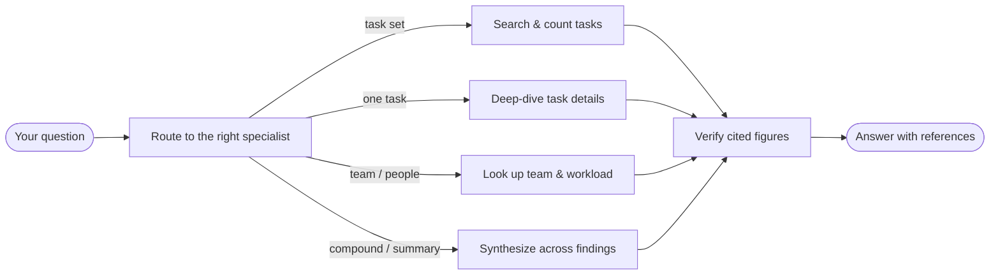

# QueryAgent — What it is and how to use it

> The QueryAgent answers natural-language questions about tasks, boards, timelines, teams, and project health — grounded entirely in live data, with every figure backed by a traceable reference. It is strictly read-only: it never creates, modifies, or deletes anything.

## What does this agent do?

- Answers task-set questions ("What's overdue on board Alpha?", "How many tasks are due this week?")
- Deep-dives a single task ("Summarize the discussion on 'Billing Migration'", "What changed on this task?")
- Explains timelines and dependencies ("Which items drive the critical path for Milestone 2?")
- Reports on team structure, workload, and skills ("Who's overloaded?", "Who has React experience?")
- Computes trends and risk signals ("Is milestone M2 on track?", "Show completion trends for Q3")
- Finds semantically related work ("Tasks similar to this incident", "Potential duplicates")
- Surfaces knowledge-graph relationships and impact paths ("What depends on this task?", "Bus-factor radar for our team")

What it does **not** do:

- It never modifies tasks, assignments, comments, or any data — it is read-only.
- It does not create plans, propose assignments, or trigger automations — those belong to the Action, Planning, and Triage agents.
- It only sees what your permissions allow — cross-group data requires the matching role.
- It does not answer questions outside the planner domain (HR, finance systems, external tools).

## What input does it take?

| You provide | Example |
|---|---|
| A question in plain language | "Which tasks are overdue?" |
| (Automatic) your current page context | The board, task, or group page you're on |
| (Automatic) your identity and group memberships | Resolved server-side, never asked |

The page you're on (board, task detail, chart, group) automatically scopes your question. You can override by naming a different board, plan, or group explicitly.

## How does it work?

When you ask a question, the **QueryAgent** first determines what kind of question it is:

- **Task search** questions ("my open tasks", "overdue items on board X", "tasks about billing") go to a specialist that searches, filters, and counts tasks using structured queries and semantic similarity.
- **Single-task** questions ("tell me about this task", "what changed on it", "its dependencies") go to a specialist that fetches one task's full record — details, history, comments, timeline position, and related items.
- **Team and org** questions ("who's overloaded", "team members with DevOps skills", "what plans exist in my group") go to a specialist that queries group structure, workload distribution, skills, and activity.
- **Compound or summary** questions that span the above — or need synthesis of multiple findings — go to a general-answer specialist that composes the response from the data already gathered.

Before the answer reaches you, a **Verifier** recomputes every figure cited in the response. If a number can't be traced back to the source data, it's either corrected or replaced with the raw data table. This ensures you never see a hallucinated statistic.

## What does it return?

> **You:** How many tasks are overdue on board "Project Apollo"?
>
> **QueryAgent:** There are **7 overdue tasks** on Project Apollo (out of 34 open). The top 3 by days overdue:
> 1. "API rate-limit fix" — 12 days overdue, assigned to Tuan *(ref: task #a1b2c3)*
> 2. "Dashboard redesign" — 8 days overdue, assigned to Linh *(ref: task #d4e5f6)*
> 3. "Payment webhook" — 5 days overdue, unassigned *(ref: task #g7h8i9)*
>
> The overdue ratio is 20.6% — up from 14% last week.

Every answer includes:

- **Citation references** — task IDs, board names, date ranges, or filters used, so you can verify by clicking through.
- **Scope disclosure** — which board/group/project the answer covers.
- **Concise prose** — prioritized by relevance; tables when they're clearer than paragraphs.

Typical response time: 2–5 seconds for simple lookups; up to 10 seconds for multi-source or trend questions.

## Capabilities by information type

| Category | Example questions | Available |
|---|---|---|
| Task search & count | "My open tasks", "Overdue on board X", "Tasks about billing" | Now |
| Board snapshot | "Current state of board Alpha" | Now |
| Single-task detail | "Summarize task Y", "Who's assigned to it?" | Now |
| Task history & comments | "What changed on this task?", "Show the discussion" | Now |
| Timeline & dependencies | "Gantt for milestone M2", "What depends on this?" | Now |
| Workload & activity | "Who's overloaded?", "What did Tuan do this week?" | Now |
| Aggregate stats | "Completion rate for Q3", "Overdue ratio by plan" | Now |
| Semantic similarity | "Tasks similar to this incident" | Now |
| Trend analysis | "Completion trend over 4 weeks" | Wave 1 |
| Schedule-risk prediction | "Will milestone M2 slip?" | Wave 2 |
| Date-conflict detection | "Any scheduling contradictions?" | Wave 2 |
| Knowledge-graph relations | "What's connected to this task?" | Wave 2 |
| Impact-path analysis | "Root cause chain for this blocker" | Wave 2 |
| Entity profiles | "Tuan's skill profile and history" | Wave 2 |
| Knowledge-base search | "Past resolutions for similar incidents" | Wave 2 |
| Duration calibration | "How long do tasks like this usually take?" | Wave 4 |
| Assignee suggestion (read) | "Who'd be a good fit for this?" | Wave 4 |
| Person task history | "Tuan's completed work in component X" | Wave 4 |
| Link-candidate detection | "Potential duplicates or related items" | Wave 4 |
| Process-pattern mining | "Rework bottlenecks this quarter" | Wave 4 |
| Bus-factor radar | "Single-person knowledge risks" | Wave 4 |
| Skill-coverage forecast | "Skill gaps vs upcoming milestones" | Wave 4 |

## Limits

- **Read-only** — it will refuse any request that implies creating, updating, or deleting data, and redirect you to the appropriate agent.
- **Scope-bound** — you only see data in groups you belong to. Cross-group queries require the matching role (EM, CEO, BOD). If the question spans groups you don't have access to, the answer covers only your visible scope and says so.
- **No external data** — it cannot query systems outside the planner (Jira, Slack, email, finance). Deferred capabilities (billable hours, utilization) are noted in the table above.
- **Freshness** — answers reflect live data at query time. Knowledge-graph and embedding indexes may lag by up to the configured refresh interval (typically minutes, not hours).
- **Verifier scope** — the Verifier checks numeric figures and item references. It does not verify qualitative judgments or summaries produced by the LLM.
- **Model limits** — very large result sets (500+ tasks) are paginated; the agent summarizes the first page and offers to continue. Complex multi-hop graph queries are depth-limited (≤3 hops).
