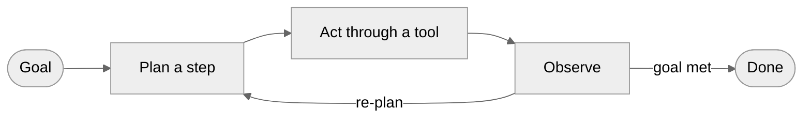
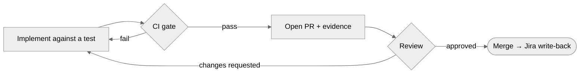

# The AI Engineering Handbook

### Working across the SDLC: from vibe coding to agentic engineering

Most of us picked up AI coding agents on our own: each in our own style, accepting whatever looks plausible. It's fast, but code that no one specified and no one verified tends to break later, usually in front of someone who didn't write it. The problem is rarely the model. It's the habit around it: **generate code, and trust it.**

This handbook replaces that habit, across the team, with a shared and disciplined one. Not _less_ AI; that's settled. AI used like an engineer: intent written down, output verified, judgment kept where it matters. The same agent gives you throwaway code in a careless workflow and dependable code behind specs, tests, and gates.

By the end you should understand the foundations (what changed, what an agent is, how to give it context and verify it, and what surrounds it), see where AI is used well versus badly on our own workflow, and be able to take a ticket from Jira to a merged PR the way we expect.

> **Principles over tools.** This teaches the thinking that lasts. We name a few tools we use today so the ideas are concrete, but treat them as illustration, not the lesson. They'll be replaced; the principles won't.

---

# Part 1. The shift: from syntax to intent

_What actually changed, and why your job is different now?_

Programming was always translation: understand a problem, design a solution, render it in syntax a machine can run. The visible part, the typing, is the part that's collapsing. The bottleneck is no longer how fast you produce code; it's how clearly you can **say what to build** and how well you can **judge what comes back**. Your job now is the three things the machine can't do for you: _specification_, _verification_, and _judgment_. The engineers who get faster don't accept everything the agent produces; they aim their attention where the agent is weak.

A chatbot answers a prompt and waits. An agent runs a loop: take a goal, plan a step, act through a tool, observe the result, decide what's next, repeating until the goal is met or it stops. Almost everything here is a variation on that loop.

"Vibe coding" and "agentic engineering" are the two ends of one scale, with most real work in between. What places a task on it isn't **whether you use AI**, since both ends do, but **how much structure, verification, and judgment surround the output.**

| Dimension              | Vibe coding                     | Structured AI-assisted             | Agentic engineering                                    |
| ---------------------- | ------------------------------- | ---------------------------------- | ------------------------------------------------------ |
| Intent                 | Casual prompts                  | Detailed prompts + constraints     | Specs, conventions, rule files                         |
| **Verification**       | **Optional — "looks right"**    | **Manual testing, spot-checks**    | **Tests, e2e, CI gates**                               |
| Codebase understanding | May not read the output         | Reviews critical paths             | Reviews architecture; agent fills in detail            |
| On error               | Paste the error back            | Human diagnoses, AI fixes          | Agent self-corrects in bounds; humans own architecture |
| Right for              | Prototypes, spikes, throwaway   | Features in an existing codebase   | Production, team-scale work                            |
| Risk                   | High — fine for disposable code | Moderate — judgment at checkpoints | Low — verified at every stage                          |

Look at the **Verification** row: that is what really separates the columns. A cleverer prompt won't move a task toward the right end; only verifying its output does (Part 4). Most of the judgment in this work is drawing that line per task, matching rigour to stakes.

> Spikes and throwaway scripts can be pure vibe coding. **Anything that touches the database, money, auth, or ships to a user belongs at the agentic-engineering end. No exceptions.** Keep this line blurry and prototypes reach production by accident.

**Takeaway:** the job moved from writing syntax to expressing intent and judging results. Decide where each task sits on this scale before you start, and never let a high-stakes task be vibe-coded.

---

# Part 2. Context: what the agent knows

_How do you get the right knowledge into the agent's head?_

The quality of what an agent produces depends far less on a clever prompt than on the **context** it works from. The question to ask isn't "how do I get the AI to write good code?" but **what would a new teammate need to know to contribute well here, and how do I write it down so the agent can use it?** Get that right and the exact prompt barely matters.

An agent draws on six kinds of context:

1. **Instructions:** its role and boundaries.
2. **Knowledge:** docs, domain facts.
3. **Memory:** the session and durable state.
4. **Examples:** patterns to imitate.
5. **Tools:** what it can call.
6. **Guardrails:** hard constraints.

The one decision that governs all six: does each load **always**, or **on demand**?

|            | **Static context**                                           | **Dynamic context**                                  |
| ---------- | ------------------------------------------------------------ | ---------------------------------------------------- |
| Loaded     | Always, every turn                                           | On demand, when a task calls for it                  |
| Token cost | High — paid on every interaction                             | Low — paid only when used                            |
| Holds      | Instructions, rule files, in-repo standards, core guardrails | Skills, fetched docs, tool results, windowed history |
| Defines    | _Who the agent is_                                           | _What it needs right now_                            |
| Fails when | Overstuffed — drowns the signal                              | Missing — the agent forgets a rule it needed         |

**Static context** is present on every turn: powerful and expensive, since every token is paid for whether the task needs it or not. For us that's `AGENTS.md` plus the standards in `/docs`: the stack, the boundaries, the rules the agent must never break.

**Dynamic context** loads only when something calls for it. The strongest form is the **skill**: a procedure that stays a one-line description until a task matches it, then loads in full. The `superpowers` and `gstack` skills work this way. Knowledge loads the same way on demand: `context7` pulls the one library doc a task needs, and the Atlassian MCP fetches the matching Confluence design instead of parking either in the prompt. That static/dynamic boundary is a real architectural decision, reviewed, versioned, owned.

**Where each piece lives.** That split becomes a filing decision the team makes: knowledge the agent needs on _most_ tasks lives **in the repo**, where it's loaded cheaply and never re-fetched; knowledge specific to one task is **pulled on demand** through the Atlassian MCP or `context7`.

| In the repo — followed on every task                                        | Pulled on demand — per task                     |
| --------------------------------------------------------------------------- | ----------------------------------------------- |
| `AGENTS.md`: stack, boundaries, conventions, workflow                       | The ticket's design & acceptance (Jira)         |
| `/docs`: infra, architecture & module boundaries, standards, ADRs, security | The domain spec for _this_ feature (Confluence) |
| The things the agent must never get wrong                                   | External library/API docs (`context7`)          |

`AGENTS.md` is the most important file the team owns, because it loads on every turn, so the bar for a line is high: it must be **always true** and the agent **would get it wrong without it**. Maintained as the team standard, it becomes a precise record of what the team has learned to correct. The same logic keeps the reused `/docs` standards in the repo rather than re-fetched from Confluence each task: cheaper, versioned, and always present.

**Takeaway:** engineer context, not prompts. Put what's durable in the repo, pull what's task-specific on demand, and treat the static/dynamic line as a real decision.

---

# Part 3. The harness: what the agent can do

_Why does what surrounds the model matter more than the model itself?_

When teams first work with agents, they treat the model as the system: a new model lands and the agent gets smarter, an old one and it gets worse. That instinct is wrong. The model is the raw engine, and an engine can't build a car without belts, gears, sensors, and an assembly line. That surrounding machinery is the **harness**: the instructions, tools, sandboxes, sub-agents, guardrails, and observability wrapped around the model.

> **Agent = Model + Harness.** The model is roughly a tenth of the behaviour you experience; the harness is the rest. The same model in two different harnesses behaves very differently, so the harness is where most of the work and improvement actually happen.

> **Most agent failures are configuration failures.** When the agent does something wrong, the instinct is to blame the model. The real cause is almost always a missing tool, a vague rule, an absent guardrail, or a context window stuffed with noise, all of which are yours to fix.

A harness has six parts. Each is something concrete you'll change:

1. **Instructions & rule files:** who the agent is and what it must not do: `AGENTS.md`, the `/docs` standards, the `superpowers` and `gstack` skill files.
2. **Tools:** the functions and APIs it can call (the Atlassian MCP for Jira/Confluence, `context7` for library docs, Playwright to drive a browser).
3. **Sandboxes:** where its code runs and what it can reach (an isolated git **worktree** per task, the dockerized dev database).
4. **Orchestration:** sub-agents, hand-offs, and **model routing** (Haiku/Sonnet/Opus by task; Part 7).
5. **Guardrails & hooks:** deterministic checks at fixed moments (`lint`, `format`, `typecheck`, the DDD-boundary and dependency-loop scripts), all enforced by **GitHub CI** before a merge.
6. **Observability:** logs and traces, so drift is visible (CI run logs today, with agent-behaviour metering still a gap).

It isn't a one-time setup; it runs in every phase. You **configure** it in planning, it **runs** the work during implementation, it drives the **feedback loop** in testing (a failed CI check routes back to the agent), and you **observe** it in review and deployment (a hook blocks a bad commit; a trace lets you audit a decision).

**Takeaway:** each of those six is a row you own, so a misbehaving agent is a harness to fix once for the whole team, not a model to swap.

---

# Part 4. Verification: the line that matters

_How do you know the output is right? This is what separates careful work from vibe coding._

In vibe coding, verification is optional: you run the thing and decide if it seems right. In agentic engineering it's mechanical, and it splits two ways: there are two different things to check, and two different angles to check them from.

|                      | **Tests**                                    | **Evals**                              |
| -------------------- | -------------------------------------------- | -------------------------------------- |
| Check                | The _deterministic_ parts                    | The _non-deterministic_ behaviour      |
| Question             | Given this input → that output? Suite green? | Right path, right tools, met the bar?  |
| Checked by           | Code                                         | Labelled cases, rubrics, a model judge |
| **Output** angle     | Does it compile / pass?                      | Is the final answer good?              |
| **Trajectory** angle | —                                            | _How_ did it get there?                |

Trajectory matters because the dangerous failures are the quiet ones. An obvious error you'll catch; an agent that skipped a verification step but returned clean-looking output, you often won't. Skip either kind of check and it's still vibe coding, however good the prompt.

**The 80% problem.** An agent generates the first 80% of a feature fast. The last 20% is where the trouble lives, and where your time should go.

|                | The fast **80%**                       | The hard **20%**                                                |
| -------------- | -------------------------------------- | --------------------------------------------------------------- |
| What it is     | Scaffolding, happy path, obvious cases | Edge cases, error handling, integration seams, real correctness |
| Who owns it    | The agent, mostly                      | **You**                                                         |
| Why it's risky | —                                      | **Looks right and may pass the basic tests**                    |

> **Set the bar at the eval, not the demo.** A demo proves an agent succeeded once; a passing eval proves it succeeds reliably.

**What's on you.** Verification is the part of the job that stays human; the tooling makes it cheaper, not optional:

- **Write the failing test first.** That test _is_ your spec. With the `superpowers` TDD skill the agent codes against a red test instead of a vibe; if you can't state the test, you don't understand the task well enough to delegate it.
- **Cover the 20%.** The agent gives you the happy path; you name the edge cases and error paths it missed and turn each into a test.
- **Own the user flow.** Every user-facing change ships with a **Playwright e2e** you're accountable for; "the agent didn't add one" isn't an excuse.
- **Read the trajectory.** Don't accept output because it's green; check it didn't skip a step or weaken a check to get there.

The mechanical part is automated: tests run against a **real database** in Docker (not mocks), and the **GitHub CI gate** (tests, the Playwright e2e suite, and **SonarQube** for smells and duplication) blocks the merge until the deterministic checks pass. The gate catches what's mechanical; **you** catch what isn't. Scoring agent _behaviour_ automatically is still our gap, so until an eval harness exists, anything an agent does unattended gets a manual human checkpoint.

**Takeaway:** tests for what's deterministic, evals for what isn't; write the test first; gate every user flow with an e2e; and judge by the eval, not the demo.

---

# Part 5. The new SDLC and your role

_How does the shape of the work, and your place in it, change?_

AI doesn't speed the lifecycle up evenly. Implementation drops from weeks to hours, while requirements, architecture, and verification stay human-paced. That reshapes the cycle instead of only speeding it up, and moves your role from _primary implementer_ to _system designer and quality gatekeeper_.

| Phase                     | What AI changes                            | What stays yours                  |
| ------------------------- | ------------------------------------------ | --------------------------------- |
| **Requirements**          | Spec and a first prototype arrive together | Deciding what's actually wanted   |
| **Design / architecture** | Agent scaffolds once decisions are made    | The trade-offs themselves         |
| **Implementation**        | Writing becomes reviewing & guiding        | The hard 20%                      |
| **Testing / QA**          | Tests & evals become how you state intent  | Defining "correct"                |
| **Code review**           | AI first pass catches the obvious          | Design, maintainability, strategy |
| **Maintenance**           | Legacy code becomes safe to change         | Deciding what's worth changing    |

Two rows deserve a note:

- **Implementation** doesn't remove work, it moves it: the same hours go into reviewing and directing the agent instead of typing.
- **Maintenance** changes the most: code once "too risky to touch" because only its author understood it becomes ordinary gated work an agent can navigate and you can sign off.

**The factory model.** Put those shifts together and your primary output is no longer code; it's the _system that produces code_. A factory manager doesn't assemble each widget by hand; they design the line and own quality control. You do the same: hand agents clear success criteria, then let them iterate against the gate. Your "line" is the harness from Part 3, and the job is to keep it sharp.

**Two modes.** Inside that system you work in one of two modes, and good engineers move between them per task.

|                | **Conductor**                              | **Orchestrator**                                              |
| -------------- | ------------------------------------------ | ------------------------------------------------------------- |
| Tempo          | Real-time, in the loop                     | Async, goal-level                                             |
| Scope          | Single file, keystroke control             | Multi-file, review outcomes                                   |
| Best for       | Exploring, debugging, the hard 20%         | Well-specified features, migrations, test gen                 |
| Demands of you | Direction step by step                     | Specification, decomposition, judgment                        |
| In our setup   | A live Claude Code session, editing inline | Sub-agents in separate git **worktrees**, running in parallel |

The 80% problem maps straight onto these: orchestrate and review the straightforward 80%, drop into conducting for the hard 20%. And what makes both cheaper is **decomposition**: breaking a feature into units small enough that one agent run produces one reviewable change. Smaller units raise first-pass success, make a wrong attempt cheap to throw away, and let independent pieces run in parallel worktrees.

**Takeaway:** you're the factory manager now, not the assembler. Name the mode each task wants (conduct the unfamiliar 20%, orchestrate the well-specified 80%), and decompose aggressively so the agent always works in small, reviewable pieces.

---

# Part 6. The work in practice

_Everything so far, applied to the two things you actually do: build a feature and fix a bug, plus the review that protects both._

Both flows share the same core, the implementation loop, and differ only at the start:

|                    | Feature                        | Bug                            |
| ------------------ | ------------------------------ | ------------------------------ |
| Starts with        | Research → mockup → brainstorm | A reproduction                 |
| Planning           | WBS → Jira tickets, SM plans   | One ticket, pulled by ID       |
| First code written | A failing test from the spec   | A failing regression test      |
| Then               | The shared implementation loop | The shared implementation loop |
| Best mode          | Decompose & orchestrate        | Often a background hand-off    |

## Building a feature

AI accelerates research, mockups, and breakdown; people own requirements and planning.

1. **Research** the approach with an AI assistant (Claude / Gemini).
2. **Mock it up** in **Claude Design** (its canvas and design tools, the mockup surface), then **brainstorm with the team** to gather requirements and feedback.
3. **Break it down.** With the team's ticket-splitting and story-point conventions as a base, the AI drafts a WBS and splits the work into epics and tasks in Jira through the **Atlassian MCP**; the **SM runs Agile planning**.
4. **Implement.** A dev takes one small ticket **by ID**; the agent pulls the ticket and its linked Confluence design through the **Atlassian MCP**, plus the in-repo `/docs`, then enters the loop below.

The front half matters most: people settle requirements and breakdown first, so the agent implements decisions instead of guessing.

## Fixing a bug

Same engine, a different start.

1. **Pull the ticket by ID.** The agent reads the description and repro steps from Jira via the **Atlassian MCP**.
2. **Reproduce, then debug** with the `superpowers` systematic-debugging skill (reproduce, hypothesise, prove, fix) rather than pasting the error and asking for a fix.
3. **Write a failing regression test first** (the `superpowers` TDD skill), then make it pass.
4. Enter the same loop below.

## The implementation loop

Both flows converge here: implement against a test, let the gate decide, and only a green run plus a human review reaches `main`:

Each stage of that loop is backed by a specific part of the harness. The mapping:

| Stage                 | Skill / command                              | MCP / tool                        | Scripts & CI                                     |
| --------------------- | -------------------------------------------- | --------------------------------- | ------------------------------------------------ |
| Pull ticket & context | —                                            | Atlassian MCP (Jira + Confluence) | reads `/docs`                                    |
| Mockup (feature)      | —                                            | Claude Design                     | —                                                |
| Plan / spec           | `superpowers` brainstorming, writing-plans   | —                                 | —                                                |
| Implement             | `superpowers` TDD; `frontend-design` for UI  | `context7` (library docs)         | —                                                |
| Debug (bug)           | `superpowers` systematic-debugging           | —                                 | —                                                |
| Local check           | `superpowers` verification-before-completion | —                                 | `lint` · `format` · `typecheck` · DDD & dep-loop |
| CI gate               | —                                            | —                                 | GitHub CI: tests · Playwright e2e · SonarQube    |
| Open PR               | `superpowers` finish-branch; `gstack /ship`  | Atlassian MCP (write-back)        | —                                                |
| Review                | `gstack /review`, `/cso`                     | —                                 | —                                                |

The names will change; the point is that **every stage has a concrete tool behind it**, so the workflow is concrete, not improvised.

## Reviewing AI-generated code

Review is where AI's speed becomes the bottleneck. Two rules keep it manageable:

- **Small, scoped PRs.** One ticket, one reviewable change. An agent writes a lot, fast; a big diff can't be reviewed honestly and is more likely to break an unrelated flow. _Too big to read carefully = too big to merge._
- **Attach evidence.** Test output, and for any UI change, before/after screenshots or a **Playwright** recording.

A first pass is automated: `gstack /review` for production-bug patterns, `/cso` for an OWASP/STRIDE security check, and **SonarQube** for smells and duplication. A human still reads for the failure modes specific to generated code:

| Look for                             | Why                                                          |
| ------------------------------------ | ------------------------------------------------------------ |
| Imports resolve to real packages     | Agents hallucinate dependencies                              |
| Error handling beyond the happy path | The agent ships the easy case                                |
| The hard 20%                         | Edge cases, integration seams, assumptions that "look right" |
| Boundaries & security                | authz, secrets, raw SQL across a module line                 |
| Scope                                | The PR does only what its ticket says                        |

> **AI-generated code gets _more_ scrutiny, not less.** The gate and the automated pass catch the obvious; a human still reviews every line that ships.

**Takeaway:** small, well-specified tickets run the loop against a test, behind the gate, then an automated pass and a human review with evidence before merge.

---

# Part 7. Cost: don't overpay

_How do you keep token cost down without slowing the work?_

In the AI era, cost shifts from headcount to tokens, and it splits two ways: **CapEx**, the upfront work of specs, tests, and context, versus **OpEx**, what you burn running and fixing things afterward.

|                         | **CapEx** (upfront)            | **OpEx** (ongoing)                                                                              |
| ----------------------- | ------------------------------ | ----------------------------------------------------------------------------------------------- |
| **Vibe coding**         | Near zero                      | High & compounding — tokens re-prompting a confused agent, maintenance tax on unstructured code |
| **Agentic engineering** | Higher — specs, tests, context | Low per feature — right the first time more often                                               |

Vibe coding looks cheap because its CapEx is almost nothing, but it pays for that with high, compounding OpEx. Agentic engineering flips that: a little more upfront, much less per feature afterward. In practice it comes down to two habits.

**1. Route the model to the task.** Don't run everything on the top model; it's slower and far more expensive than the work usually needs. Current line-up (models change):

| Use this       | For                         | Examples                                                                                    |
| -------------- | --------------------------- | ------------------------------------------------------------------------------------------- |
| **Haiku 4.5**  | Mechanical work             | lint/format fixes, simple test gen, CI triage, small well-specified edits                   |
| **Sonnet 4.6** | Everyday work — the default | most implementation, mid-complexity features, a review first pass                           |
| **Opus 4.8**   | Genuinely hard work only    | architecture, ambiguous requirements, complex multi-file changes, hard root-cause debugging |

Rule of thumb: **default to Sonnet; drop to Haiku for the mechanical; reach for Opus only when the problem is actually hard.** Opus to fix a typo is waste; Haiku for an architecture call is false economy.

**2. Keep the context tight.** You pay per token, in and out, so don't dump the whole repo into a prompt to "give it everything." Lean on a precise `AGENTS.md` and pull only the doc a task needs through `context7` or the Atlassian MCP. Tight, relevant context gets the answer right the first time more often, and the cheapest fix is the re-prompt you never had to do.

**Takeaway:** route by difficulty, keep context tight. Pay your cost upfront as structure, not afterward as wasted tokens.

---

# Part 8. Where to start

_What do you do on Monday, and what stays true after every tool here is replaced?_

## Your first moves, by role

**New joiner**

- Install the harness; read the project's rules and standards end to end, then follow them rather than edit them.
- Run the full gate on a clean checkout so you know what green looks like.
- Take one ticket through the Part 6 loop: spec before code, test before implementation, gate before "done."
- If the agent does something the rules should have caught, raise it in review.

**Middle / senior**

- Be fluent in both modes; decompose features into agent-sized tickets and keep PRs small.
- Own the harness for your area: when the agent repeats a mistake, tighten the relevant rule or standard (reviewed like any change) so the fix is permanent.
- Decide how much rigour each task needs, and make the gate enforce it.

**Lead**

- Treat the harness config, standards, prompts, and evals as code (reviewed in PRs, owned by named people), or it drifts.
- Set the bar at the eval, not the demo; set the model-routing default.
- Reshape review and hiring around judgment (specification, evaluation, architecture), not lines of code.

## Antipatterns to catch in yourself

| Antipattern                     | The fix                                                             |
| ------------------------------- | ------------------------------------------------------------------- |
| Blaming the model               | It's almost always a harness gap — fix the rule, tool, or guardrail |
| Context-stuffing the whole repo | Send a dense, relevant payload                                      |
| Trusting "looks right"          | That's where the 20% hides — verify it                              |
| A giant AI PR                   | One ticket, one scoped, reviewable change                           |
| Same rigour for every task      | Name the stakes, and match rigour to them                           |
| Wrong mode or model             | Match conduct/orchestrate and Haiku/Sonnet/Opus to the task         |
| Fixing in the chat              | Get the correction into the team standard                           |
| Letting your own skills slip    | Use AI to apply your expertise at scale, not to replace it          |

## Gaps we're closing

Deliberate investments, not background tasks: an **eval harness** gated like test coverage; **agent observability** for cost, latency, and drift; a written **model-routing** default; a decision on an **automated AI PR reviewer**; and **retrieval over our own architecture and past incidents**, so the agent recalls _why_ a boundary exists.

## What endures

When every tool named in this handbook has been replaced, three things stay true:

1. **Structure scales; vibes don't.** The gap between "it seems to work" and "it works under all conditions" is where outages come from.
2. **AI makes your engineering culture count more**, for better and worse.
3. **The human role is evolving, not shrinking.** Architecture, specification, evaluation, and judgment matter more than ever.

> Generation is the easy part now. **Verification, judgment, and direction are the real work.**

---

# Appendix. Glossary

Principles are durable; the named tools and models are examples and will change.

| Term                                    | What it is                                                                   | Type      |
| --------------------------------------- | ---------------------------------------------------------------------------- | --------- |
| Agent = Model + Harness                 | The model is ~10%; the harness is the rest                                   | principle |
| Static / dynamic context                | Always-loaded vs loaded-on-demand                                            | principle |
| Skill                                   | A procedure loaded only when a task matches it                               | principle |
| Tests vs evals                          | Deterministic checks vs scored behaviour checks                              | principle |
| Output vs trajectory                    | Is the artifact correct, vs how it got there                                 | principle |
| The 80% problem                         | The fast 80% vs the hard, decisive 20%                                       | principle |
| The factory model                       | Your output is the system that produces code                                 | principle |
| Conductor / orchestrator                | Real-time vs async, goal-level direction                                     | principle |
| CapEx / OpEx · model routing            | Upfront design vs run cost; match model to difficulty                        | principle |
| `AGENTS.md` / `/docs`                   | Static rule file and in-repo standards                                       | tool      |
| `superpowers` / `gstack`                | Dev-methodology skills / review-QA-release commands                          | tool      |
| `context7` · Atlassian MCP · Playwright | Library docs · Jira/Confluence sync · browser & e2e                          | tool      |
| Claude Design / `frontend-design` skill | Mockup surface / UI-quality guidance when building                           | tool      |
| The gate                                | lint + format + typecheck + DDD/dep scripts + tests + e2e + SonarQube, in CI | tool      |
| Haiku 4.5 / Sonnet 4.6 / Opus 4.8       | Cheap-fast / balanced / most-capable Claude models                           | model     |

---

# Further reading

The foundations are durable; the tool links are examples and will change.

**Foundations & mental models**

- Andrej Karpathy, the original "vibe coding" note — <https://x.com/karpathy/status/1886192184808149383>
- Addy Osmani, "Agentic Engineering" — <https://addyosmani.com/blog/agentic-engineering/>
- Addy Osmani, "The Factory Model" — <https://addyosmani.com/blog/factory-model/>
- Addy Osmani, "From Conductors to Orchestrators" — <https://addyosmani.com/blog/future-agentic-coding/>
- `AGENTS.md` — the open rule-file convention — <https://agents.md>
- Model Context Protocol (MCP) — the protocol the tool integrations speak — <https://modelcontextprotocol.io>
- Anthropic, Claude Code overview — <https://docs.claude.com/en/docs/claude-code/overview>
- Anthropic, Prompt engineering overview — <https://docs.claude.com/en/docs/build-with-claude/prompt-engineering/overview>

**Toolchain**

- `superpowers` — the development-methodology skills — <https://github.com/obra/superpowers>
- `gstack` — the review / QA / release commands — <https://github.com/garrytan/gstack>
- `context7` — live, version-correct library docs — <https://context7.com>
- Playwright — browser automation & e2e — <https://playwright.dev>
- Atlassian Remote MCP — Jira / Confluence integration — <https://www.atlassian.com/platform/remote-mcp-server>
- SonarQube — code smells & duplication — <https://www.sonarsource.com/products/sonarqube/>
