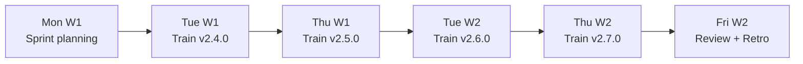
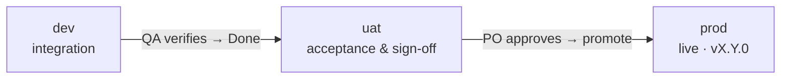
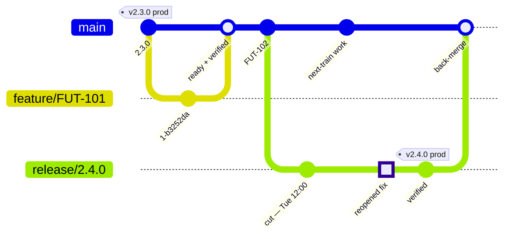
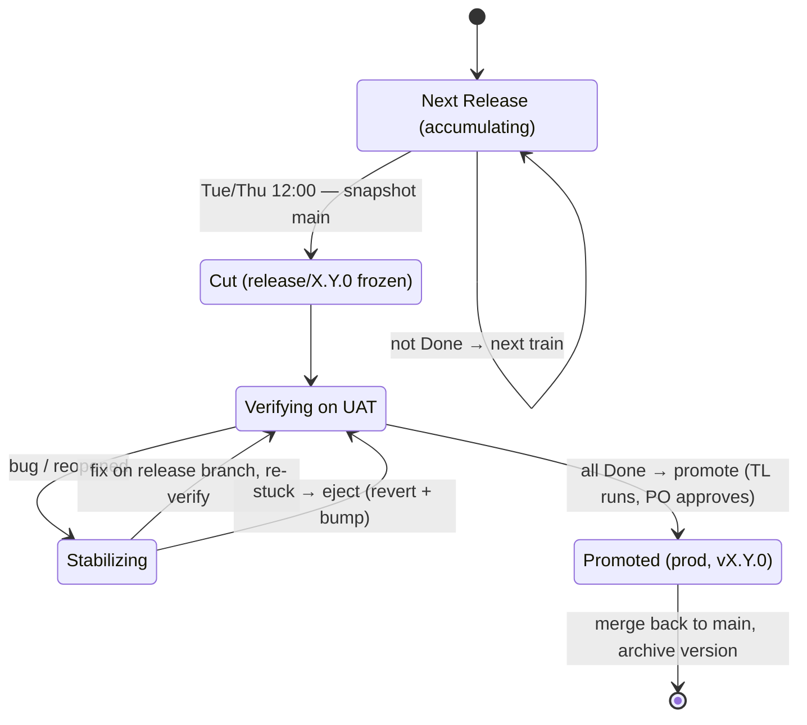
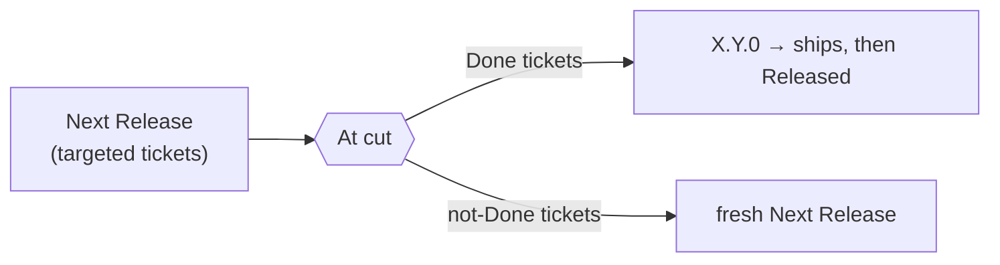
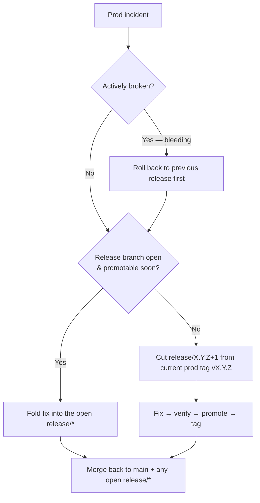

# Release process

> **Owner:** Product Owner · **Status:** Active · **Updated:** 2026-07-14

How the team plans, versions, and ships. **Sprint planning** decides *what we build* (2-week clock). **Release planning** decides *when it ships* — a **release train** departing **Tue & Thu, 12:00 UTC+7**. The two clocks are decoupled: finished work ships on the next train, not at sprint end.

## Contents

1. [Vocabulary](#1-vocabulary) · 2. [Cadence](#2-cadence) · 3. [Environments](#3-environments) · 4. [Branching & versioning](#4-branching--versioning) · 5. [The release train](#5-the-release-train) · 6. [Jira](#6-jira) · 7. [Roles](#7-roles) · 8. [Hotfixes](#8-hotfixes) · 9. [What do I do when…](#9-what-do-i-do-when)

---

## 1. Vocabulary

| Term | Means |
|---|---|
| **Sprint** | 2-week planning iteration. A sprint may produce several trains, or none. |
| **Release train** | Scheduled delivery window (Tue & Thu, 12:00 UTC+7). What's verified rides; the rest waits for the next. |
| **`Next Release`** | The Jira version holding everything targeted for the *upcoming* train, before it has a number. |
| **Version** | `MAJOR.MINOR.PATCH`. Train → MINOR, hotfix → PATCH, breaking → MAJOR. |
| **Cut** | Freezing the UAT-verified state into a `release/<version>` branch at train time. |
| **Promote** | Shipping the verified candidate from UAT to prod — the same build, unchanged. |
| **Done** | Code merged **and verified on UAT**. Only Done tickets ride a train. "Dev complete" is *not* Done. |
| **Flag** | Feature toggle. Unfinished work ships **off** and is turned on only once the feature is Done. |
| **Eject** | Back out a stuck ticket's changes from the release branch and move it to `Next Release`. |

**Roles:** PO (Product Owner) · TL (Team Lead) · SM (Scrum Master) · QA · Dev — full duties in §7.

---

## 2. Cadence

| | Sprint (plan) | Train (deliver) | Hotfix |
|---|---|---|---|
| When | 2 weeks, Mon → Fri | **Tue & Thu, 12:00 UTC+7** | On incident |
| Version | — | MINOR `X.Y.0` | PATCH `X.Y.Z` |
| Owner | Scrum Master | Team Lead | Team Lead |

One sprint ≈ four trains — work ships mid-sprint.

Sprints are named `S<YY>.<n>` (e.g. `S26.1`).

---

## 3. Environments

One-directional promotion — nothing reaches an environment it hasn't passed the one before.

| | dev | uat | prod |
|---|---|---|---|
| Purpose | Integration | **Acceptance & sign-off** (the Done gate) | Live |
| Runs | Latest integrated work | Accumulating `Next Release` build; the `release/*` candidate after cut | Promoted release `vX.Y.0` |
| Signs off | Devs (automated) | **QA** | **PO** go/no-go, then monitored |

- **Promote = ship the same verified build**, never a rebuild.
- **Promote takes two people:** TL runs it, PO gives the business go/no-go (§7).
- **Rollback** returns prod to the previous known-good release.

---

## 4. Branching & versioning

`main` is the trunk; short-lived branches come off it; tags mark production. Prod ships **only** from a `release/*` branch.

| Branch | From | Merges to | Naming |
|---|---|---|---|
| **`main`** | — | — | trunk; always releasable |
| **`feature/*`** | `main` | `main` when **ready + verified** | `<type>/FUT-<n>-<slug>` |
| **`release/*`** | `main` at cut | back to `main` on promote | `release/<X.Y.0>` |
| **hotfix** (a PATCH release) | latest prod **tag** | `main` + any open `release/*` | `release/<X.Y.(Z+1)>` (next PATCH) |

**Versioning (SemVer):** MINOR = every train · PATCH = hotfix · MAJOR = a train carrying a breaking contract change (takes MAJOR in place of MINOR).

**Rules**

1. **Merge = ready.** Only review-passed, UAT-verifiable work lands on `main`. Work that can't finish in one train window is **merged behind a flag (off)** — never a long-lived branch.
2. **Frozen release branch.** After cut, `release/*` takes only fixes for its own tickets; new work goes to `main`.
3. **Fixes come home.** Reopened tickets are fixed on `release/*`, then merged back to `main` on promote — `main` ends 0 commits ahead.
4. **Tags = prod truth.** `vX.Y.0` marks exactly what's live.

---

## 5. The release train

The train departs on time — Done rides, the rest waits.

| # | Step | Who | Action |
|---|---|---|---|
| 1 | Freeze & verify | Team | Merge freeze on `main` (T–2h); QA closes out UAT; mark tickets **Done** |
| 2 | Cut | TL | Cut `release/X.Y.0` from `main` |
| 3 | Jira version ops | SM | Rename `Next Release` → `X.Y.0`, open a fresh one, move not-Done tickets out (§6) |
| 4 | Verify candidate | QA | Acceptance + regression on `release/X.Y.0` (UAT) |
| 5 | Stabilize *(if needed)* | Dev + QA | Fix reopened tickets **on the release branch**; a **stuck** ticket → **eject** (revert + bump) |
| 6 | Promote | TL runs · PO approves | Ship `release/X.Y.0` to prod; tag `vX.Y.0` |
| 7 | Close | TL + SM | Merge back to `main`; mark version **Released** (archive); publish notes |

**The train never waits** — the 12:00 cut is as-is; Done rides, the rest catches the next train. If nothing is Done at 12:00, **skip the train** (no empty version).

---

## 6. Jira

`fixVersion` answers one question only — *which release ships this?* It is not a sprint tag or a wish list.

**At cut (SM owns this):**

1. Rename `Next Release` → `X.Y.0` (tickets inherit the number). 2. Spawn a fresh `Next Release`. 3. Move not-Done stragglers into it. On promote, mark `X.Y.0` **Released** and archive.

**Status → the Done gate:**

| Status | Reality | Rides a train? |
|---|---|---|
| To Do / In Progress / In Review | not started · on `feature/*` · PR open | No |
| In UAT | merged, on `uat`, awaiting sign-off | Not yet |
| **Done** | **UAT-verified** | **Yes — the gate** |
| Released | promoted under `vX.Y.0` | Shipped |
| Reopened | regressed | Fix on the release branch |

**Hygiene:** SM owns versions; archive after Released; never use `Unscheduled`.
**Reporting:** `fixVersion = "Next Release"` → next train's manifest · `fixVersion = "X.Y.0"` → that release's notes.

---

## 7. Roles

No Release Manager — duties split across the team. **Rule: whoever approves the promote is not whoever cut it.**

| Role | Owns |
|---|---|
| **PO** | `Next Release` scope; **business go/no-go** on promote; release notes & comms |
| **Team Lead (TL)** | Cut, stabilize, promote **execution**, merge-back; eject / hotfix / rollback calls |
| **Scrum Master (SM)** | Train schedule; Jira version hygiene; unblocking |
| **QA** | UAT verification — the **Done** gate |
| **Dev** | Build, merge-when-ready, fix reopened tickets |

**RACI** — R responsible · **A** accountable · C consulted · I informed

| Activity | PO | TL | SM | QA | Dev |
|---|:--:|:--:|:--:|:--:|:--:|
| Scope `Next Release` | **A** | C | C | I | I |
| Build & merge (= ready) | I | C | I | C | **A** |
| UAT verify → Done | I | I | I | **A** | C |
| Cut the train | I | **A** | R | I | C |
| Jira version ops | C | I | **A** | I | I |
| Stabilize on `release/*` | I | C | C | R | **A** |
| Eject a stuck ticket | C | **A** | C | C | R |
| Promote (go/no-go) | **A** | R | I | C | I |
| Merge back / close | I | **A** | R | I | C |
| Release notes & comms | **A** | C | R | I | I |
| Hotfix | C | **A** | I | C | R |
| Rollback | C | **A** | I | C | R |

Every train needs TL + SM + PO (or a named backup) on duty; never cut or promote unattended — otherwise skip to the next slot.

---

## 8. Hotfixes

A hotfix is a **PATCH release**, cut from the last prod tag — narrow scope, but the same UAT + promote gate. Rare by design: if it can wait for the next train, it's a normal ticket.

| # | Step | Who |
|---|---|---|
| 1 | Roll back to previous release *(if bleeding)* | TL |
| 2 | Cut `release/X.Y.Z+1` **from the prod tag** — carries only the fix on top of what's live | TL |
| 3 | Land the narrow fix | Dev |
| 4 | Verify on UAT (affected area) | QA |
| 5 | Promote (same gate); tag `vX.Y.Z+1` | TL · PO |
| 6 | **Propagate** — merge back to `main` + any open `release/*` | TL |

Skip step 6 and the next train silently reverts the fix.

---

## 9. What do I do when…

| Situation | Do this |
|---|---|
| My code is merged but not verified at cut | It stays on `Next Release`; keep it flag-off. Rides when Done. |
| Nothing is Done at 12:00 | Skip the train — no empty version. |
| A shipped ticket regresses after cut | Fix on the release branch, re-verify on UAT. |
| One ticket blocks the whole release | Eject it (revert + bump to `Next Release`). |
| A feature won't finish in one train window | Merge behind a flag (off); turn it on in the train where it's Done. |
| Prod is on fire | Roll back to the previous release first, then ship a PATCH from the prod tag. |
| A prod bug lands mid-train (release open) | Fold the fix into the open release branch. |
