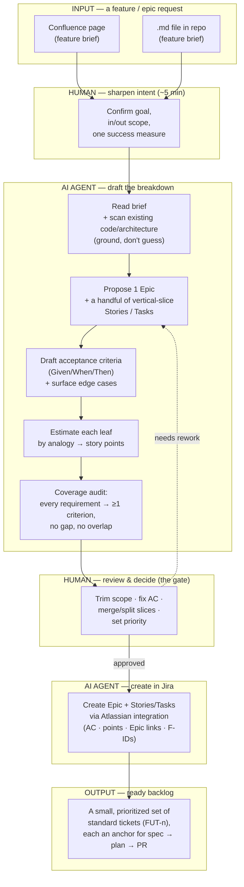
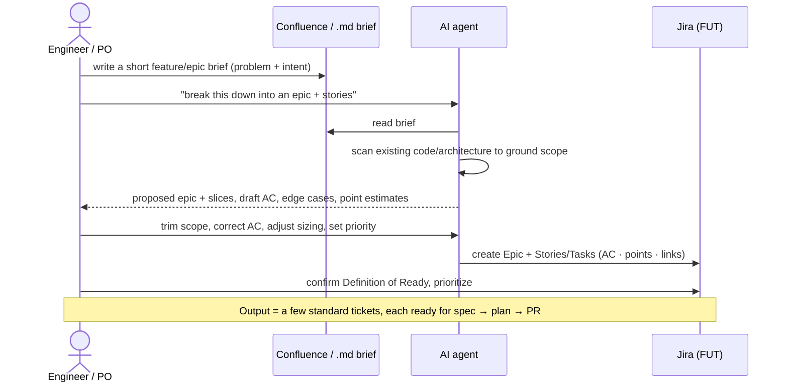

# From requirement to tickets

How a **single new feature or epic** goes from a plain requirement to a small set of ready-to-build Jira tickets — with AI doing the drafting and a human owning the decisions.

**Scope: one feature or epic at a time.** This is the realistic first step on a live product: you do *not* write a whole-module PRD and a full-module WBS up front. That heavier path exists ([`writing-a-prd.md`](writing-a-prd.md) + [`writing-a-wbs.md`](writing-a-wbs.md)) but it is the exception — for standing up a brand-new module. Day to day, work arrives as one feature/epic, and this is how we turn it into tickets.

Uses [`ticket-template.md`](ticket-template.md) for ticket shape and [`estimation.md`](estimation.md) for sizing.

---

## Input → output at a glance

---

## Who does what

---

## The steps

1. **Write the brief (human).** A few sentences: the problem, who it's for, the intended outcome. A Confluence page or a `.md` in the repo — whichever the team uses. This is *not* a PRD; it's the seed.
2. **Sharpen intent (human).** Confirm the goal, what's explicitly in and out of scope, and the one measure of success. Five minutes here prevents most rework.
3. **Draft the breakdown (AI).** The agent reads the brief and **scans the real codebase/architecture** so the slices map to what exists — then proposes one Epic and a handful of vertical-slice Stories/Tasks, each following [`ticket-template.md`](ticket-template.md).
4. **Draft acceptance criteria + edge cases (AI).** Behavioral Given/When/Then per slice, plus the edge cases a human tends to forget.
5. **Estimate (AI).** Each leaf sized by analogy to a reference shape, stating the analogy ([`estimation.md`](estimation.md)).
6. **Coverage audit (AI).** Before handing back to the human, the agent checks its own breakdown against the brief: every stated requirement maps to at least one acceptance criterion, no two slices overlap, and the usual silent gaps are covered (see *No missed requirements* below).
7. **Review & decide (human — the gate).** Trim scope, fix acceptance-criteria wording, merge or split slices, set priority. Nothing is created until a person approves; corrections loop back to step 3.
8. **Create in Jira (AI).** The agent creates the Epic and its Stories/Tasks through the Atlassian integration, carrying acceptance criteria, story points, Epic links, and requirement IDs. (For the heavy module path only, the same content can be a CSV import — see [`writing-a-wbs.md`](writing-a-wbs.md).)
9. **PO sign-off (human).** Confirm Definition of Ready and prioritize in the backlog.

**Output:** a small, prioritized set of standard tickets. Each becomes one `spec → plan → PR`, and its `FUT-<n>` key is the anchor every later signal (branch, commit, PR, metric) traces back to.

---

## No missed requirements (coverage & traceability)

Two failure modes to kill: a requirement that never became a ticket, and a ticket nobody can test. Both are caught the same way — by **tracing requirements to criteria.**

**1. Enumerate the requirements.** Turn the brief into a short numbered list (`F-<AREA>-<n>`). If a sentence in the brief implies a behavior, it's a requirement — give it an ID. This list is the yardstick everything is checked against.

**2. Trace requirement → ticket → criterion.** A one-look table proves coverage:

| Requirement | Ticket | Acceptance criterion |
|---|---|---|
| `F-XXX-1` … | `FUT-n` (Story) | Given…, when…, then… |
| `F-XXX-2` … | `FUT-m` (Story) | Given…, when…, then… |

Every requirement row must carry at least one criterion. An empty row **is** a missed requirement — the table exists to make that impossible to overlook.

**3. Run the two audits** (the same discipline a WBS uses):
- **Completeness** — "what behavior is in the brief *or* the surrounding code but has no ticket?" This is where features leak. Check the silent gaps: foundation/scaffold, integration with other modules, permissions/RBAC, empty & error states, notifications, audit.
- **Non-overlap (MECE)** — "do two tickets claim the same behavior?" → merge or re-cut so each slice owns its scope.

**4. Feature-level 100% rule.** The epic's stories together deliver the whole feature — no gap, no out-of-scope excess. If they don't sum to the feature, something is missing or something crept in.

**5. Three-persona read** (before sign-off) — read the ticket set as each reader and fix what they can't act on. Cheap to run (three quick agent reviews), and it is what turns "looks complete" into "is complete and testable":
- **Agent** — could I build each ticket with no missing context?
- **Dev** — can I tell when each is correctly done?
- **QA** — can I derive a test for every criterion?

---

## AI does · Human owns

| AI does | Human owns |
|---|---|
| Read the brief; ground scope in real code | The intent and the "why" |
| Propose the epic + vertical slices | What is **in** scope vs deferred |
| Draft behavioral acceptance criteria + edge cases | Approving / correcting the acceptance criteria |
| Size each leaf by analogy | Sanity-checking the estimate and priority |
| Create the tickets in Jira | Final Definition-of-Ready sign-off |

---

## Keep it honest

- **One feature/epic, a handful of tickets.** If the breakdown balloons past what one person can review in a sitting, it wasn't a feature — split the brief first.
- **Ground, don't guess.** The agent must read the code before proposing slices; ungrounded stories drift from what's actually there.
- **The gate is real.** AI drafts; a human decides scope and acceptance. That boundary is the difference between a backlog you can trust and a pile of plausible-looking tickets.
