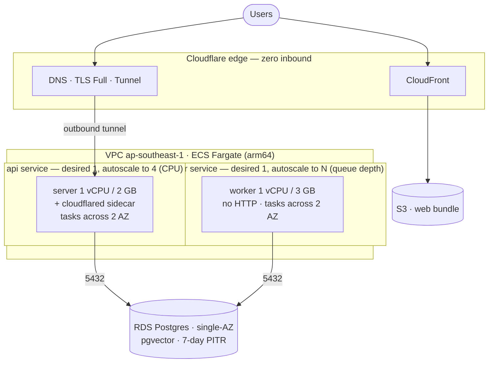

# AWS production — ECS Fargate

Prod runs on ECS Fargate (Graviton) in `ap-southeast-1`, single region. Baseline is one `api` task and
one `worker` task, each autoscaling to 2+. Edge is zero-inbound via a Cloudflare Tunnel. RDS is
single-AZ; the web bundle is served from S3 + CloudFront. Same `platform-server` / `platform-web` images
as dev/uat (`entrypoint.sh` selects `serve` vs `worker`). Provisioned by Terraform in
`infra/terraform/prod/`. Matches [`../platform/tech-stack.md §18`](../platform/tech-stack.md#18-ecs-fargate).

## 1. Topology



- Single region; multi-region out of scope.
- No public ALB. Traffic arrives only through the `cloudflared` sidecar's outbound tunnel. Task SGs
  have no ingress except to RDS on 5432.
- Tasks run in the two **public** subnets with a public IP and an **egress-only** security group — zero
  inbound is preserved (nothing routes in; tasks reach *out* to ECR, Secrets Manager, RDS, and Cloudflare
  over the IGW). This avoids a NAT gateway (~$32/mo) and VPC endpoints. Spreading across the two AZ
  subnets is free (Fargate bills vCPU/GB, not AZ). RDS runs single-AZ (§2).
- **api is sized 1 vCPU / 2 GB** — the app runs TypeScript via `tsx` at runtime, which compiles the whole
  module graph on boot (a transient spike well above the ~425 MB steady state). 0.5 vCPU / 1 GB is too
  tight for a reliable boot.

## 2. Behaviour

- **Deploys are zero-downtime at `desired=1`.** ECS rolling (`minimumHealthyPercent=100`,
  `maximumPercent=200`) starts the new task and drains the old before removing it.
- **Unplanned api task loss:** ~30–60 s gap while ECS relaunches (none if already scaled ≥2).
- **AZ impaired:** ECS places the replacement in the healthy AZ.
- **RDS primary loss or maintenance:** single-AZ, so this is downtime — a few minutes on scheduled
  maintenance, or up to the 30–60 min restore RTO on instance loss (§6). Single-AZ is a deliberate cost
  tradeoff; 7-day PITR is the safety net.
- **Worker isolated from api** (own service), so an embedding spike can't affect the API.

## 3. Autoscaling

- **api:** target-tracking on `ECSServiceAverageCPUUtilization` ~60%, `min=1 max=4`. Each added task
  brings its own tunnel connector.
- **worker:** target-tracking / step policy on a `PendingJobs` CloudWatch metric (a worker or scheduled
  Lambda publishes `graphile_worker.jobs` depth), `min=1 max=N`. Falls back to CPU if the metric isn't
  wired yet. graphile-worker uses advisory locks, so concurrent workers are safe.

## 4. Provision

Two-stage Terraform; apply is a gated human step, never CI.

- `infra/terraform/bootstrap/` — once per account. Creates `seta-tfstate-prod-apse1` (versioned,
  KMS-encrypted, PAB, `prevent_destroy`), local state.
- `infra/terraform/prod/` — the stack:

```bash
cd infra/terraform/prod
cp terraform.tfvars.example terraform.tfvars   # gitignored
terraform init && terraform plan -out=prod.tfplan
terraform apply prod.tfplan                     # human-reviewed
```

Provisions VPC (2 public + 2 private subnets, IGW), S3 (app + web) + CloudFront, ECS cluster +
`api`/`worker` task defs + services + autoscaling, task-execution/task IAM roles, task SGs, RDS single-AZ.
Secrets live in Secrets Manager, injected into both containers by the execution role; S3 uses the task
role (no static keys). The boot-required set: `DATABASE_URL`, `BETTER_AUTH_SECRET`,
`CRYPTO_LOCAL_MASTER_KEY`, and **`OPENAI_API_KEY`** (the embedding provider constructs at boot and throws
if it is unset — presence is checked, not validity), plus the tunnel token, `MAILER_*`, `M365_*`.
`DATABASE_URL` uses `sslmode=no-verify` (encrypt in transit; the RDS CA is not in the default trust store,
and `pg` would fail to verify with `require`).

**A fresh environment is validated end-to-end by the sandbox e2e** (`infra/terraform/sandbox/` +
`.github/workflows/sandbox-e2e.yml`): OIDC into a sandbox account → apply → build/push → migrate → deploy
→ in-VPC `/health/ready` check → destroy. Same module as prod, so the create-graph is exercised for real.

Out of repo: create the Cloudflare Tunnel + hostname (TLS Full), store the token in Secrets Manager; set
up the GitHub→AWS OIDC role for deploys (no on-box runner — Fargate has no persistent box).

## 5. Deploy

Build-once → ECR → ECS rolling, on GitHub-hosted runners via the OIDC role.

1. `build.yml` builds `linux/arm64` `server` + `web` images (`server-git-<sha>` / `web-git-<sha>` +
   `-latest`), syncs the web bundle to S3 + CloudFront invalidation.
2. `deploy.yml` (`environment=prod`, gated): pre-migration RDS snapshot → migrator via
   `aws ecs run-task` → register new task-def revision + `update-service` (rolling) for both services →
   wait `services-stable` → smoke `/health/ready` → record `PROD_LAST_GOOD_TAG`.

Migrations must be backward-compatible (expand/contract) — old and new tasks overlap during the roll.

## 6. Runbooks

**Rollback.** App: `deploy.yml` with a prior `server-git-<sha>`. DB: restore the pre-migration snapshot
to a new instance, repoint `DATABASE_URL`, redeploy the matching version. Infra: `git revert` the
`infra/terraform/prod/` change + `terraform apply`.

**Backup & restore.**

| Asset | Mechanism | Retention |
|---|---|---|
| RDS | Automated backups + PITR (`backup_retention_period=7`) | 7 days |
| RDS (release boundary) | Pre-migration snapshot per deploy | Until pruned |
| S3 (app + web) | Versioning + noncurrent expiration | 30 days |

RPO ≈ 5 min, RTO ≈ 30–60 min. Drill quarterly and after any backup/RDS change: restore the latest
snapshot to a disposable instance, point a temp task at it, validate `/health/ready` + login + migrator
no-op, record wall-clock vs RTO, delete.

```bash
aws rds restore-db-instance-from-db-snapshot \
  --db-instance-identifier seta-prod-pg-restore-<date> --db-snapshot-identifier <snapshot-id>
# or PITR within 7 days:
aws rds restore-db-instance-to-point-in-time --source-db-instance-identifier seta-prod-pg \
  --target-db-instance-identifier seta-prod-pg-restore-<date> --restore-time <ISO8601>
```

**RDS password rotation.** The password has two homes that must not drift: Terraform
`var.db_master_password` and the Secrets Manager `DATABASE_URL`. Generate new → update `terraform.tfvars`
→ `terraform plan` (only the password changes, in-place) → `terraform apply` with `--apply-immediately`
forced → update the Secrets Manager value → force a new ECS deployment on both services → verify
`/health/ready`. Do it in a low-traffic window.

## 7. Observability

No CloudWatch Logs or app-state alarms — alerting lives in the central Prometheus/Loki/Grafana stack on
a separate VPS. Run Grafana Alloy (or ADOT) as a sidecar to scrape `:9464` and ship logs, tagged
`MONITORING_ENV=prod`. Use ECS/task metrics for CPU/mem/running-count (no host `node-exporter`). RDS
infra metrics (storage, connections) come from CloudWatch. Alerts: `api`/`worker` running-count < 1,
RDS storage-fill, queue-depth backlog.

## 8. Cost

`ap-southeast-1`, Graviton, on-demand, per month. Rates: $29.53/vCPU, $3.23/GB.

| Component | Baseline (`desired=1`) |
|---|---|
| api — 1 vCPU / 2 GB | $36 |
| worker — 1 vCPU / 3 GB | $39 |
| cloudflared sidecar | ~$9 |
| web — S3 + CloudFront | ~$3 |
| RDS single-AZ (`db.t3.micro`) | ~$19 |
| **Total** | **~$106** |

Autoscaling bills per-second only while scaled. Compute runs on a 1-yr Compute Savings Plan (~20–30%
off the rates above).
