# Product Requirements Document — Hiring

| | |
|---|---|
| **Product area** | Seta — Hiring |
| **Audience** | Product · PMO · QA |

---

## 1. Overview

Hiring is where the company **fills the roles it needs with the right people** — from the outside and from within. It holds every **open role (requisition)**, the **candidates** working through the pipeline, the **interviews** and their feedback, and the **offers** that turn a candidate into a hire. It also runs **internal mobility** — letting an existing employee apply for a stretch role, with the right managers and the PMO signing off — and turns the whole pipeline into **recruitment analytics** so the company can see where hiring is slow, where candidates fall away, and which sources are worth the spend.

Hiring sits in the middle of the workforce flow: it takes the **demand** for people (the roles projects need, owned by Project Management), works the **pipeline**, and on a successful hire hands a new person to **People**, which creates their employee record and starts onboarding. It never keeps its own copy of the employee — once someone is hired, People is the source of truth.

**The problem.** For an outsourcing company, winning work depends on staffing it fast and well — yet recruitment usually lives in spreadsheets, inboxes, and a disconnected applicant tool that knows nothing about the projects driving the demand or the people already on the bench. Hiring managers can't see which open roles are at risk, recruiters re-key candidate data from CVs, internal moves happen by side conversation, and no one learns from why past candidates failed. Hiring makes recruitment one trustworthy pipeline — tied to real project demand, feeding real employee records, and measured so the process actually improves.

**Who benefits**

| Audience | Value |
|---|---|
| Recruiter (HR) | One place to run every open role end to end — candidates, interviews, offers — with CVs parsed for them and the pipeline measured. |
| Team Lead / Engineering Manager | Open roles for their projects, panel interviews to give feedback on, and a clear way to release or take on people through internal moves. |
| Account Manager | Visibility of hiring against their accounts — what's open, what's at risk, who's coming. |
| Employee | A window onto open roles across the company and a clear, fair way to apply for a move. |
| PMO | Control of internal moves as the capacity gatekeeper, and a portfolio view of hiring demand vs supply. |
| Board of Directors / leadership | Time-to-fill, pipeline health, source effectiveness, and the risks worth acting on — at a glance. |

---

## 2. Goals & success metrics

**Goals**

1. Fill open roles **faster and with better-matched people**, from outside and from within.
2. Tie every requisition to **real project demand** and feed every hire straight into the employee record — no re-keying, no drift.
3. Make **internal mobility** a first-class, fair, well-governed path, with the PMO protecting capacity.
4. Turn the pipeline into **insight** — where candidates fall away, which rounds filter hardest, which sources pay off — so the process improves.
5. Keep recruitment **fast and forgiving** — CVs parsed on intake, drafts the assistant prepares for a human to approve.

**Success metrics** *(targets are a business decision — to be set at sign-off unless noted)*

| Objective | Metric | Target |
|---|---|---|
| Fill roles on time | Average days to fill an open role; share of roles filled by their due date | ≤ 30 days avg |
| Offers that land | Offer acceptance rate | TBD |
| Healthy pipeline | Stage-to-stage conversion through the funnel; candidates stuck per stage | TBD |
| Internal mobility | Share of roles filled by an internal move; mobility decision time | TBD |
| Source value | Hires and cost-per-hire by source channel | TBD |
| Learning loop | Share of closed roles with a recorded outcome and reason (the analytics dataset) | TBD |

---

## 3. Roles & access

Two independent things decide what a person sees and does — **what they can do** (their *tier*) and **whose records they can see** (their *scope*). They are never conflated. People, Hiring, and Project Management share one set of tiers:

- **Strategic** — the Board of Directors (BOD), Admin, the **PMO**, and **HR**. Org-wide reach and the final decisions. Within Strategic, **HR** owns the people decisions (confirm probation, run a review cycle, manage org & positions) and the **PMO** owns capacity (the last approver of an internal move, and the gate on project allocation).
- **Account Manager** — sees and acts for the account(s) they own; needs an explicit grant to see another account.
- **Manager** — a **Team Lead, Engineering Manager, or Project Manager**: runs the people or projects they manage, gives review and interview input, and proposes moves or staffing.
- **Recruiter** — the HR staff who run requisitions, candidates, interviews, and offers for the accounts they're assigned to *(Hiring only)*.
- **Member** — sees and self-services only their own record, work, and applications.

**Scope is derived, never hand-set** — it follows **which account and project a person or role belongs to**. A Manager sees the people on the projects they manage; an Account Manager sees everyone allocated to their account; a person working on two accounts is visible to **both** account managers; a Member sees only themselves. When an allocation ends, that visibility is withdrawn.

In Hiring specifically, a Member sees the module only as **Open Roles** — they can browse open roles, **apply** for an internal move, and follow their own application. A **Recruiter's scope is the accounts they are assigned to** (the assignment lives on the PM account record — F-ACCT-1), and on those accounts a recruiter gets a **scoped read into People** (an internal applicant's skills, role, and current allocation, to judge fit and release feasibility) and into **PM** (the project and demand a requisition was opened against). **Field-level rules** always apply: a **candidate's personal contact details** and an **offer's compensation** are shown only to Recruiters and Strategic users; everyone else sees them as restricted. No one ever sees another organization's data.

**What each tier can do** *(defaults; an organization may fine-tune)*

| Capability | Member | Manager | Account Manager | Recruiter | Strategic |
|---|---|---|---|---|---|
| Open roles (requisitions) | View open roles | Propose for own project | View own account | Open & manage | All; PMO oversight |
| Internal mobility | Apply (self); track own | Endorse (release / receive) | View own account | Coordinate | **PMO is the final approver** |
| Candidates & pipeline | — | View for own roles | View own account | Manage the pipeline | View all |
| Interviews | View own (as interviewee) | Give panel feedback | View own account | Schedule & run | View all |
| Offers | See own offer | — | View own account | Draft | Approve |
| Recruitment insight (Knowledge Base) | — | View | View | Maintain | View / maintain |
| Reports | — | Own roles | Own account | Recruitment-wide | Org-wide |

> The assistant ("Ask Seta") acts as a restricted helper, not a person: it can read what the current user is allowed to see and **draft** changes, but every change it proposes is held for a human to approve before it is saved.

---

## 4. Scope

**Hiring owns recruitment; it borrows demand and feeds supply.** Hiring is the **single source of truth for the recruitment pipeline** — requisitions, candidates, interviews, offers, and internal-move applications. It **reads** the demand it works against (the roles projects need) from **Project Management**, and reads the people facts it needs for internal moves and interview scoring from **People**. On a successful hire it **hands the new person to People**, which creates the employee record — Hiring never keeps its own employee record.

**In scope:** requisitions and their job descriptions; external candidates and the pipeline (with CV parsing); interviews, scheduling, and feedback scoring; offers and the accept/decline that triggers a hire; internal mobility (apply → endorse → PMO approval); the one-seat fulfillment that ties a project's demand to exactly one hire; recruitment reports; the recruitment-insight ("Knowledge Base") analytics; the CV and offer-letter document vault; sensitive-data protection and a full audit trail; and the read/draft tools the "Ask Seta" assistant uses against all of the above.

**Out of scope (now):**

- **The employee record and onboarding** — owned by People; Hiring hands over a hired person and stops there.
- **Project assignments, allocation, and capacity numbers** — owned by Project Management; Hiring reads demand and triggers an allocation on a hire or an approved move, but never authors allocations itself.
- **The assistant's chat experience** — owned elsewhere; Hiring only exposes the data and approve-before-write tools it uses.
- **A job-description content library / template store** — the "Knowledge Base" here is recruitment **analytics**, not a job-description store (OQ-1).
- **Payroll and final compensation policy** — an offer carries pay terms, but pay administration lives elsewhere.
- **The web shell, navigation chrome, and global search bar** — delivered by the suite-shell effort; Hiring supplies the data behind them.

**Upstream / downstream dependencies.** Each has a defined fallback so Hiring stays usable.

| Hiring needs… | From / To | Fallback if absent |
|---|---|---|
| The demand a role is opened against (a project's open seat) | From Project Management | A recruiter opens a requisition manually, unlinked |
| Employee facts (skills, role, current allocation) for an internal applicant | From People + PM | Internal-mobility scoring falls back to a plain rating |
| Which accounts a recruiter is assigned to (their scope) | From Project Management (account record) | The recruiter sees only requisitions explicitly assigned to them |
| Microsoft Teams meeting links and interview transcripts | From the integrations layer | The recruiter pastes a link/transcript manually |
| Creating the employee on a hire; committing the allocation on a hire or move | To People / Project Management | The hire is recorded in Hiring and handed over manually |

**How People, Hiring, and Project Management fit together.** These three are one value stream for an outsourcing business: **Hiring** fills the roles the company needs, **People** is the trusted record of everyone who works here and runs their whole journey, and **Project Management** staffs those people onto client work and tracks delivery. The same human is **one identity seen three ways** — a **candidate/applicant** in Hiring, an **employee** in People, an **allocated resource** in PM — linked by id and kept in step by events, **never copied into a shared record**. Each fact has **exactly one owner**; every other module reads it and never writes it.

| Concern | Owned by | How the others use it |
|---|---|---|
| Login, single sign-on, roles | **Identity** | All three gate access by role; an account is admin-provisioned, never auto-created at first sign-on |
| Employee record, org & positions, skills, documents, lifecycle, performance, capacity | **People** | PM and Hiring read worker facts by id; People is the source of truth |
| Recruitment — requisitions, candidates, interviews, offers, internal-move applications | **Hiring** | PM raises the demand Hiring works; on a hire, Hiring hands the person to People |
| Accounts, projects, resource allocation, utilization, demand, delivery health, margin | **Project Management** | People reads allocation and utilization (for its views and for who-sees-whom); Hiring reads the demand a role is opened against |
| Time-off / leave, attendance, worked hours | **Timesheet system** *(external)* | People shows a balance and submits requests through it; PM reads availability from it |
| Per-project task execution (kanban) | **Planner** | PM links a project to a planner group; People scaffolds lifecycle checklists on it |
| Payroll, billing, invoicing | **Downstream finance** *(external)* | People holds pay attributes; PM derives margin; finance administration runs elsewhere |

**The handoffs that link them**

- **Demand → hire.** PM raises a one-seat staffing need; Hiring opens a requisition against it. PM owns demand; Hiring owns the pipeline.
- **Hire → employee.** When a candidate accepts, Hiring hands the person to People, which creates the employee record and starts onboarding — nothing re-keyed. People is then the source of truth; Hiring keeps the candidate only as recruitment history.
- **Hire or move → allocation.** As soon as a worker exists for that seat, PM fills it with the named person (committed, possibly future-dated). One seat is filled once; the losing path is cancelled.
- **Internal move → job change.** An approved internal move is recorded as a **movement against the existing person** in People (never a new employee) and re-allocates them in PM.
- **Re-hire → same person.** A returning alumnus is matched at hire and added as a **new employment period on their existing record** — never a duplicate.
- **Leaving → wind-down.** Offboarding in People ends the person's open allocations in PM so utilization doesn't go stale.

**Priority**

| Priority | What |
|---|---|
| **Must (MVP)** | Requisitions + job descriptions; candidates + pipeline + CV parsing; offers and the hire handoff; sensitive-data protection; audit. |
| **Should** | Interviews + feedback scoring; internal mobility with the endorsement chain and PMO approval; one-seat fulfillment; recruitment reports. |
| **Could** | Recruitment-insight analytics (Knowledge Base); talent-pool re-matching of past candidates; "recommended for you" role matching; the assistant's draft-and-approve tools. |
| **Won't (now)** | The employee record/onboarding, allocation authoring, a job-description template library, payroll, the assistant chat surface. |

---

## 5. How Hiring is organized

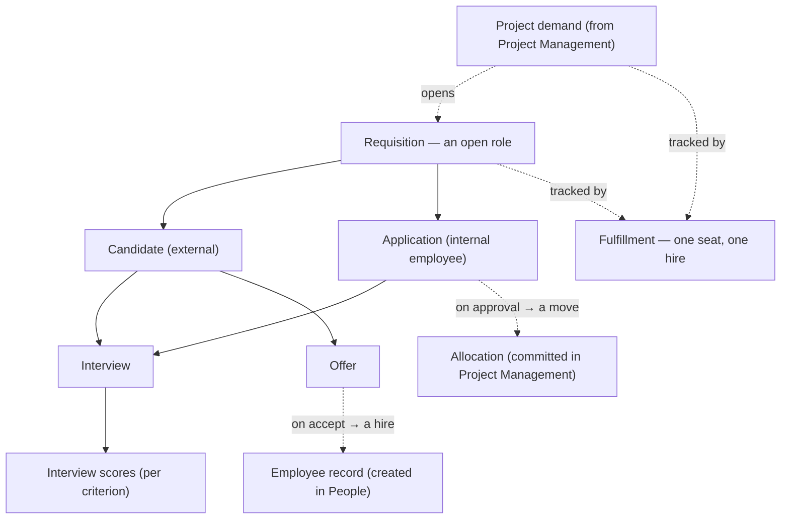

*Structure only — this shows what belongs to what, not any order of events (those live in §8).*

- **Requisition** — one open role to fill: its job description, the role and grade, the account/project it serves, the skills it needs, whether it's a **replacement** or a **new** role, and where it is in the pipeline.
- **Candidate** — an external applicant: their profile, CV, source, skills, and current pipeline stage.
- **Application** — an existing **employee applying** for a role (the internal-mobility path), with its endorsement history.
- **Interview** — a scheduled conversation (round, panel, time, online or onsite) with its result and feedback.
- **Interview scores** — the per-criterion ratings captured against the shared scorecard, so feedback is comparable across candidates.
- **Offer** — the terms made to a candidate; accepting it makes the hire.
- **Fulfillment (one seat)** — the thread that ties a project's open seat to exactly one outcome: filled by an external hire **or** an internal move, never both, with the losing path cancelled.

---

## 6. Use cases

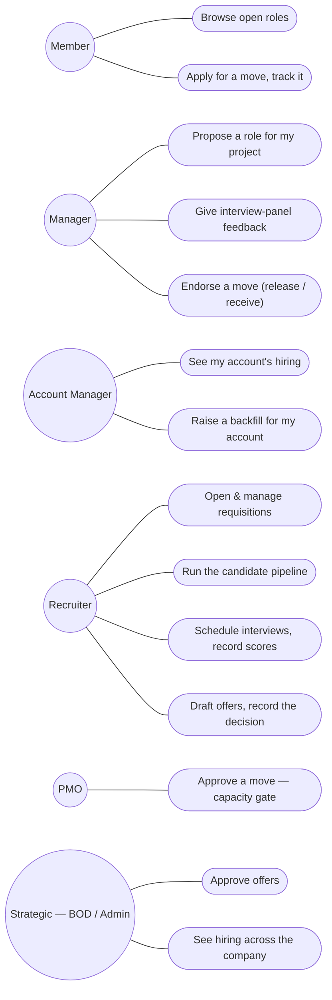

*The PMO is shown as a distinct actor where it owns a distinct use case (the capacity gate); it otherwise sits within Strategic. The diagram shows the actors that own distinct recruitment use cases.*

---

## 7. Features & requirements

*Each requirement is numbered for traceability and has plain acceptance criteria QA can verify.*

### 7.1 Requisitions

**F-REQ-1 — Open & manage a role.** A recruiter (or a Strategic user) can open a requisition with a title, a full job description (about, responsibilities, requirements, nice-to-have), the role and grade, the account/project it serves, the skills and levels it needs, and whether it's a **replacement/backfill** or a **new** role.
- A requisition can be opened directly by a recruiter, or **raised automatically when Project Management flags an unfilled seat** — in which case it is linked to that demand from the start. A **replacement/backfill** role is linked to the specific open position it fills.
- Each requisition represents **one seat**; to hire several people for the same role, several requisitions are opened.
- A role can be edited, paused (**On hold**), resumed, and closed as **Filled** or **Cancelled**.

**F-REQ-2 — Pipeline & status.** A requisition moves through **Sourcing → Screening → Interview → Offer**, and shows a status of the current stage, **On hold**, **Filled**, or **Cancelled**.
- The board shows roles as cards with their stage progress; the list shows them as a table with applicants count, stage, status, and due date.
- Switching between board and list keeps the same roles and filters.

**F-REQ-3 — Internal applicants on a role.** A requisition shows the employees who have applied to it (the internal-mobility path), each with their application status.

**F-REQ-4 — Open roles for employees.** An employee sees Hiring as **Open Roles** — the open requisitions across the company they could apply to — and can follow a role they're interested in.
- Roles a person is a good fit for can be surfaced as **"recommended for you"** by matching their skills and grade against the role's needs.

**F-REQ-5 — Approval & funded headcount.** A requisition is **approved before it opens**, and is **gated on funded headcount** — it cannot be created beyond the budgeted positions that authorize it.
- A requisition runs through a short **approval chain** (hiring manager → PMO/Strategic for budget sign-off) before it becomes open and visible; an unapproved requisition cannot collect candidates.
- A **replacement/backfill** is tied to the specific open position it fills; a **new** role must map to an approved headcount line (People F-HEAD-1). A requisition raised from a PM backfill carries that authorization from the start, so the demand→hire link is governed, not free-created.

### 7.2 Candidates & pipeline

**F-CAND-1 — Add a candidate & parse the CV.** A recruiter can add an external candidate, and uploading a CV **auto-fills** their name, contact, date of birth, gender, seniority, and skills.
- The recruiter reviews and confirms the parsed details before they are saved — nothing parsed is stored unconfirmed.
- The candidate is created against the role they're applying for, at the start of the pipeline, with the CV kept on file.
- A candidate's skills are matched against the role's required skills to show a fit indicator and flag a strong match.

**F-CAND-2 — Pipeline.** A candidate moves through **New → Screening → Interview → Offer → Hired**, viewable as a board (a column per stage) or a list, with search by name/role/skill and a filter by role.
- Moving a candidate between stages is recorded in their activity history.
- A candidate can be moved to a different open role without re-entering their details.
- A candidate who is **Hired** or **Rejected** can no longer be moved.

**F-CAND-3 — Reject with a reason.** A recruiter can reject a candidate, recording a reason and tags; the rejection shows on the candidate thereafter and feeds the recruitment analytics.

**F-CAND-4 — Candidate detail.** Opening a candidate shows their profile, contact, source, rating, CV, skills, notes, their interviews, and a full activity timeline.

**F-CAND-5 — Talent pool.** Previously rejected candidates can be re-matched against current open roles, so a good past candidate isn't lost. Former employees (alumni) are a candidate segment too — a returning hire is sourced here and linked to their existing record at hire (F-OFFER-3).

### 7.3 Interviews

**F-INT-1 — Schedule an interview.** A recruiter can schedule an interview for a candidate or an internal applicant — choosing the round (e.g. Screening, Technical, Culture-fit, Final), the panel, the date, time, and duration, and whether it's **online or onsite**.
- For an online interview a Microsoft Teams meeting link is provided; an onsite interview has no link.
- A panel must have at least one member; scheduling a candidate who was at New or Screening moves them to the Interview stage.
- The panel and the candidate are reminded ahead of the interview (by default the day before; configurable).

**F-INT-2 — Record feedback.** A panel member records an interview's **result** (Pass / Hold / Fail), an **overall rating** (1–5), a **recommendation** (Hire / Next round / No hire), the meeting transcript, and notes.
- The transcript can be **pulled from Microsoft Teams** rather than typed.
- Scores are captured against the shared, **versioned scorecard** (per-criterion ratings with evidence), so feedback is comparable across candidates and a later change to the scorecard never shifts a completed interview's scores.
- Completing an interview that ends Pass / Hire makes the candidate **eligible for the Offer stage** and surfaces them as ready for an offer.

**F-INT-3 — Cancel, no-show, reschedule.** An interview can be cancelled, marked a no-show (with a reason), or rescheduled; the change is recorded.

**F-INT-4 — Interview plan & scorecard gate.** A role's pipeline has a **structured interview plan** — which rounds the candidate goes through and, per round, which competencies each panel member assesses — so interviews are consistent rather than ad hoc.
- Each round assigns its panel a focused set of criteria to score; the panel member knows what they're there to assess.
- A candidate **cannot advance to the Offer stage until the round's scorecards are submitted** — a missing scorecard blocks the advance, so an offer is never made on incomplete feedback.

### 7.4 Offers

**F-OFFER-1 — Make an offer.** A recruiter drafts an offer (compensation, start date, the role/position it's for); a Strategic user **approves** it before it goes out.

**F-OFFER-2 — Record the decision.** The candidate's decision is recorded as **Accepted** or **Declined**.
- A candidate can have only **one accepted offer**.
- Declining closes the offer (the role can continue with other candidates).

**F-OFFER-3 — Hire handoff.** Accepting an offer **hires** the candidate and hands them to People, which creates the employee record and starts onboarding — with nothing re-keyed — and commits the project allocation the role was opened for.
- Before the handoff, the candidate is **matched against existing people** (by identity, work email, or name + date of birth). If they are a **returning former employee**, the handoff carries the matched person so People adds a new employment period to their **existing** record rather than creating a duplicate.
- The hire is handed over **exactly once**, even if the acceptance is processed more than once.

**F-OFFER-4 — Respond-by & expiry.** An approved offer is issued to the candidate with a **respond-by date**; if they don't decide by then it **lapses (Expired)** and the recruiter is notified.
- A lapsed offer is closed; the role can continue with other candidates.

**F-OFFER-5 — Revise & re-approve (negotiation).** An offer can be **revised** (e.g. after a counter on compensation or start date) — a new version that goes back through approval before it is re-sent, with the prior versions kept on record.
- A candidate who declines on terms doesn't dead-end: the recruiter can revise and re-issue rather than losing them.

**F-OFFER-6 — Pre-hire checks.** Where required, an accepted offer passes a **background / reference check** before the hire is final — a gate between *Accepted* and *Hired*.
- A failed check stops the hire (the seat stays open); a passed or waived check lets the handoff (F-OFFER-3) proceed.

**F-OFFER-7 — Reneged or no-show before start.** A candidate who **accepts then withdraws** before day one, or **no-shows at onboarding**, is a recognized outcome — not a dead end requiring a full offboarding.
- The hire is reversed cleanly: the person is recorded as **Did not start** in People (People F-ONB-5) and the **project seat reopens** in Project Management so the pipeline resumes — rather than offboarding someone who never worked.

### 7.5 Internal mobility

**F-MOB-1 — Apply for a move.** An employee can apply to an open role, with a note; they can withdraw any time **before the PMO's decision** — once approved or rejected, it can no longer be withdrawn.

**F-MOB-2 — Endorsement chain.** An application is endorsed in order by the employee's **current (releasing) manager**, then the **receiving manager**, before it reaches the PMO — each an explicit, recorded decision in which the endorsing manager notes the spare capacity.
- Each endorsement notifies the next approver in the chain, so nothing stalls silently.

**F-MOB-3 — PMO review & approval (the single capacity gate).** After both managers endorse, the application reaches **PMO review**, where the PMO checks the person's capacity before deciding. The **PMO** is the final approver, and this is **the one place capacity is gated** for the move — it is not re-approved downstream.
- Approving someone onto a role **beyond full capacity** (the over-allocation measure Project Management derives and People surfaces) requires an explicit **over-allocation override** — a single PMO decision whose reason and approver are recorded in the audit trail and **carried with the move** (it is not prompted again when the allocation is committed) (OQ-5).
- On approval the move hands off both ways, with capacity already settled: **Project Management** commits the allocation to the new role, and — if the move changes the person's **role or grade** — People records a **movement (job change) against the existing employee record**, where **HR applies the pay/position aspect without re-approving capacity** (People F-MOVE-2). Hiring never edits the employment record itself, and no new employee is created.
- On rejection nothing changes. The full endorsement and decision history is kept on the application, and the applicant can follow it through to the move taking effect (People notifies them on the effective date — F-MOVE-3).

### 7.6 One-seat fulfillment

**F-FILL-1 — One seat, one hire.** When a project needs a person, that single open seat is tracked from the moment a requisition opens to the moment it's filled — by an **external hire** or an **internal move**, never both.
- When one path fills the seat, the other in-flight path for that seat is **cancelled** automatically.
- A seat left unfilled past its deadline is raised on the PMO's and the assigned recruiter's attention list, with a notification — never silently dropped.

### 7.7 Recruitment reports

**F-RPT-1 — Recruitment dashboard.** A recruiter or leader sees open roles, candidates in process, average days to hire, and offer acceptance, with an overall hiring-health read — scoped to what they're responsible for (recruitment-wide, account, own roles).

**F-RPT-2 — Funnel & lead time.** The dashboard shows how many candidates sit at each step and how long they spend there, calling out the **biggest drop-off** and the **slowest step**.

**F-RPT-3 — Roles at risk.** Open roles are shown against their deadlines (on track / due soon / overdue), and hiring pace is shown against demand for the coming months.
- Each pipeline stage carries an **SLA target** (the expected days in stage); candidates and roles aging past their stage SLA surface on an attention list, so a stalled pipeline is caught rather than forgotten.

**F-RPT-4 — Recruiters & sources.** The dashboard shows recruiter performance (hires, time-to-fill, on-time rate) and where hires come from (applicants, hires, hire rate, cost per hire by channel).

### 7.8 Recruitment insight (Knowledge Base)

**F-KB-1 — Learning from closed roles.** From closed roles, Hiring shows a retrospective: **pass rate by interview round**, what **winning candidates share**, the **failure patterns** behind rejections (clustered by theme), an **improvement plan** per theme, the **hardest roles to fill**, and a **case-study log** of each candidate's outcome, reason, and tags.
- This is recruitment **analytics** built from the pipeline's own outcomes — not a job-description library.

### 7.9 Documents

**F-DOC-1 — Document vault.** Candidate CVs and offer letters are kept on file against the candidate and the offer.

### 7.10 Protection & audit (cross-cutting)

**F-SEC-1 — Sensitive-data protection.** A candidate's personal contact details and an offer's compensation are shown only to recruiters and Strategic users; everyone else sees them as restricted.

**F-SEC-2 — Audit trail.** Every change — an edit, a status change, an approval, a decision, an access grant — is recorded with who did it and when, building a full history that an authorized user can review.

**F-SEC-3 — Organization isolation.** A user only ever sees their own organization's data; nothing from another organization is ever visible.

**F-SEC-4 — Cross-account access grant (suite-wide).** An Account Manager who needs to see an account they don't own can **request access**; a **PMO or Strategic** user **grants or revokes** it (it is never self-granted).
- A grant is **suite-wide** — it widens the manager's visibility to that account across **People, Hiring, and Project Management** for as long as it lasts (optionally time-boxed); revoking it removes the visibility everywhere immediately.
- Granting and revoking are recorded in the audit trail.

### 7.11 Assistant integration ("Ask Seta")

**F-AI-1 — Read & draft, approve before write.** The assistant can read what the current user is allowed to see and **draft** changes (e.g. open a requisition, schedule an interview, endorse or approve a move, make or approve an offer), but **every drafted change is held for the user to approve before it is saved**.
- The assistant never sees or changes anything the current user couldn't see or change themselves.

---

## 8. Key journeys

Each journey reads as a **lifecycle** — what goes **in**, how it's **handled**, and what comes **out**. The first shows the whole suite end to end; the rest zoom into Hiring.

**End-to-end — from a project's need to a delivering, growing employee** *(the whole suite)*

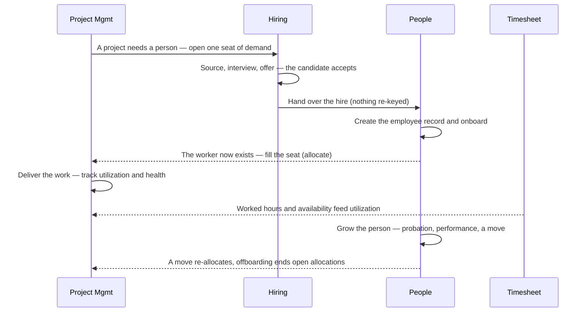

*In: a project's staffing need. Handling: hire → onboard → allocate → deliver → review. Out: a staffed project and an employee with a tracked journey.*

**Sourcing to hire**

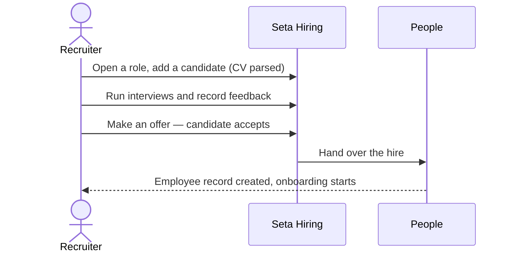

*In: an open role and a candidate's CV. Handling: pipeline → interviews → offer. Out: an accepted offer handed to People as a new employee.*

**Internal mobility — the capacity-gated move**

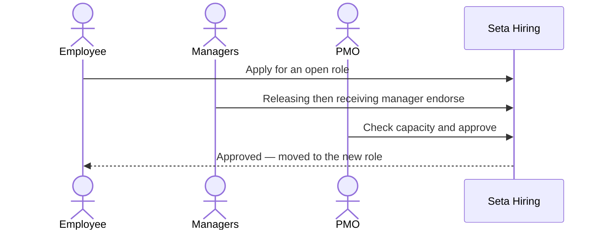

*In: an employee's application. Handling: releasing then receiving endorsement, then the PMO capacity gate. Out: an approved move (recorded in People as a job change).*

**One seat, one hire — fulfillment**

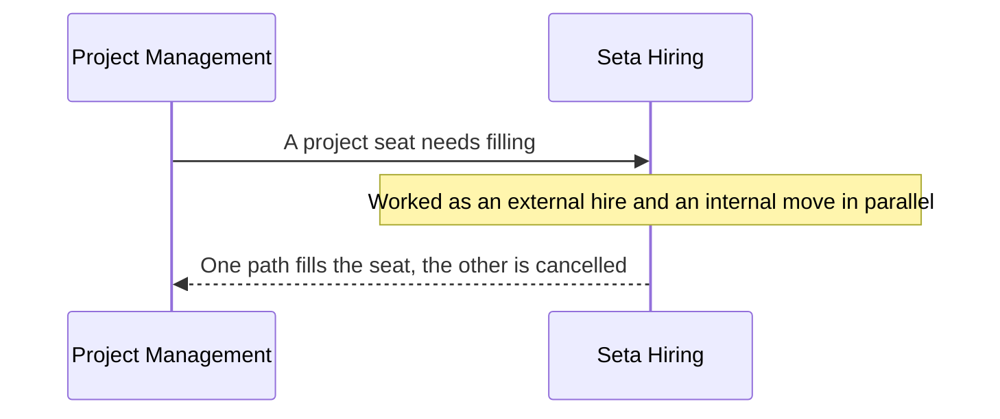

*In: a project's open seat. Handling: external hire and internal move worked in parallel. Out: the seat filled exactly once, the losing path cancelled.*

---

## 9. States

**The full person lifecycle (across Hiring and People)**

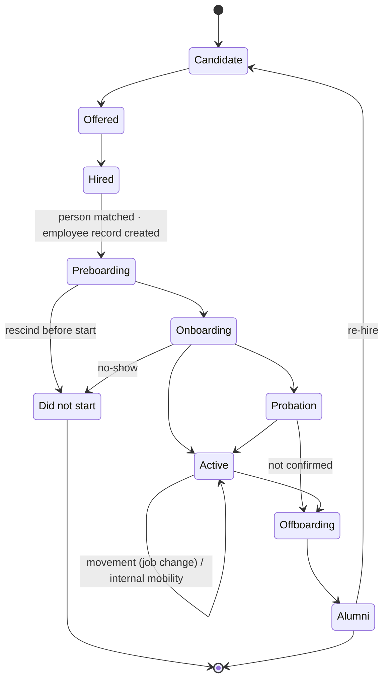

*Candidate and Offered are owned by Hiring; from Preboarding on, People owns the person. A hire who rescinds before day one or no-shows ends at **Did not start** (never an active employee — the project seat reopens, F-ONB-5), not Alumni. An internal move and a re-hire both run back through Hiring's selection but resolve to the **same person** in People — never a second record.*

**A candidate's pipeline**

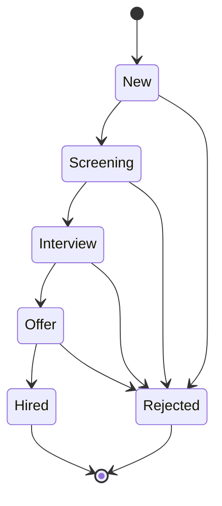

**An internal-mobility application**

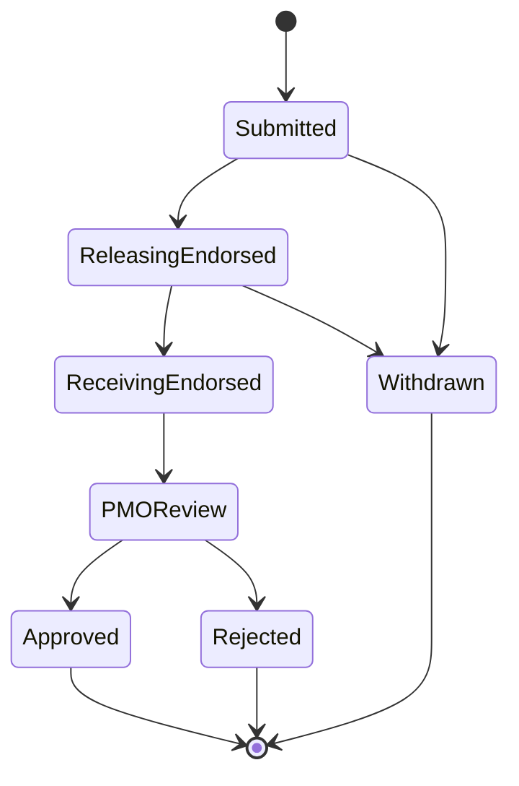

**An offer**

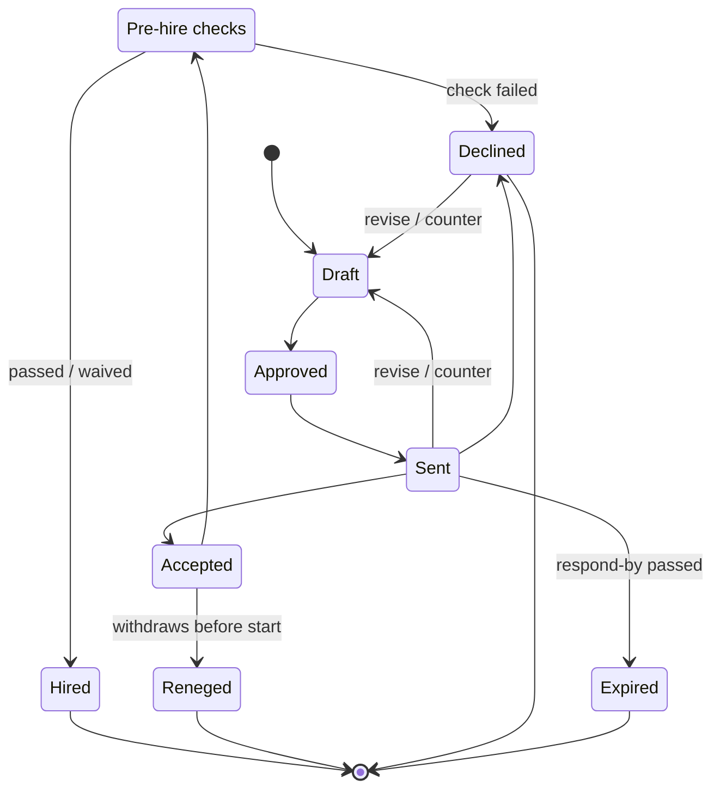

*A revised offer goes back through approval before it's re-sent; an accepted offer clears any pre-hire checks before it becomes a hire; a candidate who reneges before day one ends at Reneged and the seat reopens (F-OFFER-7).*

**A project seat (fulfillment)**

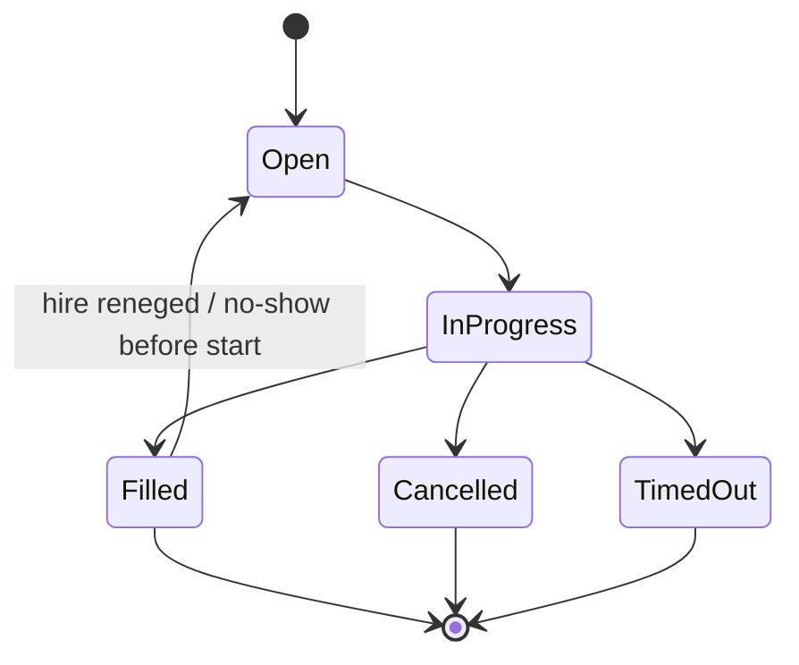

---

## 10. Acceptance scenarios (for QA)

Plain, verifiable behaviors. The **Covers** column maps each scenario to the requirement it verifies. Italic = behavior to confirm / test still to be written. (QA IDs are stable identifiers and may be non-contiguous.)

| # | Scenario | Expected | Covers |
|---|---|---|---|
| QA-1 | Open a requisition with a job description | The role is created at Sourcing with status open | F-REQ-1 |
| QA-2 | Put a role on hold, then resume it | The role pauses and resumes without losing its place | F-REQ-1, F-REQ-2 |
| QA-3 | Switch a role between board and list | The same roles and filters carry across | F-REQ-2 |
| QA-4 | An employee opens Hiring | They see only Open Roles and can apply, not manage | F-REQ-4 |
| QA-5 | Upload a candidate's CV | Name, contact, seniority, and skills are auto-filled for the recruiter to confirm | F-CAND-1 |
| QA-6 | Move a candidate from New to Interview | The move is recorded in their activity history | F-CAND-2 |
| QA-7 | Try to move a Hired or Rejected candidate | Not allowed | F-CAND-2 |
| QA-8 | Reject a candidate with a reason and tags | The reason shows on the candidate and feeds the analytics | F-CAND-3 |
| QA-9 | Re-match rejected candidates to open roles | Suitable past candidates are surfaced for current roles *(test to be written)* | F-CAND-5 |
| QA-10 | Schedule an online interview | A Teams link is provided; an onsite interview has none | F-INT-1 |
| QA-11 | Schedule an interview for a New candidate | The candidate moves to the Interview stage | F-INT-1 |
| QA-12 | Schedule an interview with no panel member | Not allowed — at least one is required | F-INT-1 |
| QA-13 | Record interview feedback | Result, rating, recommendation, transcript, and per-criterion scores are saved | F-INT-2 |
| QA-14 | Change the scorecard after an interview was scored | The completed interview's scores are unchanged | F-INT-2 |
| QA-15 | A recruiter drafts an offer | It cannot go out until a Strategic user approves it | F-OFFER-1 |
| QA-16 | A candidate already has an accepted offer, accept a second | Not allowed — one accepted offer per candidate | F-OFFER-2 |
| QA-17 | A candidate accepts an offer | They are hired and handed to People, which creates the employee and starts onboarding | F-OFFER-3 |
| QA-18 | The acceptance is processed twice | The hire is handed over exactly once *(test to be written)* | F-OFFER-3 |
| QA-19 | An employee applies for an open role | The application starts and the releasing manager is notified | F-MOB-1, F-MOB-2 |
| QA-20 | Endorsements happen out of order | The chain must go releasing manager, then receiving manager, then PMO | F-MOB-2 |
| QA-21 | The PMO approves a move beyond full capacity | An explicit over-allocation override is required | F-MOB-3 |
| QA-22 | The PMO approves a move | The person is committed to the new role and Project Management allocates them | F-MOB-3 |
| QA-23 | A seat is filled by an internal move while an external hire is in progress | The external path for that seat is cancelled | F-FILL-1 |
| QA-24 | A seat passes its deadline unfilled | It is escalated, not silently dropped | F-FILL-1 |
| QA-25 | An Account Manager opens the reports | Figures are scoped to their account, not the whole company | F-RPT-1 |
| QA-26 | View the recruitment funnel | The biggest drop-off and slowest step are called out | F-RPT-2 |
| QA-27 | Open the recruitment-insight view | Pass-rate by round, failure patterns, and an improvement plan are shown from closed roles | F-KB-1 |
| QA-28 | A non-recruiter opens a candidate or an offer | Contact details and compensation show as restricted | F-SEC-1 |
| QA-29 | Make any change | It is recorded with who did it and when | F-SEC-2 |
| QA-30 | A user from one organization tries to see another's roles | Never possible | F-SEC-3 |
| QA-31 | The assistant proposes opening a requisition | The change is held for a human to approve before anything is saved | F-AI-1 |
| QA-32 | Project Management flags an unfilled seat | A requisition is raised automatically, linked to that demand | F-REQ-1 |
| QA-33 | Close a role as Cancelled | It shows Cancelled and the pipeline stops | F-REQ-2 |
| QA-34 | Open a role with internal applicants | Its applicants are listed with their application status | F-REQ-3 |
| QA-35 | Parse a CV but don't confirm the fields | Nothing parsed is saved until the recruiter confirms it | F-CAND-1 |
| QA-36 | Open a candidate | Profile, contact, source, CV, interviews, and a full activity timeline show | F-CAND-4 |
| QA-37 | Move a strong candidate from a closed role to an open one | They carry over without re-entry | F-CAND-2 |
| QA-38 | Reschedule, or mark a no-show with a reason | The change is recorded | F-INT-3 |
| QA-39 | A candidate completes a Pass / Hire interview | They become eligible for the Offer stage | F-INT-2 |
| QA-40 | A candidate declines an offer | The offer closes; the role continues with other candidates | F-OFFER-2 |
| QA-41 | An offer's respond-by date passes with no decision | It lapses (Expired) and the recruiter is notified | F-OFFER-4 |
| QA-42 | Withdraw an internal application before, then after, the PMO decides | Allowed before the decision; not after | F-MOB-1 |
| QA-43 | A recruiter endorses a move | The next approver in the chain is notified | F-MOB-2 |
| QA-44 | Open the recruiters & sources view | Recruiter performance and channel hire-rate / cost show | F-RPT-4 |
| QA-45 | Open the document vault for a candidate | Their CV and any offer letters are on file | F-DOC-1 |
| QA-46 | A returning former employee is hired | They are matched to their existing person; People adds a new employment period — no duplicate record | F-OFFER-3 |
| QA-47 | An approved internal move changes the person's role/grade | Hiring hands the change to People as a movement against the existing record; no new employee is created | F-MOB-3 |
| QA-48 | Open the roles-at-risk view | Roles show on track / due soon / overdue against their deadline, hiring pace vs demand shows, and items stalled too long in a stage appear on the attention list | F-RPT-3 |
| QA-49 | Try to open a requisition without approval / beyond funded headcount | It cannot collect candidates until approved, and a new role beyond budgeted headcount is blocked | F-REQ-5 |
| QA-50 | A candidate reaches Offer with a panel scorecard missing | The advance to Offer is blocked until the round's scorecards are submitted | F-INT-4 |
| QA-51 | A candidate counters on compensation | The offer is revised, re-approved, and re-sent; prior versions are kept | F-OFFER-5 |
| QA-52 | An accepted offer requires a background check | The hire is held at pre-hire checks; a failed check stops it, a passed/waived check lets the handoff proceed | F-OFFER-6 |
| QA-53 | A candidate accepts then withdraws before day one | They are recorded as "Did not start" and the project seat reopens — no full offboarding | F-OFFER-7 |
| QA-54 | Open the recruitment dashboard | An overall hiring-health read shows alongside open roles, in-process candidates, time-to-hire, and acceptance — scoped to what the viewer is responsible for | F-RPT-1 |
| QA-55 | An Account Manager is granted access to another account, then it's revoked | While granted they see that account's hiring too (the grant is suite-wide); revoking removes it immediately; both are audited | F-SEC-4 |

---

## 11. Open questions

| # | Question | Owner |
|---|---|---|
| OQ-1 | **Knowledge Base scope:** confirmed as recruitment **analytics**, not a job-description library. Decide separately whether a job-description-template store is wanted, and where it lives. | Product |
| OQ-2 | **Localization:** which recruitment content (job descriptions, candidate-facing text, interview guides) must be authored in both English and Vietnamese? | Product |
| OQ-3 | **Microsoft Teams integration:** interview meeting links and transcript pulls depend on the integrations layer. Confirm availability and the manual fallback. | Product + Eng |
| OQ-4 | **CV parsing:** confirm the recruiter always reviews parsed fields before they're saved, and the expected accuracy bar. | Product |
| OQ-5 | **Over-allocation override:** who may approve a move beyond full capacity, and how is it surfaced and audited? This is the **same single decision** as PM OQ-5 (recorded once at PMO mobility approval, carried with the move). | Product + PMO |
| OQ-6 | **Follow a role:** the prototype lets an employee "follow" an open role. Confirm whether following (and any referral flow) is in the first release. | Product |
| OQ-7 | **Success-metric targets** in §2 marked TBD are a business call to set at sign-off; confirm which metrics gate the release. | Product / PMO |
| OQ-8 | **Candidate communication:** the prototype shows no candidate-facing messages (interview invites, decisions, offer delivery). Decide whether templated candidate communication is in scope, or done outside the system. | Product |
| OQ-9 | **Everyday recruiter actions:** confirm whether duplicating a role (opening several similar seats at once), reassigning a role to another recruiter, and bulk-adding candidates from a sourcing batch are in the first release. | Product |
| OQ-10 | **Endorsement edge cases:** how a move is handled when the releasing and receiving manager are the same person, or an approver is absent. | Product + PMO |
| OQ-11 | **Role-level requisitions (openings count):** established ATS tools (Greenhouse/Ashby) let one requisition carry N openings against a single shared candidate pipeline. The platform's settled model is **one seat = one requisition** (for clean exactly-once fill). Confirm whether to add a role-level grouping/shared-pipeline view over several one-seat requisitions, without changing the one-seat fill model. | Product + Eng |
| OQ-12 | **Requisition approval chain:** confirm the exact sign-off steps before a requisition opens and who approves budget/funded headcount (F-REQ-5). | Product / PMO |

