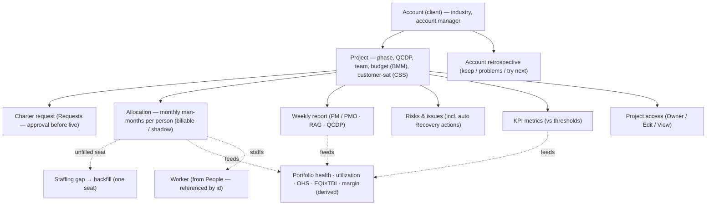
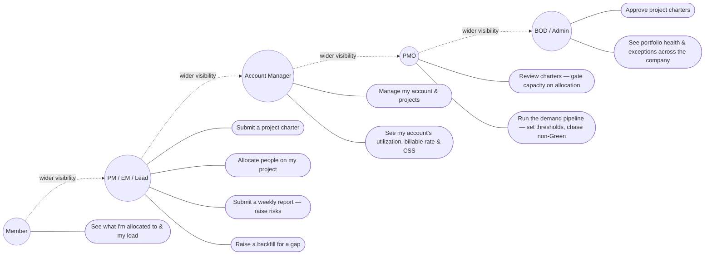
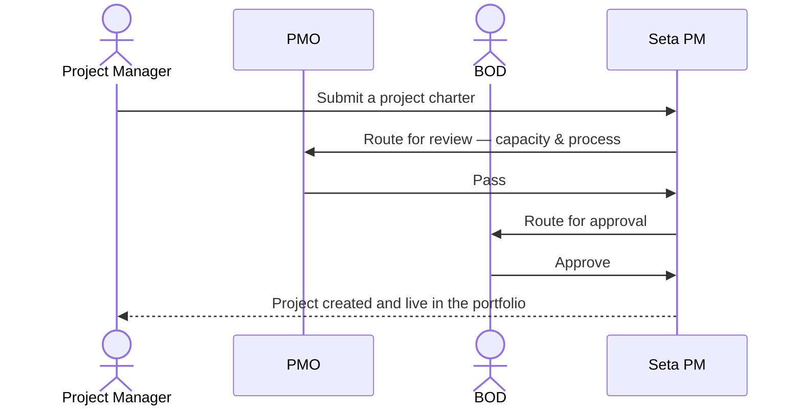
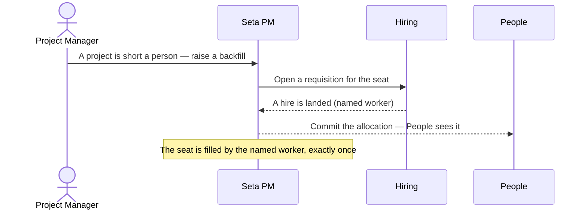
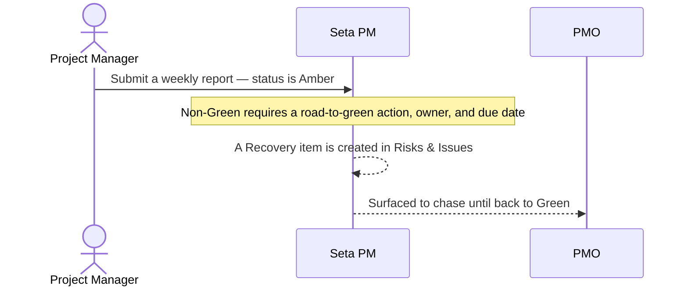
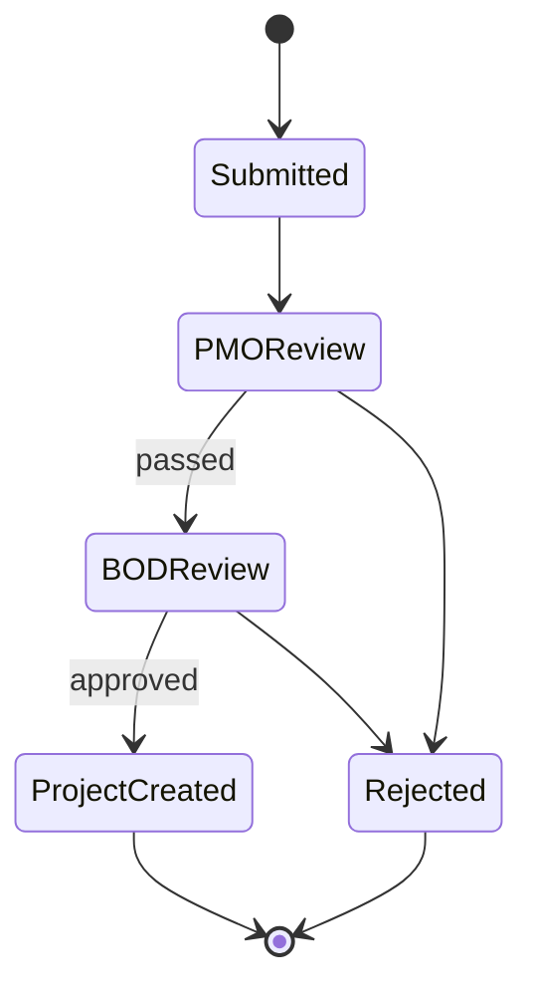
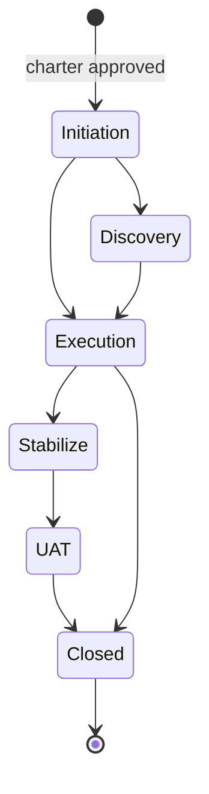
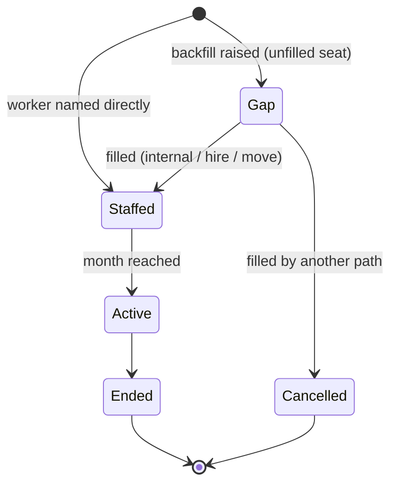
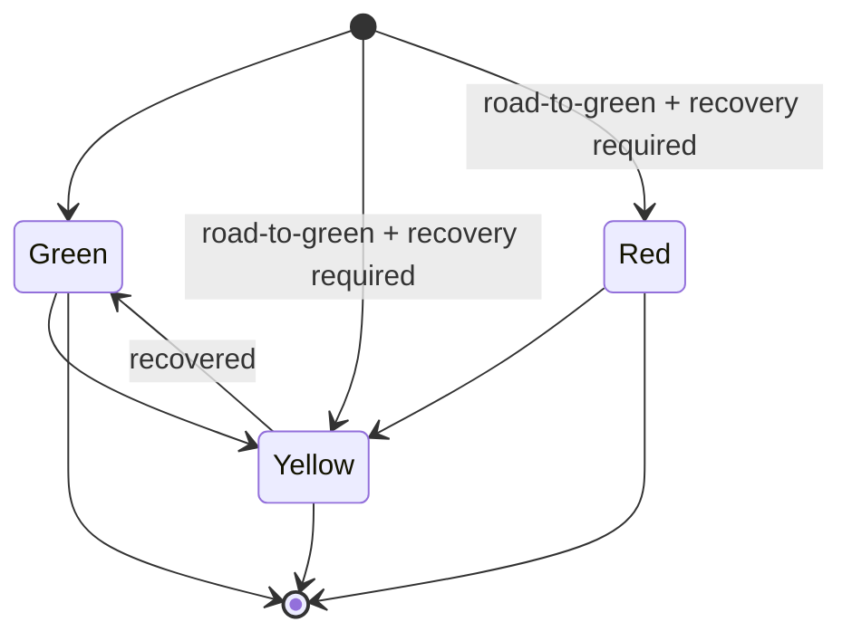

# Product Requirements Document — Project Management (PSA)

| | |
|---|---|
| **Product area** | Seta — Project Management |
| **Status** | Draft (to-build) · 2026-06-18 |
| **Version** | 0.1 |
| **Audience** | Product · PMO · QA |

---

## 1. Overview

Project Management is Seta's **delivery system-of-record** — the place that knows **which clients we serve, what projects we run for them, who is staffed on each one, and whether those projects are healthy**. It holds the company's **accounts** (the outsourcing clients) and the **projects** under them, runs each new project through a **charter approval** before it goes live, and — most importantly for an outsourcing business — owns **resource allocation**: the authoritative record of **who is staffed on what, at what monthly effort, billable or not**. On top of that it monitors delivery health through **QCDP** (Quality, Cost, Delivery, Process) with a **RAG** (Red / Amber / Green) read, collects **weekly status reports**, tracks **risks and issues**, runs a **KPI** programme with an operational-health score, and surfaces the **staffing gaps** a project needs filled — handing them to Hiring.

PM is built around six working areas that mirror how a PMO actually runs a portfolio: **Portfolio** (account-and-project health rollup), **Requests** (the project-charter governance flow), **Weekly Reports**, **RA Monitoring** (resource allocation and utilization), **Risks & Issues**, and **KPI Metrics**. It sits at the centre of the workforce flow: it is the **single source of truth for allocation and utilization** that People reads (to show who's loaded and to decide who can see whom), it raises the **demand** Hiring turns into open roles, and it commits the **allocation** when a hire or an internal move lands. It never keeps its own copy of the employee — it references each worker by id and reads their skills, capacity, and availability from People.

**The problem.** For a software-outsourcing firm, the business *is* billable time on client projects — yet the facts that decide whether that business is healthy are scattered. Who is over-allocated across two accounts, and who is sitting idle? Which projects are slipping their QCDP, and is anyone acting on it? Where are we short of people next month, and has that gap become a hire? What's the margin and billable rate on this account? Today these live in disconnected spreadsheets, status emails, and a staffing tool that doesn't talk to recruitment or to the employee record. PM makes delivery a single, structured, permission-aware source of truth — so the PMO can protect capacity, project managers can run and report on their projects in one place, leaders get an honest portfolio view, and the assistant Seta is built around can reason over real accounts, projects, and allocations.

**Who benefits**

| Audience | Value |
|---|---|
| Project Manager / Engineering Manager | One place to run a project end to end — charter, staffing, weekly status, risks, KPIs — and to raise a staffing need or a retro action without leaving the tool. |
| PMO | The capacity gatekeeper's console: every allocation and over-allocation, the demand pipeline, charter sign-off, KPI thresholds, and a portfolio-wide view of health and predictability. |
| Account Manager | Everything on their account(s) — projects, who's staffed, utilization, billable rate, customer satisfaction, and risks — without seeing the rest of the company. |
| Board of Directors (BOD) / leadership | Portfolio health, utilization, billable rate, predictability, and the exceptions worth acting on — with charter approval at the top of every new project. |
| Team member | A clear view of what they're allocated to and how loaded they are. |

---

## 2. Goals & success metrics

**Goals**

1. Make PM the **single source of truth** for accounts, projects, and **resource allocation** — the facts People, Hiring, and the assistant all rely on.
2. Govern every new project through a **charter approval** (PM → PMO → BOD) so capacity and commercial sense are checked before work starts.
3. Give the PMO real **capacity control** — a monthly allocation grid with over-allocation, idle, and burnout flags, and a single path from "we're short a person" to a filled seat.
4. Surface **delivery health honestly** — QCDP/RAG, weekly status, risks, and KPIs **derived** from real inputs, not free-typed optimism — in time to act.
5. Turn delivery data into **decisions**: utilization, billable rate, predictability, margin, and staffing gaps put in front of the people who can act on them.

**Success metrics** *(targets are a business decision — to be set at sign-off unless noted)*

| Objective | Metric | Target |
|---|---|---|
| Healthy utilization | Average utilization across billable staff; over-allocated / idle people surfaced in time to rebalance | within each role's safe band; flags surfaced within the month |
| Billable rate | Billable man-months ÷ total capacity | ≥ 80% |
| Delivery predictability | Estimate reliability (planned vs actual) across the portfolio | ≥ 75% |
| Report compliance | Share of active projects with a weekly report this week | ≥ 90% |
| Acting on red | Share of non-Green reports with a road-to-green action, owner, and due date | 100% |
| Margin | Gross margin by account / project against target | ≥ 35% green / ≥ 25% amber |
| Demand filled | Time from a staffing gap being raised to the seat being filled | TBD |

The **PMO owns these metrics**; every target marked TBD is set at sign-off, and which metrics gate the release is confirmed then (OQ-10).

---

## 3. Roles & access

Two independent things decide what a person sees and does — the same model People and Hiring use — plus the **PMO** as the **capacity gatekeeper** and a **project-level access** grant layered on top of the tier.

**Access tier** — *what a person can do.*

- **Strategic** — the Board of Directors (BOD), Admin, and the **PMO**. Org-wide reach; the **BOD** is the final approver in a project charter; the **PMO** reviews charters, **owns allocation as the capacity gatekeeper**, configures KPI thresholds, and chases non-Green reports.
- **Account Manager** — sees and acts for the account(s) they own — their projects, allocations, utilization, billable rate, customer satisfaction, and risks; needs an explicit grant to see another account.
- **Project Manager / Engineering Manager / Team Lead** — runs the projects they manage: submits charters, edits allocation on their projects, submits weekly reports, raises and owns risks, and raises staffing demand for their project.
- **Member** — sees what they're allocated to and their own utilization (read-only).

**Visibility scope** — *which accounts and projects you can see* — is derived from **account ownership and project membership**, not set by hand. An Account Manager sees their accounts' projects; a PM/EM sees the projects they are **named on or granted Owner/Edit access to**; a member sees only the projects they're allocated to (and, within those, **only their own allocation rows — never a colleague's effort or billable status**). An Account Manager who needs another account requests it (F-SEC-4). No one ever sees another organization's data.

**Project access (R&R)** — on top of the tier, each project carries explicit **Owner / Edit / View** grants, assigned in the charter's post-approval staffing step (F-ACCESS-1). This **project-scoped** grant is what makes "own project" concrete: it decides who can edit a specific project's plan, allocation, reports, and risks, regardless of how wide their tier view is.

Within Strategic, the **PMO is a distinct authority**: it alone gates capacity on allocation (including the over-capacity override — F-ALLOC-2), sets KPI thresholds, and runs the open-seat pipeline — powers the BOD and Admin do not exercise day to day.

**Field-level rules** always apply: **cost, margin, and commercial figures** are shown only to the PMO, the account's manager, and Strategic users; everyone else sees them as restricted.

**What each tier can do** *(defaults; an organization may fine-tune)*

| Capability | Member | PM / EM / Lead | Account Manager | Strategic (BOD / Admin / PMO) |
|---|---|---|---|---|
| Accounts | — | View own | Create / edit own | All; PMO/Admin manage |
| Requests (project charter) | View own | **Submit & run** own | Create / edit own account | **PMO reviews · BOD approves** |
| RA Monitoring (allocation) | View **self** only | **Edit** own project | View own account | **PMO — capacity gatekeeper, all** |
| Utilization & flags | Self only | Own project | Own account | All |
| Portfolio / project health | — | Own | Own account | All |
| Weekly reports | — | **Submit (as PM)** own project | View own account | All; PMO submits & chases |
| Risks & issues | View own project | **Raise & own** own project | View own account | All |
| KPI metrics & thresholds | — | **Enter own project's inputs**; view | View own account | PMO sets thresholds |
| Staffing / backfill | View own | **Raise** own project | View own account | PMO runs the open-seat pipeline |
| Cost & margin | — | — *(restricted)* | View own account | PMO/Strategic |

> Logging-in accounts are provisioned separately by an administrator; signing in with single sign-on authenticates a person who has already been created and never auto-creates one.

> The assistant ("Ask Seta") acts as a restricted helper, not a person: it can read what the current user is allowed to see and **draft** changes, but every change it proposes is held for a human to approve before it is saved (§7.12).

---

## 4. Scope

**PM owns delivery; it references the worker and feeds the workforce flow.** PM is the **single source of truth for accounts, projects, and resource allocation** for the whole platform — People reads who's allocated and how loaded from PM (it never authors allocations), and PM's allocation view is what People uses to decide visibility scope. In the other direction, PM **reads** the worker facts it needs — skills, capacity, leave/availability — from **People**, and **raises staffing demand** to **Hiring**, which turns it into an open role; PM never recruits and never holds an employee record.

**In scope:** accounts (clients) and their account managers; projects and the **charter approval flow** ("Requests": submit → PMO review → BOD review → project created); **resource allocation** (a monthly man-month grid, billable vs non-billable, multi-project, capacity-checked) and the **utilization** it derives, with reallocation suggestions; **portfolio and project health** (QCDP/RAG, predictability, customer satisfaction, report compliance, exceptions); **weekly status reports** (dual PM/PMO) with road-to-green; **risks and issues** (with auto-created recovery actions); **KPI metrics, thresholds, the operational-health score (OHS), the EQI×TDI (engineering-quality × technical-debt) engineering-health matrix, and the corrective-and-preventive-action (CAPA) register**; **account retrospectives**; **staffing demand / backfill** handed to Hiring; **project-level access grants**; sensitive-data protection and a full audit trail; and the read/draft tools the "Ask Seta" assistant uses against all of the above.

**Out of scope (now):**

- **The employee record, skills mastery, org & positions, and the lifecycle** — owned by People; PM references each worker by id and reads their facts. PM stores how someone is *staffed*, not who they *are*.
- **Recruitment** (requisitions, candidates, interviews, offers) — owned by Hiring; PM raises a backfill/demand and consumes the result, but never runs a pipeline.
- **Time-off / leave, attendance, and worked timesheets** — owned by the timesheet system; PM reads availability (via People) and may read logged hours for "actual" utilization and margin, but owns none of it.
- **Payroll, billing, and invoicing** — PM derives margin and billable rate, but finance administration (rate-card maintenance, invoices, payroll) is a downstream integration (OQ-3).
- **Per-project task execution (kanban)** — reused from the **Planner** module (a planner group per project); PM links to it rather than rebuilding it (OQ-1).
- **The assistant's chat experience, the web shell, navigation chrome, and global search bar** — delivered elsewhere; PM supplies the data and approve-before-write tools behind them.

**Upstream / downstream dependencies.** Each has a defined fallback so PM stays usable if a neighbour is late or down.

| PM needs… | From / To | Fallback if absent |
|---|---|---|
| Worker skills, role, and profile (to staff and match) | From People | Allocation still works by id; skill-match cues show "unavailable" |
| Worker capacity (full-time-equivalent / contracted hours, effective-dated) | From People | Utilization uses the last known capacity; a missing capacity shows the figure as unavailable, not guessed |
| Worker availability (approved leave) | From People (timesheet-owned) | Availability shows last-known; flags use planned capacity only |
| A hire or an approved internal move to fill a demanded seat | From Hiring | The seat stays open and is escalated; the PMO fills it internally |
| "Actual" worked hours behind utilization and margin | From the external timesheet system | The "actual" figure is omitted (not guessed); planned utilization and margin still show |
| Per-project task board | To / from Planner | The project links to a planner group; if absent, the task board is simply unavailable |

**Module boundaries & data ownership.** The same worker is one identity across several modules, but **each fact has exactly one owner**; the others read it. PM never holds a second copy of what it doesn't own, and no module writes into another's data — they stay in step through events and module APIs.

| Concern | Owned by | PM's relationship |
|---|---|---|
| Login, single sign-on, roles | Identity | PM gates access by role and project grant |
| **Accounts, projects, resource allocation, demand, portfolio health, KPIs, margin** | **PM** | The source of truth PM owns |
| Employee record, org & positions, skills, capacity, lifecycle | People | PM reads worker facts by id; People reads PM's allocation view for utilization and visibility |
| Recruitment (open roles, candidates, interviews, offers) | Hiring | PM raises a backfill/demand; Hiring fills it and signals back the hire/move |
| Time-off / leave, attendance, worked hours | Timesheet system | PM reads availability and logged hours; owns none of it |
| Per-project task execution (kanban) | Planner | PM links a project to a planner group |
| Payroll, billing, rate-card administration | Downstream finance | PM derives margin; finance administration runs elsewhere |

When a project is short of a person, **PM raises a backfill** (a one-seat staffing need) and hands it to **Hiring**, which opens a requisition; when Hiring lands a hire or the PMO approves an internal move, **PM commits the allocation** — filling the seat with the named worker. People then sees that allocation through PM's view. The worker is one identity across all modules, linked by id and kept in step by events — never a shared record.

**Priority**

| Priority | What |
|---|---|
| **Must (MVP)** | Accounts; projects + charter flow; **resource allocation** (monthly MM grid, billable, capacity-checked) and utilization; the allocation view People consumes; sensitive-data protection; audit. |
| **Should** | Portfolio / project health (QCDP/RAG, predictability, report compliance); weekly reports with road-to-green and auto-recovery; KPI metrics, thresholds & the operational-health score; staffing/backfill to Hiring. |
| **Could** | Risks & issues with resource-risk → backfill; EQI×TDI matrix & CAPA register; account retrospectives; reallocation suggestions; project-level access grants; margin; the assistant's draft-and-approve tools. |
| **Won't (now)** | The employee record, recruitment pipeline, leave/timesheets, payroll/invoicing/rate-card admin, a bespoke per-project task board (reuse Planner), the assistant chat surface. |

---

## 5. How PM is organized

*Structure only — this shows what belongs to what, not any order of events (those live in §8). Health, utilization, the operational-health score, and margin are **derived** — recomputed from allocations, reports, KPIs, and rates, never free-entered.*

- **Account** — an outsourcing client (with an industry and an account manager); it has one or more projects and an account-level health rollup, billable rate, and customer-satisfaction score.
- **Project** — a piece of work under an account, with an objective, scope, budget (in **billable man-months, BMM**), a methodology and pricing model, a PM and PMO, a **phase** (Initiation / Execution / Stabilize / UAT / Discovery), a QCDP/RAG health read, a team count, a customer-satisfaction score (CSS, out of 5), and a predictability figure. A project goes live only after its **charter** is approved.
- **Charter request ("Requests")** — the approval a new project passes through (PM submits → PMO reviews → BOD approves) before it becomes a live project in the portfolio. A rejected charter is closed with its reason.
- **Allocation** — the authoritative record that a worker is staffed on a project, expressed as **monthly effort in man-months** (e.g. 0.5 MM = half a person-month), **billable or not** (non-billable effort is "shadow"). A worker can be on **many projects at once** (multi-project); their utilization is **derived** from allocation against the capacity in effect.
- **Staffing gap / backfill** — an unfilled seat on a project (plan exceeds staffed): one seat is one backfill, handed to Hiring to fill.
- **Weekly report** — a project's weekly status (submitted by the **PM and/or PMO**) with a RAG and QCDP read; a non-Green status requires a road-to-green action and spawns a tracked recovery.
- **Risks & issues** — the register for a project; types include Bug, Customer, Resource, Stability, Recovery, Action, Improvement. A resource risk can raise a backfill.
- **KPI metrics** — the measured numbers across Quality / Cost / Delivery / Process against thresholds that drive the derived health read, the **operational-health score (OHS)**, the **EQI×TDI** engineering-health matrix, and the **CAPA** register.
- **Account retrospective** — a per-account retro (keep doing / problems / try next) drawn from the week's reports, risks, and metrics; an item can be promoted to a tracked action.
- **Project access** — the explicit Owner / Edit / View grants on a single project.

---

## 6. Use cases

*The dotted arrows show **visibility** widening up the tiers — not inherited abilities. Authority over the capacity gate (allocation), KPI thresholds, and the demand pipeline sits with the PMO; final charter approval sits with the BOD.*

---

## 7. Features & requirements

*Each requirement is numbered for traceability and has plain acceptance criteria QA can verify.*

### 7.1 Accounts

**F-ACCT-1 — Manage accounts.** A PMO or Account Manager can create and edit client accounts — each with an **industry** and an assigned **account manager** — holding one or more projects.
- An account is the entity People and Hiring reference by id; changing it keeps their lookup views in step.
- An account carries a derived health rollup, billable rate, and customer-satisfaction score across its projects.
- An Account Manager manages only their own accounts; the PMO/Admin manage all.

### 7.2 Projects & charter flow ("Requests")

**F-PROJ-1 — Submit a project charter.** A PM submits a charter for a new project — its **name, account, PM (requester), budget (in billable man-months, BMM), team size, methodology (Scrum / Kanban), pricing (Fixed-price / time & materials), timeline, objective, and scope (in / out)** — which enters review rather than going live.

**F-PROJ-2 — Charter approval.** A charter runs through a fixed sequence — **Submitted → PMO review → BOD review → Project created** — before the project is live in the portfolio.
- The **PMO** reviews for capacity and process and can pass or **reject** it; the **BOD** gives the final approval.
- On BOD approval the project is **created automatically** in the portfolio (with a generated project id) at its starting phase, naming its PM and PMO.
- A **rejected** charter is closed with its reason and timestamp recorded; it is not resurrected in this flow.

**F-PROJ-3 — Post-approval staffing & access.** Immediately after approval, the project's initial **team is named** — each member with a role, a starting allocation, and a project **access level (Owner / Edit / View)** (F-ACCESS-1).

**F-PROJ-4 — Run a project.** Once live, a PM can edit the project (objective, scope, **phase**, status) and close it; each change is audited.
- A project carries a phase (Initiation / Execution / Stabilize / UAT / Discovery) and links to a **Planner group** for its task execution (the kanban board is Planner's, not rebuilt here — OQ-1).

### 7.3 Resource allocation & utilization ("RA Monitoring")

**F-ALLOC-1 — Allocate a worker.** A PMO or PM can staff a worker onto a project at a **monthly effort** (man-months per month — e.g. 0.2 / 0.5 / 0.8 / 1.0 MM), marking it **billable or not** and giving the role on the project.
- A worker can be allocated to **several projects at once** (multi-project); their total load is the sum across allocations.
- The allocation grid shows each person's monthly effort across the planning horizon, with a per-person and per-project total; the PMO/PM can edit a month's effort inline, and each edit is saved and audited.
- A **Member sees only their own allocation row** — their load across the projects they're on — never a colleague's effort or billable status. Allocation is **authored only by the PMO (any project) and the PM/EM (their own projects)**; an Account Manager views their account's allocation but does not edit it.

**F-ALLOC-2 — Utilization, flags & role bands.** Utilization is **derived** — allocated effort against the capacity in effect — and each person is flagged against their **role's safe band**:
- **Over-allocated** (committed beyond capacity), **Over-utilized** (loaded above the safe band — burnout risk), **Idle** (under-allocated and under-loaded), **Shadow** (non-billable effort), and **Multi** (allocated to two or more projects at once — context-switch risk).
- **Staffing a worker beyond capacity is blocked unless the PMO records an explicit over-capacity override**, with a reason; the override and its reason are audited (OQ-5). A flag alone does not stop an allocation; an over-capacity *commit* does, until the PMO clears it.
- Capacity comes from People; PM does not own it. A worker's capacity change or approved leave refreshes the maths. A past period is measured against the capacity **actually in effect then**, not today's.
- The "actual" portion comes from the external timesheet feed; when it's unavailable the actual figure is omitted (not guessed) and the planned figure still shows.

**F-ALLOC-3 — Billable, shadow & realization.** Allocation distinguishes **billable** man-months from **shadow** (non-billable: internal, R&D, bench) effort, and applies a **realization rate** so the *real* billable figure reflects rework and context-switching, not just raw allocation.
- The realized billable figure is **lower than raw billable allocation** by the realization rate; an account-level rollup shows total MM, billable MM, shadow MM, billable rate, and realization. Whether the realization rate is set org-wide or per-project, and by whom, is a business call (OQ-12).

**F-ALLOC-4 — Reallocation suggestions.** The view pairs **over-allocated** people with **under-allocated** ones in the same account and suggests a rebalancing, so a capacity imbalance is surfaced rather than left to chance.

**F-ALLOC-5 — Allocation view for People.** Every allocation create / change / end is emitted so **People's allocation view** stays current — this is the basis of People's resource-allocation view **and** of who can see whom (visibility scope). When a worker is offboarded in People, their open allocations are ended so utilization doesn't go stale.

### 7.4 Portfolio & project health

**F-PORT-1 — Project health (QCDP / RAG).** Each project carries a **QCDP** read — Quality, Cost, Delivery, Process — each Green / Yellow / Red, **derived** from its KPI metrics and reported status; the project's **RAG** is the worst of the four pillars.
- Because each pillar follows its KPIs, turning a pillar's KPI red turns that pillar Red and (being the worst) the project's RAG Red — a change anyone can observe without seeing the formula.
- The PM may **override** a derived status, with the override recorded.
- A project also shows its **phase**, team count, BMM, predictability, and **customer-satisfaction score (CSS, out of 5)**. How CSS is sourced — a real customer signal versus a derived proxy — is unresolved (OQ-9), so it is shown but not yet trusted to drive decisions.

**F-PORT-2 — Portfolio rollup.** A leader sees a portfolio across accounts and projects — each account rolled up to **Healthy / Watch / Critical** with a health score — scoped to what they manage (org-wide, account, or own projects).
- The rollup follows the account's worst project: any Red project makes the account **Critical**, any Yellow (none Red) makes it **Watch**, all-Green makes it **Healthy**.

**F-PORT-3 — Portfolio KPIs & exceptions.** The portfolio surfaces headline figures — **accounts healthy/watch/critical, billable rate, predictability, and report compliance** — and an **exceptions list** of what needs attention:
- every **non-Green** project (Red first), projects with **no weekly report this week**, and **stale-Green** projects — Green for several consecutive weeks with **no movement in their KPIs** (a complacency cue prompting a PMO spot-check).

### 7.5 Weekly reports

**F-WEEKLY-1 — Submit a weekly report.** A weekly per-project status can be submitted **as the PM or as the PMO** (both may report on the same project in the same week) — an executive summary, the week's risk/issue, and an overall **RAG** (with QCDP auto-derived and an override allowed).
- A **non-Green** status **requires a road-to-green action with an owner and a due date** before it can be submitted.
- A PM can report only on a project they **manage** (or have Edit/Owner access to); the option to file a report is not offered for projects outside that scope.

**F-WEEKLY-2 — Auto-recovery on non-Green.** Submitting a non-Green report **creates a tracked "Recovery" item** in the project's Risks & Issues — the road-to-green action, its owner, and due date — so a red week becomes a tracked task, not a sentence in a summary.

**F-WEEKLY-3 — Trend, comments & chase.** A report shows a **RAG trend** over recent weeks (to spot stale-Green, trending-red, or a recent recovery) and a **threaded comment** discussion. Comments are authored by the PM, PMO, and BOD (it is a governance discussion, not a decision gate); a new comment notifies the relevant parties. Missing or non-Green reports are surfaced to the PMO to chase (the no-report case shows in the portfolio exceptions, F-PORT-3).

### 7.6 Risks & issues

**F-RISK-1 — Risk & issue register.** A PM or PMO can record risks and issues on a project, each with a **type** (Bug, Customer, Resource, Stability, Recovery, Action, Improvement), a **severity** (Critical / High / Important / Medium), a **priority** (P0 / P1 / P2), a **status** (Open / In Progress / Monitoring / Resolved / Done), an owner, a due date, and the action being taken.
- The register totals logged items, open items, recovery actions, and critical/P0 items, and filters by type.
- The register is **scoped to the viewer's projects** — a member or account manager sees only the risks for projects they can see, never the whole company's (commercial and customer-dissatisfaction items in particular stay within scope).

**F-RISK-2 — Resource risk → backfill.** A **Resource** risk (not enough people) can be turned into a **staffing backfill** (F-STAFF-1) directly from the register, so a flagged shortage becomes a tracked seat rather than a note.

### 7.7 KPI metrics

**F-KPI-1 — KPI catalogue & derivation.** A project's KPIs are measured across **Quality / Cost / Delivery / Process** against a catalogue, each with goal and yellow thresholds and a direction; a subset of these values **derive** the QCDP/RAG (F-PORT-1). The representative catalogue is below; the exact metric set, and which of them feed the QCDP derivation, is confirmed at sign-off (OQ-8):

| Pillar | KPIs |
|---|---|
| **Quality** | Defect Leakage · Reopened Rate · Defect Removal Efficiency (DRE) · Defect Density |
| **Cost** | Gross Margin · Billable Rate · Utilization · Effort Consumption |
| **Delivery** | On-time Delivery · Forecast Accuracy · Release Predictability · Schedule Performance Index (SPI) |
| **Process** | Process Compliance · Retro Closure · Audit Compliance · CAPA Closure |

**F-KPI-2 — Manual input & thresholds.** The PMO sets goal/yellow thresholds per metric; a metric reads green / amber / red against them. Where a number isn't fed automatically, a privileged user can **enter the raw metric** (e.g. on-time rate, leakage, actual-vs-budget, commitment/velocity), and the QCDP/RAG re-derives with a live preview.

**F-KPI-3 — Operational-health score & engineering matrix.** The KPIs roll into an **Operational Health Score (OHS)** per project — a **weighted blend across the four pillars** (Green / Yellow / Red), distinct from the QCDP/RAG *worst-of-four* read — and an **EQI×TDI matrix** plots each project's **engineering-quality index** against its **technical-debt index** so "high debt, low quality" projects stand out, with the high-risk quadrant marked. The exact OHS weighting and the EQI/TDI derivation are confirmed at sign-off (OQ-8).

**F-KPI-4 — CAPA register.** A **corrective-and-preventive-action (CAPA)** register is built from breached KPIs — CAPA (quality), Risk (delivery), Improvement (cost/process) — each with an owner, due date, and progress, advanced **Open → In Progress → Done** by the item's owner or the PMO, so a missed KPI has a tracked response rather than a one-off note.

### 7.8 Staffing demand / backfill

**F-STAFF-1 — Raise a backfill.** When a project is short of a person (its planned team exceeds who's staffed), a PM or PMO can **raise a backfill** — a one-seat staffing need carrying the project, account, and the size of the gap; the PM raising it **chooses the role, grade, and skills** for the seat (so Hiring opens a targeted requisition, not a generic one).
- **One seat is one backfill**; a gap of several seats raises several.
- A backfill is handed to **Hiring**, which opens a requisition against it.
- The **PMO sees every open seat across the portfolio** — its age, project, and owner — as the pipeline it runs. An unfilled seat past its deadline is escalated to the PMO and the assigned recruiter, never silently dropped; a seat that is **filled but not yet started** (a future-dated commitment) does not escalate.

**F-STAFF-2 — Fill on hire or move.** When Hiring lands an external hire or the PMO approves an internal move for that seat, the **named worker fills the seat** as a committed allocation — as soon as a worker exists, not at onboarding-complete, and possibly future-dated.
- A seat is filled **exactly once** even if the hire confirmation is received more than once. When one path fills it, the losing path is cancelled.

### 7.9 Retrospectives

**F-RETRO-1 — Account retrospective.** A PM or PMO can run an **account-level retrospective** seeded from the **most recent week's** reports, risks, and metrics — three lanes, **Keep doing / Problems / Try next** — each item owned by a named person and editable before it's committed.
- A **Try-next** item can be **promoted to a tracked action** in Risks & Issues — creating an Action item with its owner and a due date, marked as coming from the retro — so a retro insight doesn't evaporate.

### 7.10 Project access (R&R)

**F-ACCESS-1 — Project-level grants.** Each project carries explicit **Owner / Edit / View** access grants, assigned in the charter's post-approval staffing step.
- This project-scoped grant is how "own project" is decided: it sets who can edit a specific project's plan, **allocation**, reports, and risks, independent of the viewer's tier. A PM named on a project at charter approval (F-PROJ-3) receives the Owner/Edit grant that puts the project in their editable scope.

### 7.11 Protection & audit (cross-cutting)

**F-SEC-1 — Sensitive-data protection.** Where cost, margin, and commercial figures are shown, they are shown only to the PMO, the account's manager, and Strategic users; everyone else sees them as restricted. (Margin itself is a "Could" — see §4 and OQ-3 — so this rule governs it as and when it lands, not a promise that margin is built today.)

**F-SEC-2 — Audit trail.** Every change — a charter decision, an allocation, an over-capacity override, a weekly report, a risk, a KPI threshold, an access grant — is recorded with who did it and when.

**F-SEC-3 — Organization isolation.** A user only ever sees their own organization's accounts, projects, and data.

**F-SEC-4 — Cross-account access grant.** An Account Manager who needs to see an account they don't own can **request access**; a PMO or Strategic user **grants or revokes** it (it is never self-granted).
- A grant widens that manager's visibility to the granted account for as long as it lasts — optionally time-boxed — and revoking it removes the visibility immediately.
- Granting and revoking are recorded in the audit trail.

### 7.12 Assistant integration ("Ask Seta")

**F-AI-1 — Read & draft, approve before write.** The assistant can read what the current user is allowed to see and **draft** changes (e.g. allocate a worker, submit a weekly report, raise a risk or a backfill, approve a project), but **every drafted change is held for the user to approve before it is saved**.
- The assistant never sees or changes anything the current user couldn't see or change themselves.

---

## 8. Key journeys

---

## 9. States

**A project charter ("Requests")**

**A project**

*Phase reflects delivery progress, not approval, and a project can be closed from any active phase. A project's **status** (active / on hold / closed) is tracked alongside its phase — putting a project on hold pauses it without changing its phase.*

**An allocation seat**

**A weekly report's RAG**

*Each week is a fresh report, immutable once submitted; the arrows show how a project's status moves week to week (the basis of the trend in F-WEEKLY-3).*

---

## 10. Acceptance scenarios (for QA)

Plain, verifiable behaviors. The **Covers** column maps each scenario to the requirement it verifies. Italic = behavior to confirm / test still to be written. (QA IDs are stable identifiers and may be non-contiguous.)

| # | Scenario | Expected | Covers |
|---|---|---|---|
| QA-1 | A PM submits a project charter | The project enters review (Submitted), not the live portfolio | F-PROJ-1, F-PROJ-2 |
| QA-2 | The PMO rejects a charter | It is closed with the reason recorded; it is not live and is not resurrected | F-PROJ-2 |
| QA-3 | A charter is approved by the BOD | The project is created automatically, live in the portfolio at its starting phase | F-PROJ-2 |
| QA-4 | Name the team after approval | Each member gets a role, a starting allocation, and an Owner/Edit/View grant | F-PROJ-3, F-ACCESS-1 |
| QA-5 | Allocate a worker at 0.5 MM/month to a project | The allocation shows in the grid and People's allocation view reflects it | F-ALLOC-1, F-ALLOC-5 |
| QA-6 | Allocate the same worker to a second project | Both allocations stand; their monthly loads sum; the person is flagged Multi | F-ALLOC-1, F-ALLOC-2 |
| QA-7 | A worker is loaded above their role's safe band | They are flagged Over-utilized (burnout risk) | F-ALLOC-2 |
| QA-8 | A worker is under-allocated and under-loaded | They are flagged Idle | F-ALLOC-2 |
| QA-9 | A non-billable internal allocation consumes effort | It is counted as Shadow, separate from billable MM | F-ALLOC-3 |
| QA-10 | A worker's capacity changes in People | PM's utilization maths refresh against the new capacity | F-ALLOC-2 |
| QA-11 | Read utilization for a past period | It is measured against the capacity in effect then, not today's | F-ALLOC-2 |
| QA-12 | The "actual" hours feed is unavailable | The actual figure is omitted, not guessed; planned still shows | F-ALLOC-2 |
| QA-13 | An over-allocated and an under-allocated person share an account | *A reallocation swap is suggested (test to be written)* | F-ALLOC-4 |
| QA-14 | A worker is offboarded in People | Their open allocations are ended so utilization doesn't go stale | F-ALLOC-5 |
| QA-15 | Set a project's Quality KPI to a red value | The Quality pillar turns Red and, as the worst pillar, the project's RAG turns Red | F-PORT-1 |
| QA-16 | A PM overrides a derived health status | The override is allowed and recorded | F-PORT-1 |
| QA-17 | An Account Manager opens the portfolio | Accounts roll up to Healthy/Watch/Critical, scoped to their account | F-PORT-2, F-SEC-3 |
| QA-18 | Open the portfolio exceptions | Non-Green projects, projects with no report this week, and stale-Green projects are listed | F-PORT-3 |
| QA-19 | Submit a weekly report with an Amber status and no action | Not allowed — a road-to-green action, owner, and due date are required | F-WEEKLY-1 |
| QA-20 | Submit a non-Green report with an action | A tracked Recovery item is created in Risks & Issues | F-WEEKLY-2 |
| QA-21 | The PM and the PMO both report on a project in one week | Both reports stand for that project and week | F-WEEKLY-1 |
| QA-22 | Open a report detail | A RAG trend over recent weeks and a threaded comment discussion show | F-WEEKLY-3 |
| QA-23 | A project misses its weekly report | It surfaces to the PMO to chase | F-WEEKLY-3 |
| QA-24 | Log a risk with a type, severity, priority, and status | It is recorded and totalled in the register, filterable by type | F-RISK-1 |
| QA-25 | Convert a Resource risk to a staffing need | A one-seat backfill is created from the risk | F-RISK-2, F-STAFF-1 |
| QA-26 | Enter a KPI value past its threshold | The metric reads amber/red and the QCDP re-derives | F-KPI-1, F-KPI-2 |
| QA-27 | Lower several KPIs across pillars on a project | Its OHS (the weighted blend) drops a band, independently of the worst-of-four RAG | F-KPI-3 |
| QA-28 | Open the engineering-health matrix | *Each project plots its EQI against its TDI; the high-risk quadrant is marked (derivation to confirm)* | F-KPI-3 |
| QA-29 | A KPI is breached | A CAPA item is opened with owner, due date, and progress | F-KPI-4 |
| QA-30 | Raise a backfill for a 3-seat gap | Three one-seat backfills are created and handed to Hiring | F-STAFF-1 |
| QA-31 | Hiring lands a hire for a seat | The named worker fills the seat as a committed allocation | F-STAFF-2 |
| QA-32 | The hire signal arrives twice for one seat | The seat is filled exactly once *(test to be written)* | F-STAFF-2 |
| QA-33 | A seat is filled by an internal move while a requisition is open | The losing path is cancelled | F-STAFF-2 |
| QA-34 | A seat sits open past its deadline | It shows as overdue, and *it is escalated to the PMO and recruiter (escalation test to be written)* | F-STAFF-1 |
| QA-35 | Run an account retrospective and promote a Try-next item | *A tracked Action is created in Risks & Issues with its owner and due date, marked as from the retro (test to be written)* | F-RETRO-1 |
| QA-36 | A View-grant user opens a project they don't own | They can read but not edit its plan, allocation, reports, or risks | F-ACCESS-1 |
| QA-37 | View margin/cost as a non-privileged user | They show as restricted | F-SEC-1 |
| QA-38 | Make any change in PM | It is recorded with who did it and when | F-SEC-2 |
| QA-39 | A user from one organization tries to see another's accounts | Never possible | F-SEC-3 |
| QA-40 | The assistant proposes allocating a worker | The change is held for a human to approve before anything is saved | F-AI-1 |
| QA-41 | A Member opens RA Monitoring | They see only their own allocation row — their load across their projects — never a colleague's effort or billable status | F-ALLOC-2 |
| QA-42 | Create an account with an industry and an account manager | It is created; an Account Manager can edit only their own account, not another's | F-ACCT-1 |
| QA-43 | Move a live project from one phase to the next (e.g. Execution → Stabilize) | The phase change is recorded and reflected in the portfolio | F-PROJ-4 |
| QA-44 | The BOD rejects a charter at the final step | It is closed with the reason recorded; no project is created | F-PROJ-2 |
| QA-45 | Close a live project | It moves to Closed and the change is audited | F-PROJ-4 |
| QA-46 | Commit a worker beyond their capacity | The commit is blocked until the PMO records an over-capacity override with a reason; the override is audited | F-ALLOC-2 |
| QA-47 | A billable allocation with a realization rate below 100% | The realized billable figure is lower than the raw billable allocation | F-ALLOC-3 |
| QA-48 | A Member or Account Manager opens Risks & Issues | Only risks for projects they can see appear, never the whole company's | F-RISK-1 |
| QA-49 | A PM enters an on-time / leakage value on their own project | The raw input is accepted and the QCDP re-derives; the PM cannot set thresholds | F-KPI-2 |
| QA-50 | The PMO opens the open-seat pipeline | Every unfilled seat across the portfolio shows with its age, project, and owner | F-STAFF-1 |
| QA-51 | A seat is filled but future-dated | It does not escalate while it waits to start | F-STAFF-1 |
| QA-52 | An Account Manager requests access to another account; a PMO grants then revokes it | The manager sees it only while granted; revoking removes it immediately; both are audited; it is never self-granted | F-SEC-4 |

---

## 11. Open questions

| # | Question | Owner |
|---|---|---|
| OQ-1 | **Task execution:** per-project kanban reuses the **Planner** module (a planner group per project, linked by id). Confirm the depth of that reuse and whether any PM-specific board behavior is needed. | Product + Eng |
| OQ-2 | **Allocation horizon & granularity:** the prototype shows a **monthly man-month grid** over a fixed horizon. Confirm the planning horizon, whether allocation is ever finer than monthly, and how a mid-month change is represented to the user. | Product |
| OQ-3 | **Margin & rate-card:** margin and billable rate are derived KPIs; **cost/bill rate-card maintenance** (and invoicing/payroll) is a downstream finance integration. Confirm how far margin goes in the first release and where rates are maintained. | Product / Finance |
| OQ-4 | **"Actual" utilization & margin** depend on the external timesheet feed for worked hours. Confirm the feed is available and the fallback when it isn't. | Product + Eng |
| OQ-5 | **Over-allocation override:** who may staff a worker beyond capacity, and how it is surfaced and audited (shared with Hiring's mobility capacity gate). | Product + PMO |
| OQ-6 | **Charter approval chain:** confirm the PMO-then-BOD sequence and whether smaller projects may take a shorter path; confirm a rejected charter is truly terminal (no resubmission). | Product / PMO |
| OQ-7 | **Project access vs tier:** confirm how the project-level Owner/Edit/View grant interacts with the tier when they disagree (e.g. an Account Manager with only View on a project in their account). | Product |
| OQ-8 | **KPI catalogue:** confirm the exact metric set and thresholds, the OHS weighting and EQI/TDI derivation, and which KPIs are manual vs derived (and which actually feed QCDP) in the first release. | Product / PMO |
| OQ-9 | **Customer-satisfaction score (CSS):** confirm how CSS is sourced (a real customer signal vs a derived proxy) before it drives account health. | Product / PMO |
| OQ-10 | **Success-metric targets** in §2 marked TBD are a business call to set at sign-off; confirm which metrics gate the release. | Product / PMO |
| OQ-11 | **Localization:** which PM content (charter fields, weekly-report narrative, risk descriptions, retro items) must be authored in both English and Vietnamese? | Product |
| OQ-12 | **Realization rate:** confirm whether the realization rate (real billable vs raw allocation) is set org-wide or per-project, and who owns it. | Product / PMO / Finance |
| OQ-13 | **Multi & burnout thresholds:** confirm the threshold for the Multi flag (e.g. two or more concurrent projects) and each role's safe utilization band, and whether the PMO can tune them. | Product / PMO |
| OQ-14 | **Demand-aging escalation:** confirm how long an unfilled seat may sit before it escalates, and to whom (PMO and/or the assigned recruiter). | Product / PMO |

---

*A companion technical design (data, integrations, permissions, and detailed rules) is maintained separately for the development team.*
