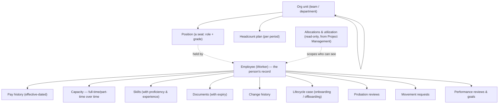
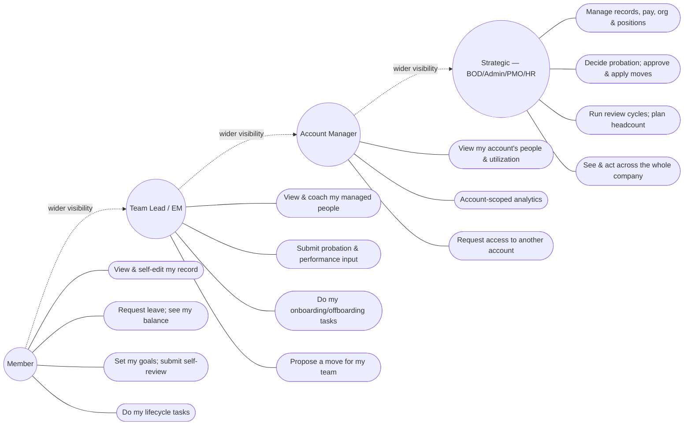
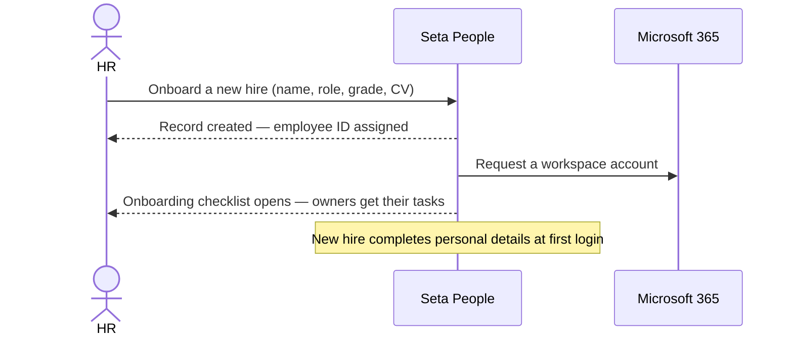
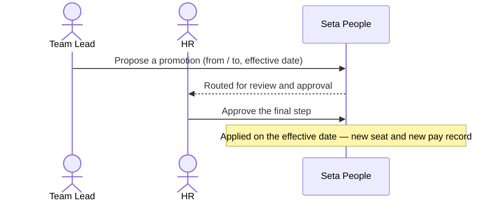
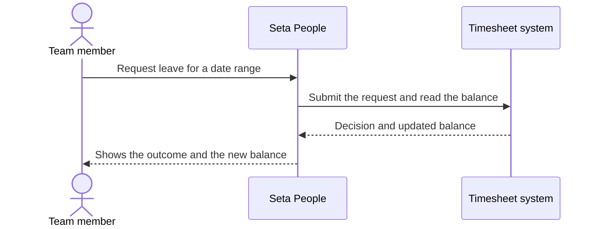
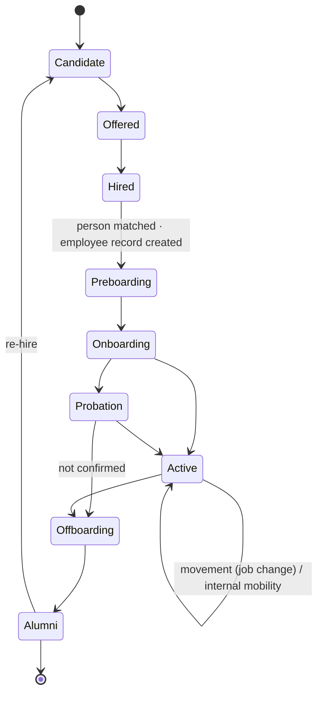
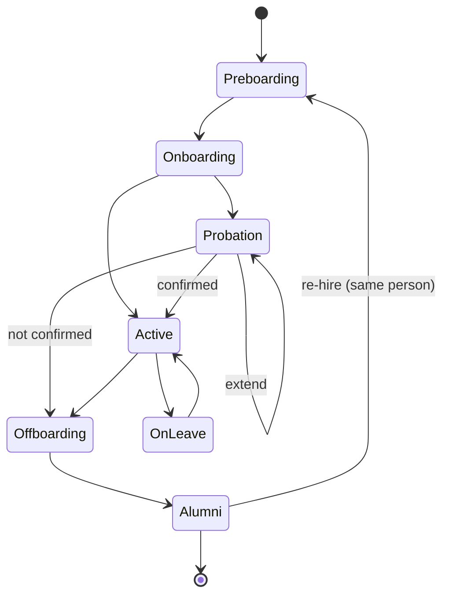
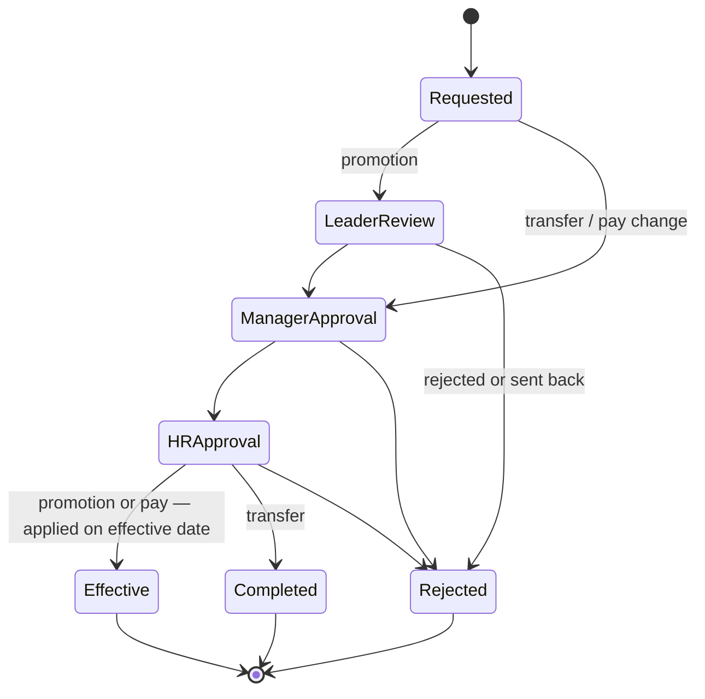

# Product Requirements Document — People

| | |
|---|---|
| **Product area** | Seta — People |
| **Status** | Draft (to-build) · 2026-06-18 |
| **Version** | 0.1 |
| **Audience** | Product · PMO · QA |

---

## 1. Overview

People is Seta's single, trusted record of **who works here and what happens to them across their time at the company** — and the **one place every other part of the platform reads an employee's facts from**. It holds each person's employee record — their role, department, skills, documents, and pay — and the **org chart** of teams and positions they sit in. It runs the **employee journey** end to end: bringing a new hire on board, confirming them through probation, moving them when they're promoted or transferred, and offboarding them when they leave. On top of that it surfaces **time off** (owned by the timesheet system) and manages **performance reviews and goals** and **workforce planning**, and it shows leaders a live picture of headcount, utilization, and skills across the organization. (Where that picture draws on project and time data owned by other modules, People only views and analyzes it — see §4.)

**The problem.** For an outsourcing company, its people *are* the product — yet the facts about them are scattered across spreadsheets, email threads, and one-off HR documents. Who is on probation and due for a confirmation this week? Who is over-allocated across two accounts? Which skills are we short on? Today no one place can answer these, and the AI assistant Seta is built around is only as good as the workforce data it can see. People makes the company's workforce a single, structured, permission-aware source of truth — so HR runs every lifecycle process in one place, leaders get an honest real-time view, and the assistant can reason over real people, positions, and allocations.

**Who benefits**

| Audience | Value |
|---|---|
| Team member | A self-service home for their own record, documents, leave, goals, and lifecycle tasks — and a clear view of where they stand. |
| Team Lead / Engineering Manager | One view of the people they manage: who's onboarding, who's due a probation review, team readiness, and the ability to coach, evaluate, and propose moves. |
| Account Manager | Everyone working on their account(s) in one place — allocation, utilization, and lifecycle status — without seeing the rest of the company. |
| HR | A complete system of record and a single console for onboarding, probation, movement, offboarding, and performance cycles. |
| Board of Directors (BOD) / PMO / leadership | Org-wide headcount, utilization, skills coverage, attrition, and lifecycle health — with sensitive data controlled and every change audited. |

---

## 2. Goals & success metrics

**Goals**

1. Make People the **single source of truth** for the employee record, org structure, and workforce facts the rest of Seta and its assistant rely on.
2. Run the **whole employee lifecycle** — preboarding through alumni — in one place, with clear ownership, SLAs, and no step lost.
3. Give every leader the **right view of the right people** — automatically scoped to what they manage — while keeping pay and personal data protected.
4. Turn workforce data into **decisions**: utilization, skills coverage, headcount gaps, and attrition surfaced in time to act.
5. Make routine HR work **fast and forgiving** — bulk import, self-service, drafts the assistant prepares for a human to approve.

**Success metrics** *(targets are a business decision — to be set at sign-off unless noted)*

| Objective | Metric | Target |
|---|---|---|
| Trusted single record | % of active employees with a complete, current record (no missing required fields/documents) | TBD |
| Lifecycle on time | % of onboarding / offboarding tasks completed within their SLA; overdue tasks open at any time | TBD |
| Probation discipline | % of probation confirmations decided on or before their due date | TBD |
| Healthy utilization | Average utilization across billable staff; over-allocated people surfaced in time to rebalance | ≥ 85% avg; over-allocations surfaced within the month |
| Skills visibility | % of the workforce with skills recorded; coverage against in-demand skills | TBD |
| Self-service adoption | % of new hires who complete their personal details at first login | TBD |
| Data protection | Sensitive-field (pay / bank / tax) views by anyone outside the allowed set | 0 |

---

## 3. Roles & access

Two independent things decide what a person sees and does. Do not conflate them.

**Access tier** — *what a person can do.* Everyone sits in one of four tiers:

- **Strategic** — the Board of Directors (BOD), Admin, the PMO, and HR. Full reach across the whole organization, including pay and personal data, plus the admin-only decisions (confirm probation, approve a move, run a review cycle, manage the org and positions).
- **Account Manager** — sees and acts for the people on the account(s) they own; needs an explicit **grant** to view another account (F-SEC-4).
- **Team Lead / Engineering Manager** — sees and coaches the people on the projects they manage; gives probation and review input and proposes moves.
- **Member** — sees and self-services their own record only.

**Visibility scope** — *which people's records you can see.* This is **not** a field someone sets by hand; it is derived from **who is allocated to which project and account**. A Team Lead sees the people on the projects they manage; an Account Manager sees everyone allocated to their account; a person working on two accounts is visible to **both** account managers. When an allocation ends, that visibility is withdrawn.

On top of both, **field-level rules** always apply, regardless of tier:

- **Pay, bank details, and tax** are shown as **"Restricted"** to anyone who is not the record's owner or a Strategic user, and can only be **edited** by a Strategic user.
- **Position, grade, pay, bank, and tax** are **admin-only to edit** — a manager can never change them, even on someone they manage.
- **Personal details** (contact, date of birth, emergency contact) are editable by the **person themselves** (including a guided self-completion at first login) or by an admin.

No one ever sees another organization's data.

**What each tier can do** *(defaults; an organization may fine-tune)*

| Capability | Member | Team Lead | Account Manager | Strategic (BOD/Admin/PMO/HR) |
|---|---|---|---|---|
| View people directory & profiles | Self | Managed members (pay/personal restricted) | Own account's people (restricted) | All, incl. restricted fields |
| Edit personal details (contact, date of birth, emergency contact) | Own | — | — | Any record |
| Edit position, grade, pay, bank, tax | — | — | — | ✓ |
| Org structure & positions | View own | View own team | View own account | Create / edit / assign |
| Resource allocation & utilization (read-only) | Self | Own team | Own account | All |
| Workforce analytics & dashboard | Self | Team-scoped | Account-scoped | Org-wide |
| Headcount planning | — | — | View | Create / edit |
| Lifecycle directory & stage changes | View self | View managed | View own account | All transitions |
| Onboarding / offboarding tasks | Own tasks | Own-lane tasks | View | Run it; owns HR steps |
| Probation review & decision | See own outcome | Submit review input | View | Decide pass / extend / fail |
| Movement (transfer / promotion / pay) | See own history | Propose (managed) | Propose (own account) | Approve & apply |
| Performance reviews, goals & cycles | Own goals + self-review | Review managed + set goals | Account-scoped view | Open / close cycles; all reviews |
| Time-off / leave *(from the timesheet system)* | See own balance; submit a request | — | — | — |

> Logging-in accounts are provisioned separately by an administrator; signing in with single sign-on authenticates a person who has already been created and never auto-creates one. A person can exist in People before they can log in (a preboarding hire), and the two are linked when they first sign in.

> The assistant ("Ask Seta") acts as a restricted helper, not a person: it can read what the current user is allowed to see and **draft** changes, but every change it proposes is held for a human to approve before it is saved (§7.15).

---

## 4. Scope

**People owns the employee; it only borrows the rest.** People is the **single source of truth for the employee record** for the whole platform — every other module (Project Management, Hiring, the assistant, and the rest) reads a person's identity, role, skills, position, status, and history *from* People rather than keeping its own copy. In the other direction, the project and time data People displays — **who is allocated to which project, utilization, and worked hours** — is **owned elsewhere (Project Management and the timesheet system)** and surfaces here **for viewing and analysis only; People never creates or edits it**.

**In scope:** the employee record (personal, employment, grade, skills, documents, effective-dated pay and capacity); org structure and positions; the resource-allocation and utilization **view** (read-only, fed from project assignments); workforce analytics and the skills/talent picture; headcount planning; the full lifecycle — preboarding, onboarding, probation, movement, offboarding, alumni — with its dashboards and directory; performance reviews, scorecards, goals, and review cycles; the document vault; sensitive-field protection and a full audit trail; and the read/draft tools the "Ask Seta" assistant uses against all of the above.

**Out of scope (now):**

- **The assistant's chat experience** — Seta's "Ask Seta" panel and its specialist agents are owned elsewhere; People only exposes the data and the approve-before-write tools it uses.
- **Authoring project assignments, utilization, and billing rates** — these belong to Project Management; People only **reads** them. Account and project are *not* fields on a person; membership is the set of project allocations.
- **Recruitment** (requisitions, candidates, interviews, offers) — a separate Hiring module; People receives a hired candidate from it and turns them into an employee (F-WORK-9).
- **Time-off / leave, attendance, and timesheets** — owned by the **timesheet system**; People shows a person's leave balance and lets them submit a request through that system's interface, but owns no leave, attendance, or worked-hours data.
- **Payroll, benefits, and deep compensation planning** — People stores pay-relevant attributes and history but does not run payroll.
- **The web shell, navigation chrome, and global search bar** — delivered by the suite-shell effort; People supplies the data behind them.

**Upstream dependencies.** People relies on other systems for some of its data; each has a defined fallback so People stays usable if the upstream is late or down.

| People needs… | From | Fallback if absent |
|---|---|---|
| Project/account allocations & utilization (who's on what, how loaded) | Project Management | Allocation/utilization views show "unavailable" rather than wrong numbers; visibility scoping uses the last known allocations |
| A hired candidate to convert into an employee | Hiring | A Strategic user onboards the person directly (F-WORK-2) |
| "Actual" worked-hours behind utilization | External timesheet system | The "actual" figure is omitted (not guessed); planned utilization still shows |
| Leave balances and leave requests | Timesheet system | Balance shows as unavailable; a request is held until it can be submitted |
| A workspace account on hire (and its removal on exit) | Workspace provisioning (not built yet — OQ-2) | The request is logged as a placeholder and actioned manually |

**Module boundaries & data ownership.** The same person is one identity across several modules, but **each fact has exactly one owner**; the others read it. People never holds a second copy of what it doesn't own, and no module writes into another's data — they stay in step through events and module APIs.

| Concern | Owned by | People's relationship |
|---|---|---|
| Login, single sign-on, roles | Identity | People links a person to their login by id |
| **Employee record, org & positions, skills, documents, lifecycle, performance** | **People** | The source of truth other modules read |
| Recruitment (open roles, candidates, interviews, offers, internal moves) | Hiring | Receives a hired person and creates the employee record (F-WORK-9) |
| Project assignments, allocation, utilization, demand | Project Management | People reads it for views/analysis; never authors it |
| Time-off / leave, attendance, worked hours | Timesheet system | People shows a balance and submits requests through its interface; owns no leave data |
| Payroll & compensation administration | Downstream finance | People stores pay attributes and history; payroll runs elsewhere |

When a candidate is hired, **Hiring hands the person to People**, which creates the employee record (the new source of truth) and starts onboarding; Project Management then commits the allocation the role was opened for. From that point People owns the person; Hiring keeps its candidate record only as recruitment history.

**Priority**

| Priority | What |
|---|---|
| **Must (MVP)** | Employee records + skills + documents; org structure & positions; the people directory with search/filter; sensitive-field protection; audit. |
| **Should** | Lifecycle directory & dashboard; onboarding & offboarding boards; probation; movement approvals; resource-allocation & utilization view; workforce analytics. |
| **Could** | Performance review cycles + goals/OKRs; leave integration (via the timesheet system); headcount planning; bulk actions; the assistant's draft-and-approve tools. |
| **Won't (now)** | Recruitment, timesheets/attendance, payroll/benefits, the assistant chat surface. |

---

## 5. How People is organized

*Structure only — this shows what belongs to what, not any order of events (those live in §8).*

- **Employee (Worker)** — the system-of-record for one person: their employment facts, grade, skills, documents, pay history, and journey. One person has a single identity but can have more than one **period of employment** (a re-hire adds a period; it never duplicates the person).
- **Pay history** — pay is never overwritten; a change adds a new dated record, so past pay is always preserved and a future-dated change can be scheduled.
- **Capacity** — whether someone is full-time or part-time, tracked over time, so past-period workload is measured against the capacity that was actually in effect.
- **Skills** — a predefined skills catalog; a person can hold several skills at once, each with its own proficiency level (0 to 5) and optional years of experience.
- **Org unit** — a team or department; org units nest into the company hierarchy.
- **Position** — an internal seat bound to a role and grade inside an org unit; it can be **open** or **filled**, and is held by at most one person. Reporting lines come from positions, not a hand-typed manager field, so moving a person re-binds a seat rather than rewriting their identity.
- **Headcount plan** — the budgeted positions for an org unit in a period, compared against what's actually filled.
- **Lifecycle case** — a running onboarding or offboarding for one person, with its checklist, owners, progress, and health.
- **Allocations & utilization** — which projects and accounts a person is working on and how loaded they are; **read-only here**, supplied by Project Management, and the basis for who can see whom.

---

## 6. Use cases

Scope widens from Member to Strategic — a Member sees only themselves, a Team Lead their managed people, an Account Manager their account, and Strategic the whole company. But authority over **pay, position, and grade, and the final decisions** (confirm probation, approve a move, run a cycle) sits **only with Strategic**, no matter how wide a manager's view is.

*The dotted arrows show **visibility** widening up the tiers — not inherited abilities. Each tier owns only the use cases wired to it; authority over pay, position, and the final decisions stays with Strategic.*

---

## 7. Features & requirements

*Each requirement is numbered for traceability and has plain acceptance criteria QA can verify.*

### 7.1 People directory & records

**F-WORK-1 — Employee record.** Each employee has one record holding their personal details, employment facts (role, department, employment type, grade), skills, documents, and pay history.
- A new record requires at least a full name; a work email is generated if one isn't supplied and must be unique.
- Pay, bank, and tax are shown as "Restricted" to anyone who isn't the owner or a Strategic user.
- Position, grade, pay, bank, and tax can only be changed by a Strategic user; personal details can be changed by the person or an admin.

**F-WORK-2 — Onboard a person.** A Strategic user can add a new member through a short form (name, role, department, grade, employment type, optional account/project and direct manager, optional CV).
- On save, the person is created at the start of their journey, an employee ID is assigned, and a workspace account (Microsoft 365 / Teams) is requested for them (automatic provisioning is not yet available — see OQ-2; until it lands the request is logged as a placeholder for manual action).
- The "direct manager" entered here seeds the person's position and reporting line; it is not a separate free-standing field (reporting is derived from positions — F-ORG-3).
- HR fills only the essentials; the new member completes their own personal details at first login.

**F-WORK-3 — Bulk import.** A Strategic user can import many people at once from a spreadsheet.
- The file is checked against the expected columns; rows missing a required value are **skipped and reported**, and the valid rows are imported.
- The user sees how many rows were valid and how many were rejected before and after importing.

**F-WORK-4 — Edit a record.** A user edits the fields they're allowed to, with field-level rules enforced.
- Changing pay adds a new dated pay record rather than overwriting the old one; past pay is preserved and a change can be future-dated.
- Every change is written to the person's change history.

**F-WORK-5 — Directory views, search & filter.** The directory can be viewed as a grid of cards or a list, searched, and filtered.
- Search matches by name, role, account, email, or skill, filtering the view as the user types.
- The list can be filtered by lifecycle stage and by account; an empty result shows a clear "no matching people" state.
- Each person's results respect the viewer's visibility scope — a viewer never sees someone outside it.
- People also exposes this search to the suite-wide search bar, returning only people and skills the viewer is allowed to see.

**F-WORK-6 — Skills.** A person can hold many skills at once, each chosen from a **predefined skills catalog** (skills are not free-typed) and rated at a **proficiency level from 0 to 5**, optionally with years of experience.
- The same person carries several skills, each at its own level.
- A skill that isn't in the catalog cannot be added to a person.
- Whether a skill level is self-declared or confirmed by a manager is an open question (OQ-8); it affects how much the skills analytics can be trusted.

**F-WORK-7 — Change stage.** A Strategic user can move a person between lifecycle stages (the journey in §9), and only valid transitions are allowed.

**F-WORK-8 — Capacity over time.** A person's working capacity (full-time or part-time) is tracked as dated history, like pay.
- Changing capacity adds a new dated record rather than overwriting the old one, so a past period is always measured against the capacity that was actually in effect, and a change can be future-dated.

**F-WORK-9 — Create an employee from a hire.** When Hiring marks a candidate as hired, People turns that candidate into an employee record and starts their onboarding — without anyone re-typing what hiring already captured.
- The details collected during hiring (name, contact, role, and so on) carry over into the new record; nothing is lost in the handover.
- The new record links to the open position the hire was made against and begins at the start of the journey (Preboarding / Onboarding).
- HR can review and complete the record before the person starts. A candidate who was not actually hired never becomes an employee.

**F-WORK-10 — Re-hire a former employee.** A person has one identity in People but can have more than one **period of employment**. Re-hiring an alumnus adds a new employment period to the **same person**, keeping their prior history — never a duplicate record.
- A returning person comes through Hiring as a candidate; the match to their existing record is confirmed at hire (by identity, work email, or name + date of birth). A genuine new person gets a new record.
- Their **original hire date is preserved** and a new start date is set. Whether prior service counts toward seniority is a **deliberate policy choice**, not assumed (OQ-12).

### 7.2 Org structure & positions

**F-ORG-1 — Org units & positions.** A Strategic user can build the org as nested units (teams/departments) and define **positions** — seats bound to a role and grade — within them.
- A position is **open** or **filled**, and can be held by at most one person at a time.

**F-ORG-2 — Assign a seat.** A Strategic user can place a person into a position or vacate it (on hire, on a move, or on exit).
- Assigning a holder marks the position filled; vacating it marks it open again.

**F-ORG-3 — Org chart.** Anyone can see an org chart at company, account, or project level, with zoom, pan, and drill-in from an account to its projects.
- The reporting line is derived from positions and their org units, not a hand-typed manager field.
- The chart only shows the parts of the organization the viewer is allowed to see.

### 7.3 Resource allocation & utilization (read-only)

**F-ALLOC-1 — Allocation view.** A user can see who is allocated to which projects and accounts, by month, with a per-person and per-account breakdown.
- Allocations are **read-only** here — they come from project assignments and are never edited in People.
- A person can be allocated to several projects or accounts at once; their total is the sum of those allocations.

**F-ALLOC-2 — Utilization.** A user can see each person's utilization (planned vs actual), with the load split into billable, internal, bench, and leave.
- Anyone loaded over 100% in a month is flagged as **over-allocated**.
- Utilization figures come live from Project Management; if that source is unavailable the view shows them as unavailable or last-known (clearly marked) rather than showing wrong numbers.
- The "actual" portion comes from the external timesheet feed; when that feed is unavailable the actual figure is omitted, not guessed, and the planned figure still shows.

**F-ALLOC-3 — Scope.** The view is scoped to the viewer: Strategic sees everyone, an Account Manager their account, a Team Lead their team, a Member only themselves.

### 7.4 Workforce analytics

**F-ANALYTICS-1 — Workforce dashboard.** A leader sees a dashboard of headcount, utilization, attrition, bench, tenure, seniority, skill coverage and gaps, critical-role coverage, and forward-looking figures (hiring and attrition forecast, turnover, exits), scoped to what they manage (org-wide, account, team, or self).

**F-ANALYTICS-2 — Skills & talent picture.** A user can see the skills the organization has, broken down by seniority band (e.g. Fresher / Junior / Middle / Senior) against where skills are in demand, with search and paging.

### 7.5 Headcount planning

**F-HEAD-1 — Plan headcount.** A Strategic user can set the planned (budgeted) positions for an org unit in a period and compare planned against filled.
- Open positions are the unit of demand a hiring requisition can target; opening or vacating a position raises a demand signal that Hiring can pick up.

### 7.6 Lifecycle directory & dashboard

**F-LIFE-1 — Lifecycle stage.** Every employee carries a lifecycle stage — **Preboarding → Onboarding → Probation → Active → Offboarding → Alumni** (with **On leave** as a temporary state of an active person).

**F-LIFE-2 — Lifecycle directory.** A user can browse everyone by stage, with search and filters by stage and department, each row showing stage, progress, health, manager, and next milestone, and a way to open that person's journey.
- Health reads in plain terms — **On track / At risk / Blocked / Overdue / Complete**.
- The directory is scoped to the viewer's people.

**F-LIFE-3 — Lifecycle dashboard.** Each tier gets a dashboard fit to their role: leadership sees stage funnels, trends, department comparisons, a risk heatmap, and an attention list of overdue/blocked items; a manager sees their team's lifecycle; a member sees their own stage, progress, tasks, and documents.
- Overdue and blocked items surface as an **attention list**, and opening one jumps to the relevant record.

### 7.7 Onboarding

**F-ONB-1 — Onboarding process.** Bringing a new hire on board runs a multi-step checklist across phases (pre-onboarding → onboarding day → post-onboarding), each step owned by a responsible role — **HR, IT, Team Lead, or Compensation & Benefits (C&B)**.
- The process can be viewed as a board (cards moving across phase columns) or as a per-person checklist, with a completion ring and per-phase progress.
- Each step shows its owner and an SLA cue (due soon, overdue, or done).

**F-ONB-2 — IT handoff.** IT-owned steps (provision laptop, create email/Teams, group mail, VPN/SSO, install toolset) can be handed off to the IT service desk from a pre-filled request.

**F-ONB-3 — Advance & complete.** Moving a card or ticking checklist items advances the work; a blocked step must be explicitly resolved before it continues.
- When the checklist completes, the person advances out of onboarding (into probation or active), and HR, their manager, and IT are notified.

### 7.8 Probation

**F-PROB-1 — Probation reviews.** A person in probation has scheduled checkpoints (e.g. 1-month and 2-month, with a confirmation around 90 days), each capturing a score (1–5) and the reviewer's note, against weighted objectives with progress and a risk indicator.
- A Team Lead/EM submits review **input**; the **decision** is a Strategic (HR) call.

**F-PROB-2 — Confirmation decision.** At the end of probation HR records one of three outcomes: **Pass & confirm** (the person becomes Active), **Extend** (a new confirmation date is set), or **Do not confirm** (offboarding begins).
- An extension uses an org-default length (e.g. 30 days) that can be adjusted, and a person can be extended more than once.
- The decision is recorded with who made it and when, and the person's stage moves accordingly.

### 7.9 Movement

**F-MOVE-1 — Request a move.** A Team Lead or Account Manager can propose a **promotion**, **transfer**, or **pay change** for someone they manage, stating the from/to and an effective date.
- A movement is the **single record of a job change**, whether it's started directly by HR/a manager **or triggered by an approved internal-mobility selection in Hiring** — both record the change against the **existing person**, never a new hire. (A move that only changes which project a person works on is a Project-Management re-allocation, not a movement — see F-MOVE-3.)

**F-MOVE-2 — Approval workflow.** A move runs through a fixed sequence of approvals — for a promotion: **Request → Leader review → Manager approval → HR approval → Effective**; a pay change follows the same path without the leader-review step; a transfer ends at **Completed** — and its status is the first step not yet done.
- Each step is an explicit approval; a move only takes effect once fully approved.
- Any approver can **reject** a move or **send it back** for rework; a rejected move does not take effect, and its outcome is recorded.

**F-MOVE-3 — Apply on the effective date.** An approved move is **applied on its effective date**, not at the moment of approval — re-binding the person's position and/or adding a new dated pay record — and is applied once only.
- Account/project changes are handled as project re-allocations, not as a People field edit.

### 7.10 Offboarding

**F-OFF-1 — Offboarding process.** Offboarding runs a clearance workflow across stages — **Receive information → Prepare → Execute → Complete** — with parallel **owner lanes for HR, Team Lead, IT, and Finance**, each with its own tasks.
- A leaver is marked **voluntary** or **involuntary**, and the process shows progress, health, last day, and reason.
- An offboarding can be **put on hold or cancelled** before completion (e.g. a resignation is rescinded or a last day moves); the person returns to their prior stage.

**F-OFF-2 — Deactivation & clearance.** IT and Finance steps cover account/access removal and asset return, handed off to the IT service desk from a pre-filled request.
- For an **involuntary** exit, access is revoked immediately rather than on the last day, and the IT and audit steps are expedited.

**F-OFF-3 — Complete & retain.** When every lane's tasks are done, the person becomes **Alumni**, the record is retained per the data-retention policy, and the relevant parties are notified.
- Completion also marks the person inactive and signals Project Management to end any open allocations they still hold.

### 7.11 Performance

**F-PERF-1 — Review scorecard.** A review uses a weighted scorecard of criteria grouped into pillars, with rules a reviewer must follow:
- Certain **core** criteria are mandatory; an extreme score (a 1 or a 5) requires written **evidence**; any criterion scored below 4 requires a **top action** from the action catalog.
- A guided maturity self-assessment (scored across several fixed dimensions) feeds one of the criteria automatically.
- A person sees **My Scorecard** (their own); a Team Lead sees **Team Evaluation** for the people they manage, with the previous period's result shown for comparison.

**F-PERF-2 — Stable history.** The scorecard is versioned: a completed review keeps the criteria and weights it was scored against, so changing the instrument later never shifts past results.

**F-PERF-3 — Review cycles & goals.** HR can run recurring **review cycles** with **goals/OKRs** (objectives and key results) per person (objective, key results, weight, progress); managers and the people themselves set and update goals, and reviews can draw on delivery and utilization signals.
- Closing a cycle finalizes its reviews; probation reuses the same scorecard as a one-off review.

### 7.12 Time-off / Leave (from the timesheet system)

Leave is **owned by the timesheet system**, not by People — its types, balances, accrual, and approvals all live there. People surfaces it and lets a person act on it through that system.

**F-LEAVE-1 — See balance & request leave.** A person can see their current leave balance and submit a leave request from within People; both are handled by the timesheet system — People stores no leave data and makes no leave decisions.
- The balance People shows matches the timesheet system; a request submitted in People is handed to the timesheet system, where it is approved or rejected.
- Approved leave updates the person's availability, which Project Management reads.
- If the timesheet system is unavailable, the balance shows as unavailable rather than a wrong number, and a new request is held until it can be submitted.

### 7.13 Documents

**F-DOC-1 — Document vault.** A person's record holds their documents (CV, contract, identity documents), each with an optional expiry, replaceable so the latest version is kept with its history.

**F-DOC-2 — Required documents & expiry.** The system knows which document types are required (overall or by employment type) and flags a person who is **missing** a required document; documents nearing expiry raise a reminder to HR and the owner.

### 7.14 Protection & audit (cross-cutting)

**F-SEC-1 — Sensitive-data protection.** Pay, bank, and tax are shown only to the record's owner and to Strategic users; everyone else sees "Restricted."
- A manager's access to a person's sensitive data is re-checked **at the moment it is requested** against a current allocation — not from a cached list — so that when an allocation ends, the very next request is refused. There is no window in which stale visibility exposes pay, bank, or tax.

**F-SEC-2 — Audit trail.** Every change — a record edit, a status change, an approval, a decision — is recorded with who did it and when.

**F-SEC-3 — Organization isolation.** A user only ever sees their own organization's people and data.

**F-SEC-4 — Cross-account access grant.** An Account Manager who needs to see an account they don't own can request access; a Strategic user grants or revokes it.
- A grant widens that Account Manager's visibility to the granted account for as long as it lasts; revoking it removes the visibility immediately.
- Granting and revoking are recorded in the audit trail.

### 7.15 Assistant integration ("Ask Seta")

**F-AI-1 — Read & draft, approve before write.** The assistant can read what the current user is allowed to see and **draft** changes (e.g. onboard someone, update a field, start an offboarding, record an evaluation), but **every drafted change is held for the user to approve before it is saved**.
- The assistant never sees or changes anything the current user couldn't see or change themselves.

---

## 8. Key journeys

---

## 9. States

**The full person lifecycle (across Hiring and People)**

*Candidate and Offered are owned by Hiring; from Preboarding on, People owns the person. An internal move and a re-hire both run back through Hiring's selection but resolve to the **same person** in People — never a second record.*

**An employee's journey**

**A movement request**

---

## 10. Acceptance scenarios (for QA)

Plain, verifiable behaviors. The **Covers** column maps each scenario to the requirement it verifies. Italic = behavior to confirm / test still to be written. (QA IDs are stable identifiers and may be non-contiguous.)

| # | Scenario | Expected | Covers |
|---|---|---|---|
| QA-1 | A non-admin opens someone's record | Pay, bank, and tax show as "Restricted" | F-SEC-1 |
| QA-2 | A manager tries to edit a managed person's grade or pay | Not allowed; only a Strategic user can | F-WORK-1, F-SEC-1 |
| QA-3 | A person edits their own contact details at first login | Allowed and saved | F-WORK-1, F-WORK-2 |
| QA-4 | Change someone's pay, then look at history | A new dated pay record is added; the old pay is still on record | F-WORK-4 |
| QA-5 | Import a spreadsheet with some incomplete rows | Valid rows import; incomplete rows are skipped and reported | F-WORK-3 |
| QA-6 | A Team Lead opens the directory | Only their managed people appear; others are not visible | F-WORK-5 |
| QA-7 | A person is allocated to two accounts | Both account managers can see them | F-SEC-1 |
| QA-8 | An allocation ends, then that manager re-opens the person's pay | The very next request is refused; no stale window exposes sensitive data | F-SEC-1 |
| QA-9 | A position is already filled, assign a second holder | Not allowed — a position holds one person | F-ORG-1 |
| QA-10 | Onboarding checklist reaches completion | The person advances out of onboarding and HR, their manager, and IT are notified | F-ONB-3 |
| QA-11 | Try to continue a blocked onboarding step | Blocked until it is explicitly resolved | F-ONB-3 |
| QA-12 | HR records "Pass & confirm" on probation | The person becomes Active | F-PROB-2 |
| QA-13 | HR records "Do not confirm" on probation | Offboarding begins for that person | F-PROB-2 |
| QA-14 | A promotion is approved on the final step | It applies on its effective date, not at approval — *(test to be written)* | F-MOVE-3 |
| QA-15 | An involuntary exit is started | IT access is revoked immediately, not on the last day | F-OFF-2 |
| QA-16 | Offboarding finishes all lanes' tasks | The person becomes Alumni | F-OFF-3 |
| QA-17 | Score a review criterion a 1 or a 5 | Written evidence is required before it can be saved | F-PERF-1 |
| QA-18 | Score a criterion below 4 | A top action must be chosen | F-PERF-1 |
| QA-19 | Re-weight the scorecard after a review was completed | Past review totals are unchanged | F-PERF-2 |
| QA-20 | View a person's leave balance and submit a request | The balance matches the timesheet system; the request is handed to it for approval; People stores no leave data | F-LEAVE-1 |
| QA-22 | A person is loaded over 100% in a month | Shown as over-allocated | F-ALLOC-2 |
| QA-23 | A required document is missing for a person | Flagged as missing | F-DOC-2 |
| QA-24 | The assistant proposes onboarding someone | The change is held for a human to approve before anything is saved | F-AI-1 |
| QA-25 | A user from one organization tries to see another's people | Never possible | F-SEC-3 |
| QA-26 | Add several skills to a person, each at a different level (0–5), from the predefined catalog | They save with their levels and feed the profile and skills/talent picture; a skill not in the catalog can't be added | F-WORK-6, F-ANALYTICS-2 |
| QA-27 | Change someone's capacity to part-time from a future date | A new dated record is added; a past period still reads at the old capacity | F-WORK-8 |
| QA-28 | An Account Manager opens the org chart | Only their account's part of the chart shows | F-ORG-3 |
| QA-29 | An Account Manager opens the workforce dashboard | Figures are scoped to their account, not the whole company | F-ANALYTICS-1 |
| QA-30 | Set a headcount plan, then fill some positions | Planned-vs-filled shows the gap correctly *(test to be written)* | F-HEAD-1 |
| QA-31 | Open the lifecycle directory as a Team Lead | Only managed people show, each with a plain health label (On track / At risk / Blocked / Overdue / Complete) | F-LIFE-2, F-LIFE-3 |
| QA-34 | Replace a document with a newer version | The latest version shows; the previous one is kept in history | F-DOC-1 |
| QA-35 | Make any change to a record | It appears in the person's change history with who and when | F-SEC-2, F-WORK-4 |
| QA-36 | The effective-date job runs twice for one approved move | The move is applied exactly once *(test to be written)* | F-MOVE-3 |
| QA-37 | An approver rejects or sends back a move | The move does not take effect and the outcome is recorded | F-MOVE-2 |
| QA-38 | Attempt an illegal stage change (e.g. reopen an Alumni as Active) | Rejected | F-WORK-7 |
| QA-39 | A Strategic user grants an Account Manager access to another account, then revokes it | The manager can see it while granted; revoking removes the visibility immediately; both are audited | F-SEC-4 |
| QA-40 | The assistant is asked to read data the current user can't see | It returns nothing that user couldn't see themselves | F-AI-1 |
| QA-41 | Hiring marks a candidate as hired | An employee record is created from the candidate's details and onboarding starts, with no data re-typed | F-WORK-9 |
| QA-42 | Re-hire a former employee | A new employment period is added to the same person; prior history is intact; no duplicate record; original hire date preserved | F-WORK-10 |
| QA-43 | An internal-mobility move that changes a person's role is approved in Hiring | A movement (job change) is recorded against the existing person — not a new hire | F-MOVE-1 |
| QA-44 | Assign a person to a position, then vacate it | The position reads filled, then open again | F-ORG-2 |
| QA-45 | Open the allocation view for a person on two projects | Both allocations show, by month, with the per-person and per-account split | F-ALLOC-1 |
| QA-46 | A Team Lead opens the allocation view | Only their team's allocations show; a Member sees only their own | F-ALLOC-3 |
| QA-47 | A person goes on approved leave | They show as On leave (a temporary state of an active person), then return to Active | F-LIFE-1 |
| QA-48 | Open an onboarding case | The board/checklist shows each step's owner and an SLA cue (due soon / overdue / done); a blocked step is flagged | F-ONB-1 |
| QA-49 | Trigger the IT handoff on an onboarding step | A pre-filled request is raised to the IT service desk | F-ONB-2 |
| QA-50 | A Team Lead submits probation input; HR records the decision | Input and decision are separate — the Lead can't decide pass/fail | F-PROB-1 |
| QA-51 | Put an offboarding on hold before completion | The person returns to their prior stage; clearance can resume later | F-OFF-1 |
| QA-52 | Open then close a review cycle | Goals/OKRs and reviews are captured; closing finalizes the cycle's reviews | F-PERF-3 |

---

## 11. Open questions

| # | Question | Owner |
|---|---|---|
| OQ-1 | **Localization:** which lifecycle/process content (onboarding & offboarding steps, review notes) must be authored in both English and Vietnamese, and where does the language choice live? | Product |
| OQ-2 | **Workspace provisioning:** automatic Microsoft 365 / Teams account creation on hire (and removal on exit) is a **new capability that doesn't exist yet** — until it lands, on-hire provisioning is a placeholder. Confirm the timeline and the interim behavior. | Product + Eng |
| OQ-3 | **Personal profile view:** the full self/profile view exposes sensitive personal data and is currently switched off in the prototype. Decide exactly what a person, a manager, and an admin each see on a profile. | Product |
| OQ-4 | **"Actual" utilization** depends on the external timesheet system feeding worked hours. Confirm that feed is available, and the fallback when it isn't. | Product + Eng |
| OQ-5 | **Release sequencing:** performance review *cycles* and goals/OKRs, and headcount planning are designed but beyond the first prototyped screens. Confirm which land in the first release vs later. | Product |
| OQ-6 | **Retention:** confirm the exact retention period for offboarded (alumni) records and documents before scheduled deletion. | Product |
| OQ-7 | **Success-metric targets** in §2 marked TBD are a business call to set at sign-off; confirm which metrics gate the release and the date targets are fixed. | Product / PMO |
| OQ-8 | **Skill levels:** are proficiency levels self-declared by the person, or confirmed by a manager? This affects how far the skills analytics can be trusted. | Product |
| OQ-9 | **Probation extension length:** confirm the default extension length and that it's configurable (the Pass / Extend / Do-not-confirm outcomes themselves are specified in F-PROB-2). | Product |
| OQ-10 | **Account Manager demand:** an AM who is short of people on an account has no direct action here today (headcount planning is Strategic-only, hiring is separate). Confirm how an AM raises a staffing need. | Product |
| OQ-11 | **Timesheet leave API:** confirm the timesheet system exposes the interface People needs to show balances and submit leave requests, and the behavior when it's unavailable. | Product + Eng |
| OQ-12 | **Continuous service on re-hire:** confirm the policy for whether a re-hired person's prior service bridges toward seniority/tenure (the original hire date is always preserved; the seniority date defaults to the new start unless bridged). | Product / HR |

---

*A companion technical design (data, integrations, permissions, and detailed rules) is maintained separately for the development team.*
