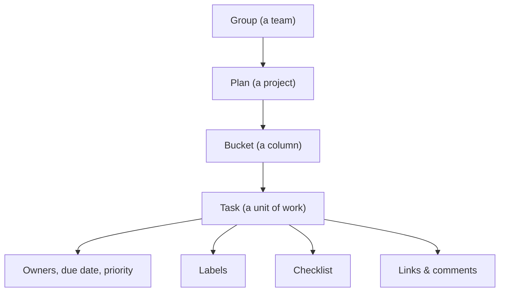
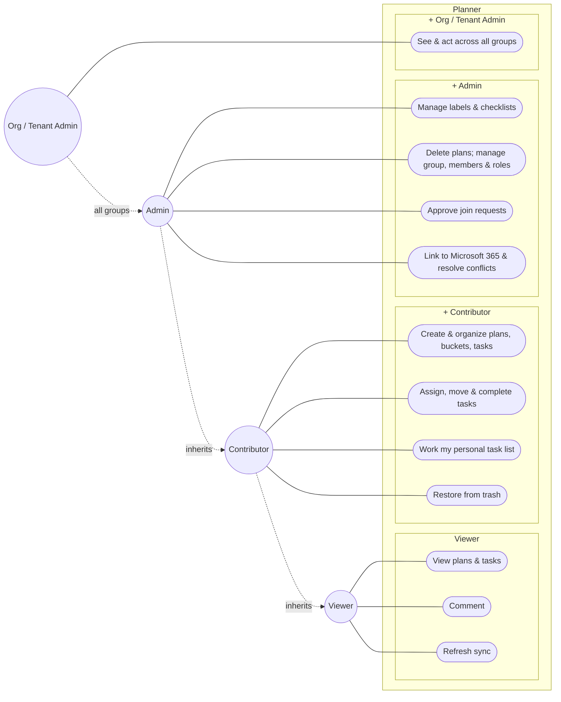
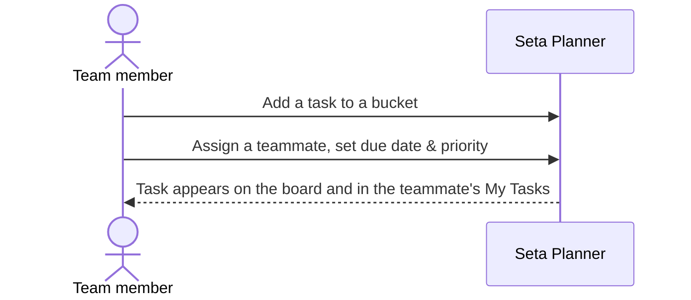
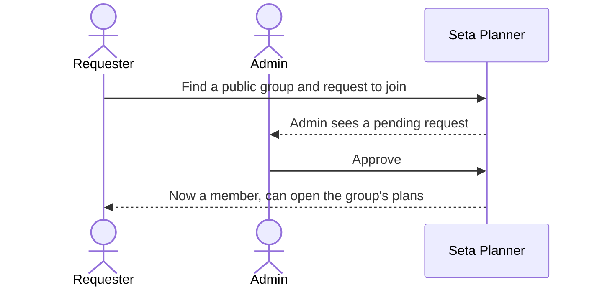
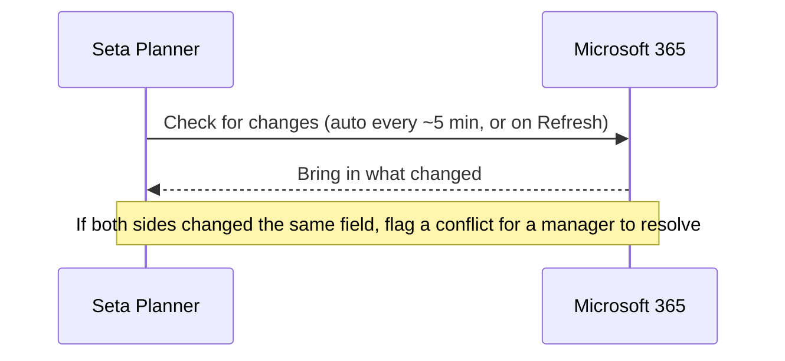
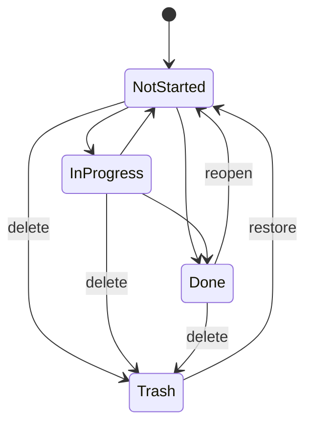
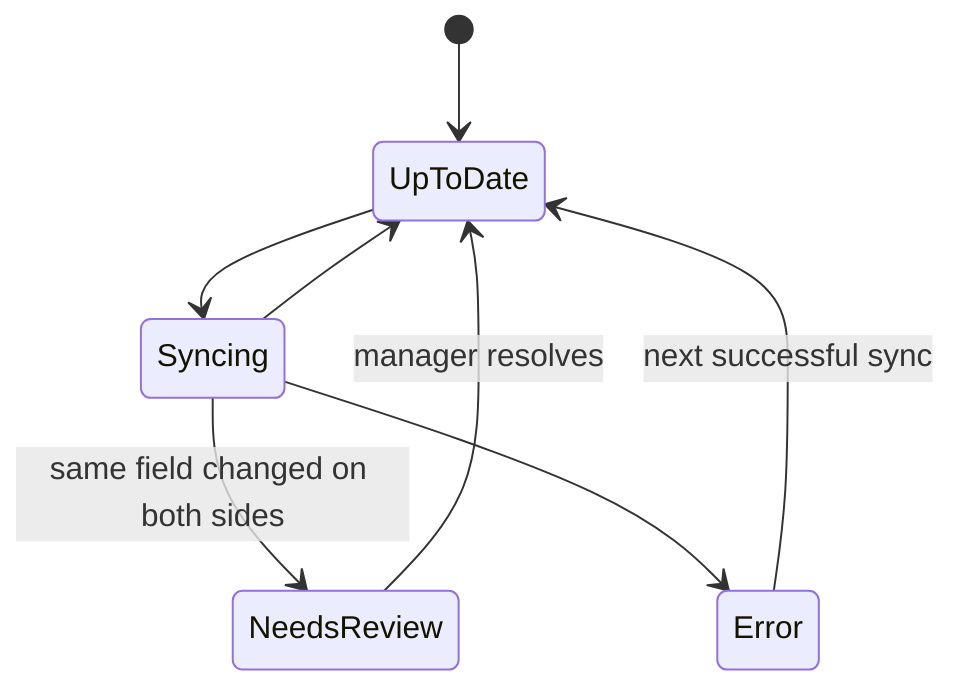

# Product Requirements Document — Planner

| | |
|---|---|
| **Product area** | Seta — Planner |
| **Status** | Baseline · 2026-06-17 |
| **Version** | 1.0 |
| **Audience** | Product · PMO · QA |

---

## 1. Overview

Planner is where a team plans and tracks its work. You create a **plan** (a project), split it into **buckets** (columns like To‑do / Doing / Done), and fill them with **tasks** you assign to people, schedule, prioritize, and check off. Teams are organized into **groups**, and what each person can see or change depends on their role. If a team already uses **Microsoft 365 Planner**, they can link a plan so changes flow both ways — edit in either place and Planner keeps them in step, asking a person to decide only when the same thing was changed on both sides at once.

**The problem.** Teams' work is scattered across spreadsheets, chat, and Microsoft Planner — none of it AI‑aware, all of it drifting out of sync. Seta is an AI‑first work platform, and the assistant is only as useful as the backlog it can see. Many organizations already run Microsoft Planner and won't abandon it. Planner makes Seta adoptable by meeting them there: one trustworthy copy of the work, with a safe two‑way bridge to Microsoft 365 and no lock‑in (unlinking keeps all the data).

**Who benefits**

| Audience | Value |
|---|---|
| Team member | One board for native and Microsoft 365 work; board / grid / calendar views; a personal "My Tasks" inbox across all plans. |
| Group admin | Control over membership and access roles, join‑request approvals, and a status roll‑up across plans. |
| PMO / leadership | Org‑wide visibility, plan status roll‑ups, a full history of changes, and a managed bridge to Microsoft 365. |

---

## 2. Goals & success metrics

**Goals**

1. Let a team run a plan end‑to‑end — plan, assign, track, complete — without leaving Seta.
2. Keep a plan in sync with Microsoft 365 both ways, with no surprise data loss.
3. Give every team controlled, role‑based access with org‑wide oversight for the PMO.
4. Make the experience fast and forgiving — instant edits, drag‑and‑drop, easy recovery from mistakes.

**Success metrics** *(targets are a business decision — to be set at sign‑off)*

| Objective | Metric | Target |
|---|---|---|
| Adopt without migration | % of onboarded teams that link at least one Microsoft 365 plan in 30 days | TBD |
| Trustworthy single source of truth | How often sync conflicts happen, and how long they take to resolve | TBD |
| Active usage | Weekly active members; tasks created and completed per active member | TBD |
| Freshness for the assistant | Time from a change in Microsoft 365 to it showing in Seta | ≤ ~10 min |
| Healthy collaboration | % of tasks that have an owner; how long tasks sit in each status | TBD |
| Stickiness | % of teams still active after 30 days | TBD |

---

## 3. Roles & access

Two separate things decide what a person sees and does.

**Group membership** — everyone in a group is either an **Owner** or a **Member**. This is an ownership label: it records who is responsible for a group, but it does **not** by itself grant any special power.

**Access role** — what a person can actually *do* is set by their **access role** in a group: **Viewer**, **Contributor**, or **Admin**. Everyone added to a group starts as a **Viewer**; an administrator grants Contributor or Admin deliberately. Being a group Owner does **not** automatically make someone an Admin.

Above the group, **Organization / Tenant Admins** can see and act across *every* group in the workspace; an in‑group Admin's power is limited to the groups they're assigned to. Microsoft 365 syncing runs as a restricted **system account** (not a person) that can only read, update, and mark the sync status of linked content.

**What each access role can do** *(defaults — an organization can fine‑tune Contributor/Viewer powers)*

| Capability | Viewer | Contributor | Admin |
|---|---|---|---|
| View plans, tasks, members; comment; refresh sync | ✓ | ✓ | ✓ |
| Create & edit plans, buckets, tasks; assign owners | — | ✓ | ✓ |
| Delete tasks; add / remove buckets | — | ✓ | ✓ |
| Restore a deleted plan or task from trash | — | ✓ | ✓ |
| Manage labels & checklists | — | —¹ | ✓ |
| Delete plans; create / delete / restore groups | — | — | ✓ |
| Manage members & access roles | — | — | ✓ |
| Link / unlink Microsoft 365; resolve conflicts | — | — | ✓ |

¹ By default, adding labels and checklist items is an Admin‑only power — whether Contributors should have it is an open question (§11).

---

## 4. Scope

**In scope:** plans, buckets, tasks (with owners, dates, priority, labels, checklists, links, comments); the personal "My Tasks" view; groups, membership, roles, and join requests; trash and restore; two‑way Microsoft 365 Planner sync.

**Out of scope (now):** the AI assistant's behavior over Planner; charts & analytics dashboards; semantic search. These are separate efforts.

**Priority**

| Priority | What |
|---|---|
| **Must (MVP)** | Plans, buckets, tasks, assignment, roles & access, trash/restore, link a Microsoft 365 plan with visible sync status. |
| **Should** | Conflict resolution, My‑Tasks ordering, labels & categories, checklists, links, comments, duplicate, plan roll‑ups, archive. |
| **Could** | Bulk conflict resolve, conflict notifications, bulk membership changes. |
| **Won't (now)** | Charts, semantic search, a task review workflow. |

---

## 5. How Planner is organized

- **Group** — a team space that holds plans and members; can be private or public, and can be linked to a Microsoft 365 group.
- **Plan** — a project inside a group; the thing that links to a Microsoft 365 Planner plan.
- **Bucket** — an ordered column within a plan (e.g. To‑do / Doing / Done).
- **Task** — a unit of work with owners, dates, priority, progress, labels, a checklist, links, and comments.

---

## 6. Use cases

Access roles build on each other: a **Contributor** can do everything a **Viewer** can, plus create and manage work; an **Admin** everything a Contributor can, plus run the group and the Microsoft 365 link; an **Org / Tenant Admin** the same as an Admin but across *every* group. Each actor is wired only to the use cases its level *adds*. (Group **Owner / Member** is a separate ownership label, not an access role.)

---

## 7. Features & requirements

*Each requirement is numbered for traceability and has plain acceptance criteria QA can verify.*

### 7.1 Plans & boards

**F‑PLAN‑1 — Create & manage plans.** A Contributor or Admin can create a plan in a group, rename it, duplicate it, and archive it; deleting a plan is an Admin action.
- A plan can only be created in a group the user belongs to (or anywhere, for an admin).
- Deleting a plan removes its tasks too, and a deleted plan can be restored from trash.
- Archiving hides a plan from active lists without deleting it.
- Duplicating a plan copies its buckets and tasks into a new, independent plan.

**F‑PLAN‑2 — Views.** A plan can be viewed as a **board**, a **grid/table**, or a **calendar**.
- The board shows buckets as columns and tasks as cards; the calendar places tasks by due date, pages by date range, and lists tasks with no due date separately.
- Switching views keeps the same tasks, search, and filters.

**F‑PLAN‑3 — Buckets.** A user can add, rename, delete, and reorder buckets.
- Deleting a bucket also removes the tasks in it (recoverable from trash).
- Bucket order is preserved after reload.

**F‑PLAN‑4 — Roll‑ups.** Anyone with access to a group can see a per‑plan summary (how many tasks, how many done / in progress / not started, and the nearest due date).
- Summaries count only live (not deleted) tasks.

**F‑PLAN‑5 — Find & organize within a plan.** Any view can be searched, filtered, and grouped.
- **Search** — find tasks in the plan by words in their title; the view filters live as you type.
- **Filter** — narrow the view by assignee and by label, with a Clear control. Search and filters are kept in the page address, so a filtered view is shareable and survives reload.
- **Group** — the grid can be grouped by bucket, assignee, priority, due date, or label (the board groups by bucket).

### 7.2 Tasks

**F‑TASK‑1 — Create & edit a task.** A user can create a task with at least a title, and edit its details (description, owners, dates, priority, labels).
- A new task starts as "not started", medium priority, with no owner.

**F‑TASK‑2 — Progress.** A task is **Not started**, **In progress**, or **Done** (a simple three‑state model that matches Microsoft Planner).
- Marking a task done removes it from active and impending lists.
- Trying to complete an already‑done task, or reopen a task that isn't done, is prevented with a clear message.

**F‑TASK‑3 — Priority & dates.** A task has a priority (Urgent / Important / Medium / Low) and optional start and due dates.
- A task past its due date and not done is shown as **Late**.

**F‑TASK‑4 — Assign.** A task can have one or more owners.
- Assigning the same person twice has no extra effect.
- On a Microsoft 365‑linked plan, only people who exist in Microsoft 365 can be assigned (others are blocked with a clear message).
- Owners can be reordered on a task. On a task with no owner yet, a **Suggest** option can recommend a best‑fit owner by skill match (scope to confirm — see §11, OQ‑5).

**F‑TASK‑5 — Move & reorder.** A user can drag a task within a bucket, across buckets, and across plans.
- New order is preserved after reload.
- Moving a task to another plan keeps its owners, checklist, and links, but drops its labels (labels belong to the original plan); the user is warned before the move.

**F‑TASK‑6 — Duplicate.** A user can duplicate a task; by default the copy keeps the description and checklist but not owners, labels, links, or dates.

**F‑TASK‑7 — Delete & restore.** Deleting a task is reversible from trash within the retention window.

**F‑TASK‑8 — My Tasks.** Each user has a personal list of their tasks across all plans, grouped into **Late**, **Due this week**, **In progress**, **Not started**, and **Recently completed**, with a custom order they control.

**F‑TASK‑9 — Bulk actions.** In the grid, a user can select several tasks and act on them at once — move, assign, set or clear a due date, or delete.
- The result reports per‑task success and failure (including any blocked by permissions), not just an overall pass/fail.

**F‑TASK‑10 — Task history.** Each task shows its own change history — created, status changes, assignments, moves, and so on.

### 7.3 Detail on a task

**F‑DETAIL‑1 — Labels.** A plan can define labels (name + color); a task can carry several. On a Microsoft 365‑linked plan, only labels mapped to a Microsoft category can be applied.

**F‑DETAIL‑2 — Checklist.** A task can have an ordered checklist of sub‑items that can be checked off.

**F‑DETAIL‑3 — Links/references.** A task can hold links to documents or web pages; each link can carry a label and shows a typed, color‑coded badge (Word, Excel, web, and so on). The same link can't be added twice to one task.

**F‑DETAIL‑4 — Comments.** Anyone with access can comment; authors can edit or delete their own comments; admins can delete any. Comments show newest first and can't be empty or excessively long.

### 7.4 Groups, membership & access

**F‑GROUP‑1 — Create & manage groups.** An Admin can create a group with a name, description, color, and visibility (private or public), and can rename, archive, or delete it.
- The creator is automatically the group's owner.

**F‑MEMBER‑1 — Manage members.** An Admin can add and remove members (individually or in bulk) and change a member's membership label (Owner or Member).
- A person's **access role** (Viewer / Contributor / Admin) is assigned separately by an administrator and is not the same as the Owner/Member label (see §3).
- For a group linked to Microsoft 365, membership is managed in Microsoft 365 — people can't add or remove members directly in Seta.

**F‑JOIN‑1 — Join requests.** A user can search **public** groups by name and request to join; an Admin approves or rejects the request.
- You can't request to join a private group, request a group you're already in, or have two open requests for the same group.
- A previously rejected request can be sent again.
- Approving adds the person; rejecting adds no one.

**F‑VIS‑1 — Visibility.** Private groups are visible only to their members (and admins); public groups can be found by anyone in the organization. No one ever sees another organization's data.

### 7.5 Microsoft 365 two‑way sync

**F‑SYNC‑1 — Link a plan.** An Admin can link a plan to a Microsoft 365 Planner plan (the plan's group must already be linked to Microsoft 365).
- A plan can only be linked once; two plans can't point at the same Microsoft 365 plan.

**F‑SYNC‑2 — Unlink — no data loss.** An Admin can unlink a plan; the plan and all its tasks stay in Seta as normal (native) data.

**F‑SYNC‑3 — Two‑way updates.** Changes made in Seta flow to Microsoft 365 and vice‑versa.
- The sync runs automatically (about every 5 minutes) and on demand via a **Refresh** action.

**F‑SYNC‑4 — Sync status.** Every linked plan shows its status — **Up to date**, **Syncing**, **Needs review (conflict)**, or **Error** — with the time of the last sync.

**F‑SYNC‑5 — Conflicts.** If the *same field* is changed in both Seta and Microsoft 365 between syncs, Planner doesn't guess — it flags a conflict for a manager to resolve by choosing which version to keep. (If only one side changed, that change is applied automatically.)

### 7.6 Notifications

**F‑NOTIFY‑1 — In‑app notifications.** Members get in‑app notifications for the things that affect them, each linking straight to the item:
- a task is **assigned** to them or **unassigned**;
- a task they created or own is **completed** or **reopened**;
- they're **added to a group** or their **role changes**;
- a **plan is created or deleted** in their group.

---

## 8. Key journeys

---

## 9. Task & sync states

**A task's life**

**A linked plan's sync status**

---

## 10. Acceptance scenarios (for QA)

Plain, verifiable behaviors. Italic = behavior to confirm / test still to be written.

| # | Scenario | Expected |
|---|---|---|
| QA‑1 | Complete an already‑done task | Prevented with a clear message |
| QA‑2 | Reopen a task that isn't done | Prevented with a clear message |
| QA‑3 | Two people edit the same task at once | One save wins; the other is told to refresh and retry |
| QA‑4 | Drag a task to the bottom of a bucket, reload | It stays where it was dropped |
| QA‑5 | Move a task to another plan | Owners, checklist, links kept; labels dropped; user warned first |
| QA‑6 | Assign the same person twice | No duplicate, no error |
| QA‑7 | Add a member to a Microsoft 365‑linked group in Seta | Blocked, with a note that membership is managed in Microsoft 365 |
| QA‑8 | Request to join a private group | Not allowed |
| QA‑9 | Request a group you're already in / already requested | Not allowed (no duplicate request) |
| QA‑10 | Approve a join request | Person becomes a member; rejecting adds no one |
| QA‑11 | Link a plan whose group isn't linked to Microsoft 365 | Not allowed, with a clear reason |
| QA‑12 | Link two plans to the same Microsoft 365 plan | Second one blocked |
| QA‑13 | Refresh a plan that isn't linked | Not allowed |
| QA‑14 | Unlink a plan | Plan and tasks remain in Seta, intact |
| QA‑15 | Same field changed in Seta and Microsoft 365 | Conflict flagged for a manager to resolve; nothing silently overwritten |
| QA‑16 | Only one side changed a field | That change is applied automatically |
| QA‑17 | Empty or over‑long comment | Rejected |
| QA‑18 | A member of one organization tries to see another's data | Never possible |
| QA‑19 | Delete a bucket / plan, then restore | Tasks come back with it *(test to be written)* |
| QA‑20 | A task past due and not done | Shows as Late; deferred tasks don't show as Late |
| QA‑21 | Search a plan for a word | Only tasks whose title matches show; clearing search restores the view |
| QA‑22 | Filter by assignee and label | View narrows; Clear resets; the filtered URL reopens the same view |
| QA‑23 | Group the grid by priority | Tasks are grouped under each priority |
| QA‑24 | Bulk‑delete several tasks, one without permission | The allowed ones are deleted; the blocked one is reported as failed |
| QA‑25 | Get assigned a task | The new owner receives a notification that links to the task |

---

## 11. Open questions

| # | Question | Owner |
|---|---|---|
| OQ‑1 | Charts/analytics: confirm it stays out of this release. | Product |
| OQ‑2 | Should there be a "needs review" task workflow? (A flag exists but no process around it.) | Product |
| OQ‑3 | Trash: permanent "empty / purge" is shown in the UI but has **no backend yet** — build it or remove the button? Also confirm the retention period. | Product + Eng |
| OQ‑4 | Should **Contributors** be able to add labels & checklist items? Today that is Admin‑only by default. | Product |
| OQ‑5 | Is skill‑based "Suggest assignee" part of Planner, or part of the AI assistant (out of scope)? | Product |

---

*A companion engineering specification (data model, events, permissions, error codes, state details) is maintained separately for the development team.*
