# People — Work Breakdown Structure

The canonical artifact is [`people-wbs.csv`](people-wbs.csv) — the WBS dictionary, sequencing record, and Jira-import file in one. This page is a skim aid only; the CSV wins on any disagreement.

The People module decomposes into **15 capabilities (Epics)** and **46 work packages (vertical slices)**, each = one `slice → spec → plan → PR`, totalling ~232 story points. It is **greenfield** — `P-E1 Foundation` is a deliverable, not a dependency. The **MVP** set (`MVP=Y`) is the PRD §4 *Must* tier and is dependency-closed: the trusted employee record (record, pay/capacity, skills, documents), org units & positions, the lifecycle stage machine, the directory with search/filter (and its read-model), sensitive-field masking, and the audit/isolation baked into Foundation. *Should* and *Could* tiers (allocation/utilization views, analytics, lifecycle directory/dashboard, onboarding, probation, movement, offboarding, performance, leave, headcount, assistant tools) are sequenced behind it. The **critical path** is `PPL-1 → PPL-3 → PPL-21 → PPL-28 → PPL-29` (Foundation → employee record → lifecycle stage machine → probation reviews → confirmation decision) — note probation depends on the stage machine and scorecard, not on the onboarding board.

Grounded in [`people-prd.md`](people-prd.md) §7 (all 48 `F-*` codes covered), the `people` schema in [`../reference/db-design.md`](../reference/db-design.md), and the `people.*` event catalog in [`../reference/ddd-design.md`](../reference/ddd-design.md).

```mermaid
graph TD
  P[People module]
  P --> E1[P-E1 Foundation]
  P --> E2[P-E2 Directory & records]
  P --> E3[P-E3 Org structure & positions]
  P --> E4[P-E4 Allocation & utilization]
  P --> E5[P-E5 Workforce analytics]
  P --> E6[P-E6 Headcount planning]
  P --> E7[P-E7 Lifecycle directory & dashboard]
  P --> E8[P-E8 Onboarding]
  P --> E9[P-E9 Probation]
  P --> E10[P-E10 Movement]
  P --> E11[P-E11 Offboarding]
  P --> E12[P-E12 Performance]
  P --> E13[P-E13 Time-off / Leave]
  P --> E14[P-E14 Access control & data protection]
  P --> E15[P-E15 Assistant tools]

  E1 --> PPL1[PPL-1 Module foundation]
  E1 --> PPL2[PPL-2 Identity link]
  E2 --> PPL3[PPL-3 Employee record]
  E2 --> PPL4[PPL-4 Pay & capacity]
  E2 --> PPL5[PPL-5 Skills]
  E2 --> PPL6[PPL-6 Document vault]
  E2 --> PPL7[PPL-7 Directory & search]
  E2 --> PPL8[PPL-8 Onboard a person]
  E2 --> PPL9[PPL-9 Bulk import]
  E2 --> PPL10[PPL-10 Job history]
  E2 --> PPL11[PPL-11 Create from hire]
  E2 --> PPL12[PPL-12 Re-hire]
  E2 --> PPL43[PPL-43 Worker directory read-model]
  E3 --> PPL13[PPL-13 Org units & positions]
  E3 --> PPL14[PPL-14 Org chart]
  E4 --> PPL15[PPL-15 Allocation read-model]
  E4 --> PPL16[PPL-16 Allocation view]
  E4 --> PPL17[PPL-17 Utilization]
  E4 --> PPL44[PPL-44 Account/project read-model]
  E5 --> PPL18[PPL-18 Workforce dashboard - current state]
  E5 --> PPL19[PPL-19 Skills & talent picture]
  E5 --> PPL45[PPL-45 Workforce metrics read-model]
  E5 --> PPL46[PPL-46 Headcount & attrition forecast]
  E6 --> PPL20[PPL-20 Headcount plan]
  E7 --> PPL21[PPL-21 Lifecycle stage machine]
  E7 --> PPL22[PPL-22 Lifecycle directory]
  E7 --> PPL23[PPL-23 Lifecycle dashboard]
  E8 --> PPL24[PPL-24 Onboarding process]
  E8 --> PPL25[PPL-25 IT handoff]
  E8 --> PPL26[PPL-26 Preboarding lane]
  E8 --> PPL27[PPL-27 Rescind / no-show]
  E9 --> PPL28[PPL-28 Probation reviews]
  E9 --> PPL29[PPL-29 Confirmation decision]
  E10 --> PPL30[PPL-30 Movement request & approval]
  E10 --> PPL31[PPL-31 Apply on effective date]
  E10 --> PPL32[PPL-32 Mobility inbound move]
  E11 --> PPL33[PPL-33 Offboarding process]
  E11 --> PPL34[PPL-34 Deactivation & completion]
  E12 --> PPL35[PPL-35 Scorecard instrument]
  E12 --> PPL36[PPL-36 Review cycles & goals]
  E12 --> PPL37[PPL-37 Calibration]
  E13 --> PPL38[PPL-38 Leave balance & request]
  E14 --> PPL39[PPL-39 Sensitive-field masking]
  E14 --> PPL40[PPL-40 Scope & at-request re-check]
  E14 --> PPL41[PPL-41 Cross-account grant]
  E15 --> PPL42[PPL-42 Assistant tools]
```

