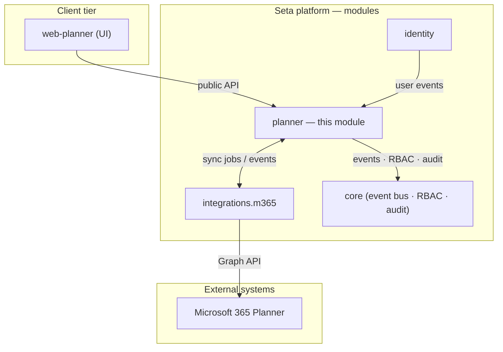
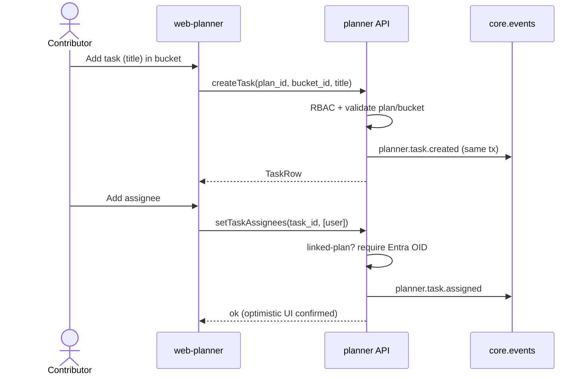
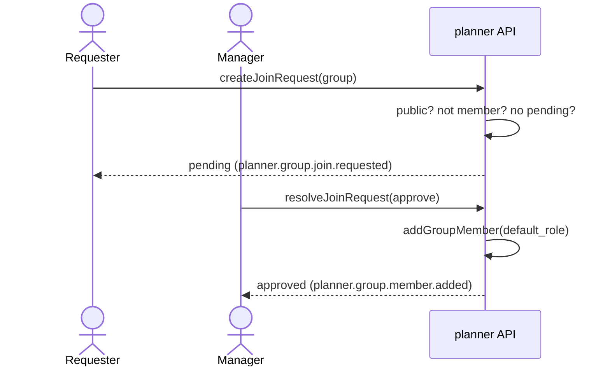
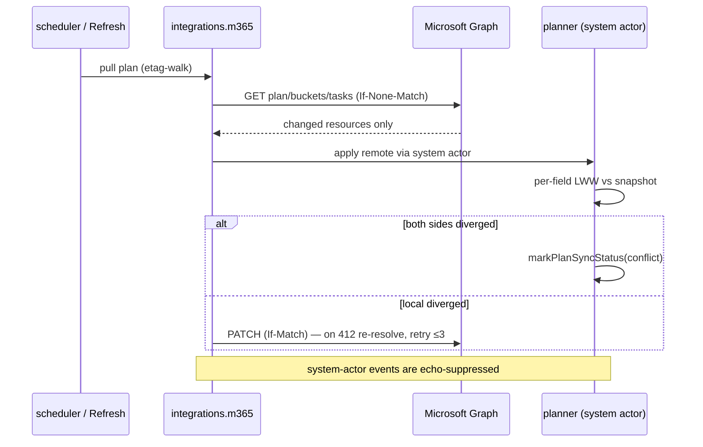
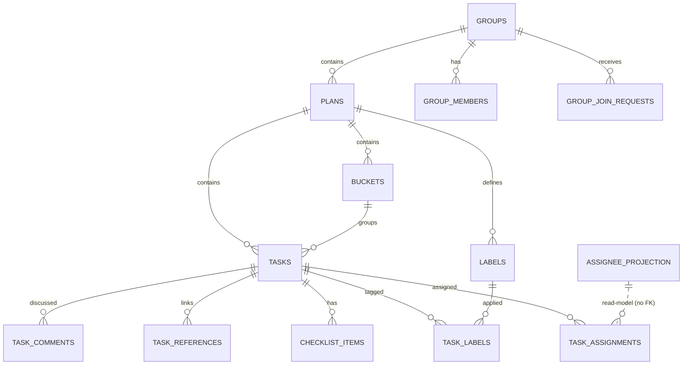
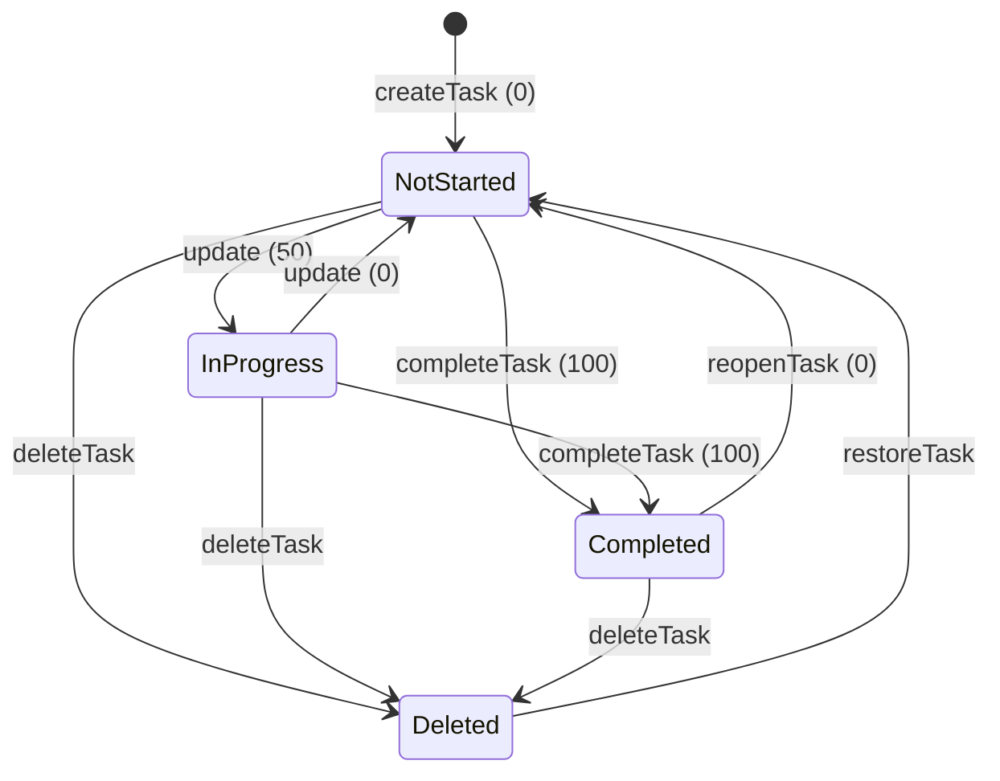
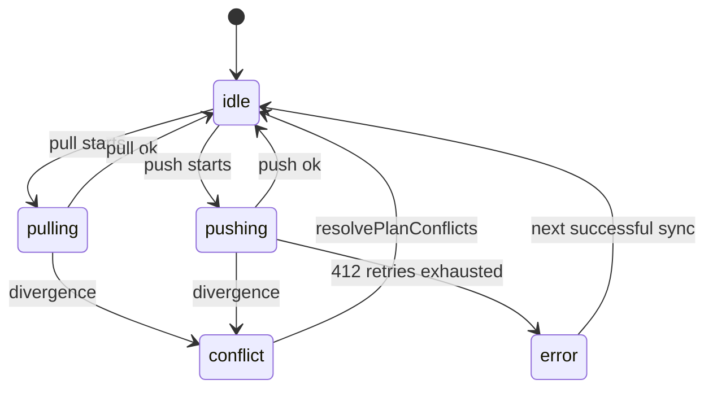

# Software Requirements Specification — Planner Module

| | |
|---|---|
| **Product** | Seta Agent Platform — Planner module |
| **Status** | Baseline · 2026-06-17 |
| **Version** | 1.0 |
| **Author / Owner** | Product |
| **Audience** | PMO · Product · QA · Engineering |

---

## 1. Introduction

### 1.1 Purpose

This document specifies the requirements for the **Planner** module of the Seta Agent Platform — what it does, the rules it enforces, and how it is verified. It is the shared reference for product, QA, and engineering. Scope is defined in §1.2.

### 1.2 Scope

Planner is Seta's work-management module. Teams organize into **groups**, plan work in **plans**, structure it into **buckets**, and track it as **tasks** (with assignees, dates, priority, labels, checklists, references, and comments). Any plan may run natively or be linked to a Microsoft 365 Planner plan with two-way sync. It is multi-tenant, group-scoped, access-controlled, and fully auditable through the platform event bus.

**In scope:**

| Area | Capabilities |
|---|---|
| Core work management | Plans, buckets, tasks, assignment, labels/categories, checklist, references, comments, ordering, My-Tasks, trash |
| Groups & access | Groups, membership, roles, join requests, visibility, RBAC |
| M365 two-way sync | Link/unlink, pull/push, per-field conflict resolution, sync status |

**Out of scope:** agent-tools / copilot behavior; charts & analytics dashboard; activity-feed internals; embeddings / semantic search (deferred to M3).

**Priority (MoSCoW).** *Must (MVP):* core CRUD, assignment, RBAC + tenant isolation, soft-delete/restore, M365 link/unlink + sync status + pull. *Should:* conflict resolution, My-Tasks ordering, labels/categories, checklist, references, comments, duplicate, rollups, archive. *Could:* bulk conflict resolve, conflict notifications, bulk membership. *Won't (this baseline):* charts, embeddings, review workflow, `guest` role *(not in the permission matrix; see OQ-2)*.

### 1.3 Definitions & Acronyms

| Term | Meaning |
|---|---|
| **Group** | A team workspace owning plans and members; private or public; native or M365-linked. |
| **Plan** | A project inside a group; the unit that links to M365 Planner. |
| **Bucket** | An ordered column within a plan (e.g. To-do / Doing / Done). |
| **Task** | A unit of work in a plan/bucket; carries owner(s), dates, priority, progress, labels, checklist, references, comments. |
| **Label / Category slot** | A plan-scoped tag; may map to a Microsoft Planner category slot (1–25). |
| **Assignee** | A user assigned to a task; multiple per task. |
| **Order hint** | A lexicographic key giving drag-drop ordering (fractional index on native plans; Planner directive form on linked plans). |
| **Native vs Linked** | A native plan lives only in Seta; a linked plan is two-way synced with an M365 Planner plan. |
| **LWW** | Last-writer-wins, applied per field against the last-synced snapshot. |
| **System actor** | The non-human integration identity `integrations.m365` that applies pulled changes. |
| **Soft-delete** | Marking a row deleted (`deleted_at`) without removing it; restorable within retention. |
| **Tenant** | The top-level isolation boundary; all data is tenant-scoped. |
| **RBAC** | Role-based access control; the platform authorization engine. |

### 1.4 Overview (plain words)

> **Planner is where your team plans and tracks work.** You make a **plan** (a project), split it into **buckets** (columns like To-do / Doing / Done), and fill them with **tasks** you assign to people, schedule, prioritize, and check off. Teams are organized into **groups**, and what you can see or change depends on your role in the group. If your team already uses **Microsoft Planner**, you can link a plan so edits flow both ways — change something in either place and Planner keeps them in step, asking a person to decide only when the *same field* was changed on both sides at once.

**§2** describes the product and its users; **§3** specifies the requirements (functional and non-functional); **§4** defines their verification; the **appendices** hold the data model, events, state machines, permission matrix, and traceability.

---

## 2. Overall Description

### 2.1 Product perspective

Planner is a feature module of the Seta platform. It owns the `planner` Postgres schema, exposes a public function surface to other modules, emits domain events on the shared transactional outbox (`core.events`), and consumes events from the **identity** module to keep a local read-model of users for assignment. Microsoft 365 sync is mediated by a separate **integrations.m365** module that owns the Graph API client; Planner never calls Graph directly.

*Static component view — modules and their integration points (one abstraction level: modules). Runtime behavior is specified by the sequence diagrams in §3.2; this diagram intentionally shows no call ordering.*

**The problem it solves.** Teams' work is scattered across spreadsheets, chat, and Microsoft Planner — none AI-aware, all drifting out of sync. Seta is an AI-first work-management platform, and the AI is only as good as the backlog it reasons over. Many organizations already run M365 Planner and cannot abandon it. Planner makes Seta adoptable by meeting them there: a safe two-way bridge that keeps one trustworthy copy of the truth, with no lock-in (unlinking preserves all data as native).

### 2.2 Product functions

At a glance, Planner lets users:

- **Plan work** — create plans, organize them into buckets, and create/duplicate/archive/delete plans (soft, restorable).
- **Manage tasks** — create, edit, move (within and across plans), reorder by drag-drop, complete/reopen, assign to multiple owners, set priority and start/due dates.
- **Add context** — labels (and M365 category slots), checklists, URL references, and threaded comments.
- **Work personally** — a cross-plan "My Tasks" view bucketed by urgency with a custom personal order.
- **Organize teams** — create groups, manage members and roles, run join requests for public groups.
- **Bridge to M365** — link a plan to Microsoft Planner, sync both ways, see sync status, and resolve conflicts.
- **Recover** — restore soft-deleted items from trash within a retention window.

### 2.3 User characteristics

| Persona | Description | Primary jobs |
|---|---|---|
| **Contributor** | Day-to-day group member. | Create/edit/move/complete tasks; comment; manage own My-Tasks. |
| **Group Owner / Manager** | Owns a group. | Manage members & roles, approve join requests, create/delete plans, link to M365. |
| **PMO / Org Admin** | Tenant-wide oversight. | View across all groups, plan rollups, restore/purge trash, audit. |
| **M365 System Actor** | Non-human integration identity. | Apply pulled M365 changes; mark sync status; manage linked-group membership. |

Access is governed by four planner roles — `planner.admin`, `planner.contributor`, `planner.viewer`, and `system.integrations.m365` — plus the org-wide `org.admin` / `tenant.admin` roles that grant tenant-wide visibility. Personas map to roles as: **Contributor** → `planner.contributor`; **Group Owner/Manager** → `planner.admin` *and* the group-membership role `owner`; **PMO/Org Admin** → `org.admin` / `tenant.admin`; **M365 System Actor** → `system.integrations.m365`. Note the two access axes that combine per Appendix D's two-layer model: a *flat permission role* and a *group-membership role* (`owner` / `member`). The exact capability-per-role grid is **Appendix D**.

### 2.4 Constraints

These platform rules constrain the design and are assumed throughout:

- **Multi-tenant isolation.** Every row is tenant-scoped; cross-tenant access is rejected.
- **No cross-schema foreign keys.** User references are bare UUIDs; cross-module consistency is event-driven, not FK-enforced.
- **The bus is the outbox.** Each state change commits its event in the same transaction (`core.events`); there is no separate publish path.
- **Soft-delete by default.** No hard delete except admin-gated trash purge.
- **Microsoft progress triplet.** Task progress is `{0, 50, 100}`, not a 0–100 range, for M365 parity.
- **Module boundaries.** Cross-module access only via the public surface; no raw cross-schema SQL; Planner never shares its DB handle.

### 2.5 Assumptions & dependencies

| Dependency | Type | Owner | Criticality | Impact if unavailable |
|---|---|---|---|---|
| `integrations.m365` module | Internal | Eng-Integrations | Critical (sync) | All sync requirements fail; plans run native-only. |
| Microsoft Graph API | External | Microsoft | Critical (sync) | Pull/push blocked; throttling degrades freshness. |
| Entra ID / OID provisioning | External / identity | IT + Identity | High | Linked-plan assignees unresolvable → skipped. |
| `identity` module (user events) | Internal | Eng-Identity | High | Stale assignee names/skills in the read-model. |
| `core` (events / RBAC / audit) | Internal foundation | Eng-Core | Critical | No event bus, authorization, or audit. |

**Assumptions:** tenants linking M365 hold valid Graph credentials/consent; users intended as linked-plan assignees are pre-provisioned with an Entra OID (SSO, no JIT); a ~5-minute pull cadence is acceptable freshness for AI/reporting.

---

## 3. Specific Requirements

> Convention: each functional requirement has a stable ID (`FR-<area>-<n>`) and **acceptance criteria (AC)**. "System actor" = `integrations.m365`. All writes are RBAC-checked and emit events transactionally unless noted. Use-case-to-requirement traceability is in **Appendix G**; the event names appear in **Appendix B**.

### 3.1 Functional requirements

#### 3.1.1 Plans

**FR-PLAN-1 — Create plan.** A user with `planner.plan.create` on a group can create a plan (`name`, optional starter bucket).
- AC1: Group must exist, not be deleted, and be in the caller's tenant, else error.
- AC2: New plan defaults `external_source='native'`, `sync_status='idle'`, `version=1`.
- AC3: Emits `planner.plan.created`.

**FR-PLAN-2 — Update plan.** A user with `planner.plan.update` can rename a plan.
- AC1: No-op patches do not bump version or emit an event.
- AC2: A successful change bumps `version` and emits `planner.plan.updated` with `changed_fields`.

**FR-PLAN-3 — Delete / restore plan (soft).** `planner.plan.delete` soft-deletes; restore returns it to live.
- AC1: Delete requires matching `expected_version`, else `CONFLICT`.
- AC2: Delete cascades to the plan's tasks (soft).
- AC3: Emits `planner.plan.deleted` / `planner.plan.restored`.

**FR-PLAN-4 — Archive / unarchive plan.** A plan may be archived (`archived_at`) independently of deletion.
- AC1: Emits `planner.plan.archived` / `planner.plan.unarchived`.

**FR-PLAN-5 — Duplicate plan.** Deep-copies a plan, its live buckets, and live tasks (honoring duplication options).
- AC1: The copy is independent; emits create events for plan, buckets, and tasks.

**FR-PLAN-6 — Plan rollups.** `listGroupPlansWithRollups` returns per-plan aggregates (counts by status, average percent-complete, latest due).
- AC1: Aggregates reflect only live (non-deleted) tasks.

#### 3.1.2 Buckets

**FR-BUCKET-1 — Create / rename / delete bucket.** Buckets are ordered columns within a plan.
- AC1: A new bucket is appended (order hint after the last bucket).
- AC2: Delete is soft and **cascade-deletes the bucket's tasks**; `planner.bucket.deleted` carries `deleted_task_ids[]`.

**FR-BUCKET-2 — Reorder buckets.** `moveBucket` repositions a bucket via its order hint.
- AC1: Order persists; lists are returned `ORDER BY order_hint NULLS LAST`.

#### 3.1.3 Tasks

**FR-TASK-1 — Create task.** Requires `plan_id` + `title`; all else optional with defaults.
- AC1: Defaults `priority_number=5`, `percent_complete=0`, `is_deferred=false`, `preview_type='automatic'`, `external_source='native'`.
- AC2: If `bucket_id` is given, the bucket must exist in the plan and be live, else error.
- AC3: The task is appended to the tail of its bucket/root scope.
- AC4: Emits `planner.task.created`.

**FR-TASK-2 — Update task.** Strict patch surface; unknown/legacy keys rejected.
- AC1: `description` is sanitized and a plain-text `description_text` derivative is stored for search.
- AC2: `expected_version` mismatch → `CONFLICT`; success increments version.
- AC3: A no-op patch returns the row without emitting an event.
- AC4: `external_*` fields are writable **only** by the system actor, else `RESERVED_FOR_SYSTEM_ACTOR`.
- AC5: Emits `planner.task.updated` with `changed_fields`.

**FR-TASK-3 — Progress (three-state).** `percent_complete ∈ {0, 50, 100}` only.
- AC1: Any other value is rejected.

**FR-TASK-4 — Complete / reopen.**
- AC1: `completeTask` sets `100`, clears `is_deferred`; rejects if already 100 (`VALIDATION`).
- AC2: `reopenTask` requires current 100, sets `0`, clears `is_deferred`; rejects otherwise (`VALIDATION`).
- AC3: Emits `planner.task.completed` / `planner.task.reopened` (+ notifications).

**FR-TASK-5 — Priority.** `priority_number ∈ {1,3,5,9}` (Urgent, Important, Medium, Low).
- AC1: Values outside the set are rejected.

**FR-TASK-6 — Scheduling.** `start_at` / `due_at` are optional instants powering the calendar and the "due soon" view.
- AC1: A task with `due_at` in the past, `percent_complete<100`, `is_deferred=false` qualifies as Late.

**FR-TASK-7 — Ordering & in-plan move.** Tasks order lexicographically within a bucket via order hint.
- AC1: Native plans use fractional indexing; linked plans use Planner directive form.
- AC2: On collision (no key space), the bucket is rebalanced; each repositioned task emits `planner.task.moved`.
- AC3: Order persists across reload.

**FR-TASK-8 — Cross-plan move.** Moving a task to another plan re-homes it.
- AC1: **Labels are dropped** (labels are plan-scoped); **assignees, checklist, and references are preserved**.
- AC2: Order hint is recomputed in the target plan; `bucket_id` re-validated.
- AC3: Emits `planner.task.moved` (+ `planner.task.updated` for the new `plan_id`).

**FR-TASK-9 — Duplicate task.** Copies within the same bucket with options.
- AC1: Defaults copy description + checklist **on**; assignees/labels/references/dates **off**.

**FR-TASK-10 — Delete / restore task (soft).**
- AC1: Soft-delete sets `deleted_at`; restore clears it; emits corresponding events.

**FR-TASK-11 — Assignment.** Multiple users per task; idempotent.
- AC1: `assignTask` is insert-on-conflict-do-nothing; re-assigning is a no-op with no event.
- AC2: `setTaskAssignees` batch-replaces; on linked plans, any assignee without an Entra OID is rejected with `ASSIGNEE_NOT_M365_SYNCABLE` (system actor bypasses).
- AC3: Emits `planner.task.assigned` / `planner.task.unassigned`.

**FR-TASK-12 — Personal ordering (My Tasks).** `setAssigneePriority` sets a per-user order for the task in the user's list.
- AC1: My Tasks groups into Late / Due this week / In progress / Not started / Recently completed; deferred tasks are excluded from impending sections.

#### 3.1.4 Labels & categories

**FR-LABEL-1 — Label CRUD (per plan).** Labels (`name`, `color`) are plan-scoped; soft-deleted.
- AC1: Create/update/delete require `planner.label.write`; read requires `planner.label.read`.
- AC2: Delete is soft; deleted labels disappear from listings.
- AC3: Emits `planner.label.created` / `.updated` / `.deleted`.

**FR-LABEL-2 — Apply / unapply label.**
- AC1: On linked plans, applying a label with no `category_slot` is rejected with `LABEL_NOT_SYNCABLE`.
- AC2: Emits `planner.label.applied` / `.unapplied`.

**FR-LABEL-3 — Category slots (M365 parity).** Labels may map to plan category slots `1..25`; unique per `(plan_id, category_slot)`.
- AC1: Out-of-range slot → `CATEGORY_SLOT_OUT_OF_RANGE`.
- AC2: `category_descriptions` JSON is validated (keys `category1..category25`, value length ≤ 100).
- AC3: Mapping a label to a slot emits `planner.label.category-slot-changed`; editing a slot description emits `planner.plan.category-description-changed`.

#### 3.1.5 Checklist, references, comments

**FR-CHECK-1 — Checklist items.** Add/update/remove ordered sub-items per task.
- AC1: Requires `planner.checklist.write`; items order within a task via order hint.
- AC2: Remove is soft-delete; items survive a cross-plan move (FR-TASK-8/AC1).
- AC3: Emits `planner.checklist_item.added` / `.updated` / `.removed`.

**FR-REF-1 — Task references.** Add/remove URL references (with alias and detected type).
- AC1: URL is unique per task; duplicates rejected (`DUPLICATE_REFERENCE`).
- AC2: References are preserved on cross-plan move.

**FR-COMMENT-1 — Comments.** Create/edit/delete/list comments on a task.
- AC1: Body must be non-empty after trim and ≤ 4000 chars.
- AC2: Edit sets `edited_at`; delete is soft; list is newest-first, live only, paginated.
- AC3: Delete-any requires `planner.task.comment.delete.any`; authors may delete their own.

#### 3.1.6 Groups, membership & access

**FR-GROUP-1 — Create group.** `planner.group.create`; fields `name` (unique per tenant, live), `description`, `theme`, `visibility` (private/public), `default_role`.
- AC1: The creator is always added as `owner`, regardless of `initial_members`.
- AC2: Emits `planner.group.created` + `planner.group.member.added` per member.

**FR-GROUP-2 — Update / delete / restore group.**
- AC1: Update is optimistic-locked on `expected_version`; no-op patches skip emit.
- AC2: Only `name`, `description`, `theme`, `visibility`, `default_role` are mutable; `external_*` are system-actor only.
- AC3: Delete is soft and version-checked; emits `planner.group.deleted` / `.restored`.

**FR-MEMBER-1 — Add / remove members.** `planner.group.member.write`.
- AC1: Add is idempotent; only a real insert emits `planner.group.member.added`.
- AC2: Remove emits `planner.group.member.removed` only when a row was actually deleted.
- AC3: On M365-linked groups, human actors are rejected with `LINKED_GROUP_IMMUTABLE_MEMBERS`; only the system actor may mutate membership.

**FR-MEMBER-2 — Set member role.** `planner.group.member.role.set`. Roles are `owner` | `member`.
- AC1: Same-role set is a no-op (no event).
- AC2: Linked-group immutability applies (system actor only).
- AC3: Emits `planner.group.member.role-changed`.

**FR-JOIN-1 — Request to join.** Any read-capable user may request.
- AC1: Only **public** groups allow requests, else `JOIN_REQUEST_PRIVATE_GROUP`.
- AC2: Existing member → `ALREADY_MEMBER`; existing pending request → `JOIN_REQUEST_DUPLICATE`.
- AC3: A previously rejected request is reopened to `pending` on re-request.
- AC4: Emits `planner.group.join.requested`.

**FR-JOIN-2 — Resolve join request.** `planner.group.member.write` to approve/reject.
- AC1: Approve adds the user as a member (default role); reject sets `rejected` and adds nothing.
- AC2: Resolution records `resolved_at` / `resolved_by`.
- AC3: Resolving a missing / non-pending request → `JOIN_REQUEST_NOT_FOUND`.

**FR-VIS-1 — Visibility & scope.**
- AC1: Private groups are visible only to members and tenant/org admins; listings are filtered by the caller's accessible group set.
- AC2: Public groups are discoverable via `discoverGroups` without membership.
- AC3: All group reads/writes enforce tenant match; cross-tenant access → `CROSS_TENANT`.

**FR-RBAC-1 — Two-layer enforcement.** Every operation checks (a) flat permission membership and (b) group scope (see Appendix D).
- AC1: Org/tenant admins and the system actor bypass the group-scope check.
- AC2: `planner.viewer` cannot create/delete; `planner.contributor` cannot delete groups or manage members/roles.

#### 3.1.7 Microsoft 365 two-way sync

**FR-SYNC-1 — Link plan to M365.** `planner.plan.link.m365` (admin/owner).
- AC1: The plan's group must be M365-linked, else `GROUP_NOT_LINKED`.
- AC2: The plan must currently be native, else `CONFLICT`.
- AC3: Linking two plans in a tenant to the same external id → `LINKED_DUPLICATE_PLAN`.
- AC4: Sets `external_source='m365'`, `external_id`, bumps version, emits `planner.plan.updated` with `external_*` in `changed_fields`.

**FR-SYNC-2 — Unlink plan.** `planner.plan.unlink` (admin only).
- AC1: Rejects native plans with `PLAN_NOT_LINKED`.
- AC2: Sets `external_source='native'`, clears `external_id/etag/synced_at`.
- AC3: **No tasks/buckets/checklist are deleted** — data is retained as native; the integrations link row is tombstoned.

**FR-SYNC-3 — Sync status.** Plans and tasks carry `sync_status ∈ {idle, pulling, pushing, error, conflict}` + `last_error`.
- AC1: `markPlanSyncStatus` / `markTaskSyncStatus` are system-actor only (else `RESERVED_FOR_SYSTEM_ACTOR`); idempotent on unchanged status.
- AC2: Emits `planner.plan.sync-status-changed` / `planner.task.sync-status-changed`.

**FR-SYNC-4 — Refresh (pull).** `planner.plan.refresh` (any plan member) triggers an on-demand incremental pull.
- AC1: Rejects native plans with `PLAN_NOT_LINKED`.

**FR-SYNC-5 — Conflict resolution (per-field LWW).** The resolver compares local vs remote vs last-synced snapshot: equal → no-op; only local diverged → push local; only remote diverged → apply remote; **both diverged → conflict**.
- AC1: `resolvePlanConflicts` (admin/owner) accepts per-field `{kind, field, choice: local|remote}`; `local` enqueues a push, `remote` overwrites locally and updates the snapshot.
- AC2: Emits `planner.plan.conflict-resolved`.

**FR-SYNC-6 — Echo suppression & idempotency.** System-actor changes must not re-trigger a push.
- AC1: Subscribers no-op when the event actor is the system actor.
- AC2: Push uses `If-Match`; on `412`, re-fetch + re-resolve, retry up to 3×, then mark `conflict`.

**FR-SYNC-7 — Linked-plan field constraints.**
- AC1: Linked-plan assignees must have an Entra OID (FR-TASK-11/AC2).
- AC2: Linked-plan labels must be slot-mapped (FR-LABEL-2/AC1).
- AC3: Linked-group membership is immutable to humans (FR-MEMBER-1/AC3).

### 3.2 External interface requirements

#### 3.2.1 User interfaces (web-planner)

The UI presents these screens: **Groups Hub**, **Group Discovery**, **Group Detail** (Plans / Members / Activity / Integrations / Settings), **Plan Board** with Board / Grid / Calendar / Charts *(route only — OQ-1)* views, **Task Detail** (modal and full page), **Plan Categories Settings**, **My Tasks**, and **Trash**. Edits are optimistic with rollback on error; drag-drop is keyboard-accessible; linked plans show a sync-status indicator with last-synced time and a refresh action.

Representative flows:

#### 3.2.2 Software interfaces

- **Microsoft 365 (via integrations.m365).** Pull is an etag-walk (`If-None-Match`) that fetches only changed resources; push is `If-Match` PATCH with 412 retry. Planner exposes system-actor operations (`mark*SyncStatus`, conflict resolution) and never calls Graph directly.

- **Identity module.** Planner subscribes to `identity.user.*` events to maintain its `assignee_projection` read-model.
- **Core events.** All state changes are emitted to `core.events` (Appendix B).

### 3.3 Performance requirements

**FR-PERF-1 — Sync performance.**
- Plan pull *duration*: p50/p95 ≤ 2 s / 10 s for ≤ 200 tasks.
- Single-resource push: p50/p95 ≤ 0.5 s / 2 s.
- User-triggered refresh: p50/p95 ≤ 1 s / 3 s.
- End-to-end sync lag (remote change → reflected in Seta): p50/p95 ≤ 5 min / 10 min (steady-state 5-minute pull cadence).
- The etag-walk short-circuits unchanged resources.

Verification fixture and method are in **§4.3**.

### 3.4 Software system attributes

- **Security & access control.** RBAC is enforced on every operation in two layers — flat permission membership and group scope (Appendix D). Every row is tenant-scoped; cross-tenant access returns `CROSS_TENANT`. `last_error` and sync logs carry no PII.
- **Reliability & idempotency.** State change and event commit in one transaction. Delivery is at-least-once; subscribers are idempotent on `event_id`. Structural writes use optimistic concurrency (`expected_version` → `CONFLICT` on mismatch). Sync operations are idempotent on unchanged status.
- **Auditability.** Every domain event in `core.events` is the audit trail; actors are typed (`user | cli | system | agent | sync`) and attributable.
- **Maintainability.** Cross-module access only through the public surface (`/`, `/events`, `/rbac`, `/agent-tools`); no raw cross-schema SQL; Planner never shares its DB handle.

### 3.5 Other requirements

**FR-RETAIN-1 — Soft-delete & retention.** Groups, plans, tasks, labels, checklist items, and comments soft-delete; deleted items are restorable and permanent purge is admin-gated.
- AC1: Soft-deleted items remain restorable until purged.
- AC2: Permanent purge requires `planner.trash.empty` (admin).
- AC3: The 30-day trash window is presented in the UI; **server-side enforcement is unverified (Appendix F, OQ-4)** and is not a guaranteed requirement until confirmed.

---

## 4. Verification

### 4.1 Functional acceptance scenarios

> *Source* column: a plain test name = an existing test; *italic* = test not yet written (tracked in Appendix H, Phasing). Rows split shipped vs to-build where a behavior is only partially covered.

| ID | Scenario | Expected | Source |
|---|---|---|---|
| QA-1 | Complete an already-completed task | `VALIDATION` | task-lifecycle |
| QA-2 | Reopen a non-100% task | `VALIDATION` | task-lifecycle |
| QA-3 | Update with stale `expected_version` | `CONFLICT`, no write | update-task |
| QA-4 | No-op patch | Returns row, no event | update-task |
| QA-5 | Cross-plan move with labels | Labels dropped; assignees/checklist/refs kept; order recomputed | move-task |
| QA-6 | Drag task to bucket bottom, reload | Position persists | e2e drag-task-reorder |
| QA-7 | Re-assign same user | No-op, no duplicate event | assign-task |
| QA-8 | Add member to linked group as human | `LINKED_GROUP_IMMUTABLE_MEMBERS` | linked-group-immutability |
| QA-9 | Same operation as system actor | Succeeds | linked-group-immutability |
| QA-10 | Join-request to private group | `JOIN_REQUEST_PRIVATE_GROUP` | create-join-request |
| QA-11 | Duplicate pending join-request | `JOIN_REQUEST_DUPLICATE` | create-join-request |
| QA-12 | Re-request after rejection | Reopens to `pending` | create-join-request |
| QA-13 | Approve / reject request | Approve adds member; reject adds nothing | resolve-join-request |
| QA-14 | Link plan whose group is native | `GROUP_NOT_LINKED` | link-plan-to-m365 |
| QA-15 | Link two plans to same external id | `LINKED_DUPLICATE_PLAN` | link-plan-to-m365 |
| QA-16 | Link an already-linked plan | `CONFLICT` | link-plan-to-m365 |
| QA-17 | Refresh a native plan | `PLAN_NOT_LINKED` | refresh-plan-sync |
| QA-18 | Mark sync status as a human | `RESERVED_FOR_SYSTEM_ACTOR` | mark-*-sync-status |
| QA-19 | Apply slot-less label on linked plan | `LABEL_NOT_SYNCABLE` | apply-label |
| QA-20 | Assign non-Entra user on linked plan | `ASSIGNEE_NOT_M365_SYNCABLE` | set-task-assignees |
| QA-21 | Comment empty / >4000 chars | Rejected | task_comments |
| QA-22 | Private group to non-member | Hidden; discoverable only if public | list-groups-visibility |
| QA-23 | Push 412 conflict | Re-fetch, re-resolve, retry ≤3, then `conflict` | *spec only — test pending* |
| QA-24 | Echo from system-actor change | No re-push (suppressed) | sync subscriber |
| QA-25 | Comment/move event in live feed | Appears <10 s without reload | e2e group-activity-feed |
| QA-26 | Cross-tenant read / write / list | `CROSS_TENANT`; no row leakage | create paths covered (create-* tests); *add list/read-leakage isolation test* |
| QA-27 | Two concurrent `expected_version` writes | One succeeds, one `CONFLICT` | *add interleaving test* |
| QA-28 | Order-hint collision on move | Bucket rebalanced; each task emits `moved` | rebalance covered (order-hint); *add per-task `moved` event assertion* |
| QA-29 | Bucket delete cascade | `deleted_task_ids[]` correct; restore symmetric | *add test* |
| QA-30 | Plan delete cascade | Plan tasks soft-deleted; restore returns them | *add test* |
| QA-31 | API-level boundary rejection | priority {2,4,7}, percent {25,75,99}, slot {0,26} rejected | DB-CHECK covered (native-parity-migrations); *add API-surface test* |
| QA-32 | My-Tasks bucketing edges | Deferred excluded; week-edge Late/Due; completed window | bucketing covered (list-my-tasks); *add week-edge / deferred / completed-window assertions* |
| QA-33 | Rollups with mixed live/deleted | Counts reflect only live tasks | *add test* |
| QA-34 | Trash retention / purge | >30d purgeable; purge admin-gated; non-admin denied | *blocked on OQ-4* |
| QA-35 | Category description length | value >100 chars rejected | native-parity-migrations |

### 4.2 Access-control verification

Each denied cell of the permission matrix (Appendix D) must return `FORBIDDEN` (or `RESERVED_FOR_SYSTEM_ACTOR` for sync). Trace to `tests/unit/rbac.test.ts` and `rbac-parity.test.ts`.

| ID | Actor → action | Expected |
|---|---|---|
| QA-RBAC-1 | viewer → task/plan/group.create | `FORBIDDEN` |
| QA-RBAC-2 | contributor → group.delete | `FORBIDDEN` |
| QA-RBAC-3 | contributor → group.member.write / role.set | `FORBIDDEN` |
| QA-RBAC-4 | contributor → plan.unlink / plan.delete | `FORBIDDEN` |
| QA-RBAC-5 | contributor → task.comment.delete.any | `FORBIDDEN` |
| QA-RBAC-6 | non-member → action on group ∉ accessible set | `FORBIDDEN` (scope) |
| QA-RBAC-7 | org/tenant admin → action on any group | allowed (scope bypass) |
| QA-RBAC-8 | human → plan/task sync.mark-status | `RESERVED_FOR_SYSTEM_ACTOR` |

### 4.3 Performance verification fixture

> Test-to-build — the §3.3 SLOs are currently unverified.

- **Fixture:** one M365-linked plan with 200 tasks (mixed buckets, assignees, labels, checklist).
- **Environment:** dedicated perf lane (staging-equivalent Postgres + a Graph sandbox/stub), single tenant, no competing load; record warm vs cold.
- **Method:** N ≥ 20 runs per scenario (full pull; incremental pull with 0 / K changed; single-resource push; user refresh); report p50/p95.
- **Gate:** meet §3.3 targets; fail the lane on regression. Sync lag = `m365.plan.pull.lag` (remote-change → reflected-in-Seta).

---

## Appendix A — Data model

> All `user_id` references are bare UUIDs (no cross-schema FK). `assignee_projection` is a local read-model maintained from identity events.

**Tasks (selected fields)**

| Field | Type | Null | Default | Note |
|---|---|---|---|---|
| `id` | uuid | no | gen_random_uuid | PK |
| `tenant_id`, `plan_id` | uuid | no | — | scope |
| `bucket_id` | uuid | yes | — | optional column |
| `title` | text | no | — | — |
| `description` / `description_text` | text | yes | — | sanitized HTML / plain-text for FTS |
| `priority_number` | int | no | 5 | CHECK (1,3,5,9) |
| `percent_complete` | int | no | 0 | CHECK (0,50,100) |
| `is_deferred` | bool | no | false | excludes from "due soon" |
| `preview_type` | text | no | automatic | CHECK enum |
| `review_state` | text | yes | — | 'needs_review' / null |
| `start_at`, `due_at` | timestamptz | yes | — | scheduling |
| `order_hint`, `assignee_priority` | text | yes | — | ordering / personal order |
| `external_source` | text | no | native | CHECK (native,m365) |
| `external_id`, `external_etag`, `external_synced_at` | — | yes | — | M365 linkage |
| `sync_status` | text | no | idle | CHECK 5-state |
| `last_error` | text | yes | — | truncated, no PII |
| `created_by` | uuid | no | — | — |
| `created_at`, `updated_at` | timestamptz | no | now() | — |
| `deleted_at` | timestamptz | yes | — | soft-delete |
| `version` | int | no | 1 | optimistic lock |

**Plans** — `id, tenant_id, group_id, name, category_descriptions (jsonb ≤25 keys), external_source/id/etag/synced_at, sync_status, last_error, archived_at, deleted_at, version`.

**Groups** — `name (unique per tenant, live), theme (CHECK 7 colors), visibility (private/public), default_role (owner/member), external_source/id/synced_at, account_id, version`.

**Supporting tables** — `group_members (group_id,user_id; role)`, `group_join_requests (group_id,user_id; status)`, `buckets (order_hint, external_*)`, `task_assignments (task_id,user_id; order_hint, external_assigned_at)`, `labels (color, category_slot 1–25)`, `task_labels (task_id,label_id)`, `checklist_items (checked, order_hint, external_*, soft-delete)`, `task_references (unique task_id+url, type, preview_priority)`, `task_comments (body 1–4000, edited_at, soft-delete)`, `assignee_projection (read-model: display_name, email, skills[], availability, tz, ooo, deactivated)`.

**Notable indexes/constraints** — soft-delete-aware partial indexes; `tasks_by_due_soon (tenant_id,due_at) WHERE not deleted, not deferred, percent<100`; FTS `tasks.search_tsv` (GIN); partial-unique external keys for plans/buckets/tasks/checklist; unique `(plan_id, category_slot)`.

## Appendix B — Domain event catalog

| Domain | Events |
|---|---|
| Group | created, updated, deleted, restored, member.added, member.removed, member.role-changed, join.requested |
| Plan | created, updated, deleted, restored, archived, unarchived, category-description-changed, sync-status-changed, conflict-resolved |
| Bucket | created, updated, deleted (`deleted_task_ids[]`) |
| Task | created, updated, deleted, restored, moved, assigned, unassigned, completed, reopened, sync-status-changed, reference-added, reference-removed |
| Checklist | added, updated, removed |
| Label | created, updated, deleted, applied, unapplied, category-slot-changed |
| Comment | created, updated, deleted |

Events commit in the same transaction as the mutation; delivery is at-least-once with idempotent subscribers. Planner **consumes** `identity.user.created/profile.updated/deactivated/email.changed` to maintain `assignee_projection`.

## Appendix C — State machines

**Task progress / lifecycle**

**Sync status (plan & task)**

## Appendix D — Permission matrix

Legend: ✓ allowed · — denied · (sys) system actor only. Scope layer: non-admin users act only within groups in their accessible set; `org.admin`/`tenant.admin` and the system actor bypass scope.

| Action / Role | admin | contributor | viewer | m365 (sys) |
|---|---|---|---|---|
| group.read | ✓ | ✓ | ✓ | ✓ |
| group.create | ✓ | — | — | — |
| group.update | ✓ | — | — | ✓ |
| group.delete | ✓ | — | — | — |
| group.member.read | ✓ | ✓ | ✓ | ✓ |
| group.member.write | ✓ | — | — | ✓ |
| group.member.role.set | ✓ | — | — | ✓ |
| plan.read | ✓ | ✓ | ✓ | ✓ |
| plan.create / update | ✓ | ✓ | — | ✓ (update) |
| plan.delete | ✓ | — | — | — |
| plan.link.m365 | ✓ | — | — | — |
| plan.unlink | ✓ | — | — | — |
| plan.refresh | ✓ | ✓ | ✓ | — |
| plan.resolve-conflict | ✓ | — | — | — |
| plan / task sync.mark-status | — | — | — | ✓ |
| bucket.create/update/delete | ✓ | ✓ | — | — |
| task.read / read.tenant | ✓ | ✓ | ✓ | ✓ |
| task.create / update / assign | ✓ | ✓ | — | ✓ (update) |
| task.delete | ✓ | ✓ | — | — |
| task.comment.read / create | ✓ | ✓ | ✓ | — |
| task.comment.delete.any | ✓ | — | — | — |
| label.read | ✓ | ✓ | ✓ | ✓ |
| label.write | ✓ | ✓ | — | — |
| checklist.write | ✓ | ✓ | — | — |
| trash.read / restore / empty | ✓ | — | — | — |

## Appendix E — Error codes

`NOT_FOUND` · `FORBIDDEN` · `CONFLICT` · `VALIDATION` · `CROSS_TENANT` · `LINKED_GROUP_IMMUTABLE_MEMBERS` · `LINKED_DUPLICATE` · `LINKED_DUPLICATE_PLAN` · `DUPLICATE_REFERENCE` · `RESERVED_FOR_SYSTEM_ACTOR` · `CATEGORY_SLOT_OUT_OF_RANGE` · `GROUP_NOT_LINKED` · `PLAN_NOT_LINKED` · `LABEL_NOT_SYNCABLE` · `ASSIGNEE_NOT_M365_SYNCABLE` · `JOIN_REQUEST_PRIVATE_GROUP` · `ALREADY_MEMBER` · `JOIN_REQUEST_DUPLICATE` · `JOIN_REQUEST_NOT_FOUND`

> `LINKED_DUPLICATE` is raised when a group is linked to an M365 group that is already linked.

## Appendix F — Open questions / decision log

| # | Item | Current finding | Decision needed | Owner |
|---|---|---|---|---|
| OQ-1 | Charts view | Route exists; full visualizations pending | Confirm out of scope → separate spec | Product |
| OQ-2 | `guest` role | DB allows only owner/member; UI shows a `guest` option → vestigial | Remove from UI or formally introduce | Product + Eng-Planner |
| OQ-3 | `review_state` | Single value `needs_review`; no workflow | Define review pipeline or drop field | Product |
| OQ-4 | Trash retention | 30-day window is a UI constant; server-side purge unconfirmed | Confirm/implement purge job | Eng-Planner |
| OQ-5 | Integrations link tables | Live in `integrations` schema (separate module) | Confirm interface contract | Eng-Integrations |
| OQ-6 | Embeddings | Code paths exist but table dropped | Confirm deferred to M3; remove references | Product |

## Appendix G — Use-case → requirement traceability

| Use case | FR refs |
|---|---|
| Create / edit plan | FR-PLAN-1, FR-PLAN-2 |
| Manage buckets | FR-BUCKET-1, FR-BUCKET-2 |
| Create / edit task | FR-TASK-1..3, FR-TASK-5, FR-TASK-6 |
| Assign task | FR-TASK-11 |
| Move / reorder task | FR-TASK-7, FR-TASK-8 |
| Complete / reopen | FR-TASK-4 |
| Label / checklist / reference | FR-LABEL-1..3, FR-CHECK-1, FR-REF-1 |
| Comment | FR-COMMENT-1 |
| My Tasks | FR-TASK-12 |
| Duplicate plan / task | FR-PLAN-5, FR-TASK-9 |
| Plan rollups | FR-PLAN-6 |
| Trash soft-delete / restore | FR-PLAN-3, FR-TASK-10 |
| Create / update / delete group | FR-GROUP-1, FR-GROUP-2 |
| Add/remove members; set role | FR-MEMBER-1, FR-MEMBER-2 |
| Discover / request / approve join | FR-VIS-1, FR-JOIN-1, FR-JOIN-2 |
| Link / unlink / refresh / resolve M365 | FR-SYNC-1..7 |
| Sync performance / SLOs | FR-PERF-1 |
| Soft-delete & retention | FR-RETAIN-1 *(AC3 blocked on OQ-4)* |

## Appendix H — Supplementary planning material (non-normative)

*Not part of the requirements specification; retained for product/PMO planning.*

**Success metrics & instrumentation** — targets are business decisions (TBD at sign-off):

| Objective | Metric | Source event / counter |
|---|---|---|
| Adopt without migration | Tenants linking ≥1 M365 plan (30d) | `planner.plan.updated` (external_* changed) |
| Trustworthy single truth | Conflict rate; time-to-resolution | `planner.plan.sync-status-changed(conflict)` → `…conflict-resolved` |
| Active work management | WAU; tasks created/completed per user | `planner.task.created` / `.completed` |
| Data freshness | Sync lag p95 | `m365.plan.pull.lag` |
| Low-friction collaboration | % tasks with an owner; status dwell | `planner.task.assigned`; `planner.task.updated` |
| Retention | % returning weekly | any `planner.*` user-actor event |

**Ownership (RACI).** R Responsible · A Accountable · C Consulted · I Informed.

| Workstream | Product | Eng-Planner | Eng-Integrations | QA | PMO |
|---|---|---|---|---|---|
| Core work management | A | R | I | C | I |
| Groups / RBAC | A | R | I | C | I |
| M365 sync | A | C | R | C | I |
| Retention / governance | C | R | C | C | A |
| This SRS (ownership) | A/R | C | C | C | I |

**Phasing.** Baseline (shipped): this document's scope. Next (planned): conflict notifications + bulk resolve; resolve OQ-2/3/4; build the §4.3 perf fixture and §4.2 denial suite. Future (M3+): embeddings / semantic search; task review workflow. *(Not a committed schedule; PMO assigns dates.)*
