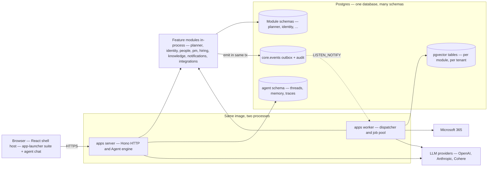
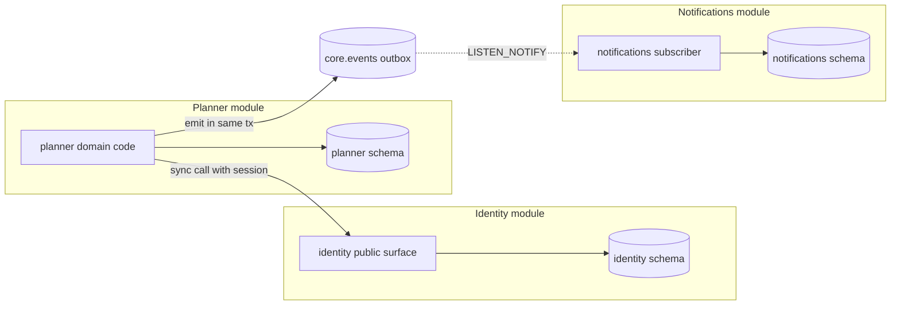
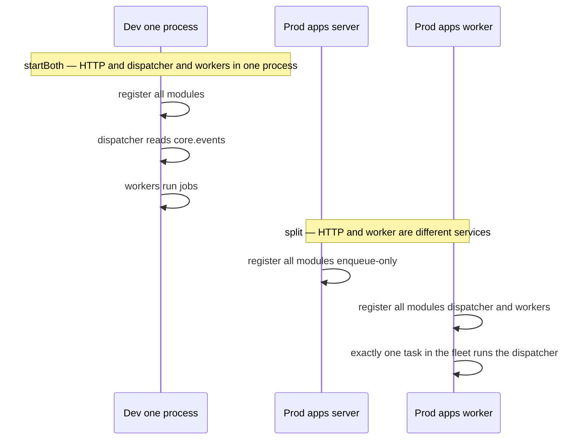
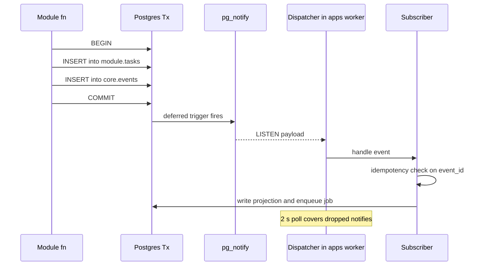
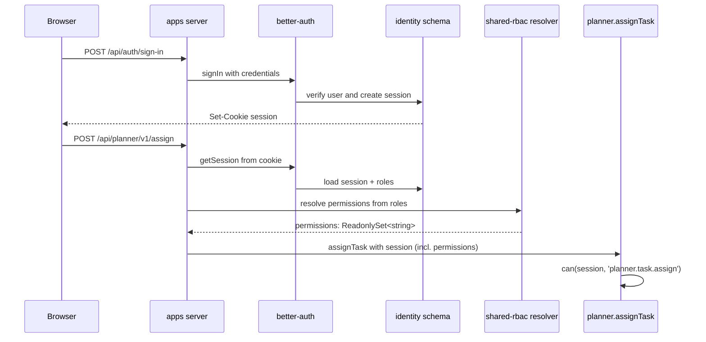
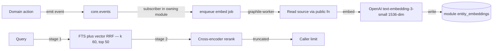
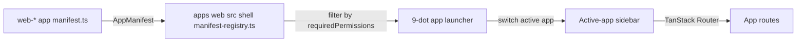
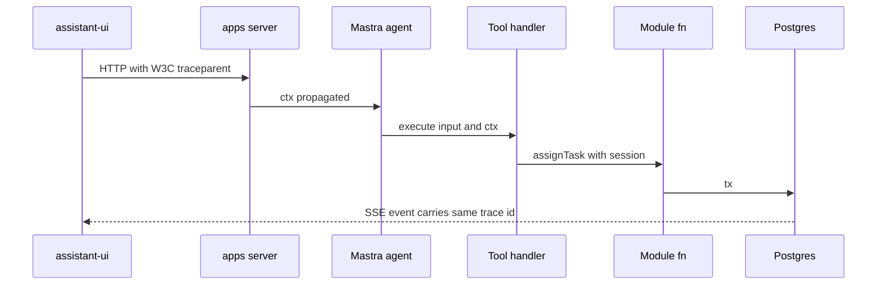

# Architecture

Seta is a multi-tenant, AI-first work-management platform implemented as a modular monolith. A single Postgres database, a single composition library, and multiple Node runtimes share one image; each module owns a Postgres schema, a public TypeScript surface, and an optional set of agent tools that the agent engine composes into Mastra agents at boot.

This document is the single source of truth for the implementation shape. When the code and this document disagree, the document is treated as the bug — the code is corrected to match.

**Related documents.** [`tech-stack.md`](./tech-stack.md) records why each dependency was chosen. [`agent-architecture.md`](../agent/architecture.md) covers the agent system in depth. [`creating-modules.md`](../guides/creating-modules.md) is the module-author guide. [`hosting/aws.md`](../hosting/aws.md) covers production deployment.

---

## System overview



The picture compresses every architectural commitment that follows:

| Element | Significance |
|---|---|
| **One image, two processes** | `apps/server` and `apps/worker` compose the same modules; the runtimes differ only in which subsystems they activate. |
| **Modules in-process** | Cross-module calls are typed function calls, not HTTP. The boundary is the schema and the public surface, not the network. |
| **One Postgres, many schemas** | Module data, the event outbox, embedding tables (pgvector), and agent memory all live in the same database. One backup, one failover, one SLO. |
| **Outbox + LISTEN/NOTIFY** | State mutation and event emission share a transaction; the worker dispatcher fans events to subscribers with at-least-once delivery. |
| **Agent inside the server runtime** | The agent engine composes module-owned tools at boot. Read tools execute directly; write tools pause for explicit user approval. |
| **External boundaries** | Only LLM providers and Microsoft 365 are outside the database; everything else is one transactional store. |

Each of these is unpacked in the sections below.

---

## 1. What Seta is — and isn't

| Seta **is** | Seta **is not** |
|---|---|
| A multi-tenant AI-first work-management platform | A single-tenant internal tool |
| A modular monolith — many modules, one DB, one image | A microservices fleet over HTTP |
| Postgres-everything (events, sessions, vectors, queue) | Multi-store (no Redis, Kafka, separate vector DB) |
| Self-hostable on a single VM or AWS ECS | SaaS-only |
| Agent-callable on every domain action | A chatbot bolted onto CRUD |
| Human-in-the-loop on every write | Auto-approve / fully autonomous |

---

## 2. Design principles

| # | Principle | Why it matters |
|---|---|---|
| 1 | **Schemas are the boundary, not networks** | Module isolation is a refactor pressure, not a deployment cost |
| 2 | **One Postgres, many schemas** | One backup, one failover, one SLO — domains isolated by schema |
| 3 | **RBAC re-checked at the callee** | The caller's claim is never trusted; the bus does not impersonate |
| 4 | **The bus is the outbox** | Lost and phantom events are impossible at the schema |
| 5 | **HITL on every write tool** | An agent never mutates without an approving human |
| 6 | **No internal contract versioning** | Event types, signatures, and unions change in place — no V1/V2 |
| 7 | **Production-grade only** | "Patch now, real fix later" is rejected on review |
| 8 | **Composition at boot, validation at boot** | Typos fail boot, not runtime |

---

## 3. Scale & latency targets

The shape below is calibrated for this envelope. Outside it, the trade-offs in §17 start to bite.

| Dimension | Target | Where to look |
|---|---|---|
| Tenants per cluster | ~5,000 | per-tenant LIST-partitioned vector + per-tenant RBAC |
| Users per tenant | ~10,000 | session-scoped permission cache |
| HTTP p95 (warm) | < 150 ms | Hono + Drizzle + module sub-app |
| Agent first token (p95) | < 1.5 s | chat orchestration route + warm Mastra agent |
| Event dispatcher lag (p95) | < 200 ms | `LISTEN/NOTIFY` + 2 s poll fallback |
| Retrieval p95 (top-50 + rerank) | < 250 ms | HNSW partition prune + Cohere rerank |
| Cold start (ECS task) | < 45 s | minimum-task autoscaling keeps it off the hot path |

---

## 4. Stack

| Layer | Choice | Section |
|---|---|---|
| Runtime | Node 24 LTS | [tech-stack §1](./tech-stack.md#1-node-24-lts) |
| Build | Turborepo + pnpm, Vite (web), `tsc` (backend) | [§2](./tech-stack.md#2-turborepo--pnpm) |
| HTTP | Hono | [§3](./tech-stack.md#3-hono) |
| Jobs | graphile-worker | [§4](./tech-stack.md#4-graphile-worker) |
| Auth | better-auth + argon2id | [§5](./tech-stack.md#5-better-auth--argon2id) |
| Database | Postgres 17 + pgvector | [§6](./tech-stack.md#6-postgres-17), [§7](./tech-stack.md#7-pgvector) |
| ORM | Drizzle | [§8](./tech-stack.md#8-drizzle-orm) |
| Event bus | Transactional outbox + `LISTEN/NOTIFY` | [§9](./tech-stack.md#9-transactional-outbox--listennotify) |
| Agent runtime | Mastra | [§10](./tech-stack.md#10-mastra) |
| AI SDK | Vercel AI SDK v6 | [§11](./tech-stack.md#11-ai-sdk-v6) |
| Chat UI | assistant-ui v0.14 | [§12](./tech-stack.md#12-assistant-ui) |
| Frontend | React 19 + TanStack Router + Query + shadcn/ui + Tailwind 4 | [§14–17](./tech-stack.md#14-react-19) |
| Cloud | AWS ECS Fargate + RDS + S3 + Secrets Manager | [§18](./tech-stack.md#18-ecs-fargate) |
| IaC | Terraform | [§19](./tech-stack.md#19-terraform) |
| Observability | OpenTelemetry + pino + CloudWatch | [§20](./tech-stack.md#20-opentelemetry--pino) |

---

## 5. Repo layout

```
apps/
├── server/   # Hono HTTP (dev also runs dispatcher + worker pool via startBoth)
├── worker/   # graphile-worker pool + LISTEN/NOTIFY dispatcher (production split)
├── cli/      # ops: migrate, seed, embedding backfills
└── web/      # React 19 shell host — composition root for the frontend suite

packages/
├── core/             # event bus, outbox, registry, runtime composition
├── identity/         # users, sessions, SSO, role grants
├── planner/          # plans, buckets, tasks, M365 sync + chat orchestrators
├── people/           # workers, skills, org units, allocations
├── pm/               # accounts, projects, requests, resource allocation
├── hiring/           # requisitions, openings, candidates, pipeline
├── integrations/     # M365 boot + directory sync, mail-transport config, MCP clients
├── knowledge/        # tenant knowledge corpus, RAG pipeline
├── notifications/    # in-app + email prefs, SSE hub
├── agent/            # engine-only: Mastra runtime + agent factory
├── web-planner/        # launcher app: planner UI + client + query keys
├── web-people/         # launcher app: people directory + org chart
├── web-pm/             # launcher app: project monitoring
├── web-hiring/         # launcher app: hiring
├── web-agent/          # launcher app (Agent Studio) + shell-rendered "Ask Seta" panel
├── web-admin/          # launcher app: tenant-admin console
├── web-identity/       # shell infra: SessionProvider, login/profile, user menu (no tile)
├── web-notifications/  # shell infra: top-bar popover, notification stream (no tile)
└── shared-*/         # infra: config, db, rbac, types, ui, crypto, mailer, storage,
                      #        embeddings, retrieval, orchestration, testing

sdks/
├── agent/   # @seta/agent-sdk — agent-tool contract (pure types)
└── module/    # @seta/module-sdk — frontend app-manifest contract

infra/
├── docker/    # Dockerfile + compose
└── terraform/ # AWS reference IaC
```

---

## 6. Modules & boundaries

A module owns a Postgres schema, a public TypeScript surface, and the code behind both. Two — and only two — boundary crossings exist. The diagram below shows both, using planner, identity, and notifications as concrete examples:



Each module reaches its own schema directly. Crossing into another module's domain happens through one of two legal paths only:

| Crossing | What's allowed | What's not |
|---|---|---|
| Synchronous call (planner → identity above) | Import the callee's public surface; pass `session`; the callee re-validates the permission | Importing from another module's `backend/` paths; reading the callee's tables directly |
| Asynchronous event (planner → bus → notifications above) | Emit inside the source-mutation transaction; subscriber consumes idempotently keyed on event ID | Writing into another module's schema; emitting outside the transaction |

Any edge not drawn above is rejected by static analysis — every PR runs CI gates that reject cross-module internal imports, raw SQL crossing schema boundaries, styling outside `@seta/shared-ui`, and cross-schema reads at Drizzle codegen time. The boundary is verified by tooling, not by review discipline.

**No cross-schema foreign keys.** `planner.tasks.assignee_id` is a `uuid` with no FK to `identity.user.id`. Consistency is event-driven via local read-model projections in the consumer's own schema.

**No cross-module data-handle sharing.** A module never hands its Drizzle client to another module. Mutation crosses only through public-surface function calls or domain events.

### Module classification

Path layers — enforced by dep-cruiser, no maintained allowlist:

| Layer | Path prefix | Rule |
|---|---|---|
| **infra** | `packages/shared-*`, `sdks/*` | Leaf packages — may not import from feature or orchestrator modules |
| **module** | `packages/<name>/` | Cross-module imports go through the public surface only |
| **app** | `apps/*`, `packages/web-*` | Leaf frontend apps. `no-cross-web-app-imports` keeps `web-planner` / `web-agent` / `web-admin` from importing one another (the `web-identity`, `web-notifications`, and `web-agent` panel are sanctioned cross-app infra); `web-no-backend-imports` blocks any `web-*` / `apps/web` import of a module's `backend` or `db` paths |

On top of the path layer, each module declares a `"setaTier"` in `package.json` — informational metadata naming its role: **foundation** (`core`, `identity`) depended on by every module; **feature** (`planner`, `people`, `pm`, `hiring`, `integrations`, `knowledge`, `notifications`) domain-owning modules; **engine** (`agent`) composing tools and specs into a Mastra runtime. The chat orchestrators (assignment / planner-Q&A / weekly-planner) live in `planner` on the shared orchestration kernel (`@seta/shared-orchestration`); the former standalone `staffing` orchestrator module was removed.

---

## 7. Canonical module shape

The module factory (`pnpm gen module`) produces this. Walkthrough in [`creating-modules.md`](../guides/creating-modules.md).

```
packages/<module>/
├── package.json                # exports: ., ./events, ./rbac, ./contracts, ./register
├── drizzle.config.ts           # schemaFilter: ['<module>']
├── drizzle/migrations/         # generated + hand-written .sql siblings
└── src/
    ├── index.ts                # public surface — application-service functions
    ├── events.ts               # event constants + zod payload schemas
    ├── rbac.ts                 # permission constants
    ├── contracts.ts            # browser-safe DTOs + zod schemas
    ├── register.ts             # one reg.module({...}) call
    └── backend/
        ├── domain/             # use-case functions (transaction-script style)
        ├── subscribers/        # event handlers (idempotent on event_id)
        ├── jobs/               # graphile-worker task handlers
        ├── http/               # Hono sub-app + zod request schemas
        ├── stream/             # SSE hub (when fanning events to clients)
        ├── workflows/          # Mastra workflow builders
        ├── agent-tools.ts      # AgentTool[] surfaced to agent
        ├── agent-specs.ts      # AgentSpec[] for orchestrator-style agents
        └── db/
            ├── schema.ts       # Drizzle pgSchema('<module>')
            └── client.ts       # internal — never exported
```

| Path | Public? |
|---|---|
| `src/index.ts` | ✅ |
| `src/events.ts`, `rbac.ts`, `contracts.ts`, `register.ts` | ✅ |
| `src/backend/**`, `src/db/**` | ❌ private |

---

## 8. Runtimes

Three Node runtimes share **one composition library** at `packages/core/src/runtime/`, exported as the private subpath `@seta/core/runtime` (dep-cruiser limits importers to `apps/server`, `apps/worker`, and integration tests).

```ts
// Both apps/server/src/index.ts and apps/worker/src/index.ts do:
const reg = createContributionRegistry();
registerCoreContributions(reg);
registerIdentityContributions(reg);
// ... one register*Contributions call per active module ...

const rt = buildRuntime(env, { reg, pool, ...deps });
```

| Runtime | Role |
|---|---|
| `apps/server` | Hono HTTP. **Prod:** HTTP only with enqueue-only `WorkerHandle`. **Dev** (`NODE_ENV !== 'production'`): `startBoth()` runs HTTP + dispatcher + worker pool in one process. |
| `apps/worker` | graphile-worker pool + `LISTEN/NOTIFY` dispatcher. **Only `apps/worker` runs the dispatcher in production** — exactly one instance across the fleet. |
| `apps/cli` | Ops surface: `migrate`, `seed`, embedding backfills. Never starts the dispatcher (dep-cruiser-enforced). |

### Dev vs prod composition



The browser shell at `apps/web` shares no Node composition with the others. The same registry concept drives the web shell — each app package exports a typed `AppManifest` from `@seta/module-sdk`, registered via `apps/web/src/shell/manifest-registry.ts` + `manifests.ts`.

---

## 9. Contribution registry

Each module's `register.ts` makes one `reg.module({...})` call. The registry validates **at composition time** — collisions throw before the runtime finishes booting.

```ts
reg.module({
  name: 'planner',
  schema,                    // Drizzle pgSchema (name must match)
  migrationsDir,             // absolute path

  events,                    // Record<EventType, ZodSchema>
  rbac,                      // Record<permissionSlug, description>

  subscribers,               // SubscriberDef[]   — idempotent on event_id
  jobs,                      // TaskList          — globally unique names
  routes:    { mountAt: '/api/planner/v1', build },   // optional
  stream:    buildStreamHub,                          // optional

  agentTools,                // AgentTool[]     — composed into agents
  agentSpecs,                // AgentSpec[]       — orchestrator personas
  workflows,                 // WorkflowBuilder[] — Mastra workflows

  errorMapper,               // <ModuleError> → { status, body }
});
```

### Boot-time validation

| Check | Fails on |
|---|---|
| Schema name matches `name` | Mismatch → throw |
| Job names globally unique | Collision across modules |
| Permission slugs unique | Collision across modules |
| Tool IDs unique | Collision across modules |
| Agent spec IDs unique | Collision |
| Workflow IDs unique | Collision |
| Every subscriber's event type has a payload schema | Missing schema in any module's `events` |
| Every `agentSpec.tools[]` ID resolves in the tool catalog | Typo, removed tool |

A typo in a tool reference fails boot, not runtime.

---

## 10. Event bus

The bus is a **transactional outbox** in `core.events` plus `LISTEN/NOTIFY` for wakeups. Two classic bugs die at the schema:

| Bug | Why it's impossible |
|---|---|
| *Lost events* — state committed, publish failed | The event row lives in the same transaction |
| *Phantom events* — publish succeeded, state rolled back | Rollback drops the event row too |

### Lifecycle



There is no separate publish path. `core.emit()` throws outside an `emitContext` — the only legal entry points are `withEmit`, `withCoreEmitContext` (for Mastra workflows), and the subscriber framework. Audit rows live in `core.events` alongside domain events — one unified history.

| Property | Guarantee |
|---|---|
| Delivery | At-least-once |
| Ordering | Per-aggregate only — not global |
| Dedup | Subscriber framework, keyed on `event_id` |
| Replay window | Bounded by `core.events` retention (default 90 days) |
| Dispatcher singleton | `apps/worker` only, exactly one task in the fleet |

---

## 11. Identity & sessions

`@seta/identity` wraps better-auth (local password + Entra OIDC) over `identity.user`, `identity.session`, `identity.account`, `identity.verification` (better-auth's tables) plus a sibling `identity.user_profile` for app-specific fields (skills, availability, working_hours, timezone).

Sessions land in request context via a Hono middleware provided by `@seta/core`. Every public-surface function takes a `session: SessionScope` carrying `tenant_id`, `user_id`, `role_summary` (`{ roles, cross_tenant_read }`), the scoped `assignments` (`{ role, scope_kind, scope_id }`) with org-unit reach pre-expanded, `cross_tenant_read`, and a resolved `permissions: ReadonlySet<string>`. The permission set and scope map are computed at session-build time from the user's assignments via the shared resolver (`@seta/shared-rbac`) and recomputed on cache hydration — never persisted.

### RBAC resolution engine

All enforcement resolves through one shared `@seta/shared-rbac` registry. `INVENTORY` (in `packages/shared-rbac/src/inventory.ts`) is the single source of truth for canonical permission strings and seed role→permission maps. The server composition root, `pnpm gen:rbac`, and `@seta/identity` all build the registry from it via `inventoryToManifests(INVENTORY)`. Each module also declares a typed `statement` in its `src/rbac.ts` (built into a `ModuleRbacManifest` via `toManifest(...)`) and its statement is parity-tested against its `INVENTORY` slice. Although better-auth is a dependency, the RBAC layer uses plain typed statements and `toManifest` — not `createAccessControl` — keeping declarations free of unused role objects.

Special resolution rules:
- `org.admin` and `tenant.admin` resolve to the full permission set (wildcard).
- `org.viewer` resolves to every `.read` permission.
- `IMPLICIT_PERMISSIONS` (a fixed baseline list in `shared-rbac`) is unioned for every authenticated user.

Backend enforcement uses `can(session, permission)`. Module `requirePermission` wrappers remain for typed errors and module-specific scope checks (e.g. planner group-scope, M365 system-actor guard) — not for resolution.

A generated `PermissionKey` union (`@seta/shared-rbac/generated`, produced by `pnpm gen:rbac`, drift-guarded by a test) is shared backend↔frontend. The frontend gates nav entries, route guards, and `<Can>`/`usePermission` on the resolved permission set delivered via `GET /api/identity/v1/me`.

### Login → permission check



**SSO is admin pre-provisioning only.** No just-in-time provisioning. First SSO login links to an existing pre-provisioned user; unknown subjects are rejected.

### Directory sync (M365 → people, one way)

`@seta/integrations` pulls the Entra directory into `people` so the org chart is sourced from the company system of record. It reads `GET /users/delta?$select=…,manager` — the same endpoint serves the initial load and every incremental run, with the cursor on `integrations.m365_tenant_config`. Data flows M365 → us and never the reverse.

**In scope: humans on a verified domain.** `isSyncableUser` admits `userType: 'Member'` accounts whose mail domain is one of the tenant's verified domains, then drops anything holding no licence *and* carrying neither `givenName` nor `surname`. That second test is what keeps room, equipment and shared mailboxes out of `people`: Entra models them as ordinary licensed-looking `Member` users, so domain and `userType` alone admit every meeting room in the tenant. The authoritative discriminator would be `mailboxSettings.userPurpose`, but it needs `MailboxSettings.Read` consent the directory app is not guaranteed to hold, and `/places` needs `Place.Read.All`; licence-and-name is derivable from the `/users/delta` payload the sync already reads. Requiring **both** conditions before excluding is deliberate — a licensed account with no name parts, and an unlicensed human, both still sync.

The sync writes through `people`'s public surface (`syncDirectoryPeople`, `updateOrgUnit`, `deleteOrgUnit`) under a system-actor session, so RBAC and `person_history` attribution apply exactly as they do for a human edit. Three invariants keep it from becoming a back door:

- **Manager is not a column.** Reporting stays derived from `org_unit.head_worker_id` (F-ORG-3), so the Entra manager projects onto the unit head rather than a `person.manager_id`. `read-workers.ts` and `worker-scope.ts` — the latter an RBAC predicate — are untouched by the sync. Because a head change therefore moves a permission scope, an ambiguous manager raises a conflict instead of picking a winner.
- **Entra identity lives in `integrations`.** `m365_person_links` / `m365_org_unit_links` hold the Entra object IDs, following the existing `m365_group_links` pattern. `people.person` gained only `photo_storage_key` and `directory_managed` (a field-lock flag, since `people` cannot read the link table cross-schema).
- **The sync owns the department layer only.** It creates, renames, re-parents and heads `kind='function'` units carrying a link row. The structural spine (`executive`, `operation`, `delivery`, `pmo`) is exempt — the org-chart UI grafts the account/project subtree onto `delivery`, so re-parenting it would leave those views rootless. Units with no link row are never touched, and deletes require the unit to be empty of members and children.

**Auto-create never creates logins.** A synced person gets `people.person` + `employment_period` rows only — the no-JIT-provisioning rule above is unaffected. Removals and disables raise a `user_removed` conflict rather than mutating the person.

Anything the sync cannot decide safely becomes a row in `integrations.m365_directory_conflict` (`manager_ambiguous`, `email_collision`, `unit_delete_blocked`, `spine_collision`, `user_removed`), resolved by an admin at `/admin/m365-directory`. Resolutions call the same public `people` functions under the **admin's** session, so the audit trail names a real user. `people.org_unit.updated` / `.deleted` propagate to `identity.org_unit_projection`, which feeds session building — deletes are tombstoned so a delete arriving before its create cannot resurrect the row.

---

## 12. Agent system

`@seta/agent` is engine-only. It composes module-owned agent tools and specs into Mastra agents via the contribution registry; it does **not** import any feature or orchestrator module (enforced by dep-cruiser rule `agent-no-feature-imports`). The agent registry, tool + RBAC contracts, workflow surface, HITL contract, memory model, and code locations are in [`agent-architecture.md`](../agent/architecture.md).

### Chat runtime — intent router + orchestrators

Every chat turn (`POST /api/agent/v1/chat`) is classified by an intent router (`apps/server/src/chat-routing/`) and dispatched to one of four orchestrators — **assignment** (recommend-and-assign; sub-agents taskAnalyzer / skillMatcher / avaiChecker / recommender), **planner Q&A** (read-only task/team questions), the **weekly planner** (organizes the caller's tasks into a day-by-day plan), or **A2 action** (the `mutate` intent: turn a sentence into ONE proposed change and show a preview card, writing nothing until Confirm). Each is an agent-of-agents built in `@seta/planner/orchestration` on the shared orchestration kernel (`@seta/shared-orchestration`). The composition root (`apps/server`) is the only layer that can see all four runtimes: it builds them, wraps them in `makeChatRouter` (classify → dispatch), and injects the result as `chatOrchestration` into `registerAgent`. A2 alone receives a widened run input carrying the open preview (see below). The former standalone `staffing` orchestrator module was absorbed into `planner`.

An explicit pick in the chat model selector resolves through the engine's model registry (`packages/agent/src/backend/model-registry.ts`) and rides `RunCtx.model` into the orchestrator and every sub-agent LLM call for that turn. Auto (or no pick) uses the runtime's boot-time default (`resolveModel('auto', { tierHint: 'fast' })`). The catalog comes from `AGENT_MODELS`, falling back to `AGENT_MODEL`, then a built-in catalog.

Chat HITL uses Mastra-native suspend/resume. The assignment orchestrator's `proposeAssignment` composite calls `ctx.agent.suspend(candidate card)`; the web renders the card inline and, on approval, resumes the suspended turn via `POST /api/agent/v1/chat/resume` (`resumeOrchestration: assignmentOrchestration.runResume`, bound in `apps/server`), which streams the continuation and runs `assignTask`. The separate `POST /workflows/approvals/:id/decide` route only records decisions for workflow-step approvals — it does not resume chat.

#### Revising a preview by chatting (FUT-840)

A user adjusts the proposal already on screen by saying what to change, rather than cancelling and starting over. Five moves, and only the first two are new to the request path:

1. **The router finds it.** `makeChatRouter` calls `findOpenPreview` — `findOpenChatPreview` in `@seta/agent`, bound to `workflowIds: ['planner.action']` — but only on a `mutate` turn inside a thread. It returns the NEWEST pending card for this approver. Classification never reads it: `ADJUST_RE` is pure text, placed after `QUESTION_RE`, so "what should I make it?" stays a question. A read-model failure degrades to "nothing open" rather than failing the turn.
2. **A2 receives it as data.** `renderOpenPreviewBlock` appends an OPEN PREVIEW block to the turn message — approval id, owning tool, the card's intent line, and the card's own `kvTable` rows. The machine-readable `argsPatch` never reaches the prompt, so no proposed value can be smuggled back in through model text.
3. **The tool re-derives the proposal.** `resolveRevision` asserts, in order: an absent `revisionOf` is a NEW request and is never refused; `revisionOf` must EQUAL the approval id the SERVER injected (checked *before* the load, so a mismatched id costs no query and reveals nothing); the card's `meta.toolId` must equal the calling tool. Targets then come FROM THE CARD, permissions are re-gated, the patch is merged over the previous one, and a FRESH idempotency key is minted. **Merge's role swap is the single deliberate exception** — it may swap which task survives, never which two tasks are involved.
4. **The writer swaps atomically.** `writeChatApprovalRow` supersedes the card named by `meta.supersedes` and inserts the new one in ONE transaction, so no committed instant has two pending cards for a task or zero.
5. **Confirm is untouched.** `/chat/resume` reads `argsPatch` verbatim off the persisted card, so the merged values apply with no code change on that path at all.

Card mutex, on `meta.dedupKeys: string[]`:

- Keys are evaluated **in declaration order and the first hit wins**. An assign card declares `assign:<taskId>` first and `task:<taskId>` second: `assign:` REUSES the open card (FUT-806), `task:` REFUSES. A tool's courtesy pre-check must mirror that precedence — checking `task:` alone would refuse the very case the writer reuses.
- The guarantee is `pg_advisory_xact_lock` over the sorted keys *inside* the writer's transaction, not the pre-check: two concurrent turns both see a clear table. The pre-check only buys the ordinary case an explanation instead of a dropped card. It names no person, because the `task:` mutex is per TENANT.
- A create card declares no keys, so a new-task preview may legitimately wait alongside an update preview for a different task.
- `meta.dedupKey` (singular) is still read as a fallback for cards written before this shipped. Removable once no pending row can carry it — 72 hours after deploy.

Run-row lifecycle: a chat card's synthetic `agent.workflow_runs` row is closed on `superseded` and `rejected` only. **An approved row stays `paused`**, because `replayableDecision` and `resumeRetry` both key on it.

### Orchestration working memory

The chat runtime wires two working-memory mechanisms (factories in `packages/agent/src/backend/memory.ts`); both reach the orchestrator as `AgentMemoryHandle`s on the run ctx (`RunCtx.threadId` / `entitiesMemory` / `userMemory`), wired by the chat route and forwarded through `executeStep` — the same plumbing precedent as `recordHitlApproval` and `RunCtx.model`.

- **Thread-scoped conversation entities** (`ConversationEntitiesSchema`,
  stored in `thread.metadata.workingMemory`): the orchestrator sets
  `RC_THREAD_ID` + `RC_AGENT_MEMORY` on its `RequestContext`, so the SDK's
  `recordEntityExposure` and `resolveTaskRef` run unmodified inside its
  delegation tools. `callTaskAnalyzer` takes a `taskRef` (UUID or ordinal
  "first"/"#2"/"last"), resolved deterministically against `recentTasks`
  BEFORE the sub-agent call, and returns `resolvedTaskId` for the LLM to pass
  downstream. Tools record exposure after each result (found tasks, discussed
  task, proposed candidate). Entities are never injected into any prompt.
- **Resource-scoped userContext** (`WorkingMemorySchema`, stored in
  `agent.mastra_resources`): the orchestrator must NOT attach `Memory` to its
  Mastra `Agent` (auto message persistence would collide with the manual
  trace-timeline `saveMessages`), so it drives the shared `GuardedMemory`
  instance through the public API instead — `getSystemMessage` renders the
  userContext section appended to its instructions, and a guarded
  `updateWorkingMemory` tool (the `GuardedMemory` LLM-write guard) performs
  the writes.

Both mechanisms are best-effort: memory failures never break a chat
answer, and all of it no-ops on the queued runner (no chat thread).

---

## 13. Embeddings & retrieval

Embeddings live in the **owning module's schema** as sibling tables, never in `agent`.



| Stage | What runs |
|---|---|
| Storage | `LIST`-partitioned by `tenant_id`, per-partition HNSW on `halfvec(1536)` (pgvector ≥ 0.7) |
| Stage 1 | FTS + vector RRF (`k = 60`), top-50 |
| Stage 2 | Cross-encoder rerank — Cohere by default, LLM-as-judge fallback, `none` to opt out |
| Provider abstraction | `@seta/shared-embeddings` (`embedMany`, source-hash, model providers) + `@seta/shared-retrieval` (`Retriever`, RRF SQL builder, rerank) |
| Mastra surface used | `@mastra/rag` for `MDocument.chunk()` and `rerank()` only. `@mastra/pg`'s `PgVector` is the per-module vector store — each module instantiates it pointed at its own schema (e.g. `identity_rag`, `knowledge_rag`). |

Backfill of an entity's embeddings is a `apps/cli` one-off command, scoped to a tenant.

---

## 14. Frontend shell

`apps/web` is a React 19 shell host on TanStack Router — the composition root for the frontend suite. Each app is its own workspace package under `packages/web-*`; the shell at `apps/web/src/shell/` owns providers (session, theme, hotkeys, toasts), the global command palette, the app-manifest registry, the 9-dot app-launcher, and route assembly.



Routes are assembled with `@tanstack/virtual-file-routes`: `physical()` mounts each app package's `src/routes/` into one generated tree under a single `Register`, lazy-split per app on first open. The launcher gates tiles by `requiredPermissions` (OR-semantics); switching the active app swaps its sidebar and route namespace. Each app owns its own sidebar — there is no shared accordion.

```ts
// packages/web-planner/src/manifest.ts
export const plannerAppManifest: AppManifest = {
  id: 'planner',
  label: 'Planner',
  icon: Squares2x2,
  routeNamespace: '/planner',
  color: '#0047FF',                    // optional launcher-tile accent
  requiredPermissions: [],             // launcher visibility gate
  useNavExtensions: noNavExtensions,   // dynamic sidebar sections
  nav: [
    { label: 'WORK', items: [
      { id: 'planner.boards', icon: LayoutDashboard, label: 'Boards', to: '/planner' },
      // ...
    ] },
  ],                                   // NavSection[] — the active-app sidebar
};
```

**Agent surfaces.** Two, both owned by `@seta/web-agent`: the shell-rendered **"Ask Seta" panel** (right-side conversational panel on every app, toggled from the top bar, no launcher tile) and **Agent Studio** — a normal launcher app at `/agent` (chat history, knowledge, workflows, runs, config) with its own sidebar.

**Console aggregation.** Tenant-admin UI (users, SSO, audit, integrations, notification prefs, tenant settings) lives in `packages/web-admin/` as a launcher app at `/admin` — one admin home, not one admin sub-app per module.

**Bundle governance.** Each app carries a `size-limit` budget enforced in CI. `web-*` and `shared-ui` mark React, react-dom, and `@tanstack/*` router+query as `peerDependencies` and external at build, so the shell provides one shared vendor instance rather than bundling a copy per app.

**Style monopoly.** All styling lives in `@seta/shared-ui`; apps compose primitives from there and never introduce their own CSS, Tailwind configuration, or design tokens. This is enforced statically at lint time.

---

## 15. Deployment

The production target is AWS ECS Fargate (HTTP service + dispatcher/worker service), RDS Postgres Multi-AZ with pgvector, S3 + CloudFront for the web bundle, Secrets Manager for environment secrets. A single multi-stage Dockerfile produces both `platform-server` and `platform-web` images; the same image runs self-hosted via `docker compose`. Mode-selectable runtime via `PLATFORM_MODULES` supports per-module deployment. Full topology, sizing, hardening, observability, runbooks, and FinOps in [`hosting/aws.md`](../hosting/aws.md); single-VM self-host in [`hosting/docker-compose.md`](../hosting/docker-compose.md).

Full topology, sizing, security, runbooks, FinOps: [`hosting/aws.md`](../hosting/aws.md).

---

## 16. Observability

| Signal | Stack |
|---|---|
| Traces, metrics | OpenTelemetry — OTLP HTTP exporter, pluggable collector |
| Logs | `pino`, child loggers per subsystem |
| Audit | `core.events` — same table as domain events |
| Health | `/health/live`, `/health/ready`, `/health/startup` on `apps/server`; readiness reports dispatcher backlog and per-subscriber lag |

### Trace propagation



---

## 17. Accepted trade-offs

The architecture imposes the following constraints. Each is a deliberate exchange against a competing design.

| Trade-off | Rationale | Revisit condition |
|---|---|---|
| Modular monolith — modules cannot scale independently below the `PLATFORM_MODULES` split | A single image, backup, and SLO is materially cheaper to operate than N services within the target scale envelope | Sustained writer CPU exceeds 70 % at `db.r6g.16xlarge` with the highest-load module already isolated |
| Single database — schema migrations require coordination across modules | Cross-schema invariants remain enforceable and one backup/restore covers the entire system | A module's migration cadence diverges from the rest by more than an order of magnitude |
| At-least-once event delivery — subscribers must be idempotent | Exactly-once semantics are unattainable across distributed systems without latency or coordination cost the workload does not justify | A use case requires exactly-once semantics that idempotency keys cannot satisfy |
| Per-aggregate event ordering only — no global order | Global ordering imposes a throughput ceiling incompatible with the target tenant density | A use case requires global ordering and cannot be reformulated to shard differently |
| pgvector — not the highest-throughput vector store at extreme scale | Co-location with source data eliminates a vendor and a transactional boundary | Single-tenant vector counts exceed 50 M with rerank latency under sustained pressure |
| Human-in-the-loop required on every write tool — adds a confirmation step | Trust and auditability are prioritised over agent autonomy at the target market | A trusted workflow requires auto-approval (implemented as an explicit, audited opt-in) |
| No microservices — modules cannot be deployed independently | Boundaries are enforced at the schema, not the network | Independent deployment cadence becomes the limiting factor on delivery throughput |

---

## 18. FAQ

| Question | Answer |
|---|---|
| **Why a modular monolith rather than microservices?** | Microservices provide independent deploy at the cost of HTTP between every domain. Schema-level isolation enforced by dep-cruiser provides the same boundary guarantees without the inter-service network surface. The `PLATFORM_MODULES` environment variable supports splitting modules across services when scaling pressure justifies it. |
| **Why Postgres for the event bus rather than Kafka or SQS?** | An external broker cannot participate in the source-of-truth transaction. The outbox-in-Postgres pattern eliminates lost-event and phantom-event failure modes by construction. The throughput ceiling of the chosen approach exceeds the system's scale targets. |
| **Is Prisma supported as an alternative to Drizzle?** | No. Drizzle's `pgSchema('<name>')` plus `schemaFilter` directives are central to module boundary enforcement; Prisma does not model schema-scoped clients at parity. |
| **Is MongoDB supported?** | No. The system depends on `LISTEN/NOTIFY`, deferred-constraint triggers, table partitioning, and pgvector — all Postgres-specific capabilities. |
| **Can the AI SDK v6 substitute for Mastra?** | No. AI SDK v6 provides the LLM client and tool-call protocol; Mastra provides agent composition, memory, and workflow primitives. The two are complementary. |
| **How are agents added independently of modules?** | Agents are not module-independent. Tools are owned by modules; cross-module chat orchestrators are composed in the `planner` module (assignment / Q&A / weekly-planner) on the shared orchestration kernel (`@seta/shared-orchestration`). |
| **What is the scale ceiling?** | The targets in §3 describe the validated envelope. Above this, the trade-offs in §17 begin to apply; mitigation involves the `PLATFORM_MODULES` split, read replicas, and isolating the highest-load module onto a dedicated database. |
| **Is the agent system documented separately?** | Yes — see [`agent-architecture.md`](../agent/architecture.md). |

---

## 19. Reading code

The fastest path to understanding any subsystem:

| Subsystem | File |
|---|---|
| Registry type + validation | `packages/core/src/composition/registry.ts` |
| `buildRuntime`, `startBoth` | `packages/core/src/runtime/bootstrap.ts` |
| Outbox + dispatcher | `packages/core/src/events/*` |
| Reference feature module | `packages/planner/` |
| Chat orchestrators (assignment / Q&A / weekly) | `packages/planner/src/backend/orchestration/` |
| Orchestration kernel (runners, RunCtx) | `packages/shared-orchestration/src/` |
| Composition in practice | `apps/server/src/index.ts` + `apps/worker/src/index.ts` |
| Agent-tool contract | `sdks/agent/src/index.ts` |
| Frontend app-manifest contract | `sdks/module/src/index.ts` |

For Mastra internals (when wiring the agent engine), consult the Mastra source checkout at `../mastra/` instead of inferring from npm types.

---

## See also

- [`tech-stack.md`](./tech-stack.md) — why each library is here.
- [`agent-architecture.md`](../agent/architecture.md) — the agent system in depth via a planner walkthrough.
- [`creating-modules.md`](../guides/creating-modules.md) — add a module + agent tool + UI.
- [`dev-quickstart.md`](../guides/dev-quickstart.md) — first tenant on a fresh DB.
- [`hosting/aws.md`](../hosting/aws.md) — production deployment.
