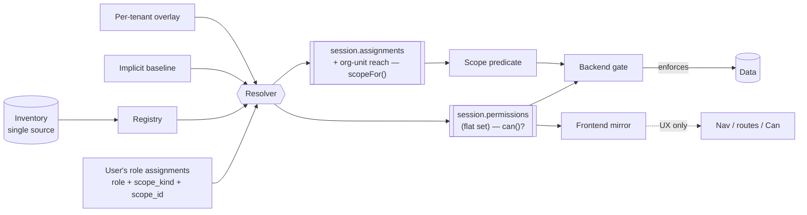
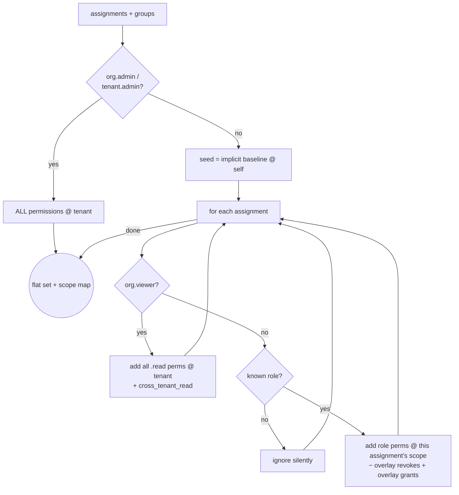
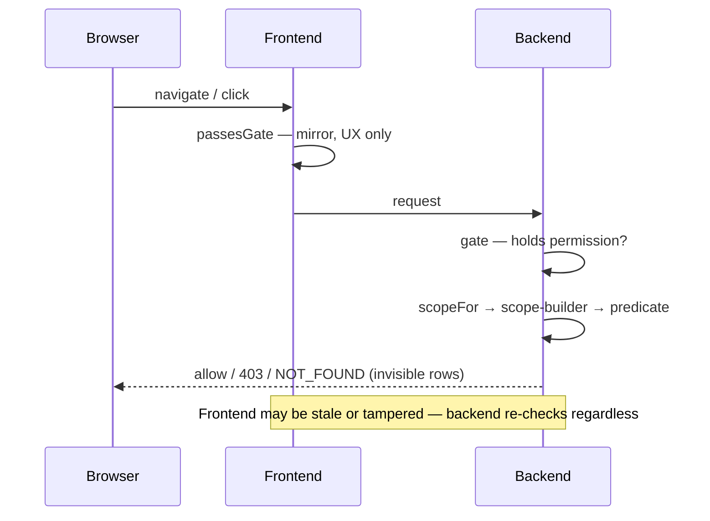
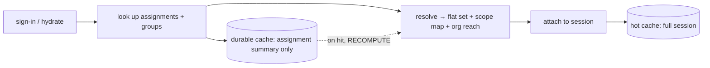

# How RBAC works

Access control has **two independent axes** that both must pass:

1. **Permission** — *can this principal perform this action at all?* A flat `module.resource.action` string, resolved to an O(1) session set. Global, verb-only, no scope baked in.
2. **Scope** — *which rows may they touch?* Attached to the role **assignment**, not the role: every grant is a triple **(principal, role, scope)** where scope is `tenant`, `org_unit` (a node + its subtree), or `self`. A per-permission scope map plus module scope-builders turn that into a SQL predicate.

Splitting the two is what keeps roles from exploding: one `pm.manager` role serves every delivery group because the *assignment* says which org unit it reaches. The backend enforces both; the frontend mirrors permissions for UX only.



---

## Permission strings

Format: `module.resource.action` — a single flat string, e.g. `planner.task.create`.

| Segment | Meaning | Example |
|---|---|---|
| module | owning module (`core.*` is identity-owned) | `planner` |
| resource | noun acted on, snake_case, may contain dots | `workflow.run` |
| action | verb from the closed set below | `read`, `create` |

**Closed verb set.** Actions come from a fixed vocabulary — there are no scope suffixes (`.self` / `.any` / `.all` / `.tenant` / `.instance` are all retired; scope lives on the assignment).

| Family | Verbs |
|---|---|
| data | `read` `create` `update` `delete` — `manage` is shorthand that expands to all four at build time |
| config | `configure` (module settings only) |
| workflow | domain verbs for a process stance, imperative: `submit` `approve` `reject` `close` `run` `cancel` `grant` `revoke` `use` `restore` … |

> Authored grouped (`knowledge.file: [read, update, delete]`), checked flat (`knowledge.file.read`). The two are mechanically interconvertible and verified equal at build time.

---

## Roles

A per-module **ladder** (tiers skippable), plus **domain roles** beside it for workflow stances, plus **foundation** roles resolved specially.

| Kind | Slugs | Resolves to |
|---|---|---|
| **Ladder** | `<module>.admin` → `<module>.manager` → `<module>.member` → `<module>.viewer` | its enumerated permission list (e.g. `knowledge.viewer` → file.read, search.read) |
| **Domain** | `hiring.recruiter`, `pm.pmo`, `pm.bod` | a workflow-specific permission list, sitting beside the ladder — never a scope tier |
| **`org.admin` / `tenant.admin`** | — | **wildcard**: every permission that exists (auto-covers new modules) |
| **`org.viewer`** | — | every string ending in `.read`, plus `cross_tenant_read` |
| **Implicit baseline** | — | a fixed self-service set for *every* authenticated user (chat use, own profile, own threads) |

"Own records only" is **never a role tier** — it is `self` scope on the assignment. Self-service (read your own profile, use chat) is the implicit baseline, not a role.

---

## Role assignment = (user, role, scope)

`identity.role_assignments` stores the triple:

| column | type | notes |
|---|---|---|
| user_id, tenant_id | uuid | |
| role_slug | text | inventory-validated |
| scope_kind | `tenant` \| `org_unit` \| `self` | closed set |
| scope_id | uuid, null | org_unit id when kind = `org_unit`, else null |
| revoked_at | timestamptz | soft-revoke |

Unique on `(tenant_id, user_id, role_slug, scope_kind, scope_id)`. **Union semantics: more assignments only ever widen reach. No deny, no narrowing at children.**

- **`org_unit` scope always means the node and its entire subtree** (the default inherit mode; boundary-stopping modes are deferred).
- **Groups carry scoped pairs too.** `identity.access_group_role` has the same `scope_kind` / `scope_id` columns, so a persona group is e.g. *"Delivery-A PMs" = `pm.manager @ org_unit:delivery-a`*. Resolution unions a user's direct assignments with their group-derived assignments; downstream nothing cares about provenance.
- **Relationship-derived reach is not stored here.** "AM sees his accounts", "project lead sees his projects", "head sees their unit", "recruiter sees their requisitions", "planner member sees their group" all derive from domain data inside scope-builders (§ scope arms). Storing them as assignments would duplicate domain facts into RBAC and drift.

---

## Resolution: flat set + scope map

One resolver entry point, used by session build, `identity.requirePermission`, and `core/rpc/rbac.ts` alike — so the **per-tenant overlay is applied in every path** (order: `defaults − revokes + grants`). It produces both:

```ts
// axis 1 — unchanged O(1) membership
can(session, 'planner.task.create')

// axis 2 — reach for a held permission
scopeFor(session, permission):
  | { kind: 'tenant' }                   // some assignment granting it is tenant-scoped
  | { kind: 'org_units', ids: string[] } // union of granted org subtrees (pre-expanded)
  | { kind: 'self' }
  | { kind: 'none' }                      // permission not held → deny
```

**Widest-wins:** `tenant ⊃ org_units ⊃ self ⊃ none`. Wildcard roles and `org.viewer` resolve to `tenant` for everything they grant; the implicit baseline resolves to `self`.



Unknown roles are no-ops (never crash). Wildcard is the only precedence. Cost is O(perms granted), in-memory.

### Org tree as scope infrastructure

People is the **source of truth** for org units (editing, heads, kinds). Identity keeps a read-only **projection** `identity.org_unit_projection` (id, parent_id, name) maintained by an idempotent subscriber to people's `org_unit.*` events — no cross-schema FK, no cross-schema reads. **Org-subtree expansion happens once at session build** (an in-memory walk over the projection — the tree is small) and the expanded id set rides on `SessionScope`. Session invalidation on `org_unit.changed` reuses the role-assignment invalidation path.

Modules that scope entities by org unit store a **local `org_unit_id` column** on the entity (uuid, no FK), set at create/edit — so the predicate is a trivially indexable `entity.org_unit_id = ANY(reach)`.

---

## Enforcement: gate then scope

Both layers run on the backend; either can deny.

| Layer | Question | How |
|---|---|---|
| **Gate** | holds the permission at all? | flat-set membership — uniform everywhere |
| **Scope** | is *this row* in reach? | `scopeFor` → module scope-builder → SQL predicate |

`shared-rbac` exports the **scope kit**. A module ships one `src/backend/scope.ts` that declares a `ScopePlan` (per resource: which column is the org_unit, which is the self/owner, plus **relationship arms** as SQL fragments) and calls the kit:

```ts
type ScopeDecision = { kind: 'all' } | { kind: 'predicate'; sql: SQL } | { kind: 'deny' }
// list/read repository functions take a ScopeDecision (not optional — unscoped queries are unrepresentable)
// decisionPredicate(decision) → SQL | null   ('all' → null, 'deny' → sql`false`, else the predicate)
```

Point checks (mutations, agent tools) reuse the same plan as an `EXISTS` guard. The three formerly-duplicated `tenantScoped` copies are now one shared helper.

**Relationship arms** (domain-derived reach, union-ed with assignment scope):

| Module | Arm | Derived from |
|---|---|---|
| people | head sees their unit's subtree | `org_unit.head_worker_id` |
| pm | AM sees their accounts; lead sees their projects | `account.am_worker_id`, `project.lead_worker_id` |
| hiring | recruiter sees their requisitions | `account_recruiter`, requisition owner |
| planner | member sees their group's plans | planner-local `group_members` |
| agent | reads own runs; tenant/cross-tenant by scope | `started_by`, `scope_kind` + `cross_tenant_read` |



Invisible rows return **NOT_FOUND**, not FORBIDDEN, so scope never leaks existence.

**Fail-closed everywhere:**

| Situation | Result |
|---|---|
| missing / empty permission set | deny |
| unknown role slug | contributes nothing |
| `scopeFor` → `none` | `deny` predicate (`sql\`false\``) |
| RPC checker not wired at boot | throws (never silently passes) |
| frontend has no delivered set | hides everything |

---

## Session lifecycle



The permission set and scope map are **computed, never persisted**. A deploy that changes permissions, role defaults, or the org tree takes effect immediately — no stale blobs to migrate.

---

## Actors

| Actor | Carries | Resolved how |
|---|---|---|
| Logged-in user | session flat set + assignments | at session build |
| Cross-service / RPC | **role slugs + scoped assignments** on the wire | callee re-resolves with its own registry + overlay |
| Agent / LLM tool | actor's resolved set via request context | tool re-checks before executing — can't exceed the user |
| System / automation | synthetic session from a `system.<integration>` role | same resolver rules; tenant isolation still enforced |

---

## Single source of truth

`packages/shared-rbac/src/inventory.ts` is the **only** hand-edited source (permission statements + role permission lists + seed maps). `pnpm gen:rbac` emits, per module, a typed constants file (`packages/<module>/src/generated/rbac.ts` — permission keys, role slugs) plus the shared `PermissionKey` type. Per-module `src/rbac.ts` re-declarations and their parity tests are gone — drift is impossible, not test-guarded.

**Build-time invariants** (fail-fast): no dangling grant · no duplicate key · per-module codegen drift · aggregate parity · type drift. After any inventory edit, run `pnpm gen:rbac && pnpm typecheck` — a missed rename fails the compiler.

---

## Overlay seam (per-tenant role editing)

The resolver accepts a per-tenant delta of `grant` / `revoke` per `(role, permission)`, applied in **every** resolution path. Order: `defaults − revokes + grants`. Seed-only today; an admin matrix later is purely additive. Foundation roles are not customizable.

---

## Reasoning checklist

1. What exact permission string (closed verb set, no suffix) does the action need?
2. Does that string exist in the inventory? (else only wildcard admins have it.)
3. Which roles grant it — and do wildcard / all-reads / implicit reach it?
4. What **assignment scope** is required (tenant / org_unit / self) — and is there a **relationship arm** (head, AM, lead, recruiter, membership) that should also grant reach?
5. Does the repository function take a `ScopeDecision`, and is the predicate fail-closed (invisible → NOT_FOUND)?
6. Backend enforces for real; frontend only mirrors.
