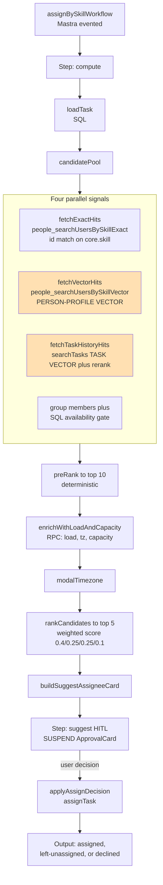
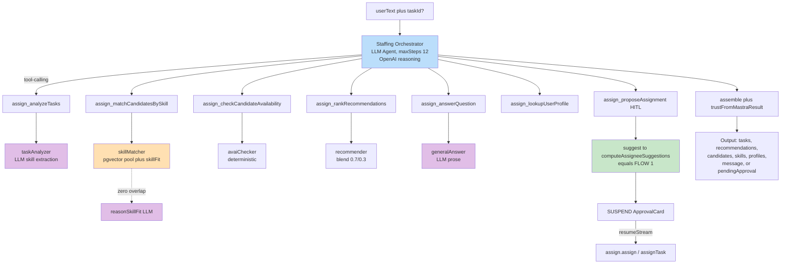
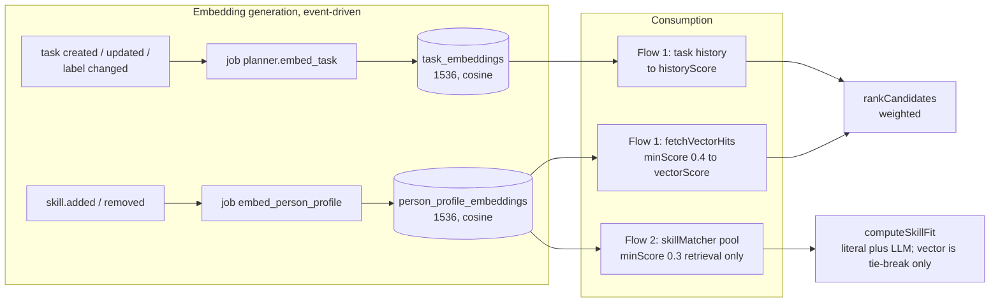

# Skill-Based Task Assignment: Two Flows Compared

**Scope:** The `planner` module has two separate flows that solve the same problem — finding the best-fit person to assign to a task. This document explains both flows in two reading layers:

- **Part 1** is for non-technical readers — plain-language explanation, no code knowledge required.
- **Part 2 onward** is the full technical reference for engineers, preserving the precision of the original design (file paths, formulas, numeric thresholds).

If you just need the gist, Part 1 is enough. If you need to build or maintain the system, keep reading.

---

## Part 1 — Overview for everyone

### The problem

Every task needs an owner. Picking the right person means weighing skills, current workload, timezone, and urgency — something a manager would normally juggle in their head. The system automates this in two different ways, both aimed at the same goal: **suggest (and, after user confirmation, carry out) the assignment of the best-fit person to a task.**

### The two flows, in plain terms

**Flow 1 — "The Formula Calculator" (Assign-by-Skill Workflow)**

You give it one task. It runs a fixed, predictable process: gather everyone with the right skills, filter to who's actually available and not overloaded, run the numbers, and hand back a ranked shortlist for you to approve. Every run follows the exact same steps in the exact same order — nothing is left open to interpretation. That's what makes it fast, cheap, and easy to audit.

**Flow 2 — "The Conversational Assistant" (Assignment Agent)**

You type a request in natural language — "who on the team could build a login page?" or "find someone to fix bug #482." An AI assistant reads the message, figures out what you actually need, and calls on a handful of specialized helpers to look things up, check availability, or answer questions. But when it actually comes time to **propose a specific person**, the assistant doesn't invent its own score — it hands the task back to the same "formula calculator" from Flow 1 to do the scoring. In other words, Flow 2's real value is in understanding the request and orchestrating the right helpers; the actual "who's the best fit" math still runs through the same trusted formula from Flow 1.

### Why have both?

- **Flow 1** is the right choice when a system, a script, or a UI button needs a deterministic, auditable answer for one specific task — no natural-language interpretation required.
- **Flow 2** is the right choice when a person wants to have a conversation about staffing — ask open-ended questions, search loosely, get an explanation — and doesn't always end in an actual assignment.

### At a glance

| | Flow 1 — Formula Calculator | Flow 2 — Conversational Assistant |
|---|---|---|
| What it is | Fixed automated process | Conversational AI assistant |
| Input | A single task ID | A written request, in plain language |
| Output | A ranked shortlist to approve | Answers, lists, or (if asked) a shortlist to approve |
| Predictability | Always the same steps, same math | Varies with the request; can take different paths |
| Speed / cost | Fast, cheap | Slower, more expensive (uses more AI reasoning) |
| Best suited for | System-triggered, single-task assignment | Human-initiated, open-ended staffing questions |
| When it actually has to "score" candidates | Uses its own formula | Calls back into Flow 1's same formula |

---

## Part 2 — Glossary (for readers less familiar with AI-system terminology)

| Term | Plain-language explanation |
|---|---|
| **LLM** (Large Language Model) | A generative AI model (e.g., GPT) capable of understanding and producing natural language. |
| **Agent** | An LLM given the autonomy to decide its next step and call tools to accomplish a task, rather than following a fixed script. |
| **Orchestrator** | The central coordinating agent that decides which tool or sub-agent to call for a given request. |
| **Sub-agent** | A smaller agent responsible for one narrow task (e.g., only extracting skills from text). |
| **Tool-calling** | The mechanism that lets an LLM invoke a specific function or API (a "tool") to fetch data or perform an action. |
| **Deterministic** | Given the same input, always produces exactly the same output — no AI "judgment call" involved. |
| **Embedding (vector)** | A piece of text encoded as a list of numbers (a vector) that captures its semantic meaning, so a machine can compare similarity. |
| **Cosine similarity** | A way of measuring how similar two vectors are — used to find profiles/candidates whose content is semantically close to a task. |
| **pgvector / HNSW** | A PostgreSQL extension for storing and searching embeddings efficiently; HNSW is an index type that speeds up approximate search. |
| **HITL** (Human-in-the-loop) | A suspend point in the flow where the system pauses and waits for explicit user confirmation before performing a write (e.g., an actual assignment). |
| **Reranker** | A step that re-orders an existing ranked list, typically to refine ordering using an additional signal. |

---

## Part 3 — Flow 1: Assign-by-Skill Workflow (deterministic flow)

### 3.1 Overview

This is a **two-step Mastra evented workflow**: `assignBySkill.compute`, followed by `assignBySkill.suggest` (the HITL step). The entire ranking path is deterministic and invokes no LLM on the primary path; scores are computed from a fixed weighted formula.

- Runtime entry point: `assignBySkillWorkflow` (`spec.ts`)
- Core logic: `computeAssigneeSuggestions(input, deps)` (`workflow.ts`)
- Default weights (`workflow.ts`): `{ exact: 0.4, vec: 0.25, load: 0.25, tz: 0.1 }`
- Constants: `PRE_RANK_TOP_K = 10`, `FINAL_TOP_K = 5`

### 3.2 Components

| Component (file) | Function | Input | Output | Technique | LLM? | Embedding? |
|---|---|---|---|---|---|---|
| `loadTask` | Loads the task and its labels | `{ tenantId, taskId }` | `LoadedTask` (title, description, labels[], due_at, priority, etc.) | Drizzle SQL join across `tasks`, `plans`, `labels` | No | No |
| `candidatePool` | Builds the candidate universe, gathering four signals in parallel | `LoadedTask` + `deps` | `{ candidates: PoolCandidate[], requiredSkillCount }` | Parallel calls to People-module tools + an SQL availability gate | No | Yes (indirectly) |
| ├ `fetchExactHits` | Matches on canonical skills | labels and mentions | `{ userId, overlap, matchedSkills[] }` | Tool `people_searchUsersBySkillExact`; identifier equality against `core.skill` | No | No |
| ├ `fetchVectorHits` | Measures person-profile similarity | query text (title, description, labels) | `{ userId, score }[]` | Tool `people_searchUsersBySkillVector` (`topK: 20`, `minScore = 0.4`) | No | Yes (person-profile vector) |
| ├ `fetchTaskHistoryHits` | Identifies users who completed similar tasks | `LoadedTask` + `deps` | `{ userId, historyScore, matches }[]` | `searchTasks` performs a pgvector query with reranking, then maps matched tasks to their assignees | Only if the reranker is `llm-judge` | Yes (task vector) |
| └ SQL availability gate | Filters to currently available users | group members | eligible identifiers | Drizzle SQL on `assigneeProjection`, excluding deactivated and out-of-office users | No | No |
| `preRank` | Applies a low-cost in-memory filter to the top 10 | `PoolCandidate[]` | top 10 | Score = `exactOverlap/denom · 0.5 + max(vec, history) · 0.5` | No | No |
| `enrichWithLoadAndCapacity` | Adds workload, available hours, and timezone for the top 10 | `PoolCandidate[]` | `EnrichedCandidate[]` | Remote-procedure fan-out to `planner_getOpenTaskCountForUser`, `people_getTimezoneForUser`, and `timesheet_getCapacityThisWeek` | No | No |
| `modalTimezone` | Derives a reference timezone | enriched candidates | timezone string (defaults to UTC) | Statistical mode | No | No |
| `rankCandidates` | Produces the final top 5 | `EnrichedCandidate[]` + weights | `CandidateUser[]` (finalScore in [0, 1]) | Normalized weighted sum with a priority boost and an urgency multiplier | No | No |
| `buildSuggestAssigneeCard` | Builds the HITL approval card | candidates + session | `ApprovalCard` | String interpolation | No | No |
| `applyAssignDecision` | Applies the user's decision | decision | `AssignBySkillOutput` (assigned, left-unassigned, or declined) | Sequential calls to `assignTask` | No | No |

### 3.3 The scoring formula (`rank-candidates.ts`)

- **Evidence gate** (`hasSkillEvidence`): a candidate is retained if `exactOverlap > 0` **or** `max(vectorScore, historyScore) ≥ EVIDENCE_FLOOR (0.3)`. Workload and timezone act only as tie-breakers.
- **Formula**: `finalScore = min(1, [w.exact · pri.exact · exact + w.vec · pri.vec · vec + w.load · load + w.tz · tzMult · tz] / normalizer)`
- **Priority boost**: for priority ≤ 3, the exact component is scaled by 1.2 and the vector component by 0.9.
- **Urgency multiplier**: reduces the timezone weight as the due date recedes, reaching 0.2 after 30 days.
- `rationale` is always `null` — this flow generates no LLM explanation.

### 3.4 Flow diagram



---

## Part 4 — Flow 2: Assignment Agent (LLM flow)

### 4.1 Overview

An LLM agent named "Staffing Orchestrator" (a Mastra `Agent` backed by an OpenAI reasoning model) coordinates the flow through tool-calling. Its tools delegate to five sub-agents — some LLM-backed, some deterministic — plus one HITL tool, `assign_proposeAssignment`.

- Entry point: the kernel invokes `planner.assignment-orchestrator` (`orchestrator-spec.ts`), a single step.
- The agent is constructed at `orchestrator.ts` with `maxSteps: 12`, a `TokenLimiterProcessor` capped at 100,000 tokens, `providerOptions.openai.reasoningSummary = 'auto'`, and a wrapping `Mastra(...)` instance so that native-suspend snapshots persist to support resume.
- Streaming and resume are exposed through `makeChatOrchestrationStreamer` and `makeChatOrchestrationResumer` (`register.ts`).
- Per-turn model selection: `pickModel(ctx, fallback) = ctx.model ?? fallback()` (`model.ts`).

### 4.2 How the orchestrator routes (via the system prompt)

The prompt (`orchestrator.ts`, `instructionsText`) opens with "You are a staffing assistant." The primary routing rules are:

- `assign_analyzeTasks` handles the intents `resolve_task_skills`, `extract_named_skills`, and `find_tasks`.
- Finding people, recommending people, and assigning people are treated as distinct branches.
- **"'Assign' is NEVER a direct write it performs — it ALWAYS goes through `assign_proposeAssignment`, which asks the user to confirm."** — this is the flow's most important safety constraint.
- When a request combines finding tasks with recommending people, the orchestrator recommends for at most `RECOMMEND_TASK_CAP = 5` tasks.

### 4.3 The seven orchestration tools (`orchestrator.tools.ts`, `makeOrchestratorTools`)

| Tool | Input | Output | Delegates to | LLM? |
|---|---|---|---|---|
| `assign_analyzeTasks` | `{ intent, query, taskRef, limit? }` | `{ resolvedTaskId, skills?, title?, tasks? }` | `taskAnalyzer.run` | Yes (sub-agent) |
| `assign_matchCandidatesBySkill` | `{ taskId, skills[] }` | `{ taskId, candidates[] }` | `skillMatcher.run` | Indirect (fit fallback) |
| `assign_checkCandidateAvailability` | `{ taskId, candidates[] }` | `{ taskId, availability[] }` | `avaiChecker.run` | No |
| `assign_rankRecommendations` | `{ taskId, skills, candidates, availability }` | `{ taskId, recommendations[] }` | `recommender.run` | No |
| `assign_answerQuestion` | uses `userText` verbatim | `{ answer }` | `generalAnswer.run` | Yes |
| `assign_lookupUserProfile` | `{ name, limit? }` | `{ profiles[] }` | `userProfileLookup.findByName` | No |
| `assign_proposeAssignment` | `{ taskId, title }` | `{ assigned, recommendations? }` | `makeProposeAssignmentTool` (HITL) | No |

### 4.4 The five sub-agents (`agents/`)

| Sub-agent (file) | Function | Technique | LLM? | Embedding? |
|---|---|---|---|---|
| `taskAnalyzer` | Extracts skills or finds tasks by intent | Prefers `task.labels`; falls back to the structured-output LLM helpers `extractSkills` and `extractTags` when labels are empty | Yes (two helpers) | No |
| `skillMatcher` | Retrieves and ranks candidates by skill | `deps.skillSearch.search` (pgvector) unioned with group members, then `computeSkillFit` | Indirect | Yes (person-profile vector) |
| ├ `computeSkillFit` | Assesses fit | Layer 1 is literal string overlap; Layer 2 (`reasonSkillFit`, an LLM call) runs only for candidates with zero overlap | Yes (fallback) | No |
| `avaiChecker` | Scores availability | `STATUS_MULT · 2^(-inProgress/3)`, where available = 1, busy = 0.35, out-of-office = 0 | No | No |
| `recommender` | Produces the final blended score | `blend = 0.7 · relevance + 0.3 · availability`, then sorts | No | No |
| `generalAnswer` | Answers open questions or questions about attached files | LLM prose generation with read-only thread memory; no tools | Yes | No |

**The most important detail in Flow 2:** the HITL tool (`propose-assignment.tool.ts`) **is deterministic**. It runs the recommendation pipeline in code by invoking `suggest`, which calls **Flow 1's** `computeAssigneeSuggestions`, then calls `agent.suspend({ card })` (a Mastra native suspend). On resume, an `approve`, `reject`, or `modify` decision routes to `assign.assign(...)` (the planner `assignTask` function). In other words: **the "who's the best fit" scoring in Flow 2 is not something the agent reasons out on its own — it reuses Flow 1's exact deterministic formula.**

The vector adapter (`adapters.ts`, `makeSkillSearch`) constructs the string `Core competencies include ${skills.join(', ')}.` and calls `matchUsersToTopic({ topic, tenant_id, limit, minScore: 0.3 })` from `@seta/people`, which queries the `person_profile_embeddings` index. The string deliberately mirrors the person-profile embedding format so that the cosine comparison operates over aligned text.

### 4.5 Flow diagram



*Purple denotes an LLM call site; orange denotes an embedding or pgvector operation; green denotes a call back into Flow 1.*

---

## Part 5 — Embeddings: generation and consumption

There is **no dedicated skill-embedding table**. Skills are embedded only indirectly, folded into two larger embedding sources. The "exact" skill-matching branch relies on identifier equality against `core.skill` and is entirely separate from the vector layer.

### 5.1 The two embedding sources

| | Person-profile embedding | Task embedding |
|---|---|---|
| Store | `people_rag.person_profile_embeddings` | `planner_rag.task_embeddings` |
| Dimension, metric, index | 1536, cosine, HNSW (m=16, efConstruction=200) | 1536, cosine, HNSW (m=16, efConstruction=64) |
| Model | `openai/text-embedding-3-small` | as at left |
| Vector identifier | `${tenantId}:${personId}` | `${tenantId}:${taskId}` |
| Used by | Both flows, through `matchUsersToTopic` | Flow 1 only (task history) |

The shared primitives reside in `packages/shared-embeddings`: `resolveEmbeddingProvider()` (`resolve.ts`, which pins 1536 dimensions and reads the `EMBED_MODEL` environment variable), `embedMany()`, and `sourceHash()` (a SHA-256 hash that gates re-embedding).

The repository contains no SQL data-definition statements for vector columns, and no literal `<=>`, `cosineDistance`, or `ivfflat` usage; the only SQL touchpoint is `CREATE EXTENSION vector` (`core/drizzle/migrations/0001…sql`). Tables and HNSW indexes are created at runtime by Mastra's `PgVector.createIndex()`. The cosine computation is encapsulated within `PgVector.query` (`@mastra/pg`) and within the People-module domain function `match-users-to-topic.ts`; it is not written literally at the planner tier.

### 5.2 Source text fed to the model

The person-profile source (`people/…/embeddings/source.ts`, `buildPersonProfileSource`) is generated prose rather than a bare list:

```
{bio} Core competencies include {skill1, skill2, …}. Experienced in {last two skills} with a strong background in {first skill}.
```

If the person has no skills, the source is empty and the vector is deleted.

The task source (`planner/…/embeddings/source.ts`, `buildTaskSource`) is:

```
Title: {title}
Description: {description}   (omitted if empty)
Skills: {label1, label2, …}  (omitted if there are no labels)
```

Structured fields such as priority, due date, and percent complete are deliberately excluded.

### 5.3 Generation triggers

Both sources follow the event → subscriber → graphile-worker job pattern, with a deterministic job key and `'replace'` semantics for debouncing.

- **Person-profile embedding**: the subscriber `people/…/subscribers/refresh-profile.ts` enqueues `embed_person_profile` on the events `people.person.skill.added` and `people.person.skill.removed`. Adding or removing a skill therefore re-embeds that person's profile. The handler `embed-profile.ts` skips the operation when `source_hash` is unchanged and deletes the vector when the profile is empty. Bulk seeding is handled by `backfill-profiles.ts`.
- **Task embedding**: the subscriber `planner/…/subscribers/task-embedding.ts` enqueues `planner.embed_task` when a task is created, when a task is updated only if the title or description changed, when a task is deleted, and when a label is applied or unapplied (skills are modeled as labels, so a label change alters the `Skills:` line). The handler is `embed-task.ts`; the backfill path uses the OpenAI batch API.

### 5.4 How the two flows consume embeddings differently

- **Flow 1** treats the vector as one of four weighted signals. `fetchVectorHits` provides `vectorScore` from person-profile similarity (`minScore = 0.4`), and `fetchTaskHistoryHits` provides `historyScore` from task-vector similarity with reranking. In `rankCandidates`, `vecEvidence = max(vectorScore, historyScore)`, and `EVIDENCE_FLOOR = 0.3` allows a candidate with zero exact overlap to surface if the fuzzy signal is sufficient. → **The vector score directly influences ranking, with no LLM involvement.**
- **Flow 2** uses the vector only to **retrieve the candidate pool**. `skillMatcher` calls `skillSearch.search`, which calls `matchUsersToTopic` against the person-profile index (`minScore = 0.3`) to obtain candidates, unioned with group members. **The final ranking does not use the vector**: `computeSkillFit` combines literal overlap with an LLM reasoning fallback, and `bestSim` serves only as a tie-breaker and as the `confidenceScore`.



---

## Part 6 — Summary comparison table (for engineers)

| | Flow 1 (Workflow) | Flow 2 (Agent) |
|---|---|---|
| Location | `packages/planner/src/backend/workflows/assign-by-skill/` | `packages/planner/src/backend/orchestration/assignment/` |
| Nature | Mastra evented workflow; a **fully deterministic** pipeline | An **LLM agent** (Mastra `Agent`) that orchestrates via tool-calling |
| LLM on the primary ranking path | No (an optional `llm-judge` reranker is swappable) | Yes; the orchestrator and several sub-agents are LLM-backed |
| Primary input | `{ taskId }` for a single task | `{ userText, taskId? }`, a natural-language chat message |
| Output | An approval card plus a ranked candidate list | A multi-branch result: tasks, recommendations, candidates, skills, profiles, a message, or a pending approval |
| Uses embeddings | Yes, from two sources (person-profile vectors and task-history vectors) | Yes, but only to retrieve the candidate pool (person-profile vectors) |
| Person-profile vector | Yes (`minScore = 0.4`, a ranking signal) | Yes (`minScore = 0.3`, retrieval only) |
| Task vector | Yes (task history) | No |
| Exact skill matching | Identifier equality on `core.skill` | Identifier equality on `core.skill` |
| HITL | The `suggest` step suspends | The `assign_proposeAssignment` tool suspends and calls back into Flow 1 |

**Design takeaway:** Flow 2 is not an independent ranking system running in parallel to Flow 1 — it is a **conversational orchestration layer built on top of Flow 1's deterministic engine**, extended with natural-language understanding, open-ended Q&A, and supporting tasks (finding tasks, looking up profiles) that Flow 1 can't handle since Flow 1 only accepts `{ taskId }`.
