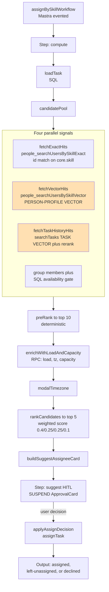
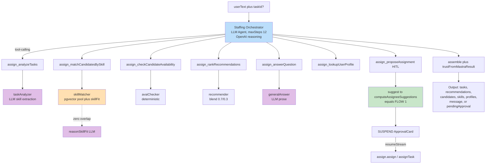
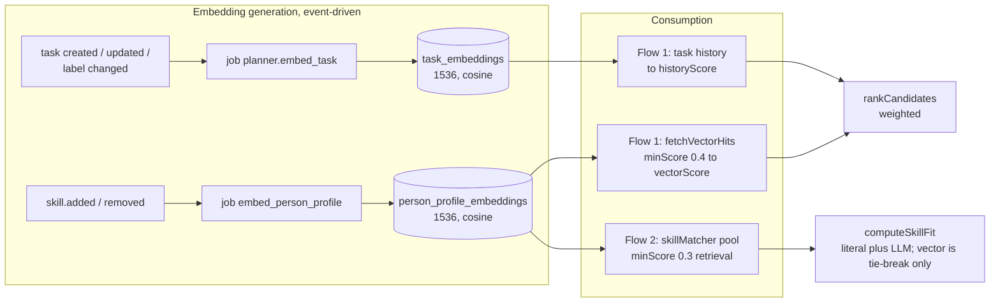

# Two Assignment Flows in the Planner Module

This document describes and distinguishes the two skill-based assignment flows in the `planner` module. The first is the **Assign-by-Skill Workflow**; the second is the **Assignment Agent**. For each flow, this document identifies the constituent components, the input and output of each component, the technique each component applies, and whether it invokes a Large Language Model (LLM). A dedicated section traces where embeddings are used, when they are generated, and their exact format. Human-in-the-loop (HITL) refers to a suspend point at which the workflow pauses for explicit user confirmation before performing a write.

| | Flow 1 — **Assign-by-Skill Workflow** | Flow 2 — **Assignment Agent** |
|---|---|---|
| Location | `packages/planner/src/backend/workflows/assign-by-skill/` | `packages/planner/src/backend/orchestration/assignment/` |
| Nature | Mastra evented workflow; a **fully deterministic** pipeline | An **LLM agent** (Mastra `Agent`) that orchestrates via tool-calling |
| LLM on the primary ranking path | No (an optional `llm-judge` reranker is swappable) | Yes; the orchestrator and several sub-agents are LLM-backed |
| Primary input | `{ taskId }` for a single task | `{ userText, taskId? }`, a natural-language chat message |
| Output | An approval card plus a ranked candidate list | A multi-branch result: tasks, recommendations, candidates, skills, profiles, a message, or a pending approval |
| Uses embeddings | Yes, from two sources (person-profile vectors and task-history vectors) | Yes, but only to retrieve the candidate pool (person-profile vectors) |

The distinction is structural. Flow 1 is a deterministic scoring engine. Flow 2 is an LLM agent that, when it needs to propose an assignee for a single task, invokes Flow 1's engine through the `assign_proposeAssignment` tool, which calls `computeAssigneeSuggestions`.

---

## 1. Assign-by-Skill Workflow (deterministic flow)

### 1.1 Overview

The workflow is a two-step Mastra evented workflow defined in `spec.ts`: `assignBySkill.compute` followed by `assignBySkill.suggest` (the HITL step). The entire ranking path is deterministic and invokes no LLM; scores are computed from a fixed weighted formula.

- Runtime entry point: `assignBySkillWorkflow` (`spec.ts:73`).
- Core logic: `computeAssigneeSuggestions(input, deps)` (`workflow.ts:59`).
- Default weights (`workflow.ts:17-22`): `{ exact: 0.4, vec: 0.25, load: 0.25, tz: 0.1 }`.
- Constants: `PRE_RANK_TOP_K = 10`, `FINAL_TOP_K = 5`.

### 1.2 Components

| Component (file) | Function | Input | Output | Technique | LLM | Embedding |
|---|---|---|---|---|---|---|
| `loadTask` (`steps/load-task.ts:20`) | Loads the task and its labels | `{ tenantId, taskId }` | `LoadedTask` (title, description, labels[], due_at, priority, and related fields) | Drizzle SQL join across `tasks`, `plans`, `labels` | No | No |
| `candidatePool` (`steps/candidate-pool.ts:76`) | Builds the candidate universe and gathers four signals in parallel | `LoadedTask` plus `deps` | `{ candidates: PoolCandidate[], requiredSkillCount }` | Parallel calls to People-module tools plus an SQL availability gate | No | Yes (indirectly) |
| ├ `fetchExactHits` (`:176`) | Matches on canonical skills | labels and mentions | `{ userId, overlap, matchedSkills[] }` | Tool `people_searchUsersBySkillExact`; identifier equality against `core.skill` | No | No |
| ├ `fetchVectorHits` (`:256`) | Measures person-profile similarity | query text (title, description, labels) | `{ userId, score }[]` | Tool `people_searchUsersBySkillVector` (`topK: 20`, `minScore = 0.4`) | No | Yes (person-profile vector) |
| ├ `fetchTaskHistoryHits` (`steps/task-history-hits.ts:34`) | Identifies users who completed similar tasks | `LoadedTask` plus `deps` | `{ userId, historyScore, matches }[]` | `searchTasks` performs a pgvector query with reranking, then maps matched tasks to their assignees | Only if the reranker is `llm-judge` | Yes (task vector) |
| └ SQL availability gate (`:225`) | Filters to currently available users | group members | eligible identifiers | Drizzle SQL on `assigneeProjection`, excluding deactivated and out-of-office users | No | No |
| `preRank` (`workflow.ts:119`) | Applies a low-cost in-memory filter to the top 10 | `PoolCandidate[]` | top 10 | Score = `exactOverlap/denom · 0.5 + max(vec, history) · 0.5` | No | No |
| `enrichWithLoadAndCapacity` (`steps/enrich-with-load-capacity.ts:28`) | Adds workload, available hours, and timezone for the top 10 | `PoolCandidate[]` | `EnrichedCandidate[]` (adds openTaskCount, hoursAvailableThisWeek, timezone) | Remote-procedure fan-out to `planner_getOpenTaskCountForUser`, `people_getTimezoneForUser`, and `timesheet_getCapacityThisWeek` | No | No |
| `modalTimezone` (`steps/rank-candidates.ts:70`) | Derives a reference timezone | enriched candidates | timezone string (defaults to UTC) | Statistical mode | No | No |
| `rankCandidates` (`steps/rank-candidates.ts:117`) | Produces the final top 5 | `EnrichedCandidate[]` plus weights | `CandidateUser[]` (finalScore in [0, 1]) | Normalized weighted sum with a priority boost and an urgency multiplier | No | No |
| `buildSuggestAssigneeCard` (`steps/suggest-assignee.ts:36`) | Builds the HITL approval card | candidates plus session | `ApprovalCard` | String interpolation | No | No |
| `applyAssignDecision` (`workflow.ts:147`) | Applies the user's decision | decision | `AssignBySkillOutput` (assigned, left-unassigned, or declined) | Sequential calls to `assignTask` | No | No |

The ranking formula (`rank-candidates.ts`) operates as follows.

- Evidence gate (`hasSkillEvidence`): a candidate is retained if `exactOverlap > 0` **or** `max(vectorScore, historyScore) ≥ EVIDENCE_FLOOR (0.3)`. Workload and timezone act only as tie-breakers.
- `finalScore = min(1, [w.exact · pri.exact · exact + w.vec · pri.vec · vec + w.load · load + w.tz · tzMult · tz] / normalizer)`.
- The priority boost (for priority ≤ 3) scales the exact component by 1.2 and the vector component by 0.9. The urgency multiplier reduces the timezone weight as the due date recedes, reaching 0.2 after 30 days.
- `rationale` is always `null`; the workflow generates no LLM explanation.

### 1.3 Flow diagram



---

## 2. Assignment Agent (LLM flow)

### 2.1 Overview

An LLM agent named "Staffing Orchestrator" (a Mastra `Agent` backed by an OpenAI reasoning model) coordinates the flow through tool-calling. Its tools delegate to five sub-agents, some LLM-backed and some deterministic, plus one HITL tool, `assign_proposeAssignment`.

- Entry point: the kernel invokes `planner.assignment-orchestrator` (`orchestrator-spec.ts:6`), a single step.
- The agent is constructed at `orchestrator.ts:287` with `maxSteps: 12`, a `TokenLimiterProcessor` capped at 100,000 tokens, `providerOptions.openai.reasoningSummary = 'auto'`, and a wrapping `Mastra(...)` instance so that native-suspend snapshots persist to support resume.
- Streaming and resume are exposed through `makeChatOrchestrationStreamer` and `makeChatOrchestrationResumer` (`register.ts:156`).
- Per-turn model selection: `pickModel(ctx, fallback) = ctx.model ?? fallback()` (`model.ts:7`).

### 2.2 Orchestrator routing via the system prompt

The prompt (`orchestrator.ts:162`, `instructionsText`) opens with "You are a staffing assistant." The primary routing rules are as follows.

- `assign_analyzeTasks` handles the intents `resolve_task_skills`, `extract_named_skills`, and `find_tasks`.
- Finding people, recommending people, and assigning people are treated as distinct branches.
- "'Assign' is NEVER a direct write you perform — it ALWAYS goes through `assign_proposeAssignment`, which asks the user to confirm." (`:218`).
- When a request combines finding tasks with recommending people, the orchestrator recommends for at most `RECOMMEND_TASK_CAP = 5` tasks.

### 2.3 Components

The seven orchestration tools (`orchestrator.tools.ts`, `makeOrchestratorTools:73`) are listed below.

| Tool identifier | Input | Output | Delegates to | LLM |
|---|---|---|---|---|
| `assign_analyzeTasks` | `{ intent, query, taskRef, limit? }` | `{ resolvedTaskId, skills?, title?, tasks? }` | `taskAnalyzer.run` | Yes (sub-agent) |
| `assign_matchCandidatesBySkill` | `{ taskId, skills[] }` | `{ taskId, candidates[] }` | `skillMatcher.run` | Indirect (fit fallback) |
| `assign_checkCandidateAvailability` | `{ taskId, candidates[] }` | `{ taskId, availability[] }` | `avaiChecker.run` | No |
| `assign_rankRecommendations` | `{ taskId, skills, candidates, availability }` | `{ taskId, recommendations[] }` | `recommender.run` | No |
| `assign_answerQuestion` | uses `userText` verbatim | `{ answer }` | `generalAnswer.run` | Yes |
| `assign_lookupUserProfile` | `{ name, limit? }` | `{ profiles[] }` | `userProfileLookup.findByName` | No |
| `assign_proposeAssignment` | `{ taskId, title }` | `{ assigned, recommendations? }` | `makeProposeAssignmentTool` (HITL) | No |

The five sub-agents (`agents/`) are listed below.

| Sub-agent (file) | Function | Technique | LLM | Embedding |
|---|---|---|---|---|
| `taskAnalyzer` (`task-analyzer.ts:124`) | Extracts skills or finds tasks by intent | Prefers `task.labels`; falls back to the structured-output LLM helpers `extractSkills` and `extractTags` when labels are empty | Yes (two helpers) | No |
| `skillMatcher` (`skill-matcher.ts:69`) | Retrieves and ranks candidates by skill | `deps.skillSearch.search` (pgvector) unioned with group members, then `computeSkillFit` | Indirect | Yes (person-profile vector) |
| ├ `computeSkillFit` (`skill-fit.ts:109`) | Assesses fit | Layer 1 is literal string overlap; Layer 2 (`reasonSkillFit`, an LLM call) runs only for candidates with zero overlap | Yes (fallback) | No |
| `avaiChecker` (`avai-checker.ts:27`) | Scores availability | `STATUS_MULT · 2^(-inProgress/3)`, where available = 1, busy = 0.35, out-of-office = 0 | No | No |
| `recommender` (`recommender.ts:34`) | Produces the final blended score | `blend = 0.7 · relevance + 0.3 · availability`, then sorts | No | No |
| `generalAnswer` (`general-answer.ts:27`) | Answers open questions or questions about attached files | LLM prose generation with read-only thread memory; no tools | Yes | No |

The HITL tool (`propose-assignment.tool.ts:59`) is deterministic. It runs the recommendation pipeline in code by invoking `suggest`, which calls Flow 1's `computeAssigneeSuggestions`, then calls `agent.suspend({ card })` (a Mastra native suspend). On resume, an `approve`, `reject`, or `modify` decision routes to `assign.assign(...)` (the planner `assignTask` function). The card is built in `approval-card.ts:28` and deliberately sets `meta.toolId = 'planner_proposeAssignment'` so that the decide endpoint routes to the correct planner decider.

The vector adapter (`adapters.ts:86`, `makeSkillSearch`) constructs the string `Core competencies include ${skills.join(', ')}.` and calls `matchUsersToTopic({ topic, tenant_id, limit, minScore: 0.3 })` from `@seta/people`, which queries the `person_profile_embeddings` index. The string deliberately mirrors the person-profile embedding format so that the cosine comparison operates over aligned text.

### 2.4 Flow diagram



Purple denotes an LLM call site; orange denotes an embedding or pgvector operation; green denotes a call back into Flow 1.

---

## 3. Embeddings: generation and format

There is no dedicated skill-embedding table. Skills are embedded only indirectly, folded into two larger embedding sources. The "exact" skill-matching branch relies on identifier equality against `core.skill` and is entirely separate from the vector layer.

### 3.1 The two embedding sources

| | Person-profile embedding | Task embedding |
|---|---|---|
| Store | `people_rag.person_profile_embeddings` | `planner_rag.task_embeddings` |
| Dimension, metric, index | 1536, cosine, HNSW (m = 16, efConstruction = 200) | 1536, cosine, HNSW (m = 16, efConstruction = 64) |
| Model | `openai/text-embedding-3-small` (recorded as `model_id = "openai:text-embedding-3-small"`) | as at left |
| Vector identifier | `${tenantId}:${personId}` | `${tenantId}:${taskId}` |
| Used by | both flows, through `matchUsersToTopic` | Flow 1 only (task history) |

The shared primitives reside in `packages/shared-embeddings`: `resolveEmbeddingProvider()` (`resolve.ts`, which pins 1536 dimensions and reads the `EMBED_MODEL` environment variable), `embedMany()`, and `sourceHash()` (a SHA-256 hash that gates re-embedding).

The repository contains no SQL data-definition statements for vector columns and no literal `<=>`, `cosineDistance`, or `ivfflat` usage; the only SQL touchpoint is `CREATE EXTENSION vector` (`core/drizzle/migrations/0001…sql:3`). Tables and HNSW indexes are created at runtime by Mastra's `PgVector.createIndex()`. The cosine computation is encapsulated within `PgVector.query` in `@mastra/pg` and within the People-module domain function `match-users-to-topic.ts:65`; it is not written literally at the planner tier.

### 3.2 Source text fed to the model

The person-profile source (`people/…/embeddings/source.ts:6`, `buildPersonProfileSource`) is generated prose rather than a bare list:

```
{bio} Core competencies include {skill1, skill2, …}. Experienced in {last two skills} with a strong background in {first skill}.
```

If the person has no skills, the source is empty and the vector is deleted.

The task source (`planner/…/embeddings/source.ts:16`, `buildTaskSource`) is:

```
Title: {title}
Description: {description}   (omitted if empty)
Skills: {label1, label2, …}  (omitted if there are no labels)
```

Structured fields such as priority, due date, and percent complete are deliberately excluded.

### 3.3 Generation triggers

Both sources follow the event → subscriber → graphile-worker job pattern, with a deterministic job key and `'replace'` semantics for debouncing.

The person-profile embedding is the source queried by both assignment flows.

- The subscriber `people/…/subscribers/refresh-profile.ts` enqueues `embed_person_profile` on the events `people.person.skill.added` and `people.person.skill.removed`. Adding or removing a skill therefore re-embeds that person's profile.
- The handler `embed-profile.ts:23` skips the operation when `source_hash` is unchanged and deletes the vector when the profile is empty. Bulk seeding is handled by `backfill-profiles.ts`.

The task embedding is generated as follows.

- The subscriber `planner/…/subscribers/task-embedding.ts` enqueues `planner.embed_task` when a task is created, when a task is updated only if the title or description changed, when a task is deleted, and when a label is applied or unapplied. Skills are modeled as labels, so a label change alters the `Skills:` line.
- The handler is `embed-task.ts:33`; the backfill path uses the OpenAI batch API.

### 3.4 How the two flows consume embeddings

- Flow 1 (Assign-by-Skill) treats the vector as one of four weighted signals. `fetchVectorHits` provides `vectorScore` from person-profile similarity (`minScore = 0.4`), and `fetchTaskHistoryHits` provides `historyScore` from task-vector similarity with reranking. In `rankCandidates`, `vecEvidence = max(vectorScore, historyScore)`, and `EVIDENCE_FLOOR = 0.3` allows a candidate with zero exact overlap to surface if the fuzzy signal is sufficient. The vector score therefore influences ranking directly, without any LLM involvement.
- Flow 2 (Assignment Agent) uses the vector only to retrieve the candidate pool. `skillMatcher` calls `skillSearch.search`, which calls `matchUsersToTopic` against the person-profile index (`minScore = 0.3`) to obtain candidates, unioned with group members. The final ranking does not use the vector: `computeSkillFit` combines literal overlap with an LLM reasoning fallback, and `bestSim` serves only as a tie-breaker and as the `confidenceScore`.



---

## 4. LLM and embedding summary

| | Flow 1 (Workflow) | Flow 2 (Agent) |
|---|---|---|
| LLM on the primary path | No | Yes (orchestrator, taskAnalyzer, generalAnswer, and the skill-fit fallback) |
| Optional LLM | `llm-judge` reranker (swappable) | Not applicable |
| Person-profile vector | Yes (`minScore = 0.4`, a ranking signal) | Yes (`minScore = 0.3`, retrieval only) |
| Task vector | Yes (task history) | No |
| Exact skill matching | Identifier equality on `core.skill` | Identifier equality on `core.skill` |
| HITL | The `suggest` step suspends | The `assign_proposeAssignment` tool suspends and calls back into Flow 1 |
