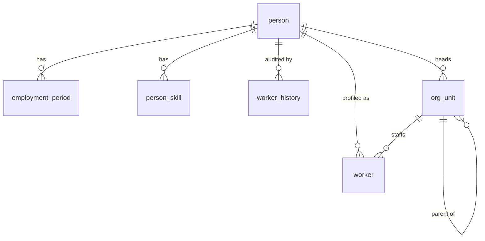
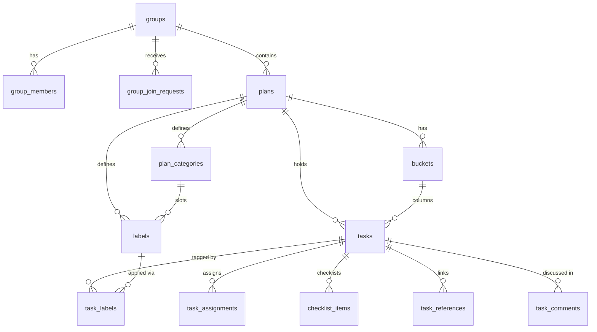
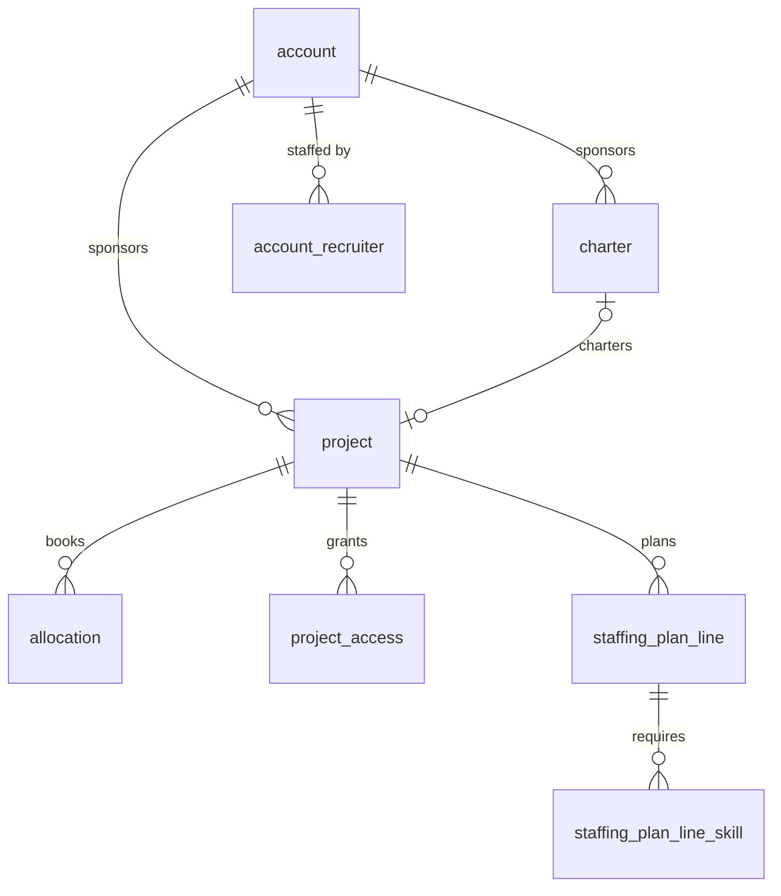
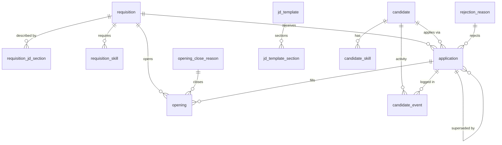
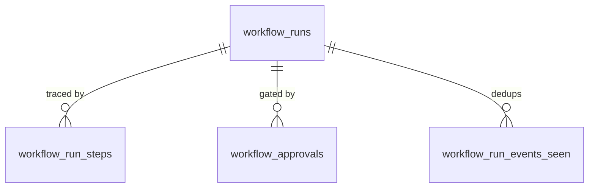

# Database design — constitution and schema map

This document describes the database as it exists. The authoritative source is the code: each module's Drizzle `schema.ts` plus its one hand-written baseline SQL file define every table, column, and constraint. This page is the map over that code — read it to understand the shape of the whole database and the rules every schema obeys; read the schema files for exact column-level truth.

- **Authoritative DDL for a standalone review DB** (DBeaver, offline inspection): [`review-schema.sql`](./review-schema.sql), regenerated from a freshly migrated dev database by [`scripts/dev/dump-review-schema.sh`](../../scripts/dev/dump-review-schema.sh). Populate it with sample data using `pnpm db:seed`.
- **The event/integration backbone** — how modules talk without sharing tables — is [`ddd-design.md`](./ddd-design.md).

The database holds ten module schemas: `core`, `identity`, `people`, `hiring`, `pm`, `planner`, `knowledge`, `agent`, `integrations`, `notifications`. Better-auth owns five tables inside `identity` (`user`, `session`, `account`, `verification`, `rate_limit`); everything else is authored here.

---

## 1. The DB constitution

These rules are binding on every schema and are enforced by CI (`pnpm lint:db`, the drizzle drift check, `lint:raw-sql`), not by review vigilance.

### Tenancy and row-level security

Every tenant-owned table carries `tenant_id uuid NOT NULL` — parent, child, and join tables alike — and has **row-level security enabled and FORCED** with one uniform policy:

```sql
USING (tenant_id = NULLIF(current_setting('app.tenant_id', true), '')::uuid)
WITH CHECK (tenant_id = NULLIF(current_setting('app.tenant_id', true), '')::uuid)
```

`shared-db` sets the `app.tenant_id` GUC transaction-locally (`SET LOCAL`) — from session scope on an HTTP request, from the event's `tenant_id` inside a subscriber transaction. The application still writes an explicit `WHERE tenant_id = …` on every query; RLS is the backstop for a missed filter, not the filter itself.

The **connection-role split** decides where that backstop bites. The web pool connects as `seta_app`, a non-superuser role without `BYPASSRLS`, so a user-facing query that forgets its tenant filter returns nothing rather than leaking. The worker pool and the migration runner keep the admin connection, because dispatcher drain, the mailer scan, and retention deletes are legitimately cross-tenant maintenance. Set `DATABASE_APP_URL` for the app role; it falls back to `DATABASE_URL` for simple self-host, where the backstop is then inert.

A small **global-table allowlist** is the only set exempt from `tenant_id` + RLS, because each is infrastructure that is read or drained across tenants: `core.tenants`, `core.events`, `core.outgoing_emails`, the four `core.subscription_*` tables, `core.rpc_idempotency`, `core.__platform_migrations`, and the better-auth / login-throttle tables `identity.session`, `identity.account`, `identity.verification`, `identity.rate_limit`, `identity.failed_login_attempts`, `identity.failed_login_alerts_sent`.

Every unique constraint on a tenant-scoped table **leads with `tenant_id`** (or names it in a partial predicate's key). External-link uniqueness is `(tenant_id, external_source, external_id)`; `knowledge.files.s3_key` is unique per tenant against a tenant-prefixed key.

Mastra owns its own tables (`mastra_threads`, `mastra_messages`, spans, snapshots) and we cannot add columns or policies to them. All access goes through one tenant-checking repository that enforces the `resourceId` contract; spans and snapshots are reachable only after resolving a run through the RLS-protected `agent.workflow_runs`. A lint rule bans `mastra_` table references outside that repository.

### Integrity

**Intra-schema foreign keys are mandatory** on every parent link, each with an explicit `ON DELETE`: `CASCADE` for owned children (assignments, sections, skills-of, steps, chunks), `RESTRICT` (the default) for references to taxonomy or template rows. **Cross-schema references stay bare `uuid` with no foreign key** — consistency across schemas is event-driven, never enforced by the database (see §3).

One enum style: the `shared-db` helper `textEnum(column, values)` emits both the Drizzle `{ enum }` type and a `CHECK` constraint from a single definition. There are no bare-text status columns and no integer-coded enums; `tasks.priority` and `tasks.progress` are `textEnum` columns, not numbers.

Polymorphic columns carry implication `CHECK`s: `role_assignments` ties `scope_kind` to `scope_id` (org_unit ⇔ non-null), `knowledge.files` ties `origin = 'chat'` to a non-null `thread_id`, `hiring.application` requires exactly one of `candidate_id` / `worker_id`.

Every mutable table has `created_at` / `updated_at timestamptz NOT NULL DEFAULT now()`, with `updated_at` maintained by a shared trigger installed in each baseline, and a `version integer NOT NULL DEFAULT 1` optimistic-concurrency column; the guarded-UPDATE recipe (`… WHERE id = $1 AND version = $2`) is the app-side write contract. Append-only tables (`worker_history`, `candidate_event`, `core.events`) carry `created_at` only. `deleted_at timestamptz` is the single soft-delete idiom; domain lifecycle timestamps (`revoked_at`, `unlinked_at`, `closed_at`, `suspended_at`) remain as explicit state modeling, documented as lifecycle, not deletion.

Money and effort columns are explicit `numeric(p,s)` with range `CHECK`s (`budget_bmm`/`effort_mm`/`source_cost numeric(15,4)`, `planned_pct` bounded 0–100, `weekday_mask` 0–127, `confidence_score` 0–1). Actor ids are `uuid` everywhere.

### Projections (read-models)

A projection is a local read-model of another module's data, maintained by a subscriber. One convention governs all of them: the table name ends `_projection`, it carries `tenant_id` and `updated_at`, it is keyed by the source aggregate's id, and the source module is documented in the schema file. Idempotency is central — `core.subscription_processed` (composite PK `subscription, event_id`) records what each subscriber has consumed, so projections carry no per-row event id. **Every projector must rebuild from `core.events` alone**, and a testcontainers test per projection verifies that replay reconstructs the same rows.

### Lifecycle and retention

Every table declares a lifecycle class in the `shared-db` registry (`packages/shared-db/src/lifecycle.ts`), one of `permanent`, `ttl(column, period)`, `partition-drop(period)`, or `custom(run)`. One shared graphile-worker retention job (`retention_tick`) walks the registry on a cadence and executes each policy — TTL deletes in bounded `ctid` batches, partition-drop detaches and drops range children past the horizon (failing closed on any unparseable bound). See §6 for the full registry.

### Migrations

Each module is squashed to **one generated baseline** (from `schema.ts`) plus **one hand-written SQL file** for what Drizzle cannot model: extensions, `core.events` range partitioning, the `updated_at` trigger install, RLS enable + policies, `EXCLUDE USING gist` / `btree_gist`, `knowledge.chunks` LIST partitioning, and the `search_tsv` generated column. Each hand-written file opens with a one-line comment naming the limitation. CI enforces unique numeric prefixes per module and a regenerate-and-diff drift check (`schema.ts` → codegen → no diff against the committed baseline). The custom runner (`shared-db/migrate.ts`, filename-lexical and checksummed) applies them; drizzle journals are unused.

Two CI ratchets keep the constitution from eroding: `pnpm lint:db` (`scripts/lint/lint-db.mjs`) scans every `schema.ts` for missing `tenant_id`, missing `created_at`, inline text-enums, and non-tenant-led uniques, diffing against a shrink-only baseline (`scripts/lint/lint-db-baseline.json`) that holds the few deliberate exceptions — junction and projection tables whose timestamps live on the source row, and person/plan-scoped uniques. The drift check re-runs codegen for all ten modules listed in `scripts/lint/db-drift-modules.json`.

---

## 2. Per-schema table inventories

### `core` — platform kernel

The event bus, the outbox, cross-module reference data, and platform bookkeeping. `core` is the only schema whose subscriber/audit code may read across module boundaries.

| Table | Purpose | Notes |
|---|---|---|
| `events` | The transactional outbox and audit log in one. Every state change commits a row here in the same transaction. | Range-partitioned by `occurred_at` (monthly children); PK `(id, occurred_at)`; `payload`/`actor`/`before`/`after` jsonb; a deferred `pg_notify` trigger wakes subscribers. Global (no RLS). |
| `audit_v` | View over `events WHERE actor IS NOT NULL` exposing `event_id, occurred_at, tenant_id, event_type, aggregate_*, actor, payload, before, after, trace_id`. | The official audit surface; app-side RBAC gates reads. There is no separate `audit_log` table. |
| `tenants` | The tenant registry: `slug`, `email_domains[]`, `idle_timeout_days`, `local_password_disabled`, `suspended_at`. | Global root table; caller-supplied `id`. |
| `skill_category` / `skill` | The two-level tenant skill taxonomy. `skill.category_id` FKs `skill_category`. | Unique `(tenant_id, name)` at each level. Referenced by bare `skill_id` from people/hiring/pm skill caches. |
| `outgoing_emails` | Transactional email outbox scanned by the mailer worker: `dedupe_key`, `template`, `to_address`, `transport_kind`, `status`, `attempts`. | Global (mailer scans cross-tenant); unique `(tenant_id, dedupe_key)`; partial index on `status = 'pending'`. |
| `subscription_cursors` | Per-subscription watermark `(last_processed_occurred_at, last_processed_event_id)` for tuple-ordered advancement. | Global. |
| `subscription_processed` | Central idempotency ledger, PK `(subscription, event_id)`. | Global; trimmed below every cursor by retention. |
| `subscription_dead_letter` | Events a subscriber failed on past retry: `attempts`, `last_error`, `payload`. | Global; 90-day TTL. |
| `subscription_failure_state` | Current back-off state per subscription (`attempts`, `next_retry_at`). | Global. |
| `rpc_idempotency` | Dedup for public-surface RPC calls, keyed by `idempotency_key`. | Global; 30-day TTL. |
| `session_scope_cache` | Materialized RBAC scope per session (`role_summary`, `cross_tenant_read`), invalidated on role change. | Global; invalidated rows hard-deleted after 7 days. |
| `__platform_migrations` | The custom runner's applied-migration ledger (checksums). | Global bookkeeping. |

### `identity` — auth, RBAC, access groups

Authentication and access control. Better-auth owns `user`, `session`, `account`, `verification`, `rate_limit`; the rest is authored here. Identity enforces access but is not the system of record for the human — that is `people` (see §3).

| Table | Purpose | Notes |
|---|---|---|
| `user` | Better-auth principal: `email`, `name`, `tenant_id`, `deactivated_at`. | Per-tenant email uniqueness on live rows. |
| `session` / `account` / `verification` / `rate_limit` | Better-auth session, credential, verification-token, and rate-limit tables. | Global (allowlisted); keys tenant-prefixed at the call site. |
| `role_assignments` | A user's role at a scope: `role_slug`, `scope_kind` (`tenant`/`org_unit`/`self`), `scope_id uuid`. | `CHECK` ties org_unit ⇔ non-null `scope_id`; partial unique on live (`revoked_at IS NULL`) assignments. |
| `role_permission_overlays` | Per-tenant grant/revoke deltas on a role's permission set. | PK `(tenant_id, role_slug, permission_key)`. |
| `access_group` / `access_group_membership` / `access_group_role` | Named groups of users that carry role bundles. `access_group_role` widens the PK to `(tenant_id, group_id, role_slug, scope_kind, scope_id)` so a group holds one role at several scopes (nil-uuid sentinel for whole-scope grants). | Membership is a tenant-led junction. |
| `product_grant` | Grants a product to a tenant, group, or user (`subject_type`/`subject_id`, `effect`). | Unique `(tenant_id, subject_type, subject_id, product_id)`. |
| `tenant_sso_providers` | Per-tenant SSO enablement/consent. `entra_tenant_id` is projected in from integrations. | PK `(tenant_id, provider_id)`. |
| `failed_login_attempts` / `failed_login_alerts_sent` | Login-throttle and alert de-dup. | Global; 90-day TTL. |
| `person_projection` | Read-model of the person (name, work email, job title, employment status) for RBAC and admin screens. | Source: `people` worker events. |
| `org_unit_projection` | Read-model of the org tree (`parent_id`, `name`). | Source: `people` org_unit events. |

### `people` — the system of record for the human

`people` owns the worker as a domain entity; identity holds only the auth account. `person` is the durable human, `worker` the employment-facing profile, `employment_period` the lifecycle state machine.

| Table | Purpose | Notes |
|---|---|---|
| `person` | The durable person; optional `user_id` links to an auth account. | `version`; index on `(tenant_id, user_id)`. |
| `employment_period` | One row per employment stint; `lifecycle_stage` is the single state machine (`preboarding` → `active` → `alumni`, etc.). | Unique `(tenant_id, person_id, seq)`; partial unique "one open period" per person. FK → `person`. |
| `worker` | Employment profile: `full_name`, `employee_no`, `work_email`, `job_title`, `availability_status`, `work_start`/`work_end`, `timezone`, `org_unit_id`. | FK → `person`; FK → `org_unit`. Live-row uniques on email and employee_no; `deleted_at` soft-delete. |
| `org_unit` | The org tree: `parent_id` (self-FK), `kind`, `head_worker_id` (FK → `person`). | Acyclicity is a domain recursive-CTE check, not a trigger. |
| `person_skill` | A person's skills with `level` (0–5). `skill_id` → `core.skill`; `skill_name` is a refreshed cache. | Unique `(tenant_id, person_id, skill_id)`; FK → `person`. |
| `worker_history` | Append-only field-change audit (`action`, `field`, `from_val`, `to_val`, `by_user_id`). | FK → `person` CASCADE; `created_at`-class only. |
| `worker_allocation_projection` | Read-model of a worker's allocations for utilization screens. | Source: `pm` allocation events. Keyed by `allocation_id`. |
| `account_projection` / `project_projection` | Read-models of pm accounts and projects for people-side joins. | Source: `pm` account/project events. |

### `hiring` — requisitions, candidates, pipeline

Requisitions carry first-class openings; candidates flow through applications. Job-description text and close/rejection reasons are normalized into their own tables.

| Table | Purpose | Notes |
|---|---|---|
| `requisition` | A hiring request: `title`, `account_id`, `kind`, `approval_status`, `status`, `stage`, `owner_user_id`. | Indexed by `(status, stage)` and account. |
| `opening` | One fillable seat under a requisition (`seq`, `status`), linking its close reason and hired application. | FKs → `requisition`, `opening_close_reason`, `application` (hired). Unique `(tenant_id, requisition_id, seq)`. |
| `opening_close_reason` / `rejection_reason` | Tenant-editable reason taxonomies (`label`, `active`, `category`). | Unique `(tenant_id, label)`. |
| `requisition_jd_section` / `jd_template` / `jd_template_section` | JD body per `(variant, section)` on a requisition, and reusable templates. | Tenant-led composite PKs; sections FK their parent CASCADE. |
| `requisition_skill` | Required skills for a requisition (`skill_id` → `core.skill`, `min_level`). | Tenant-led PK; FK → `requisition` CASCADE. |
| `candidate` | An external person in the pipeline: `contact` jsonb, `cv_storage_key`, `source_cost`, `gender`. | `deleted_at`; indexed by `(tenant_id, created_at)`. |
| `candidate_skill` | Candidate skills (`skill_id` → `core.skill`, `level`). | Tenant-led PK; FK → `candidate` CASCADE. |
| `candidate_event` | Append-only candidate activity feed (`kind`, `summary`, `detail`, `actor_user_id`). | FK → `candidate` CASCADE, optional FK → `application`. |
| `application` | A candidate's or worker's application to a requisition (`kind`, `stage`, `status`, `rating`, `tags`). | Exactly one of `candidate_id`/`worker_id` (`CHECK`); self-FK `superseded_by_application_id`; FK → `requisition`, `candidate`, `rejection_reason`. Live-row uniques per subject. |

### `pm` — accounts, projects, allocations, charters

Delivery structure: accounts and projects, the resource allocations against them, project charters through a two-stage governance flow, and the per-project staffing plan.

| Table | Purpose | Notes |
|---|---|---|
| `account` | A client account (`name`, `industry`, `am_worker_id`). | `version`; indexed by tenant. |
| `project` | A delivery project: `account_id`, `objective`, `budget_bmm`, `phase`, `status`, `methodology`, `pricing_model`, `planner_group_id`, `org_unit_id`. | FK → `account`; FK → `charter` (`set null`). `deleted_at`. |
| `charter` | The project charter through `submitted → pmo_approved → approved` (or `rejected`/`withdrawn`), with PMO and BoD sign-off columns. | FK → `account`; FK → `project` (`set null`). |
| `account_recruiter` | Recruiters assigned to an account. | Unique `(tenant_id, account_id, recruiter_worker_id)`; FK → `account` CASCADE. |
| `allocation` | A worker's booking to a project (or an open placeholder): `worker_id`, `task_id`, `bucket`, `planned_pct`, `weekday_mask`, `status`. | FK → `project`. `CHECK`s bind status↔worker and bound `planned_pct`/`weekday_mask`. Partial uniques for open placeholders. Overlaps are legitimate (no exclusion constraint). |
| `project_access` | Per-worker access level on a project (`owner`/`edit`/`view`). | Unique `(tenant_id, project_id, worker_id)`; FK → `project` CASCADE. |
| `staffing_plan_line` / `staffing_plan_line_skill` | Planned roles on a project and the skills each needs (`skill_id` → `core.skill`, `min_level` 0–5). | Lines FK → `project` CASCADE; skills FK → line CASCADE, tenant-led PK. |
| `worker_projection` | Read-model of worker name/title for pm-side joins. | Source: `people` worker events. |

### `planner` — groups, plans, boards, tasks

The task-management module, structured for two-way M365 Planner sync: most tables carry `external_source`/`external_id`/`external_etag`/`sync_status`.

| Table | Purpose | Notes |
|---|---|---|
| `groups` | A team space (`theme`, `visibility`, optional `account_id` → `pm.account`). | Live-row unique name per tenant; external-link unique. |
| `group_members` / `group_join_requests` | Membership (`role`) and pending join requests (`status`). | Tenant-led composite PKs; FK → `groups` CASCADE. `user_id` → `identity.user` (bare). |
| `plans` | A plan inside a group. | FK → `groups`; external-link unique; `sync_status`. |
| `plan_categories` | Named category slots (1–25) for a plan, one row per slot. | PK `(tenant_id, plan_id, slot)`; FK → `plans` CASCADE; FK target for `labels`. |
| `buckets` | Board columns within a plan (`order_hint`). | FK → `plans` CASCADE. |
| `tasks` | The task: `priority`/`progress` textEnums, `due_at`, `order_hint`, `review_state`, plus a `search_tsv` generated tsvector with a GIN index. | FK → `plans`, FK → `buckets` (`set null`). Many partial live-row indexes. |
| `task_assignments` | Assignees on a task. | PK `(task_id, user_id)`; FK → `tasks` CASCADE. `user_id` → `identity.user` (bare). |
| `checklist_items` / `task_references` / `task_comments` | A task's checklist, attached reference links (`type`), and comment thread (`author_id`, `body` bounded 1–4000). | FK → `tasks` CASCADE. |
| `labels` / `task_labels` | Plan-scoped labels (optionally bound to a `category_slot`) and their task assignments. | `labels` FK → `plans` CASCADE and composite FK → `plan_categories`; `task_labels` PK `(tenant_id, task_id, label_id)`. |
| `assignee_projection` | Read-model of a user as an assignment candidate (`skills[]`, `availability_status`, `timezone`). | Sources: `identity.user` + `people` worker events. Keyed by `user_id`. |

### `knowledge` — files and chunks

| Table | Purpose | Notes |
|---|---|---|
| `files` | An uploaded file: `s3_key`, `status`, `scan_status`, `origin` (`knowledge_base`/`chat`), optional `thread_id`. | `CHECK` ties `origin = 'chat'` ⇔ non-null `thread_id`; unique `(tenant_id, s3_key)` and `(tenant_id, id)` (the latter is the chunks FK target). |
| `chunks` | Extracted text chunks (`chunk_ordinal`, `chunk_text`, `page_hint`). | LIST-partitioned by `tenant_id`; composite FK → `files (tenant_id, id)`. No embeddings until M3. |

### `agent` — Mastra runtime and workflow orchestration

The agent engine's persistence: workflow runs (including relocated assignment-orchestration), their steps and approvals, and per-tenant AI settings. Mastra's own `mastra_*` tables sit alongside, reached only through the containment repository.

| Table | Purpose | Notes |
|---|---|---|
| `workflow_runs` | One orchestration/workflow run (`workflow_id`, `status`, `state`, `result`, `source_event_id`, timing). | PK `run_id`; unique `(tenant_id, source_event_id)`; indexed by `(tenant, status, started_at)`. |
| `workflow_run_steps` | Per-step reasoning trace, evidence citations, and `confidence_score` (0–1). | PK `(tenant_id, run_id, step_id)`; FK → `workflow_runs` CASCADE. |
| `workflow_approvals` | A HITL approval on a run step: `proposed_payload`, approver, `status`, decision, `expires_at`. Carries the Mastra agentic-resume handles (`mastra_run_id`, `tool_call_id`) that distinguish chat HITL from evented-workflow approvals. | FK → `workflow_runs` CASCADE; unique `(run_id, step_id)`; sweeper index on pending/`expires_at`. |
| `workflow_run_events_seen` | Per-run dedup of consumed event sequence numbers. | PK `(run_id, event_seq)`; FK → `workflow_runs` CASCADE. |
| `tenant_settings` | Per-tenant AI tuning: dedup weights/thresholds, assignment weights, `approval_ttl_hours`. | PK `tenant_id`. |
| `rate_limits` | Per-user token/turn windows for chat throttling. | PK `(tenant_id, user_id, window_start)`; expired windows swept. |

### `integrations` — Microsoft 365

Sole author of the tenant↔Entra linkage and the M365 Planner sync bookkeeping; emits events that identity and planner project from. Secrets are stored as `EncryptedBlob` jsonb.

| Table | Purpose | Notes |
|---|---|---|
| `m365_tenant_config` | Per-tenant Entra app registration (`entra_tenant_id`, `client_id`, encrypted secret). | PK `tenant_id`. Source of `identity.tenant_sso_providers.entra_tenant_id`. |
| `m365_group_links` / `m365_plan_links` | Live links from a planner group/plan to its M365 counterpart, with delta/sync state (`sync_status`, `unlinked_at`). | Live-row uniques on both internal and external ids. |
| `m365_subscriptions` | Graph change-notification subscriptions (`resource`, `expiration_at`, `client_state_hmac`). | Unique `(tenant_id, resource)`. |
| `m365_resource_etags` | Per-resource ETag cache under a plan link (`resource_type`, `platform_id`, `external_id`, `etag`). | FK → `m365_plan_links` CASCADE. |
| `mail_transport_config` | Per-tenant outbound mail transport (`graph`/`smtp`, encrypted SMTP config). | PK `tenant_id`. |

### `notifications` — in-app feed and channel preferences

Kept separate from `core.outgoing_emails` (in-app feed vs. transactional email), but `notification_prefs` is the single channel-preference surface both consult.

| Table | Purpose | Notes |
|---|---|---|
| `notifications` | A user's in-app notification (`event_type` free text, `source_event_id`, `payload`, `read_at`, `dismissed_at`). | Dedup unique `(tenant_id, source_event_id, user_id)`; partial unread index; 180-day TTL. |
| `notification_prefs` | Per-tenant channel preference (`in_app`/`email`) per event type. | PK `(tenant_id, event_type, channel)`. |

---

## 3. Cross-module reference map

Cross-schema links are **bare `uuid` columns with no foreign key**. The database never enforces them; the owning module keeps them consistent by subscribing to the target module's events (§4). These are the reference targets that recur across schemas:

| Target aggregate | Referenced by (representative bare-uuid columns) |
|---|---|
| `identity.user` | `people.person.user_id`, `people.worker_history.by_user_id`, `knowledge.files.uploaded_by`, `notifications.notifications.user_id`, `core.session_scope_cache.user_id`, and every planner authorship/assignee column (`created_by`, `task_assignments.user_id`, `task_comments.author_id`, `group_members.user_id`, …), plus actor columns in `hiring` (`owner_user_id`, `actor_user_id`), `pm` (`submitted_by_user_id`, `decided_by_user_id`, `pmo_signed_off_by_user_id`), and `agent` (`started_by`, `approver_user_id`, `decided_by`). |
| `people.worker` | `pm.account.am_worker_id`, `pm.project.pm_worker_id`/`pmo_worker_id`, `pm.charter.pm_worker_id`/`pmo_worker_id`, `pm.account_recruiter.recruiter_worker_id`, `pm.allocation.worker_id`, `pm.project_access.worker_id`, `pm.worker_projection.worker_id`, `hiring.application.worker_id`. |
| `core.skill` | `people.person_skill.skill_id`, `hiring.requisition_skill.skill_id`, `hiring.candidate_skill.skill_id`, `pm.staffing_plan_line_skill.skill_id`. Each pairs the id with a refreshed `skill_name` cache, kept honest by the `core.skill.renamed` event. |
| `pm.account` | `planner.groups.account_id`, `hiring.requisition.account_id`, `people.account_projection` (id). |
| `pm.project` | `people.project_projection` / `people.worker_allocation_projection.project_id`. |
| `pm.allocation` | `people.worker_allocation_projection.allocation_id` (its PK). |
| `planner.groups` | `pm.project.planner_group_id`. |
| `planner.tasks` | `pm.allocation.task_id`. |
| `people.org_unit` | `pm.project.org_unit_id`, `identity.org_unit_projection` (id). |
| resource request | `hiring.opening.resource_request_id` and `pm.allocation.resource_request_id` share the open-demand handle that links a hiring opening to its placeholder allocation. |

---

## 4. Projection census

Every read-model, its source, and the replay contract. Each projector is idempotent through `core.subscription_processed` and must rebuild from `core.events` alone; a testcontainers test per projection asserts that.

| Projection | Keyed by | Source events (owning module) |
|---|---|---|
| `identity.person_projection` | `person_id` | `people.worker.{created,updated,terminated,reinstated}` |
| `identity.org_unit_projection` | `org_unit_id` | `people.org_unit.*` |
| `planner.assignee_projection` | `user_id` | `identity.user.{created,deactivated}` + `people` worker skill/availability updates |
| `people.worker_allocation_projection` | `allocation_id` | `pm.allocation.*` |
| `people.account_projection` | `account_id` | `pm.account.*` |
| `people.project_projection` | `project_id` | `pm.project.*` |
| `pm.worker_projection` | `worker_id` | `people.worker.{created,updated}` |

`identity.tenant_sso_providers.entra_tenant_id` is projected the same way from `integrations` M365-config events, though it lives on a domain table rather than a `_projection` table.

---

## 5. ER diagrams

Intra-schema foreign keys only — the relationships the database actually enforces. Cross-module bare-uuid links are in §3. Schemas with no meaningful intra-schema FK structure (`core`, `identity`, `knowledge`, `integrations`, `notifications`) are omitted; their one-off links are noted in the inventories above.

### `people`



### `planner`



### `pm`



### `hiring`



### `agent`



---

## 6. Lifecycle registry

The retention job (`retention_tick`) executes this registry (`packages/shared-db/src/lifecycle.ts`, registered per module in each `register.ts`). Anything not listed as a bounded policy is `permanent`.

| Table | Policy |
|---|---|
| `core.events` | partition-drop, `EVENTS_RETENTION_DAYS` |
| `core.subscription_processed` | custom — trim rows at/below every subscriber cursor |
| `core.subscription_dead_letter` | ttl `dead_lettered_at` > 90 days |
| `core.rpc_idempotency` | ttl `created_at` > 30 days |
| `core.session_scope_cache` | custom — delete invalidated rows > 7 days |
| `core.outgoing_emails` | custom — delete `sent` rows > 180 days |
| `identity.failed_login_attempts` | ttl `attempted_at` > 90 days |
| `identity.failed_login_alerts_sent` | ttl `last_sent_at` > 90 days |
| `notifications.notifications` | ttl `created_at` > 180 days |
| `agent.workflow_runs` | ttl `finished_at` > 180 days |
| `agent.rate_limits` | custom — delete expired windows |
| Mastra spans | custom — delete > 180 days (via containment repository) |
| everything else (business aggregates, `worker_history`, `candidate_event`, projections, subscription cursors, skill taxonomy, tenants, better-auth) | permanent |

`worker_history` and `candidate_event` are permanent audit-class tables; chat-attachment files and chunks are permanent here and cleaned up by the chat-attachment-delete job on thread deletion, which is a business rule rather than retention.

---

## 7. Per-module pointers

Roadmap tables that are specified but not yet built (compensation, capacity, rates, positions, interviews, offers, KPIs, lifecycle cases, and similar) live in the module PRDs, not here — this document describes only what exists. For product intent and the forward plan, see the module PRDs — [People](../modules/people-prd.md), [Hiring](../modules/hiring-prd.md), [PM](../modules/pm-prd.md), [Planner](../modules/planner-prd.md) — and the platform architecture in [`docs/platform/architecture.md`](../platform/architecture.md). The event contracts that connect these schemas are in [`ddd-design.md`](./ddd-design.md).
