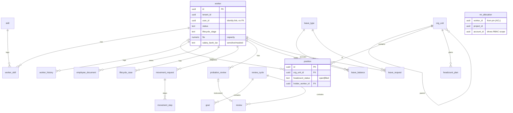
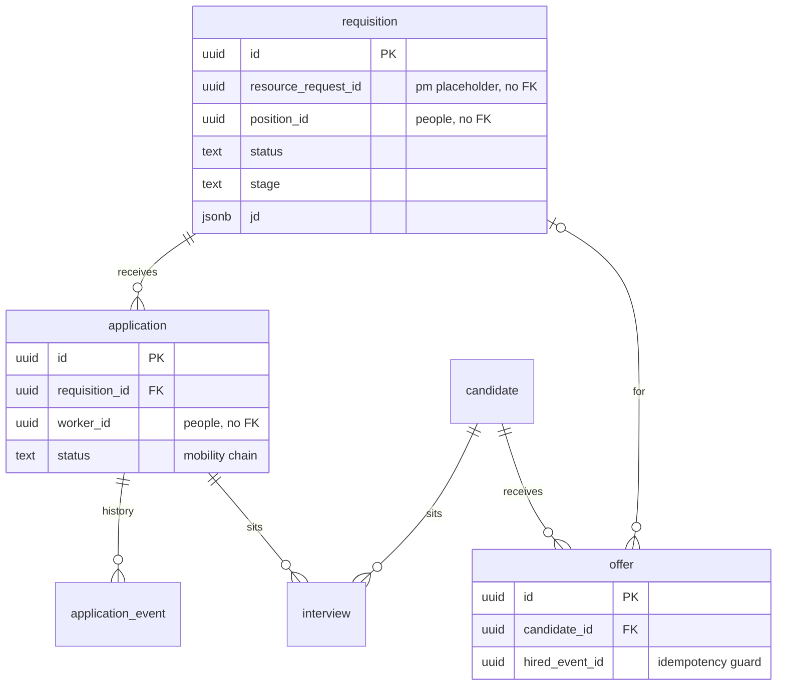
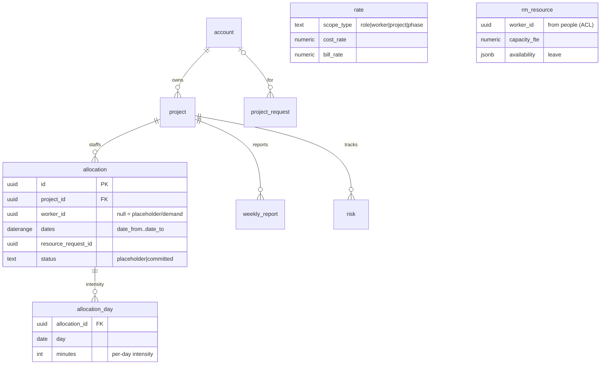
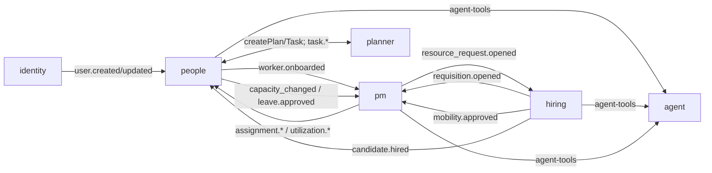

# People / Hiring / PM — unified database design (Step 7)

> Drizzle schema for all three modules in one pass so write-tables, read-models, and the event/data
> contracts ([`ddd-design.md`](./ddd-design.md)) line up. One `pgSchema` per module with
> `schemaFilter` scoping; **no cross-schema FK**; cross-module data flows only via events into
> read-model (ACL) tables owned by the consumer.
>
> **✅ Validated** against **Postgres 16** (throwaway Docker DB), including the review-fix pass below —
> full DDL applies clean: **54 tables** (people 24 · hiring 12 · pm 18); all invariant CHECKs fire
> (position holder, allocation committed↔worker, non-Green weekly road-to-green, proficiency range,
> date ranges, **scorecard-config + rate uniqueness, one-accepted-offer-per-candidate**); hot-path
> indexes confirmed via `EXPLAIN`; **zero cross-schema FKs** (asserted).
>
> **Review fixes applied (§ "Review fixes" below):** idempotency-guard tables; M:N `rm_allocation`
> re-keyed; `allocation.planned_pct`; rate temporal uniqueness; offer-accept uniqueness; interview
> reuses the scorecard instrument; UI-driven tables (skill endorsements, exit records, project access,
> weekly-report comments, KPI values, CAPA register); house-style `updated_at`/`version`/`deleted_at`.

## Conventions

- One `pgSchema('<module>')` per module; `drizzle.config.ts` sets `schemaFilter: ['<module>']`.
- Every table carries `tenant_id uuid not null`; every query filters by it. `id uuid pk default
  gen_random_uuid()`. `created_at`/`updated_at timestamptz`.
- Cross-module references are **plain `uuid` columns, no FK** (e.g. `worker_id`, `project_id`,
  `account_id`, `position_id`, `resource_request_id`). FKs allowed **only within** a module's schema.
- **Read-model (ACL) tables** live in the **consumer** schema, prefixed `rm_`, updated by event
  subscribers, idempotent on `event_id` (a `projection_offset`/processed-events guard per repo
  pattern). They hold projected facts only — never authored locally.
- **Derived** values (utilization, QCDP/RAG, margin, allocation totals) are **not stored on
  write-aggregates** — they are `rm_*` projections or computed on read.
- Migrations: `pnpm --filter @seta/<module> db:generate` → `pnpm db:migrate`. Hand-written SQL only
  for what Drizzle can't model (partitioning, triggers) — alongside generated files. Never edit a
  committed migration.

---

## `people` schema

**Worker & org (P-C1/P-C2)**
- `worker` — `user_id uuid null` (identity link), `full_name`, `work_email`, `role_title`,
  `department`, `employment_type`, `grade`, `status`, `lifecycle_stage`, `location`, `gender`,
  `dob date`, `phone`, **sensitive**: `salary`, `bank`, `tax` (masked in serializer), `joined_at`,
  `offboarded_at`, **capacity**: `fte numeric`, `contracted_hours int`. idx: `(tenant_id, status)`,
  `(tenant_id, user_id)`, `(tenant_id, lifecycle_stage)`.
- `skill` (taxonomy) — `name`, `category`. uniq `(tenant_id, name)`.
- `worker_skill` — `worker_id`, `skill_id`, `proficiency smallint (1–4)`, `years_experience`. pk
  `(worker_id, skill_id)`.
- `org_unit` — `parent_id uuid null` (FK in-schema), `name`, `manager_position_id uuid null`. idx
  `(tenant_id, parent_id)`; CHECK acyclic enforced in domain.
- `position` — `org_unit_id` (FK), `role_title`, `grade`, `headcount_status` (`open|filled`),
  `holder_worker_id uuid null`. idx `(tenant_id, org_unit_id, headcount_status)`. *Inv:* filled ⇒ one
  holder.
- `worker_history` — `worker_id` (FK), `at`, `action`, `field`, `from_val`, `to_val`, `by_user_id`.

**Lifecycle (P-C5–C9)**
- `lifecycle_case` — `worker_id` (FK), `kind` (`onboarding|offboarding`), `planner_plan_id`,
  `planner_task_id` (the employee card), `stage`, `progress smallint`, `health`, `started_at`. idx
  `(tenant_id, kind, stage)`.
- `probation_review` — `worker_id` (FK), `marker` (1mo/2mo), `scorecard_review_id null`, `outcome`
  (`pass|fail|pending`), `decided_at`.
- `movement_request` — `worker_id` (FK), `type` (`promotion|transfer|salary`), `to_position_id`,
  `to_grade`, `salary_from`, `salary_to`, `effective_date`, `status`.
- `movement_step` — `request_id` (FK), `seq`, `name`, `status`, `approver_user_id`, `decided_at`.

**Performance (P-C10)** — *reference config + cycle aggregate*
- `scorecard_config` — `pillar`, `criterion`, `weight`, `is_core bool`, `auto_from_ammi bool`,
  `ammi_dim`. (versioned reference data)
- `review_cycle` — `period`, `template_ref`, `scope jsonb`, `status` (`open|closed`).
- `goal` — `cycle_id` (FK), `worker_id`, `objective`, `key_results jsonb`, `weight`, `progress`.
- `review` — `cycle_id` (FK), `worker_id`, `reviewer_user_id`, `reviewer_type`
  (`self|manager|peer`), `scores jsonb`, `ammi jsonb`, `total numeric`, `verdict`, `strengths`,
  `improve`, `action`. (also used by `probation_review`)

**Leave (P-C11)**
- `leave_type` — `name`, `accrual_policy jsonb`.
- `leave_balance` — `worker_id`, `leave_type_id`, `balance numeric`. pk `(worker_id, leave_type_id)`.
- `leave_request` — `worker_id` (FK), `leave_type_id`, `date_from`, `date_to`, `status`,
  `approver_user_id`, `decided_at`. idx `(tenant_id, worker_id, status)`.

**Headcount (P-C12)**
- `headcount_plan` — `org_unit_id`, `period`, `planned_count int`, `notes`. idx `(tenant_id, period)`.

**Read-models (ACL) in `people`**
- `rm_allocation` — from pm: `worker_id`, `project_id`, `account_id`, `pct`/`intensity`, `billable`,
  `date_from`, `date_to`. idx `(tenant_id, worker_id)`, `(tenant_id, account_id)`,
  `(tenant_id, project_id)` — **drives RBAC visibility scope**.
- `rm_account_project` — from pm: `kind`, `id`, `name`, `parent_account_id`, `am_worker_id`.

---

## `hiring` schema

- `requisition` — `title`, `role_title`, `grade`, `account_id`, `resource_request_id null` (pm),
  `position_id null` (people), `kind` (`replacement|new`), `status`, `stage`
  (`sourcing|screening|interview|offer`), `skills jsonb`, `jd jsonb` (about/resp/req/nice),
  `start_date`, `due_date`. idx `(tenant_id, status, stage)`, `(tenant_id, resource_request_id)`.
- `candidate` — `name`, `source`, `contact jsonb`, `cv_storage_key`, `status`, `stage`. (external)
- `application` — `requisition_id` (FK), `worker_id` (internal applicant), `status`
  (`submitted|releasing_endorsed|receiving_endorsed|pmo_review|approved|rejected`), `alloc_pct`,
  `note`. idx `(tenant_id, requisition_id, status)`.
- `application_event` — `application_id` (FK), `at`, `actor`, `action`, `note`. (endorsement history)
- `interview` — `candidate_id null` / `application_id null`, `round`, `panel jsonb`, `at timestamptz`,
  `duration_min`, `mode` (`online|onsite`), `meeting_link`, `status`, `result` (`pass|hold|fail`),
  `rating smallint`, `recommendation`, `feedback`, `transcript`. idx `(tenant_id, at)`.
- `offer` — `candidate_id` (FK), `requisition_id`, `position_id`, `comp jsonb`, `start_date`,
  `status` (`draft|approved|sent|accepted|declined`). *Inv:* accept terminal, fires `candidate.hired`
  once (guard column `hired_event_id`).
- `kb_article` — `type`, `title`, `body`, `tags` *(OQ-7: or replaced by `knowledge` module refs)*.

**Read-models (ACL) in `hiring`**
- `rm_worker` — from people: `worker_id`, `name`, `skills`, `current_positions` (internal-mobility +
  on-hire linking).
- `rm_resource_request` — from pm: `resource_request_id`, `project_id`, `role`, `skills`, `count`,
  `dates`, `status`.
- `rm_account_project` — from pm (scoping/display).

---

## `pm` schema

- `account` — `name`, `am_worker_id`. idx `(tenant_id)`.
- `project` — `account_id` (FK), `name`, `objective`, `scope jsonb`, `budget_bmm numeric`,
  `pm_worker_id`, `phase`, `status`, `planner_group_id null` (deferred task reuse). idx
  `(tenant_id, account_id, status)`.
- `project_request` — `name`, `account_id`, `objective`, `scope jsonb`, `budget_bmm`, `pm_worker_id`,
  `stage` (`submitted|pmo_review|bod_review|created`), `rejected_at`. (charter flow)
- `allocation` — **`worker_id uuid null`** (null ⇒ **placeholder/demand**), `project_id` (FK),
  `task_id null`, `role`, `date_from`, `date_to`, `billable bool`, `criteria jsonb` (placeholder:
  skills/count), `resource_request_id null`, `status` (`placeholder|committed`). idx
  `(tenant_id, project_id)`, `(tenant_id, worker_id)`, partial idx `where worker_id is null`
  (open demand). *Inv:* committed ⇒ `worker_id not null`.
- `allocation_day` — `allocation_id` (FK), `date`, `minutes int`. pk `(allocation_id, date)`.
  (per-day intensity; assignment totals derived.)
- `rate` — `scope_type` (`role|worker|project|phase`), `scope_id`, `cost_rate numeric`,
  `bill_rate numeric`, `effective_from`. (override cascade resolved at read.)
- `weekly_report` — `project_id` (FK), `week`, `summary`, `risk`, `rag`, `qcdp jsonb`, `action`,
  `owner`, `due`, `by_user_id`, `submitted_at`. *Inv:* non-Green ⇒ action+owner+due not null.
- `risk` — `project_id` (FK), `title`, `type`, `severity`, `priority`, `status`, `owner`, `due`,
  `action`.
- `kpi_threshold` — `scope` (tenant/project), `metric`, `goal`, `yellow`, `direction`.

**Read-models (ACL + derived) in `pm`**
- `rm_resource` — from people: `worker_id`, `name`, `skills`, **`capacity`** (fte/hours),
  **`availability`** (approved leave ranges). drives the capacity denominator.
- `rm_utilization` — derived: `worker_id`, period, `allocated`, `capacity`, `util_pct`,
  `overallocated bool`.
- `rm_project_health` — derived: `project_id`, `qcdp jsonb`, `rag`, `predictability`.
- `rm_margin` — derived: `project_id`, `cost`, `bill`, `margin` (from allocations × resolved rates).

---

## ER diagrams (Mermaid)

### `people` schema

### `hiring` schema

### `pm` schema

### Cross-module event flow (the integration contract)

## Normalization & optimization review

- **Write-model is 3NF.** Every non-key attribute depends on the whole key and nothing else. Repeating
  groups are extracted to child tables (`worker_skill`, `allocation_day`, `movement_step`,
  `application_event`, `leave_balance`). Sensitive comp fields (`salary/bank/tax`) sit on `worker`
  (single-valued, key-dependent — a 3NF-valid choice); access control is enforced in the serializer,
  not by splitting the table.
- **`rm_*` read-models are intentionally denormalized** (not 3NF) — they are event-fed projections
  optimized for read. E.g. `rm_allocation.account_id` is transitively derivable (`project → account`)
  but stored to make the **RBAC-visibility query a single indexed lookup** (`EXPLAIN` confirms
  `rm_alloc_by_account`). This is a deliberate read-optimization, isolated to projections.
- **Read-optimized:** the hot paths — RBAC visibility (worker↔account/project), open-demand listing,
  utilization — are covered by purpose-built indexes incl. a **partial index** for open placeholders
  (`WHERE worker_id IS NULL`). `jsonb` is used only for genuinely variable/semi-structured payloads
  (JD, scope, scores, criteria, qcdp) — never for queryable scalar columns.
- **Write-optimized:** narrow write-aggregates (small rows, few FKs) keep inserts cheap;
  `allocation_day` carries the per-day fan-out so the `allocation` row stays small; derived
  values (utilization/RAG/margin) are **never written on the aggregate** (recomputed into `rm_*`),
  avoiding write amplification + contention (Vernon small-aggregate guidance).
- **Integrity:** intra-schema FKs enforce local consistency; **zero cross-schema FKs** preserve module
  isolation (asserted in validation); cross-module consistency is eventual via idempotent projections.

## Review fixes (validated 2026-06-16)

Applied after the parallel design review; all validated on Postgres 16.

**Correctness / contracts**
- **Idempotency guard:** `people.processed_event` / `hiring.processed_event` / `pm.processed_event`
  `(consumer, event_id)` — every projection subscriber inserts here in the same txn as its upsert.
  `src_event` on `rm_*` is the *last* event only, not the dedup ledger.
- **`people.rm_allocation` re-keyed** to `(tenant_id, allocation_id)` (+ `allocation_id` column) so the
  **M:N** read-model holds concurrent/sequential same-project allocations (old `(worker_id, project_id)`
  PK collapsed them). pm emits `pm.assignment.created/changed/ended`; `ended` retracts the row.
- **`pm.allocation.planned_pct numeric(5,2)`** — the planning/placeholder capacity % (per-day `minutes`
  materialize on commit); gives `rm_allocation.pct` a real source and lands `mobility.approved.pct`.
- **`pm.rate`** + `effective_to date` and `UNIQUE (tenant_id, scope_type, scope_id, effective_from)` —
  deterministic cost/bill cascade resolution.
- **`hiring.offer`**: partial `UNIQUE (tenant_id, candidate_id) WHERE status='accepted'` + CHECK
  `hired_event_id IS NULL OR status='accepted'` — "hire fires once" is now a real invariant.
- **`hiring.interview`** gains `scores jsonb` (reuses the scorecard instrument, OQ-H3) + `interview_panelist`
  child + partial `interview_upcoming` index; mobility endorsement actors typed on `application`
  (`releasing_endorsed_by`/`receiving_endorsed_by`/`pmo_decided_by`, `override_overallocation`).
- **`people.worker`**: `salary` → `salary_amount numeric(14,2)` + `salary_currency` (masked at serializer,
  not by type); `emergency_contact jsonb`; `profile_completed_at` (first-login self-completion gate);
  `version`. `movement_request` salary fields → numeric.
- **House style** (planner parity): `updated_at` + `version` on hot aggregates; `deleted_at` soft-delete
  on `pm.project`/`pm.allocation` (doc had promised it). The rule applies module-wide at implementation.

**UI-driven tables (prototype-backed) added**
- `people.skill_endorsement` (peer/manager skill endorsements ⭐); `people.exit_record` (voluntary flag,
  reason, tenure-at-exit → "why/when people leave" analytics); `people.probation_review.risk_score`;
  `people.lifecycle_case.sla_due_at` + `case_attention`/`case_by_plannertask` indexes;
  `people.employee_document` gains version-chain (`supersedes_id`) + `required` (missing-doc attention).
- `hiring.candidate` gains `skills`/`seniority` (CV-parse), `reject_reason`/`tags` (KB analytics),
  `source_cost`; `hiring.requisition` gains `owner_user_id` (recruiter attribution) + `closed_at` (TTF).
- `pm.project_access` (per-project Owner/Edit/View — the charter R&R grant); `pm.project` gains
  `methodology`/`pricing_model`/`timeline`/`css`; `pm.weekly_report_comment`; `pm.weekly_report.due`→`date`;
  `pm.kpi_value` (manual KPI input feeding QCDP); `pm.corrective_action` (CAPA/risk/improvement register).

> These additions are reflected in the per-schema table lists above conceptually; the validated DDL is
> `seta-people-hr-schema.sql` + `seta-fixes.sql` (validation artifacts — Drizzle remains the schema
> source-of-truth per repo rules).

## Migration & indexing notes

- Generate per module (`db:generate`) in dependency order: foundation tables first, `rm_*` tables
  with the slice that consumes the event.
- **Hot tables** — `allocation`/`allocation_day` (pm) and `rm_allocation` (people) carry the heaviest
  read/write; index by `(tenant_id, worker_id)` and `(tenant_id, project_id)`; consider date-range
  GiST or per-month partitioning if volume warrants (hand-written SQL, documented).
- **Idempotency** — every `rm_*` subscriber records processed `event_id`; replays are no-ops.
- **Soft delete** where history matters (`worker`, `project`, `allocation` via `status`/`deleted_at`),
  consistent with `planner`'s pattern.

## Per-module Step 7 pointers
`people.md`, `hiring.md`, `pm.md` Step 7 = this document (their schema sections above).
