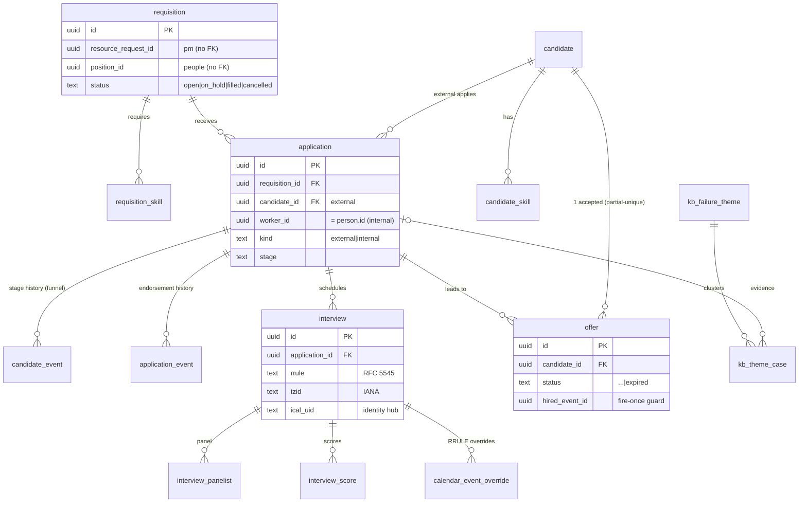
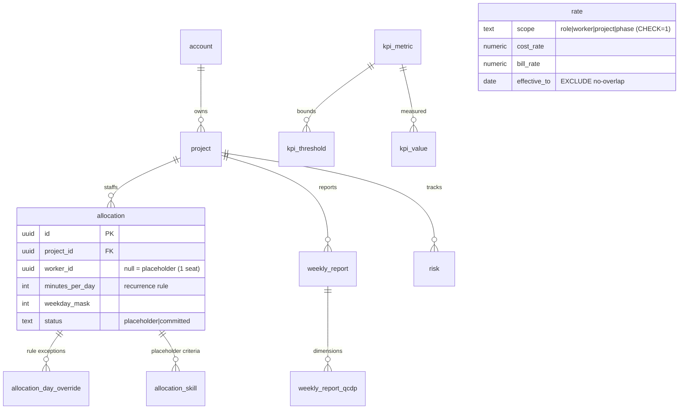
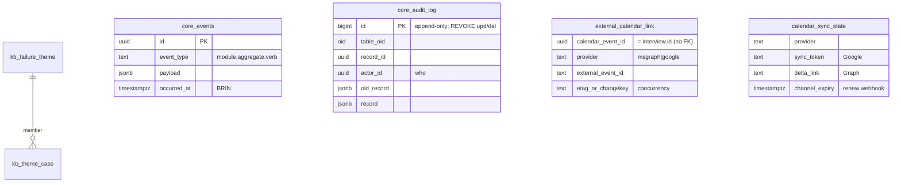
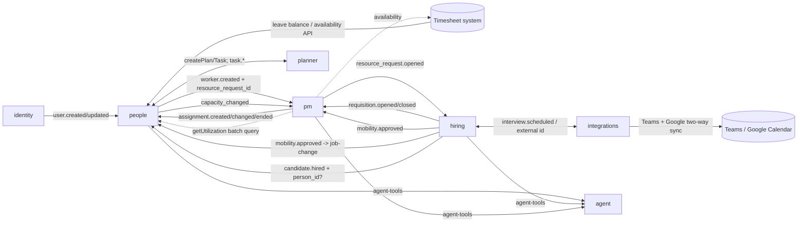

# People / Hiring / PM — unified database design (Step 7)

> ⚠️ **Revision 2026-06-18 — superseded in parts by the module technical specs**
> ([`People-technical-spec`](../modules/People-technical-spec.md), [`Hiring-technical-spec`](../modules/Hiring-technical-spec.md)),
> which are the source of truth. Reconciled deltas (applied to the schema tables + ER diagrams below):
> - **Leave tables removed from `people`** — **leave is owned by the timesheet system**; `people` only proxies its API. `people.leave.*` events dropped; `pm` reads availability from the timesheet system.
> - **Re-hire:** `worker` splits into a stable **`person` identity + 1..N `employment_period`** rows (re-hire adds a period, never a duplicate person); `original_hire_date` immutable + `seniority_date`.
> - **`movement_request.source`** (`hr_initiated|internal_mobility`); `hiring.mobility.approved` opens a `people` movement on role/grade change (dual consumer with `pm`).
> - **`offer`** gains `respond_by` + `expired`; unified **`hiring.application`**; **`candidate.segment`** (alumni); person-match carries `person_id?`.
> - **v3 hardening — authoritative DDL is [`review-schema.sql`](./review-schema.sql)** (applied + verified on a standalone Postgres; sample data in [`review-seed.sql`](./review-seed.sql)): temporal **`EXCLUDE`** overlap guards; a generic **`core.audit_log`** trigger + **`core.events`** outbox; an event-maintained **`people.rm_worker_directory`** projection; **`people.lifecycle_case_step`**; RFC 5545 **RRULE** on `hiring.interview` + an **`integrations`** schema for two-way Teams/Google sync.
>
> **The schema tables and ER diagrams below reflect v3**; the dated decision-log sections further down are historical.

## Conventions

- One `pgSchema('<module>')` per module; `drizzle.config.ts` sets `schemaFilter: ['<module>']`.
- Every table carries `tenant_id uuid not null`; every query filters by it. `id uuid pk default
gen_random_uuid()`. `created_at`/`updated_at timestamptz`.
- Cross-module references are **plain `uuid` columns, no FK** (e.g. `worker_id`, `project_id`,
  `account_id`, `position_id`, `resource_request_id`). FKs allowed **only within** a module's schema.
- **Read-model (ACL) tables** live in the **consumer** schema, prefixed `rm_`, updated by event
  subscribers, idempotent on `event_id` (a `projection_offset`/processed-events guard per repo
  pattern). They hold projected facts only — never authored locally.
- **Derived** values (utilization, QCDP/RAG, margin, allocation totals) are **not stored on
  write-aggregates** — they are `rm_*` projections or computed on read.
- Migrations: `pnpm --filter @seta/<module> db:generate` → `pnpm db:migrate`. Hand-written SQL only
  for what Drizzle can't model (partitioning, triggers, **`EXCLUDE`/`btree_gist`**) — alongside
  generated files. Never edit a committed migration.

**Cross-cutting modeling rules (architecture revision):**

- **Effective-date facts that change over time** instead of overwriting a scalar — compensation,
  capacity, and rates are **history tables** (`*_from`/`*_to` or `effective_from`), with an optional
  cached "current" value on the aggregate for hot reads. A scalar on the row makes _historical_
  reporting (past-period utilization, salary history) wrong after any change.
- **Ledgers, not mutable counters** for anything with concurrent writers + audit needs (leave): an
  append-only `*_ledger` whose balance = `Σ(delta)`; idempotent on `source_event_id`.
- **Normalized facts, not opaque jsonb,** for anything queried/aggregated (review scores, QCDP, KPI).
  Reserve `jsonb` for genuinely variable payloads (JD, scope, criteria, contact). This keeps the
  doc's own "first-class reference config, not opaque jsonb" promise honest at the _score_ layer too.
- **DB-native invariants** where Postgres can enforce them race-free: `EXCLUDE USING gist` (+
  `btree_gist`) for no-overlap (leave per worker/type), partial `UNIQUE` for single-holder/one-accept,
  CHECK for typed polymorphism. Acyclicity (org tree) stays a **locked recursive-CTE** domain check
  (no SQL CHECK can express it; two concurrent reparents can otherwise form a cycle).
- **Tenant isolation as defense-in-depth:** every table carries `tenant_id` _and_ — recommended
  platform-wide — a Postgres **RLS** policy keyed on a session GUC, so a missed `WHERE tenant_id` can
  never leak cross-tenant HR/comp data. (Platform decision; flagged here, applies beyond these 3
  modules.)
- **Projections are rebuildable:** every `rm_*` subscriber is replayable from `core.events` (offset +
  idempotent upsert). A bug in a projector — or a _new_ projection added later — is recovered by
  replay, never by hand-patching the read model. Critical because **RBAC visibility is itself a
  projection** (`rm_allocation`).
- **Out-of-order / missing-precondition handling is uniform:** at-least-once + per-aggregate-only
  ordering means a consumer _will_ see an event before its precondition exists. Policy: **park-and-retry
  with bounded attempts** for "precondition not yet present" (the aggregate may still arrive),
  **no-op** for "precondition already gone" (idempotent). Stated once here, applied by every subscriber.

---

## `people` schema

**Identity, record & org (P-C1/P-C2)**

| Table | Purpose | Key columns | Constraints / notes |
|---|---|---|---|
| `person` | the person identity (persists across re-hires) | id (**= cross-module `worker_id`**), user_id (identity link, no FK), original_hire_date, seniority_date | original_hire_date immutable; idx `(tenant, user_id)` |
| `employment_period` | one period of service | person_id, seq, start_date, end_date, status, lifecycle_stage, employment_type | uniq `(person, seq)`; **partial-unique one open** (`end_date IS NULL`) |
| `worker` | person-level **directory fields only** | person_id (unique 1:1), full_name, work_email, dob, gender, phone, emergency_contact jsonb, profile_completed_at, version, deleted_at | **GIN-trigram** `(full_name, work_email)`; domain fields derive via `rm_worker_directory` |
| `worker_compensation` | effective-dated pay (sensitive) | person_id, effective_from/to, salary_amount, salary_currency, bank/tax jsonb, reason, by_user_id | uniq `(person, from)`; **`EXCLUDE` no-overlap**; RLS-eligible |
| `worker_capacity` | effective-dated FTE | person_id, effective_from/to, fte, contracted_hours, reason, by_user_id | uniq + **`EXCLUDE`**; emits `capacity_changed` |
| `skill` | taxonomy | name, category | uniq `(tenant, name)` |
| `worker_skill` | M:N skills | person_id, skill_id, proficiency (0–5), years_experience | pk `(person, skill)` |
| `org_unit` | supervisory hierarchy | parent_id, name, manager_position_id | **acyclicity trigger** (was domain-only) |
| `position` | a seat (job profile) | org_unit_id, role_title, grade, headcount_status (open\|filled), holder_worker_id (= person.id) | filled ⇒ holder; **1-per-holder** partial-unique |
| `account_access_grant` | AM cross-account grant (F-SEC-4) | grantee_user_id, account_id, granted_by/at, revoked_by/at | unioned into visibility scope |
| `worker_history` | per-worker change log | person_id, at, action, field, from/to_val, by_user_id | (generic audit also in `core.audit_log`) |

**Lifecycle (P-C5–C9)**

| Table | Purpose | Key columns | Constraints / notes |
|---|---|---|---|
| `lifecycle_case` | onboarding/offboarding case | person_id, kind, planner_plan/task_id, stage, progress, health, **leaver_type, held, prior_stage**, sla_due_at | idx attention `(tenant, health, sla_due_at)` |
| `lifecycle_case_step` | **per-case step instance** (step-duration) | case_id, template_step_key, status (todo\|doing\|done\|blocked), started_at, done_at | uniq `(case, step_key)` |
| `lifecycle_template_step` | reusable checklist template | template_id, step_key (stamped on planner item), phase, responsible_role, sla_hours, seq | cross-case step analytics |
| `probation_review` | probation checkpoint | person_id, marker (1mo\|2mo\|confirmation), scorecard_review_id, outcome (pass\|fail\|extend\|pending), extension_until, decided_at, **decided_by** | — |
| `movement_request` | job change | person_id, type (promotion\|transfer\|pay), **source (hr_initiated\|internal_mobility)**, to_position_id, to_grade, salary_from/to, effective_date, status, applied_at, **decided_by, rejected_reason** | applied at `effective_date` (once-only via `applied_at`) |
| `movement_step` | approval step | request_id, seq, name, status, approver_user_id, decided_at | — |

**Performance (P-C10)** — versioned template + normalized scores

| Table | Purpose | Key columns | Constraints / notes |
|---|---|---|---|
| `scorecard_template` | versioned instrument | name, version, status (draft\|active\|archived) | uniq `(tenant, name, version)`; pinned immutable |
| `scorecard_criterion` | pillar/criterion config | template_id, pillar, criterion, weight, is_core, auto_from_ammi, ammi_dim | uniq `(template, criterion)` |
| `review_cycle` | review period | period, **starts_at, seq** (ordering), template_id, scope, status (open\|closed) | seq = deterministic prev-period |
| `goal` | OKR | cycle_id, person_id, objective, key_results jsonb, weight, progress | — |
| `review` | review submission | cycle_id, person_id, reviewer_type (self\|manager\|peer), template_id (pinned), ammi, total, verdict, strengths/improve/action | — |
| `review_score` | per-criterion score (normalized) | review_id, criterion_id, score, evidence, **top_action** | pk; **CHECK** evidence on 1/5 + action when <4 |

**Headcount, documents**

| Table | Purpose | Key columns | Constraints / notes |
|---|---|---|---|
| `headcount_plan` | planned positions | org_unit_id, period, planned_count, notes | — |
| `employee_document` | doc vault | person_id, doc_type, storage_key, expiry_date, supersedes_id (version chain), uploaded_by, at | — |
| `document_requirement` | required-doc policy | scope (tenant\|employment_type), employment_type, doc_type, mandatory | missing = LEFT JOIN (a flag can't mark an *absent* doc) |

> **~~Leave (P-C11)~~ — REMOVED (2026-06-18):** leave is owned by the **timesheet system**. `people` holds no leave tables and emits no `people.leave.*` events; it proxies the timesheet API (balance read + request submit) via `integrations`, and `pm` reads availability from the timesheet system directly.

**Read-models (ACL / projections in `people`)** — event-fed, no FK:

| Read-model | Source | Holds |
|---|---|---|
| `rm_allocation` | pm `assignment.*` | worker_id, project_id, account_id, pct, bucket, dates — **drives RBAC visibility**; uniq `(tenant, allocation_id)` |
| `rm_account_project` | pm | id→name, account↔project, AM owner |
| `rm_worker_directory` | events | **event-maintained directory projection** — lifecycle_stage/grade/fte/department + name/email; idx `(tenant, lifecycle_stage, full_name)` + GIN trigram (replaces the live join-view) |
| `rm_workforce_metrics` | events | headcount, attrition, bench, tenure, skill-coverage by scope/period (F-ANALYTICS-1) |

---

## `hiring` schema

| Table | Purpose | Key columns | Constraints / notes |
|---|---|---|---|
| `requisition` | an open role / seat | title, role_title, grade, account_id, `resource_request_id?` (pm), `position_id?` (people), kind (replacement\|new), status (open\|on_hold\|filled\|cancelled), stage (sourcing→offer), jd jsonb, owner_user_id, due_date, closed_at | uniq `(tenant, resource_request_id)`; idx `(tenant, status, stage)` |
| `requisition_skill` | required skills (normalized, was jsonb) | requisition_id, skill_id, skill_name, min_level | pk `(requisition_id, skill_name)` |
| `candidate` | external person | name, source, contact jsonb, dob, gender, cv_storage_key, seniority, segment (alumni), source_cost | — |
| `candidate_skill` | candidate skills (normalized) | candidate_id, skill_name, proficiency | pk `(candidate_id, skill_name)` |
| **`application`** | **unified** pursuit of one req — external candidate OR internal worker | requisition_id, kind (external\|internal), `candidate_id?` / `worker_id?`, stage (external pipeline), status (internal endorsement), rating, alloc_pct, override_overallocation, mobility_event_id, reject_reason, tags | CHECK exactly-one subject; uniq `(req, candidate)` / `(req, worker)` |
| `candidate_event` | external stage history | application_id, at, from_stage, to_stage, actor | funnel / lead-time; BRIN(at) |
| `application_event` | internal endorsement history | application_id, at, actor, action | BRIN(at) |
| `interview` | a scheduled interview | application_id, **dtstart/dtend/tzid/rrule/exdate/rdate** (RFC 5545), ical_uid (identity hub), round, mode, meeting_link, status (…\|no_show), no_show_reason, result (pass\|hold\|fail), rating, recommendation, transcript, `scorecard_template_id` (pinned, no FK), scorecard_snapshot | partial `interview_upcoming` |
| `interview_panelist` | panel (normalized, was jsonb) | interview_id, panelist_user_id | pk |
| `interview_score` | per-criterion score | interview_id, `criterion_id` (people, no FK), score, evidence | pk; CHECK evidence on extreme (1/5) |
| `calendar_event_override` | per-instance RECURRENCE-ID overrides | interview_id, recurrence_id (original instant), new_dtstart/dtend, is_cancelled | pk `(interview_id, recurrence_id)` |
| `offer` | offer to a candidate | application_id, candidate_id, comp jsonb, start_date, respond_by, status (…\|expired), hired_event_id, decided_at, decided_by | partial uniq accepted-per-candidate; fire-once guard |
| `resource_request_fulfillment` | one-seat fulfillment **saga** | resource_request_id, placeholder_allocation_id, requisition_id, path (internal\|external\|undecided), state (open→filled\|cancelled\|timed_out), timeout_at | uniq `(tenant, resource_request_id)`; uniq placeholder |
| `recruiter_account_assignment` | recruiter scope (by assignment) | recruiter_user_id, account_id | pk |
| `kb_failure_theme` / `kb_theme_case` | recruitment-insight clusters | theme: label, reject_count, pct, improvement_action, owner, priority — case: theme_id, application_id, reason | structured (replaces freetext) |
| `kb_article` | optional prose playbooks | type, title, body, tags | OQ-1 |

**Read-models (ACL in `hiring`)** — event-fed projections, no FK:

| Read-model | Source | Holds |
|---|---|---|
| `rm_worker` (+ `rm_worker_skill`) | people | person-match source for internal mobility + on-hire; alumni `stage` seeds the alumni segment |
| `rm_resource_request` | pm | open demand (one seat per request) |
| `rm_scorecard_template` / `rm_scorecard_criterion` | people | render/validate the interview instrument + pin a `scorecard_template_id` without a cross-schema FK |
| `rm_account_project` | pm | scoping / display |

---

## `pm` schema

| Table | Purpose | Key columns | Constraints / notes |
|---|---|---|---|
| `account` | client of the outsourcing co. | name, am_worker_id | idx `(tenant)` |
| `project` | project under an account | account_id, name, objective, scope jsonb, budget_bmm, pm_worker_id, phase, status, planner_group_id | idx `(tenant, account, status)` |
| `project_request` | charter flow | name, account_id, objective, scope, budget_bmm, stage (submitted→created), rejected_at | — |
| `allocation` | assignment **or** placeholder demand | `worker_id?` (null ⇒ placeholder, **one seat**), project_id, task_id, role, date_from/to, bucket (billable\|internal\|bench), planned_pct, **minutes_per_day + weekday_mask** (recurrence rule), resource_request_id, status (placeholder\|committed), deleted_at | CHECK committed ⇒ worker_id; partial idx open demand; uniq one placeholder/request; committed may be future-dated |
| `allocation_skill` | placeholder criteria (normalized, was jsonb) | allocation_id, skill_name, min_level | pk |
| `allocation_day_override` | days deviating from the rule | allocation_id, date, minutes | pk; effective intensity = rule ⊕ overrides (avoids per-day fan-out) |
| `rate` | cost/bill rate cascade | typed scope (role\|worker_id\|project_id\|phase, CHECK exactly-one), cost_rate, bill_rate, effective_from/to | uniq per scope+from; **EXCLUDE no-overlap**; resolved into `rm_effective_rate` |
| `weekly_report` | project status report | project_id, week, summary, risk, rag, action, owner, date, by_user_id, submitted_at | non-Green ⇒ action+owner+date |
| `weekly_report_qcdp` | QCDP dimensions (normalized, was jsonb) | weekly_report_id, dimension (quality\|cost\|delivery\|process), rag, note | pk |
| `risk` | risk / issue register | project_id, title, type, severity, priority, status, owner, due, action | — |
| `kpi_metric` | KPI catalog (no free-text names) | code, name, unit, category, direction | uniq `(tenant, code)` |
| `kpi_threshold` | goal/yellow bounds | scope, metric_id, goal, yellow | — |
| `kpi_value` | measured value (feeds QCDP) | project_id, metric_id, period, value | idx `(project, period, metric)` |

**Read-models (ACL + derived in `pm`)** — event-fed / computed, no FK:

| Read-model | Source / basis | Holds |
|---|---|---|
| `rm_resource` (+ `rm_resource_skill`) | people | name, skills, **`availability`** (from the **timesheet system**, not a `people.leave` event) |
| `rm_resource_capacity` | people `worker.capacity_changed` | effective-dated fte/contracted_hours — past-period utilization uses the capacity in effect *then* |
| `rm_effective_rate` | derived from `rate` cascade | `(worker, project, date) → cost_rate, bill_rate` — lookup, not a 4-level walk |
| `rm_utilization` | derived | period, capacity, util_pct, overallocated + **4-way split** (billable/internal/bench/leave); read by people via `getUtilization(...)` batch query (no event) |
| `rm_project_health` | derived from `weekly_report_qcdp` | qcdp, rag, predictability |
| `rm_margin` | derived | cost, bill, margin (allocations × `rm_effective_rate`) |

---

## ER diagrams (Mermaid) — v3

> Reflect [`review-schema.sql`](./review-schema.sql). Relationship lines are intra-schema FKs (verified
> against the live DB). Cross-module references (`worker_id = person.id`, `resource_request_id`,
> `position_id`, `criterion_id`, …) are **bare uuids, no FK**; read-models (`rm_*`) are event-fed
> projections with no FK in either direction. Attribute blocks show only representative columns — the
> SQL is authoritative.

### `people` schema

```mermaid
erDiagram
  person ||--|| worker : "directory fields"
  person ||--o{ employment_period : "1..N periods (re-hire)"
  person ||--o{ worker_compensation : "comp (effective-dated, EXCLUDE)"
  person ||--o{ worker_capacity : "capacity (effective-dated, EXCLUDE)"
  person ||--o{ worker_skill : has
  skill ||--o{ worker_skill : tags
  person ||--o{ worker_history : logs
  person ||--o{ employee_document : owns
  employee_document ||--o{ employee_document : supersedes
  org_unit ||--o{ org_unit : parent
  org_unit ||--o{ position : contains
  org_unit ||--o{ headcount_plan : plans
  person ||--o{ lifecycle_case : has
  lifecycle_case ||--o{ lifecycle_case_step : steps
  person ||--o{ movement_request : requests
  movement_request ||--o{ movement_step : approvals
  person ||--o{ probation_review : reviews
  probation_review |o--o| review : instrument
  scorecard_template ||--o{ scorecard_criterion : defines
  scorecard_template ||--o{ review_cycle : pins
  review_cycle ||--o{ goal : contains
  review_cycle ||--o{ review : contains
  person ||--o{ review : about
  review ||--o{ review_score : scores
  scorecard_criterion ||--o{ review_score : "scored on"
  person {
    uuid id PK "= cross-module worker_id"
    uuid user_id "identity link (no FK)"
    date original_hire_date "immutable"
    date seniority_date
  }
  worker {
    uuid person_id FK "unique 1:1"
    text full_name "GIN trigram"
    text work_email
    jsonb emergency_contact
  }
  employment_period {
    uuid person_id FK
    int seq
    date end_date "null = open (partial-unique)"
    text lifecycle_stage
  }
  worker_compensation {
    uuid person_id FK
    date effective_from
    date effective_to "EXCLUDE no-overlap"
    numeric salary_amount "sensitive/RLS"
  }
  position {
    uuid org_unit_id FK
    text headcount_status "open|filled"
    uuid holder_worker_id "= person.id; 1-per-holder"
  }
  lifecycle_case_step {
    uuid case_id FK
    text status "todo|doing|done|blocked"
    timestamptz started_at
    timestamptz done_at "step-duration"
  }
  rm_worker_directory {
    uuid person_id PK "event-maintained projection"
    text lifecycle_stage "indexed (LIMIT pushdown)"
    text full_name "GIN trigram search"
  }
```

_Standalone (no FK): `account_access_grant`, `document_requirement`, and the read-models `rm_allocation`, `rm_account_project`, `rm_worker_directory`, `rm_workforce_metrics` (projected from pm / events)._

### `hiring` schema

_Standalone: `kb_article` and read-models `rm_worker` (+`rm_worker_skill`), `rm_resource_request`, `rm_scorecard_template`/`rm_scorecard_criterion`, `rm_account_project`, `recruiter_account_assignment`._

### `pm` schema

_Standalone: `project_request`; read-models `rm_resource` (+`rm_resource_skill`), `rm_resource_capacity`, `rm_effective_rate`, `rm_utilization` (4-way split), `rm_project_health`, `rm_margin`._

### `core` + `integrations` schemas (v3)

### Cross-module event flow (the integration contract) — v3

_Note: `people.leave._`events are gone — leave/availability is the timesheet system's;`pm` reads availability from it directly.\*

## Normalization & optimization review

- **Write-model is 3NF.** Every non-key attribute depends on the whole key and nothing else. Repeating
  groups are extracted to child tables (`worker_skill`, `allocation_day_override`, `movement_step`,
  `application_event`, `review_score`, `weekly_report_qcdp`). **Facts that vary over time are
  effective-dated history** (`worker_compensation`, `worker_capacity`, `rate`) rather than overwritten
  scalars; **leave is a ledger** (`leave_ledger`), not a mutable counter. Sensitive comp is split to
  its own `worker_compensation` table — column-isolated for stricter grants/RLS, not serializer-only
  masking (defense-in-depth, and it survives a stray `select *`).
- **`rm_*` read-models are intentionally denormalized** (not 3NF) — they are event-fed projections
  optimized for read. E.g. `rm_allocation.account_id` is transitively derivable (`project → account`)
  but stored to make the **RBAC-visibility query a single indexed lookup** (`EXPLAIN` confirms
  `rm_alloc_by_account`). This is a deliberate read-optimization, isolated to projections.
- **Read-optimized:** the hot paths — RBAC visibility (worker↔account/project), open-demand listing,
  utilization — are covered by purpose-built indexes incl. a **partial index** for open placeholders
  (`WHERE worker_id IS NULL`). `jsonb` is used only for genuinely variable/semi-structured payloads
  (JD, scope, scores, criteria, qcdp) — never for queryable scalar columns.
- **Write-optimized:** narrow write-aggregates (small rows, few FKs) keep inserts cheap; allocation
  intensity is a **recurrence rule on `allocation`** with only deviating days in
  `allocation_day_override` (vs the old full per-day fan-out), cutting row count + write amplification;
  derived values (utilization/RAG/margin) are **never written on the aggregate** (recomputed into
  `rm_*`), avoiding contention (Vernon small-aggregate guidance).
- **Integrity:** intra-schema FKs enforce local consistency; **zero cross-schema FKs** preserve module
  isolation (asserted in validation); cross-module consistency is eventual via idempotent projections.

## Architecture revision (2026-06-17)

Applied after the solution-architecture review. **Supersedes the matching "Review fixes" entries
below** (notably: comp-on-`worker`, `review.scores jsonb`, `interview.scores jsonb`, flat
`scorecard_config`, full `allocation_day` fan-out). Schema changed → **re-validate the full DDL**.

| Area                 | Was                                                         | Now                                                                        | Why                                                |
| -------------------- | ----------------------------------------------------------- | -------------------------------------------------------------------------- | -------------------------------------------------- |
| Sensitive comp       | `salary/bank/tax` on `worker`, serializer-masked            | `worker_compensation` (effective-dated, column-isolated, RLS-eligible)     | salary history + defense-in-depth                  |
| Capacity             | scalar `fte`/`contracted_hours` on `worker` / `rm_resource` | `worker_capacity` + `rm_resource_capacity` (effective-dated)               | correct past-period utilization                    |
| Leave                | mutable `leave_balance` cell                                | `leave_ledger` (balance = Σδ) + optional cache                             | concurrent-writer races + audit                    |
| Review scores        | `review.scores jsonb`                                       | `review_score` child (criterion FK)                                        | analytics/delta queryable                          |
| Interview scoring    | `interview.scores jsonb`                                    | `interview_score` + pinned `scorecard_template_id` + `rm_scorecard_*`      | normalized + cross-module reuse                    |
| Scorecard config     | flat `scorecard_config`                                     | `scorecard_template`(versioned) + `scorecard_criterion`                    | immutable historical totals                        |
| Allocation intensity | full `allocation_day` fan-out                               | recurrence rule + `allocation_day_override`                                | row explosion / write amplification                |
| Rates                | polymorphic `scope_id`                                      | typed scope cols + CHECK + `rm_effective_rate`                             | indexable/FK-able, cached resolution               |
| QCDP / KPI           | `qcdp jsonb`, free-text `metric`                            | `weekly_report_qcdp`, `kpi_metric` catalog                                 | aggregatable, no drift                             |
| Demand               | placeholder `criteria.count`                                | one seat per placeholder                                                   | single-CAS fill stays correct                      |
| Fill timing          | pm fills on `worker.onboarded`                              | pm fills (committed, future-dated) on `worker.created`/`mobility.approved` | no phantom-open demand during onboarding           |
| Fulfillment          | scattered handlers + CAS                                    | `resource_request_fulfillment` saga (state + timeout + cancel-loser)       | observable, compensatable                          |
| Missing docs         | `employee_document.required` flag                           | `document_requirement` policy + LEFT JOIN                                  | a flag can't mark an _absent_ doc                  |
| Movement             | applied at approval                                         | applied at `effective_date` (job) + `applied_at` guard                     | future-dated promotions                            |
| Invariants           | domain-enforced                                             | `EXCLUDE`/`btree_gist`, partial `UNIQUE`, CHECK                            | race-free in the DB                                |
| Tenancy              | app `WHERE tenant_id`                                       | + RLS (recommended, platform-wide)                                         | one missed clause can't leak                       |
| Projections          | idempotent                                                  | idempotent **+ replayable/rebuildable**                                    | recover projector bugs; RBAC rides `rm_allocation` |

## Review fixes (validated 2026-06-16) — _partially superseded by the revision above_

Applied after the parallel design review; all validated on Postgres 16.

**Correctness / contracts**

- **Idempotency guard:** `people.processed_event` / `hiring.processed_event` / `pm.processed_event`
  `(consumer, event_id)` — every projection subscriber inserts here in the same txn as its upsert.
  `src_event` on `rm_*` is the _last_ event only, not the dedup ledger.
- **`people.rm_allocation` re-keyed** to `(tenant_id, allocation_id)` (+ `allocation_id` column) so the
  **M:N** read-model holds concurrent/sequential same-project allocations (old `(worker_id, project_id)`
  PK collapsed them). pm emits `pm.assignment.created/changed/ended`; `ended` retracts the row.
- **`pm.allocation.planned_pct numeric(5,2)`** — the planning/placeholder capacity % (per-day `minutes`
  materialize on commit); gives `rm_allocation.pct` a real source and lands `mobility.approved.pct`.
- **`pm.rate`** + `effective_to date` and `UNIQUE (tenant_id, scope_type, scope_id, effective_from)` —
  deterministic cost/bill cascade resolution.
- **`hiring.offer`**: partial `UNIQUE (tenant_id, candidate_id) WHERE status='accepted'` + CHECK
  `hired_event_id IS NULL OR status='accepted'` — "hire fires once" is now a real invariant.
- **`hiring.interview`** ~~gains `scores jsonb`~~ → **superseded:** normalized `interview_score` child +
  pinned `scorecard_template_id` (Architecture revision); + `interview_panelist` child + partial
  `interview_upcoming` index; mobility endorsement actors typed on `application`
  (`releasing_endorsed_by`/`receiving_endorsed_by`/`pmo_decided_by`, `override_overallocation`).
- **`people.worker`**: ~~`salary` → `salary_amount`/`salary_currency` on the row~~ → **superseded:**
  sensitive comp moved to effective-dated `worker_compensation` (Architecture revision);
  `emergency_contact jsonb`; `profile_completed_at` (first-login self-completion gate); `version`.
  `movement_request` salary fields → numeric.
- **House style** (planner parity): `updated_at` + `version` on hot aggregates; `deleted_at` soft-delete
  on `pm.project`/`pm.allocation` (doc had promised it). The rule applies module-wide at implementation.

**UI-driven tables (prototype-backed) added**

- `people.skill_endorsement` (peer/manager skill endorsements ⭐); `people.exit_record` (voluntary flag,
  reason, tenure-at-exit → "why/when people leave" analytics); `people.probation_review.risk_score`;
  `people.lifecycle_case.sla_due_at` + `case_attention`/`case_by_plannertask` indexes;
  `people.employee_document` gains version-chain (`supersedes_id`) + `required` (missing-doc attention).
- `hiring.candidate` gains `skills`/`seniority` (CV-parse), `reject_reason`/`tags` (KB analytics),
  `source_cost`; `hiring.requisition` gains `owner_user_id` (recruiter attribution) + `closed_at` (TTF).
- `pm.project_access` (per-project Owner/Edit/View — the charter R&R grant); `pm.project` gains
  `methodology`/`pricing_model`/`timeline`/`css`; `pm.weekly_report_comment`; `pm.weekly_report.due`→`date`;
  `pm.kpi_value` (manual KPI input feeding QCDP); `pm.corrective_action` (CAPA/risk/improvement register).

> These additions are reflected in the per-schema table lists above conceptually; the validated DDL is
> `seta-people-hr-schema.sql` + `seta-fixes.sql` (validation artifacts — Drizzle remains the schema
> source-of-truth per repo rules).

## Migration & indexing notes

- Generate per module (`db:generate`) in dependency order: foundation tables first, `rm_*` tables
  with the slice that consumes the event.
- **Hot tables** — `allocation`/`allocation_day_override` (pm) and `rm_allocation` (people) carry the
  heaviest read/write; index by `(tenant_id, worker_id)` and `(tenant_id, project_id)`; consider
  date-range GiST or per-month partitioning if volume warrants (hand-written SQL, documented).
- **Idempotency + replay** — every `rm_*` subscriber records processed `event_id` (replays are
  no-ops) **and is rebuildable from `core.events`** (offset + idempotent upsert) — required because
  RBAC visibility rides `rm_allocation`.
- **DB-native invariants** — hand-written SQL for `EXCLUDE USING gist` (`btree_gist`) on
  `leave_request` no-overlap; partial `UNIQUE` for single-holder / one-accepted-offer; CHECK
  "exactly one scope" on `rate`. Org-tree acyclicity stays a locked recursive-CTE domain check.
- **Soft delete** where history matters (`worker`, `project`, `allocation` via `status`/`deleted_at`),
  consistent with `planner`'s pattern.

## Per-module Step 7 pointers

`people.md`, `hiring.md`, `pm.md` Step 7 = this document (their schema sections above).
