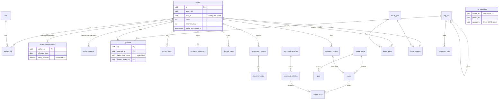
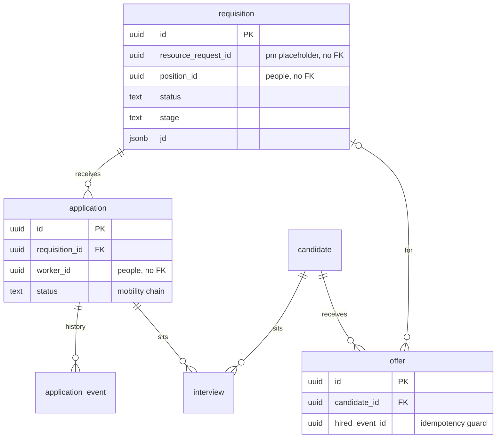
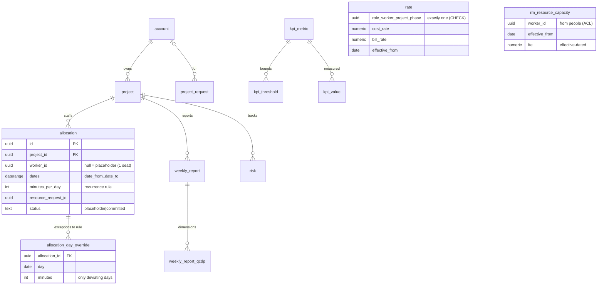
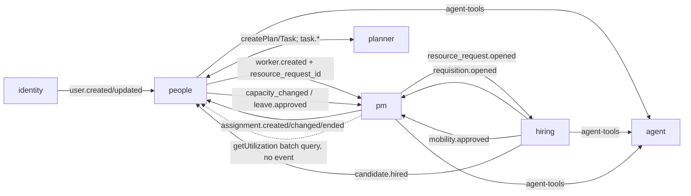

# People / Hiring / PM — unified database design (Step 7)

> Drizzle schema for all three modules in one pass so write-tables, read-models, and the event/data
> contracts ([`ddd-design.md`](./ddd-design.md)) line up. One `pgSchema` per module with
> `schemaFilter` scoping; **no cross-schema FK**; cross-module data flows only via events into
> read-model (ACL) tables owned by the consumer.
>
> **✅ Revised DDL re-validated** (2026-06-17, throwaway Postgres) — the **architecture-revision below
> (§ "Architecture revision")**: effective-dated history (compensation, capacity, rates), ledger/
> normalized facts replacing mutable cells + opaque jsonb (leave, review scores, QCDP), the allocation
> recurrence model, the fulfillment saga, and all **new DB-native invariants**. A self-checking script
> applied the 29 changed/new constraint-bearing tables clean and confirmed **9/9 invariants fire**:
> leave no-overlap (`EXCLUDE`/`btree_gist`), `rate` exactly-one-scope CHECK, one-accepted-offer partial
> UNIQUE, committed-allocation⇒worker CHECK, non-Green-weekly road-to-green CHECK, filled-position⇒holder
> CHECK, scorecard template-version UNIQUE, comp/capacity effective-dated UNIQUE. The earlier full
> 54-table pass (PG16) stands for unchanged tables. **Drizzle remains the schema SoR** — the full DDL
> regenerates via `db:generate` at implementation; the throwaway `seta-*.sql` artifacts are stale.
>
> **Review fixes applied (§ "Review fixes" below):** idempotency-guard tables; M:N `rm_allocation`
> re-keyed; `allocation.planned_pct`; rate temporal uniqueness; offer-accept uniqueness; interview
> reuses the scorecard instrument; UI-driven tables (skill endorsements, exit records, project access,
> weekly-report comments, KPI values, CAPA register); house-style `updated_at`/`version`/`deleted_at`.

## Conventions

- One `pgSchema('<module>')` per module; `drizzle.config.ts` sets `schemaFilter: ['<module>']`.
- Every table carries `tenant_id uuid not null`; every query filters by it. `id uuid pk default
  gen_random_uuid()`. `created_at`/`updated_at timestamptz`.
- Cross-module references are **plain `uuid` columns, no FK** (e.g. `worker_id`, `project_id`,
  `account_id`, `position_id`, `resource_request_id`). FKs allowed **only within** a module's schema.
- **Read-model (ACL) tables** live in the **consumer** schema, prefixed `rm_`, updated by event
  subscribers, idempotent on `event_id` (a `projection_offset`/processed-events guard per repo
  pattern). They hold projected facts only — never authored locally.
- **Derived** values (utilization, QCDP/RAG, margin, allocation totals) are **not stored on
  write-aggregates** — they are `rm_*` projections or computed on read.
- Migrations: `pnpm --filter @seta/<module> db:generate` → `pnpm db:migrate`. Hand-written SQL only
  for what Drizzle can't model (partitioning, triggers, **`EXCLUDE`/`btree_gist`**) — alongside
  generated files. Never edit a committed migration.

**Cross-cutting modeling rules (architecture revision):**
- **Effective-date facts that change over time** instead of overwriting a scalar — compensation,
  capacity, and rates are **history tables** (`*_from`/`*_to` or `effective_from`), with an optional
  cached "current" value on the aggregate for hot reads. A scalar on the row makes *historical*
  reporting (past-period utilization, salary history) wrong after any change.
- **Ledgers, not mutable counters** for anything with concurrent writers + audit needs (leave): an
  append-only `*_ledger` whose balance = `Σ(delta)`; idempotent on `source_event_id`.
- **Normalized facts, not opaque jsonb,** for anything queried/aggregated (review scores, QCDP, KPI).
  Reserve `jsonb` for genuinely variable payloads (JD, scope, criteria, contact). This keeps the
  doc's own "first-class reference config, not opaque jsonb" promise honest at the *score* layer too.
- **DB-native invariants** where Postgres can enforce them race-free: `EXCLUDE USING gist` (+
  `btree_gist`) for no-overlap (leave per worker/type), partial `UNIQUE` for single-holder/one-accept,
  CHECK for typed polymorphism. Acyclicity (org tree) stays a **locked recursive-CTE** domain check
  (no SQL CHECK can express it; two concurrent reparents can otherwise form a cycle).
- **Tenant isolation as defense-in-depth:** every table carries `tenant_id` *and* — recommended
  platform-wide — a Postgres **RLS** policy keyed on a session GUC, so a missed `WHERE tenant_id` can
  never leak cross-tenant HR/comp data. (Platform decision; flagged here, applies beyond these 3
  modules.)
- **Projections are rebuildable:** every `rm_*` subscriber is replayable from `core.events` (offset +
  idempotent upsert). A bug in a projector — or a *new* projection added later — is recovered by
  replay, never by hand-patching the read model. Critical because **RBAC visibility is itself a
  projection** (`rm_allocation`).
- **Out-of-order / missing-precondition handling is uniform:** at-least-once + per-aggregate-only
  ordering means a consumer *will* see an event before its precondition exists. Policy: **park-and-retry
  with bounded attempts** for "precondition not yet present" (the aggregate may still arrive),
  **no-op** for "precondition already gone" (idempotent). Stated once here, applied by every subscriber.

---

## `people` schema

**Worker & org (P-C1/P-C2)**
- `worker` — `user_id uuid null` (identity link), `full_name`, `work_email`, `role_title`,
  `department`, `employment_type`, `grade`, `status`, `lifecycle_stage`, `location`, `gender`,
  `dob date`, `phone`, `emergency_contact jsonb`, `profile_completed_at`, `joined_at`,
  `offboarded_at`, `updated_at`, `version`, `deleted_at`. **Sensitive comp + capacity moved off this
  row** (see `worker_compensation`, `worker_capacity`) — both are effective-dated, and isolating comp
  to its own table allows stricter grants/RLS instead of serializer-only masking. `worker` may cache
  the *current* `fte`/`grade` for hot reads. idx: `(tenant_id, status)`, `(tenant_id, user_id)`,
  `(tenant_id, lifecycle_stage)`; **GIN trigram** on `(full_name, work_email)` for directory search.
- `worker_compensation` *(effective-dated SoR for sensitive comp)* — `worker_id` (FK),
  `effective_from date`, `effective_to date null`, `salary_amount numeric(14,2)`, `salary_currency`,
  `bank jsonb`, `tax jsonb`, `reason`, `by_user_id`. uniq `(worker_id, effective_from)`; current =
  the row with null `effective_to`. **Stricter access** (sensitive table): masked + RLS-eligible;
  salary *history* lives here, not implicitly reconstructed from `movement_request`.
- `worker_capacity` *(effective-dated)* — `worker_id` (FK), `effective_from date`, `effective_to date
  null`, `fte numeric`, `contracted_hours int`. uniq `(worker_id, effective_from)`. Past-period
  utilization reads the capacity in effect *then*; emits `people.worker.capacity_changed` on insert.
- `skill` (taxonomy) — `name`, `category`. uniq `(tenant_id, name)`.
- `worker_skill` — `worker_id`, `skill_id`, `proficiency smallint (1–4)`, `years_experience`. pk
  `(worker_id, skill_id)`.
- `org_unit` — `parent_id uuid null` (FK in-schema), `name`, `manager_position_id uuid null`. idx
  `(tenant_id, parent_id)`; CHECK acyclic enforced in domain.
- `position` — `org_unit_id` (FK), `role_title`, `grade`, `headcount_status` (`open|filled`),
  `holder_worker_id uuid null`. idx `(tenant_id, org_unit_id, headcount_status)`. *Inv:* filled ⇒ one
  holder.
- `worker_history` — `worker_id` (FK), `at`, `action`, `field`, `from_val`, `to_val`, `by_user_id`.

**Lifecycle (P-C5–C9)**
- `lifecycle_case` — `worker_id` (FK), `kind` (`onboarding|offboarding`), `planner_plan_id`,
  `planner_task_id` (the employee card), `stage`, `progress smallint`, `health`, `sla_due_at`,
  `started_at`. idx `(tenant_id, kind, stage)`, `case_attention`, `case_by_plannertask`.
- `lifecycle_template_step` — `template_id`, `step_key` (stable id), `phase`, `responsible_role`,
  `sla_hours`, `seq`. The **stable `step_key` is stamped onto the planner checklist item** when the
  case is scaffolded, so cross-case step analytics ("avg time in IT-provisioning across onboardings")
  can correlate planner items back to template steps across the module boundary.
- `probation_review` — `worker_id` (FK), `marker` (1mo/2mo), `scorecard_review_id null`, `outcome`
  (`pass|fail|pending`), `decided_at`.
- `movement_request` — `worker_id` (FK), `type` (`promotion|transfer|salary`), `to_position_id`,
  `to_grade`, `salary_from numeric(14,2)`, `salary_to numeric(14,2)`, `effective_date`, `status`,
  `applied_at null`. **Application is future-dated:** the approved change is persisted on final
  approval but *applied at `effective_date`* by the `movement-apply` job (writes the new
  `worker_compensation`/position binding then), not at approval time. `applied_at` guards once-only.
- `movement_step` — `request_id` (FK), `seq`, `name`, `status`, `approver_user_id`, `decided_at`.

**Performance (P-C10)** — *versioned template + normalized scores*
- `scorecard_template` — `name`, `version int`, `status` (`draft|active|archived`). uniq
  `(tenant_id, name, version)`. **A review/interview pins an immutable `template_id`** so re-weighting
  a pillar never shifts historical totals.
- `scorecard_criterion` — `template_id` (FK), `pillar`, `criterion`, `weight`, `is_core bool`,
  `auto_from_ammi bool`, `ammi_dim`. (children of the template; replaces flat `scorecard_config`)
- `review_cycle` — `period`, `template_id`, `scope jsonb`, `status` (`open|closed`).
- `goal` — `cycle_id` (FK), `worker_id`, `objective`, `key_results jsonb`, `weight`, `progress`.
- `review` — `cycle_id null` (FK), `worker_id`, `reviewer_user_id`, `reviewer_type`
  (`self|manager|peer`), `template_id` (pinned), `ammi jsonb`, `total numeric`, `verdict`,
  `strengths`, `improve`, `action`. (also referenced by `probation_review`)
- `review_score` *(normalized, replaces `review.scores jsonb`)* — `review_id` (FK), `criterion_id`
  (FK→`scorecard_criterion`), `score smallint`, `evidence`. pk `(review_id, criterion_id)`. Makes
  "avg score on criterion X org-wide" and prev-period delta indexable instead of jsonb scans.

**Leave (P-C11)** — *ledger, not a mutable balance cell*
- `leave_type` — `name`, `accrual_policy jsonb`.
- `leave_ledger` *(append-only SoR)* — `worker_id`, `leave_type_id`, `delta numeric` (+accrual /
  −approved), `reason`, `source_event_id`, `at`. balance = `Σ(delta)`; idempotent on
  `source_event_id` (no double-accrual / double-decrement under concurrent cron + approval).
- `leave_balance` *(optional cache)* — `worker_id`, `leave_type_id`, `balance numeric`, `as_of`. pk
  `(worker_id, leave_type_id)`. A materialized snapshot of the ledger for hot reads; never the SoR.
- `leave_request` — `worker_id` (FK), `leave_type_id`, `date_from`, `date_to`, `status`,
  `approver_user_id`, `decided_at`. idx `(tenant_id, worker_id, status)`. **`EXCLUDE USING gist`**
  (`btree_gist`) on `(worker_id WITH =, daterange(date_from,date_to) WITH &&) WHERE status='approved'`
  enforces no-overlap in the DB, not the domain.

**Headcount (P-C12)**
- `headcount_plan` — `org_unit_id`, `period`, `planned_count int`, `notes`. idx `(tenant_id, period)`.

**Documents (P-C1 vault)**
- `employee_document` — `worker_id` (FK), `doc_type`, `storage_key`, `expiry_date null`,
  `supersedes_id null` (version chain), `uploaded_by`, `at`.
- `document_requirement` *(policy — derive "missing", don't flag it)* — `scope` (tenant /
  employment_type), `doc_type`, `mandatory bool`. **Missing-doc attention = `document_requirement`
  LEFT JOIN `employee_document`** (a `required` flag on existing rows can't represent an *absent*
  required doc — there's no row to carry it).

**Read-models (ACL) in `people`**
- `rm_allocation` — from pm: `worker_id`, `project_id`, `account_id`, `pct`/`intensity`, `billable`,
  `date_from`, `date_to`. idx `(tenant_id, worker_id)`, `(tenant_id, account_id)`,
  `(tenant_id, project_id)` — **drives RBAC visibility scope**.
- `rm_account_project` — from pm: `kind`, `id`, `name`, `parent_account_id`, `am_worker_id`.

---

## `hiring` schema

- `requisition` — `title`, `role_title`, `grade`, `account_id`, `resource_request_id null` (pm),
  `position_id null` (people), `kind` (`replacement|new`), `status`, `stage`
  (`sourcing|screening|interview|offer`), `skills jsonb`, `jd jsonb` (about/resp/req/nice),
  `start_date`, `due_date`. idx `(tenant_id, status, stage)`, `(tenant_id, resource_request_id)`.
- `candidate` — `name`, `source`, `contact jsonb`, `cv_storage_key`, `status`, `stage`. (external)
- `application` — `requisition_id` (FK), `worker_id` (internal applicant), `status`
  (`submitted|releasing_endorsed|receiving_endorsed|pmo_review|approved|rejected`), `alloc_pct`,
  `note`. idx `(tenant_id, requisition_id, status)`.
- `application_event` — `application_id` (FK), `at`, `actor`, `action`, `note`. (endorsement history)
- `interview` — `candidate_id null` / `application_id null`, `round`, `panel jsonb`, `at timestamptz`,
  `duration_min`, `mode` (`online|onsite`), `meeting_link`, `status`, `result` (`pass|hold|fail`),
  `rating smallint`, `recommendation`, `feedback`, `transcript`, **`scorecard_template_id` (pinned,
  people template by id — no FK)**. idx `(tenant_id, at)`, partial `interview_upcoming`.
- `interview_score` *(normalized, mirrors `people.review_score`)* — `interview_id` (FK),
  `criterion_id` (people scorecard criterion, by id — no FK), `score smallint`, `evidence`. pk
  `(interview_id, criterion_id)`. Queryable interview scoring instead of a jsonb blob.
- `offer` — `candidate_id` (FK), `requisition_id`, `position_id`, `comp jsonb`, `start_date`,
  `status` (`draft|approved|sent|accepted|declined`). *Inv:* accept terminal, fires `candidate.hired`
  once (guard column `hired_event_id`); partial `UNIQUE (tenant_id, candidate_id) WHERE
  status='accepted'`.
- `resource_request_fulfillment` *(the fulfillment **saga** state — hiring owns the lifecycle, DDD-D1)* —
  `resource_request_id`, `placeholder_allocation_id`, `requisition_id null`, `path`
  (`internal|external|undecided`), `state` (`open|in_progress|filled|cancelled|timed_out`),
  `opened_at`, `closed_at`, `timeout_at`. uniq `(tenant_id, resource_request_id)`. Gives the
  placeholder→requisition→hire→fill loop **one observable record** with timeout + losing-path
  cancellation, instead of state scattered across ad-hoc handlers.
- `kb_article` — `type`, `title`, `body`, `tags` *(OQ-7: or replaced by `knowledge` module refs)*.

**Read-models (ACL) in `hiring`**
- `rm_worker` — from people: `worker_id`, `name`, `skills`, `current_positions` (internal-mobility +
  on-hire linking).
- `rm_resource_request` — from pm: `resource_request_id`, `project_id`, `role`, `skills`,
  `dates`, `status` (one seat per request — no `count`).
- `rm_scorecard_template` / `rm_scorecard_criterion` — from people (`scorecard` reference config):
  lets hiring **render + validate** the interview instrument and pin a `scorecard_template_id`
  without a cross-schema FK. Resolves OQ-H3's "reuse the instrument" at the schema level.
- `rm_account_project` — from pm (scoping/display).

---

## `pm` schema

- `account` — `name`, `am_worker_id`. idx `(tenant_id)`.
- `project` — `account_id` (FK), `name`, `objective`, `scope jsonb`, `budget_bmm numeric`,
  `pm_worker_id`, `phase`, `status`, `planner_group_id null` (deferred task reuse). idx
  `(tenant_id, account_id, status)`.
- `project_request` — `name`, `account_id`, `objective`, `scope jsonb`, `budget_bmm`, `pm_worker_id`,
  `stage` (`submitted|pmo_review|bod_review|created`), `rejected_at`. (charter flow)
- `allocation` — **`worker_id uuid null`** (null ⇒ **placeholder/demand**, exactly **one seat**),
  `project_id` (FK), `task_id null`, `role`, `date_from`, `date_to`, `billable bool`,
  `planned_pct numeric(5,2)` (planning sketch), `minutes_per_day int null` + `weekday_mask` (the
  **recurrence rule** for the common constant-intensity case), `criteria jsonb` (placeholder:
  role/skills — **no `count`**; N seats = N placeholders, so the single-CAS fill stays correct),
  `resource_request_id null`, `status` (`placeholder|committed`), `deleted_at`. idx
  `(tenant_id, project_id)`, `(tenant_id, worker_id)`, partial idx `where worker_id is null`
  (open demand). *Inv:* committed ⇒ `worker_id not null`. **A committed allocation may be
  future-dated** (`date_from` in the future) — "started" is derived (`date_from ≤ today`), so the
  aging job (which flags only placeholders) never escalates an already-filled-but-not-started seat.
- `allocation_day_override` — `allocation_id` (FK), `date`, `minutes int`. pk `(allocation_id, date)`.
  **Only days that differ from the recurrence rule** materialize here; effective per-day intensity =
  rule ⊕ overrides. Replaces the full per-day fan-out (a 6-month alloc was ~130 rows) → far less
  write amplification; utilization recompute reads rule + sparse overrides.
- `rate` — **typed scope (no polymorphic `scope_id`)**: nullable `role` / `worker_id` / `project_id` /
  `phase` + CHECK "exactly one set" (real indexes + FK-able), `cost_rate numeric`, `bill_rate numeric`,
  `effective_from`, `effective_to date`. uniq `(tenant_id, <scope cols>, effective_from)`. Cascade
  resolved into `rm_effective_rate` (below), not re-walked on every margin read.
- `weekly_report` — `project_id` (FK), `week`, `summary`, `risk`, `rag`, `action`, `owner`,
  `date`, `by_user_id`, `submitted_at`. *Inv:* non-Green ⇒ action+owner+date not null.
- `weekly_report_qcdp` *(typed, replaces `qcdp jsonb`)* — `weekly_report_id` (FK), `dimension`
  (`quality|cost|delivery|process`), `rag`, `note`. pk `(weekly_report_id, dimension)`. Lets
  "all projects red on Delivery" be an indexed query feeding RAG derivation.
- `risk` — `project_id` (FK), `title`, `type`, `severity`, `priority`, `status`, `owner`, `due`,
  `action`.
- `kpi_metric` *(catalog — no free-text metric names)* — `code`, `name`, `unit`, `category`
  (`quality|cost|delivery|process`), `direction`. uniq `(tenant_id, code)`.
- `kpi_threshold` — `scope` (tenant/project), `metric_id` (FK→`kpi_metric`), `goal`, `yellow`.
- `kpi_value` — `project_id`, `metric_id` (FK), `period`, `value`. (manual input feeding QCDP)

**Read-models (ACL + derived) in `pm`**
- `rm_resource` — from people: `worker_id`, `name`, `skills`, **`availability`** (approved leave
  ranges). One row per worker.
- `rm_resource_capacity` *(effective-dated, from `people.worker.capacity_changed`)* — `worker_id`,
  `effective_from`, `effective_to`, `fte`, `contracted_hours`. **Past-period utilization uses the
  capacity in effect then** — not a single current scalar.
- `rm_effective_rate` — derived from the `rate` cascade: `(worker_id, project_id, date) → cost_rate,
  bill_rate`. Materialized so margin reads are a lookup, not a 4-level temporal cascade walk.
- `rm_utilization` — derived: `worker_id`, period, `allocated`, `capacity`, `util_pct`,
  `overallocated bool`. **Exposed to `people` via a batch query** (`getUtilization(workerIds[],
  period)`) — there is **no `pm.utilization.updated` event** (a derived projection has no
  transactional outbox anchor; see [`ddd-design.md`](./ddd-design.md) §7).
- `rm_project_health` — derived: `project_id`, `qcdp` (from `weekly_report_qcdp`), `rag`,
  `predictability`.
- `rm_margin` — derived: `project_id`, `cost`, `bill`, `margin` (allocations × `rm_effective_rate`).

---

## ER diagrams (Mermaid)

### `people` schema

### `hiring` schema

### `pm` schema

### Cross-module event flow (the integration contract)

## Normalization & optimization review

- **Write-model is 3NF.** Every non-key attribute depends on the whole key and nothing else. Repeating
  groups are extracted to child tables (`worker_skill`, `allocation_day_override`, `movement_step`,
  `application_event`, `review_score`, `weekly_report_qcdp`). **Facts that vary over time are
  effective-dated history** (`worker_compensation`, `worker_capacity`, `rate`) rather than overwritten
  scalars; **leave is a ledger** (`leave_ledger`), not a mutable counter. Sensitive comp is split to
  its own `worker_compensation` table — column-isolated for stricter grants/RLS, not serializer-only
  masking (defense-in-depth, and it survives a stray `select *`).
- **`rm_*` read-models are intentionally denormalized** (not 3NF) — they are event-fed projections
  optimized for read. E.g. `rm_allocation.account_id` is transitively derivable (`project → account`)
  but stored to make the **RBAC-visibility query a single indexed lookup** (`EXPLAIN` confirms
  `rm_alloc_by_account`). This is a deliberate read-optimization, isolated to projections.
- **Read-optimized:** the hot paths — RBAC visibility (worker↔account/project), open-demand listing,
  utilization — are covered by purpose-built indexes incl. a **partial index** for open placeholders
  (`WHERE worker_id IS NULL`). `jsonb` is used only for genuinely variable/semi-structured payloads
  (JD, scope, scores, criteria, qcdp) — never for queryable scalar columns.
- **Write-optimized:** narrow write-aggregates (small rows, few FKs) keep inserts cheap; allocation
  intensity is a **recurrence rule on `allocation`** with only deviating days in
  `allocation_day_override` (vs the old full per-day fan-out), cutting row count + write amplification;
  derived values (utilization/RAG/margin) are **never written on the aggregate** (recomputed into
  `rm_*`), avoiding contention (Vernon small-aggregate guidance).
- **Integrity:** intra-schema FKs enforce local consistency; **zero cross-schema FKs** preserve module
  isolation (asserted in validation); cross-module consistency is eventual via idempotent projections.

## Architecture revision (2026-06-17)

Applied after the solution-architecture review. **Supersedes the matching "Review fixes" entries
below** (notably: comp-on-`worker`, `review.scores jsonb`, `interview.scores jsonb`, flat
`scorecard_config`, full `allocation_day` fan-out). Schema changed → **re-validate the full DDL**.

| Area | Was | Now | Why |
|---|---|---|---|
| Sensitive comp | `salary/bank/tax` on `worker`, serializer-masked | `worker_compensation` (effective-dated, column-isolated, RLS-eligible) | salary history + defense-in-depth |
| Capacity | scalar `fte`/`contracted_hours` on `worker` / `rm_resource` | `worker_capacity` + `rm_resource_capacity` (effective-dated) | correct past-period utilization |
| Leave | mutable `leave_balance` cell | `leave_ledger` (balance = Σδ) + optional cache | concurrent-writer races + audit |
| Review scores | `review.scores jsonb` | `review_score` child (criterion FK) | analytics/delta queryable |
| Interview scoring | `interview.scores jsonb` | `interview_score` + pinned `scorecard_template_id` + `rm_scorecard_*` | normalized + cross-module reuse |
| Scorecard config | flat `scorecard_config` | `scorecard_template`(versioned) + `scorecard_criterion` | immutable historical totals |
| Allocation intensity | full `allocation_day` fan-out | recurrence rule + `allocation_day_override` | row explosion / write amplification |
| Rates | polymorphic `scope_id` | typed scope cols + CHECK + `rm_effective_rate` | indexable/FK-able, cached resolution |
| QCDP / KPI | `qcdp jsonb`, free-text `metric` | `weekly_report_qcdp`, `kpi_metric` catalog | aggregatable, no drift |
| Demand | placeholder `criteria.count` | one seat per placeholder | single-CAS fill stays correct |
| Fill timing | pm fills on `worker.onboarded` | pm fills (committed, future-dated) on `worker.created`/`mobility.approved` | no phantom-open demand during onboarding |
| Fulfillment | scattered handlers + CAS | `resource_request_fulfillment` saga (state + timeout + cancel-loser) | observable, compensatable |
| Missing docs | `employee_document.required` flag | `document_requirement` policy + LEFT JOIN | a flag can't mark an *absent* doc |
| Movement | applied at approval | applied at `effective_date` (job) + `applied_at` guard | future-dated promotions |
| Invariants | domain-enforced | `EXCLUDE`/`btree_gist`, partial `UNIQUE`, CHECK | race-free in the DB |
| Tenancy | app `WHERE tenant_id` | + RLS (recommended, platform-wide) | one missed clause can't leak |
| Projections | idempotent | idempotent **+ replayable/rebuildable** | recover projector bugs; RBAC rides `rm_allocation` |

## Review fixes (validated 2026-06-16) — *partially superseded by the revision above*

Applied after the parallel design review; all validated on Postgres 16.

**Correctness / contracts**
- **Idempotency guard:** `people.processed_event` / `hiring.processed_event` / `pm.processed_event`
  `(consumer, event_id)` — every projection subscriber inserts here in the same txn as its upsert.
  `src_event` on `rm_*` is the *last* event only, not the dedup ledger.
- **`people.rm_allocation` re-keyed** to `(tenant_id, allocation_id)` (+ `allocation_id` column) so the
  **M:N** read-model holds concurrent/sequential same-project allocations (old `(worker_id, project_id)`
  PK collapsed them). pm emits `pm.assignment.created/changed/ended`; `ended` retracts the row.
- **`pm.allocation.planned_pct numeric(5,2)`** — the planning/placeholder capacity % (per-day `minutes`
  materialize on commit); gives `rm_allocation.pct` a real source and lands `mobility.approved.pct`.
- **`pm.rate`** + `effective_to date` and `UNIQUE (tenant_id, scope_type, scope_id, effective_from)` —
  deterministic cost/bill cascade resolution.
- **`hiring.offer`**: partial `UNIQUE (tenant_id, candidate_id) WHERE status='accepted'` + CHECK
  `hired_event_id IS NULL OR status='accepted'` — "hire fires once" is now a real invariant.
- **`hiring.interview`** ~~gains `scores jsonb`~~ → **superseded:** normalized `interview_score` child +
  pinned `scorecard_template_id` (Architecture revision); + `interview_panelist` child + partial
  `interview_upcoming` index; mobility endorsement actors typed on `application`
  (`releasing_endorsed_by`/`receiving_endorsed_by`/`pmo_decided_by`, `override_overallocation`).
- **`people.worker`**: ~~`salary` → `salary_amount`/`salary_currency` on the row~~ → **superseded:**
  sensitive comp moved to effective-dated `worker_compensation` (Architecture revision);
  `emergency_contact jsonb`; `profile_completed_at` (first-login self-completion gate); `version`.
  `movement_request` salary fields → numeric.
- **House style** (planner parity): `updated_at` + `version` on hot aggregates; `deleted_at` soft-delete
  on `pm.project`/`pm.allocation` (doc had promised it). The rule applies module-wide at implementation.

**UI-driven tables (prototype-backed) added**
- `people.skill_endorsement` (peer/manager skill endorsements ⭐); `people.exit_record` (voluntary flag,
  reason, tenure-at-exit → "why/when people leave" analytics); `people.probation_review.risk_score`;
  `people.lifecycle_case.sla_due_at` + `case_attention`/`case_by_plannertask` indexes;
  `people.employee_document` gains version-chain (`supersedes_id`) + `required` (missing-doc attention).
- `hiring.candidate` gains `skills`/`seniority` (CV-parse), `reject_reason`/`tags` (KB analytics),
  `source_cost`; `hiring.requisition` gains `owner_user_id` (recruiter attribution) + `closed_at` (TTF).
- `pm.project_access` (per-project Owner/Edit/View — the charter R&R grant); `pm.project` gains
  `methodology`/`pricing_model`/`timeline`/`css`; `pm.weekly_report_comment`; `pm.weekly_report.due`→`date`;
  `pm.kpi_value` (manual KPI input feeding QCDP); `pm.corrective_action` (CAPA/risk/improvement register).

> These additions are reflected in the per-schema table lists above conceptually; the validated DDL is
> `seta-people-hr-schema.sql` + `seta-fixes.sql` (validation artifacts — Drizzle remains the schema
> source-of-truth per repo rules).

## Migration & indexing notes

- Generate per module (`db:generate`) in dependency order: foundation tables first, `rm_*` tables
  with the slice that consumes the event.
- **Hot tables** — `allocation`/`allocation_day_override` (pm) and `rm_allocation` (people) carry the
  heaviest read/write; index by `(tenant_id, worker_id)` and `(tenant_id, project_id)`; consider
  date-range GiST or per-month partitioning if volume warrants (hand-written SQL, documented).
- **Idempotency + replay** — every `rm_*` subscriber records processed `event_id` (replays are
  no-ops) **and is rebuildable from `core.events`** (offset + idempotent upsert) — required because
  RBAC visibility rides `rm_allocation`.
- **DB-native invariants** — hand-written SQL for `EXCLUDE USING gist` (`btree_gist`) on
  `leave_request` no-overlap; partial `UNIQUE` for single-holder / one-accepted-offer; CHECK
  "exactly one scope" on `rate`. Org-tree acyclicity stays a locked recursive-CTE domain check.
- **Soft delete** where history matters (`worker`, `project`, `allocation` via `status`/`deleted_at`),
  consistent with `planner`'s pattern.

## Per-module Step 7 pointers
`people.md`, `hiring.md`, `pm.md` Step 7 = this document (their schema sections above).
